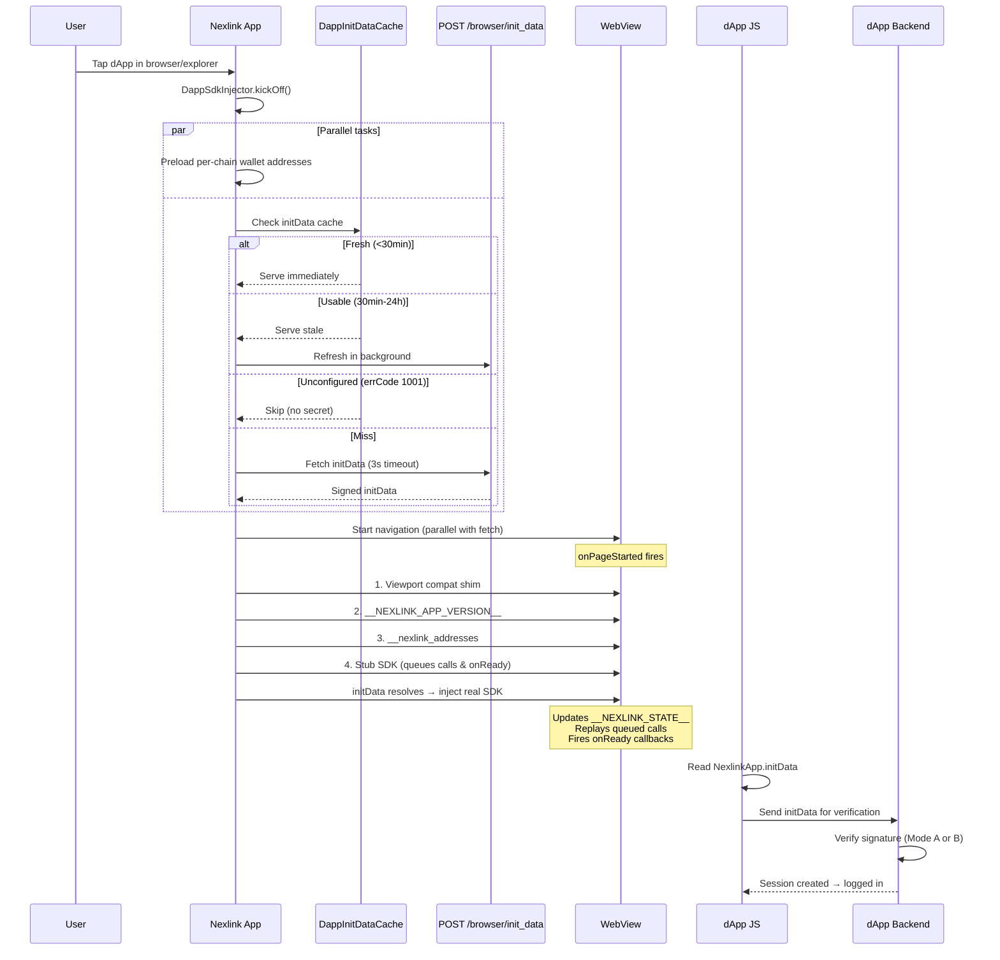
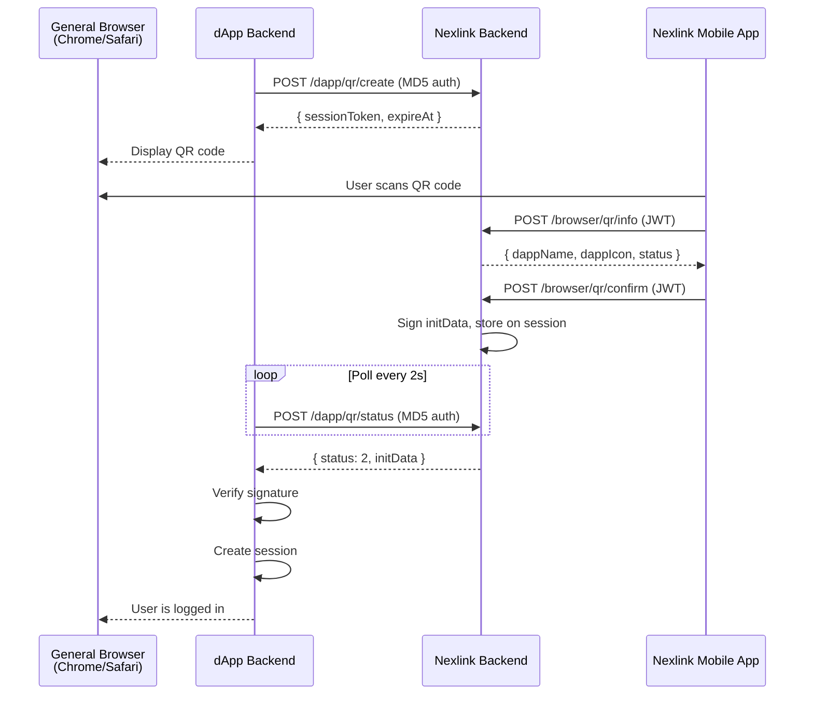
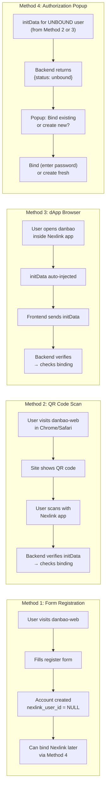
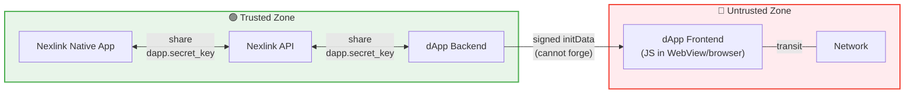

# Nexlink dApp Login & Registration

Users open a dApp inside the Nexlink native app (or scan a QR code from an external browser), and the platform provides a cryptographically signed identity payload — no username/password form required.

## How to Read This Document

This document serves two audiences:

| Audience | What to read |
|---|---|
| **Any dApp developer** integrating Nexlink login | **Part I** (Sections 1-7): login flows, signature verification, QR deep links, embeddable widget |
| **Quick API lookup** | **Part II** (Sections 8-10): request/response specs for every endpoint, initData payload format |
| **Danbao team** adding Nexlink to the existing OAuth2 app | Skim Part I for context, then focus on **Part III** (Sections 11-22): migration, endpoints, frontend |

**Part IV** (Security & Scalability) is relevant for production deployment regardless of audience. **Part V** tracks implementation status.

---

# Part I: dApp Developer Guide

---

## 1. Authentication Architecture

### Two access contexts

| Context | How user arrives | Auth method |
|---|---|---|
| **dApp Browser** (in-app) | Opens dApp inside Nexlink mobile app | Automatic `initData` injection |
| **General Browser** (external) | Visits dApp URL in Chrome/Safari/etc. | QR code scan with Nexlink app |

### Key concepts

| Concept | Value |
|---|---|
| Global JS object | `window.NexlinkApp` |
| Signed payload | `initData` (URL-encoded string) |
| HMAC key label | `"NexlinkData"` |
| Secret source | `dapps.secret_key` (per-dApp) |
| Signature algo | HMAC-SHA256 |
| Remote verify | `POST /dapp/verify` |

### initData fields

| Field | Required | Description |
|---|---|---|
| `user` | yes | JSON-stringified user object (`uid`, `openim_id`, `nickname`, `avatar`, `language_code`) |
| `user_id` | yes | The user's permanent `uid` (same as `user.uid`) — the stable, non-sequential key; never an internal sequential id |
| `auth_date` | yes | Unix seconds — server rejects if older than 24h |
| `dapp_id` | yes | Numeric ID from `dapps` table |
| `query_id` | yes | Unique per WebView session |
| `start_param` | no | Deep-link param from opening URL |
| `hash` | yes | HMAC-SHA256 hex signature of all other fields |

---

## 2. Login Flow: dApp Browser (In-App)

When a user opens a dApp inside the Nexlink app, login is **fully automatic** — zero user interaction required.

> **SDK injection:** The NexLink WebView injects `window.NexlinkApp` and `window.ethereum` automatically via inline JavaScript at `document_start`. **No `<script>` tag is needed in your HTML.** The SDK is available by the time your page scripts run. Use `NexlinkApp.onReady(cb)` to wait for `initData` to be loaded (it may still be fetching from the server).
>
> In external browsers (Chrome, Safari, etc.), `window.NexlinkApp` is `undefined` — see [Section 3](#3-login-flow-general-browser-qr-code-scan) for the QR code fallback.

### Detailed injection pipeline



**If initData fetch times out (3s) or fails:** The real SDK is still injected with `initData = ""`. EIP-1193 wallet bridge (`window.ethereum`) still works. The dApp operates as a plain web page without signed identity.

### Relevant code locations

| Step | File |
|---|---|
| init_data API call | `nexlink/lib/pages/dapp/dapp_apis.dart` → `DappApis.initData()` |
| init_data cache | `nexlink/lib/pages/dapp/dapp_browser/dapp_init_data_cache.dart` |
| Dart-side HMAC signer | `nexlink/lib/pages/dapp/dapp_browser/init_data.dart` → `InitDataSigner` |
| Go-side HMAC signer | `nexlink-api/internal/api/nexlinkdapp/handler_verify.go` |
| Go-side initData generator | `nexlink-api/internal/api/nexlinkdapp/handler_browser.go` |
| SDK injector pipeline | `nexlink/lib/pages/dapp/dapp_browser/dapp_sdk_injector.dart` |
| JS SDK (stub + real) | `nexlink/lib/pages/dapp/dapp_browser/js_bridge.dart` |
| Bridge modules | `nexlink/lib/pages/dapp/dapp_browser/bridge/modules/` |
| Browser page | `nexlink/lib/pages/dapp/dapp_browser/dapp_browser_logic.dart` |

### dApp frontend code (in-app)

```html
<script>
  // The SDK is auto-injected by the NexLink WebView — no <script> tag needed.
  // Wait for SDK to be ready (initData may still be loading)
  NexlinkApp.onReady(async function () {
    const initData = NexlinkApp.initData;
    if (!initData) {
      // Not running inside NexLink app — show QR login instead
      showQrLogin();
      return;
    }

    // Send signed payload to your backend
    const res = await fetch('/api/auth/nexlink-login', {
      method: 'POST',
      headers: { 'Content-Type': 'application/json' },
      body: JSON.stringify({ initData }),
    });
    const { token } = await res.json();
    // Store session token, proceed to app
    localStorage.setItem('session', token);
    window.location.href = '/dashboard';
  });
</script>
```

**Caveat:** Code that captures `initData` as a primitive at module load (`const id = NexlinkApp.initData`) before the real SDK arrives will see an empty string. Always use `NexlinkApp.onReady(cb)` to wait for the signed payload.

---

## 3. Login Flow: General Browser (QR Code Scan)

When a user visits a dApp URL in a regular browser (not inside the Nexlink app), `window.NexlinkApp` is `undefined` — the SDK is only injected by the NexLink WebView. The dApp must detect this and fall back to a **QR code login flow**.



**The Nexlink app never touches any external URL.** It only talks to the Nexlink backend. The QR code contains no callback URL — only a token and dApp ID. This eliminates the `callback=https://evil.com` attack vector entirely.

### 3.1. QR Code Login Protocol

#### Step 1: dApp backend creates QR session via Nexlink API

The dApp backend (not the browser) requests a QR login session from the **Nexlink backend**. The dApp is identified by the MD5 signature auth headers (`dapp_id`, `request_time`, `sign`), not by a request body field.

```
POST https://nexlink-api/dapp/qr/create
Headers: dapp_id, request_time, sign (MD5 signature auth)
{ "expireSeconds": 300 }

→ { "sessionToken": "abc123...", "dappId": "my_dapp", "status": 1, "expireAt": 1718700000 }
```

- `sessionToken` is a one-time random token (UUID), valid for the requested duration (default from server config).
- Stored in the Nexlink backend's `nexlink_qr_auth_session` table, scoped to the authenticated dApp.
- The dApp backend forwards the token to the browser.

#### Step 2: Browser displays QR code and polls dApp backend

```js
// Detect environment
if (window.NexlinkApp && window.NexlinkApp.platform === 'flutter' && NexlinkApp.initData) {
  // In-app: use initData directly
  loginWithInitData(NexlinkApp.initData);
} else {
  // External browser: show QR code
  showQrLogin();
}

async function showQrLogin() {
  // dApp backend proxied the /dapp/qr/create call
  const res = await fetch('/api/auth/qr/create', { method: 'POST' }).then(r => r.json());
  const { sessionToken, expireAt } = res.data || res;

  // QR code contains ONLY token — no callback URL
  renderQrCode(`nexlink://auth?token=${sessionToken}`);

  // Poll dApp backend (which polls Nexlink backend)
  pollQrStatus(sessionToken, expireAt);
}

async function pollQrStatus(sessionToken, expireAt) {
  while (Date.now() / 1000 < expireAt) {
    try {
      const res = await fetch('/api/auth/qr/status', {
        method: 'POST',
        headers: { 'Content-Type': 'application/json' },
        body: JSON.stringify({ sessionToken }),
      }).then(r => r.json());
      const data = res.data || res;

      if (data.status === 2) {  // confirmed
        loginWithInitData(data.initData);
        return;
      }
      if (data.status === 4) {  // expired
        showExpiredMessage();
        return;
      }
      // status === 1 (pending) → wait 2s then poll again
      await new Promise(r => setTimeout(r, 2000));
    } catch (e) {
      // Network error — wait 2s then retry
      await new Promise(r => setTimeout(r, 2000));
    }
  }
}
```

#### Step 3: User scans with Nexlink app

The Nexlink mobile app:

1. Opens the built-in QR scanner or camera.
2. Parses the deep link: `nexlink://auth?token=abc123&dapp=my_dapp`.
3. Calls `POST /browser/qr/info` to fetch dApp info (name, icon, domain) for the confirmation dialog.
4. Shows a confirmation dialog: _"Log in to [dApp Name]?"_ with the dApp's name and domain.
5. On confirm, the app calls the **Nexlink backend** (not any external URL):

```
POST https://nexlink-api/browser/qr/confirm
Authorization: Bearer <user's nexlinkToken>
{
  "sessionToken": "abc123"
}
```

6. The Nexlink backend looks up the user, generates signed `initData` (using the dApp's `secret_key` from the `dapps` table), and stores it on the session row.

#### Step 4: dApp backend polls for result

The dApp backend polls the Nexlink backend for the confirmed initData:

```
POST https://nexlink-api/dapp/qr/status
Headers: dapp_id, request_time, sign (MD5 signature auth)
{ "sessionToken": "abc123" }

→ pending:   { "sessionToken": "abc123", "dappId": "my_dapp", "status": 1, "expireAt": 1718700000 }
→ confirmed: { "sessionToken": "abc123", "dappId": "my_dapp", "status": 2, "initData": "user=%7B...%7D&hash=...", "expireAt": 1718700000 }
→ expired:   { "sessionToken": "abc123", "dappId": "my_dapp", "status": 4, "expireAt": 1718700000 }
```

Status codes: `1` = pending, `2` = confirmed, `3` = failed, `4` = expired.

On status `2` (confirmed), the dApp backend:

1. **Verifies initData** signature (Mode A with local secret, or trust it since it came from Nexlink API over authenticated channel).
2. **Looks up user** by `nexlink_user_id`. If not found, returns `"unbound"` — the dApp handles binding or account creation (see Section 13 for danbao's implementation, or implement your own).
3. **Issues its own session token** (OAuth2 token, JWT, etc.).
4. Returns the session token to the browser (via the browser's poll to `/api/auth/qr/status`).

The dApp backend proxies the `POST /dapp/qr/status` call to the Nexlink backend. The current implementation uses short polling (the browser polls every 2 seconds). A future upgrade to long polling or SSE is tracked in Section 24.

```js
// dApp backend (Node.js example) — proxies Nexlink status poll
app.post('/api/auth/qr/status', async (req, res) => {
  const { sessionToken } = req.body;
  const nexlink = await nexlinkApi.post('/dapp/qr/status', { sessionToken });
  const data = nexlink.data || nexlink;

  if (data.status === 2) {  // confirmed
    // Verify and create session
    const result = verifyNexlinkInitData(data.initData, process.env.NEXLINK_DAPP_SECRET);
    if (!result.valid) return res.status(401).end();

    const user = await db.upsertUser({ nexlinkUid: result.user.uid });
    const token = createJWT({ sub: user.id });

    return res.json({ status: 2, sessionToken: token });
  }

  // status 1 (pending) or 4 (expired) — browser will poll again
  res.json({ status: data.status });
});
```

---

## 4. initData Signature Verification

After receiving initData from either login flow, your backend must verify the HMAC-SHA256 signature before trusting the payload. There are two modes: local verification (recommended) and remote verification via the Nexlink API.

### 4.1. Algorithm

Two-step HMAC-SHA256 derivation:

```
Step 1: secret_key = HMAC_SHA256(key="NexlinkData", message=<dapp_secret_key>)

Step 2: data_check_string = sort(all_fields_except_hash)
                              .map(k => k + "=" + v)
                              .join("\n")

Step 3: computed_hash = HEX(HMAC_SHA256(key=secret_key, message=data_check_string))

Step 4: if (computed_hash === received_hash) → VALID
```

**Important:** In step 1, `"NexlinkData"` is the **HMAC key** and `dapp_secret_key` is the **message**. This matches how the Dart `Hmac(sha256, utf8.encode(hmacKeyLabel))` constructor works (second arg = key) and how Go `hmac.New(sha256.New, []byte(hmacKeyLabel))` works (second arg = key). Both implementations are verified consistent.

### 4.2. Mode A — Local Verification (Recommended)

The dApp backend holds the `secret_key` and verifies locally. No network call to Nexlink.

**Go:**

```go
// maxAge: how long initData stays valid. Default 24h.
// High-security dApps should use shorter windows (e.g., 5*time.Minute).
func VerifyNexlinkInitData(initData, dappSecret string, maxAge ...time.Duration) (*VerifyResult, error) {
    ttl := 24 * time.Hour
    if len(maxAge) > 0 { ttl = maxAge[0] }

    v, _ := url.ParseQuery(initData)
    hash := v.Get("hash")
    v.Del("hash")

    keys := make([]string, 0, len(v))
    for k := range v { keys = append(keys, k) }
    sort.Strings(keys)
    parts := make([]string, len(keys))
    for i, k := range keys { parts[i] = k + "=" + v.Get(k) }
    dataCheckString := strings.Join(parts, "\n")

    mac1 := hmac.New(sha256.New, []byte("NexlinkData"))
    mac1.Write([]byte(dappSecret))
    secretKey := mac1.Sum(nil)

    mac2 := hmac.New(sha256.New, secretKey)
    mac2.Write([]byte(dataCheckString))
    computed := hex.EncodeToString(mac2.Sum(nil))

    // hmac.Equal is constant-time — safe against timing attacks
    if !hmac.Equal([]byte(computed), []byte(hash)) {
        return nil, errors.New("bad signature")
    }
    authDate, _ := strconv.ParseInt(v.Get("auth_date"), 10, 64)
    if time.Now().Unix()-authDate > int64(ttl.Seconds()) {
        return nil, errors.New("expired")
    }
    return &VerifyResult{ /* ... */ }, nil
}
```

**Node.js** (reference for third-party dApp developers using Node.js):

```js
import { createHmac, timingSafeEqual } from 'crypto';

// maxAge: how long initData stays valid (seconds). Default 86400 (24h).
// High-security dApps should use shorter windows (e.g., 300 = 5 minutes).
function verifyNexlinkInitData(initData, dappSecret, { maxAge = 86400 } = {}) {
  const params = new URLSearchParams(initData);
  const hash = params.get('hash');
  if (!hash) return { valid: false, reason: 'missing hash' };
  params.delete('hash');

  const dataCheckString = [...params.entries()]
    .sort(([a], [b]) => a.localeCompare(b))
    .map(([k, v]) => `${k}=${v}`)
    .join('\n');

  const secretKey = createHmac('sha256', 'NexlinkData')
    .update(dappSecret).digest();
  const computed = createHmac('sha256', secretKey)
    .update(dataCheckString).digest();

  // IMPORTANT: Use constant-time comparison to prevent timing side-channel attacks.
  // Never use === or !== to compare HMAC digests.
  const hashBuf = Buffer.from(hash, 'hex');
  if (computed.length !== hashBuf.length || !timingSafeEqual(computed, hashBuf)) {
    return { valid: false, reason: 'bad signature' };
  }

  const authDate = parseInt(params.get('auth_date'), 10);
  if (Date.now() / 1000 - authDate > maxAge) {
    return { valid: false, reason: 'expired' };
  }

  return {
    valid: true,
    user: JSON.parse(params.get('user')),
    authDate,
    queryId: params.get('query_id'),
    dappId: parseInt(params.get('dapp_id'), 10),
  };
}
```

**Note on Node.js `createHmac`:** `createHmac('sha256', 'NexlinkData')` — the second argument is the key. `.update(dappSecret)` provides the message. This matches the algorithm.

### 4.3. Mode B — Remote Verification

For dApps that prefer not to store the secret. Calls the Nexlink API to verify:

```
POST /dapp/verify
{ "initData": "user=...&hash=...", "clientId": 42 }

→ 200: { "errCode": 0, "data": { "valid": true, "user": {...} } }
→ 401: { "errCode": 40002, "errMsg": "bad signature" }
```

---

## 5. Deep Link Format for QR Codes

The QR code displayed to the user encodes a Nexlink deep link. The Nexlink app parses this deep link to identify the QR session.

```
nexlink://auth?token=<sessionToken>&dapp=<dappId>
```

| Parameter | Required | Description |
|---|---|---|
| `token` | yes | One-time QR session token (UUID from Nexlink backend) |
| `dapp` | no | dApp symbol (for routing; the backend resolves dApp info from the session) |

**No callback URL.** The QR code never contains any external URL. The Nexlink app only communicates with the Nexlink backend.

The Nexlink app registers a handler for the `nexlink://auth` scheme (`NexlinkUrlRouter` → `RouteType.auth`) that:

1. Parses the `token` and `dapp` query parameters
2. Calls `POST /browser/qr/info { sessionToken }` to fetch dApp info (name, icon, domain) for the confirmation dialog
3. Shows: "Log in to **[dApp Name]**?" with the dApp's domain
4. On confirm: calls `POST /browser/qr/confirm { sessionToken }` on the Nexlink backend — the backend looks up the user, signs initData, and stores it on the session row

---

## 6. Dual-Mode dApp Template

> **Note:** Both paths are fully implemented. The in-app path uses `window.NexlinkApp.initData` directly; the QR code path uses the `/dapp/qr/create` and `/dapp/qr/status` endpoints.

A complete pattern for dApps that work both inside Nexlink and in external browsers:

```js
class NexlinkAuth {
  constructor({ apiBase }) {
    this.apiBase = apiBase;
  }

  async login() {
    // Check if running inside Nexlink app
    if (window.NexlinkApp && window.NexlinkApp.platform === 'flutter') {
      return this.loginInApp();
    } else {
      return this.loginWithQr();
    }
  }

  // --- In-app login (automatic) ---
  async loginInApp() {
    return new Promise((resolve, reject) => {
      const tryLogin = async () => {
        const initData = window.NexlinkApp.initData;
        if (!initData) {
          reject(new Error('No initData available'));
          return;
        }

        const res = await fetch(`${this.apiBase}/auth/nexlink-login`, {
          method: 'POST',
          headers: { 'Content-Type': 'application/json' },
          body: JSON.stringify({ initData }),
        });

        if (!res.ok) reject(new Error('Login failed'));
        resolve(await res.json());
      };

      if (NexlinkApp.initData) {
        tryLogin();
      } else {
        NexlinkApp.onReady(tryLogin);
      }
    });
  }

  // --- QR code login (external browser) ---
  async loginWithQr() {
    // 1. Create QR session (dApp backend proxies to Nexlink API)
    const res = await fetch(
      `${this.apiBase}/auth/qr/create`,
      { method: 'POST' }
    ).then(r => r.json());
    const { sessionToken, expireAt } = res.data || res;

    // 2. Build deep link and render QR — NO callback URL
    const deepLink = `nexlink://auth?token=${sessionToken}`;

    this.renderQrCode(deepLink);

    // 3. Poll dApp backend for confirmation
    return this.pollStatus(sessionToken, expireAt);
  }

  renderQrCode(data) {
    // Use qrcode.js, qr-code-styling, or similar
    const container = document.getElementById('qr-container');
    // ... render QR code with `data` ...
  }

  async pollStatus(sessionToken, expireAt) {
    while (Date.now() / 1000 < expireAt) {
      try {
        const res = await fetch(`${this.apiBase}/auth/qr/status`, {
          method: 'POST',
          headers: { 'Content-Type': 'application/json' },
          body: JSON.stringify({ sessionToken }),
        }).then(r => r.json());
        const data = res.data || res;

        if (data.status === 2) {  // confirmed
          return { initData: data.initData };
        }
        if (data.status === 4) {  // expired
          throw new Error('QR code expired');
        }
        // status 1 (pending) → wait 2s then poll again
        await new Promise(r => setTimeout(r, 2000));
      } catch (e) {
        if (e.message === 'QR code expired') throw e;
        // Network error — wait 2s then retry
        await new Promise(r => setTimeout(r, 2000));
      }
    }
    throw new Error('QR code expired');
  }
}
```

Usage:

```js
const auth = new NexlinkAuth({
  apiBase: 'https://api.my-dapp.com',
});

try {
  const { initData } = await auth.login();
  // Send initData to your backend for verification + session creation
  const session = await fetch('/api/auth/nexlink-login', {
    method: 'POST',
    headers: { 'Content-Type': 'application/json' },
    body: JSON.stringify({ initData }),
  }).then(r => r.json());
  localStorage.setItem('session', session.token);
} catch (e) {
  console.error('Login failed:', e);
}
```

---

## 7. Nexlink Login Widget (Hosted Embeddable Script)

> The login widget and all QR login endpoints are implemented. The widget is served at `/static/nexlink-login-widget.js`. For manual integration without the widget, see the **Dual-Mode Template** (Section 6).

The Dual-Mode Template (Section 6) requires each dApp developer to implement QR rendering, long-poll logic, and environment detection themselves. A **hosted login widget** bundles all of this into a single `<script>` tag — similar to Telegram's Login Widget.

### 7.1. dApp developer usage

```html
<!-- Drop-in: one script tag + one callback -->
<div id="nexlink-login"></div>
<script src="https://nexlink-api/static/nexlink-login-widget.js"
  data-target="#nexlink-login"
  data-api-base="https://api.my-dapp.com"
  data-onauth="onNexlinkAuth">
</script>
<script>
  function onNexlinkAuth(initData) {
    // initData is the signed payload string: "user=%7B...%7D&hash=..."
    // Send to your backend for verification + session creation
    fetch('/api/auth/nexlink-login', {
      method: 'POST',
      headers: { 'Content-Type': 'application/json' },
      body: JSON.stringify({ initData }),
    })
    .then(r => r.json())
    .then(({ token }) => {
      localStorage.setItem('session', token);
      window.location.href = '/dashboard';
    });
  }
</script>
```

### 7.2. What the widget does internally

```mermaid
flowchart TD
    A["nexlink-login-widget.js<br/>(hosted on Nexlink CDN)"] --> B["Read data-* attributes<br/>from &lt;script&gt; tag"]
    B --> C{"window.NexlinkApp<br/>exists?"}

    C -->|YES| D["In-app mode (auto-login)"]
    D --> D1["NexlinkApp.onReady(cb)"]
    D1 --> D2["Read NexlinkApp.initData"]
    D2 --> D3["Call data-onauth callback"]

    C -->|NO| E["Browser mode (QR login)"]
    E --> E1["POST to dApp backend<br/>(proxies /dapp/qr/create)"]
    E1 --> E2["Render QR code<br/>(nexlink://auth?token=...)"]
    E2 --> E3["Poll every 2s<br/>(proxies /dapp/qr/status)"]
    E3 --> E4{"status?"}
    E4 -->|2 (confirmed)| E5["Call data-onauth(initData)"]
    E4 -->|4 (expired)| E6["Show retry button"]

    style A fill:#4a9eff,color:#fff
    style C fill:#ff9800,color:#fff
    style E4 fill:#ff9800,color:#fff
```

**Widget UI features:** branded "Login with NexLink" button, QR code display, polling indicator, retry on expiry, light/dark theme via `data-theme`.

### 7.3. Widget `<script>` attributes

| Attribute | Required | Default | Description |
|---|---|---|---|
| `data-target` | no | `"#nexlink-login"` | CSS selector for the container element |
| `data-api-base` | yes | — | Base URL for your dApp backend API (the widget calls YOUR backend, not Nexlink directly) |
| `data-create-path` | no | `"/qr/create"` | Path for creating QR session on your backend |
| `data-status-path` | no | `"/qr/status"` | Path for polling QR session status on your backend |
| `data-onauth` | no | `"onNexlinkAuth"` | Global callback function name, called with `initData` string |
| `data-expire` | no | `"300"` | Session expiry in seconds |
| `data-theme` | no | `"light"` | `"light"` or `"dark"` |

### 7.4. Widget vs manual integration

| Aspect | Widget (`<script>` tag) | Manual (Section 6 NexlinkAuth class) |
|---|---|---|
| **Setup effort** | 5 lines of HTML | ~100 lines of JS + QR library |
| **QR rendering** | Built-in | Developer brings own QR library |
| **Long polling** | Built-in | Developer implements |
| **Environment detection** | Built-in | Developer implements |
| **UI/styling** | Branded, configurable via `data-*` | Fully custom |
| **Updates** | Auto-updated from CDN | Developer must update manually |
| **Customization** | Limited to `data-*` attributes | Full control |
| **Best for** | Quick integration, standard login pages | Custom UIs, SPAs, non-standard flows |

### 7.5. Widget implementation (Nexlink-side)

The widget JS file is served from the Nexlink backend at `/static/nexlink-login-widget.js`. Core behavior:

```js
// nexlink-login-widget.js — simplified overview of actual implementation
(function () {
  'use strict';

  // 1. Read config from script tag's data-* attributes
  var config = {
    target: script.getAttribute('data-target') || '#nexlink-login',
    apiBase: script.getAttribute('data-api-base'),       // YOUR dApp backend
    createPath: script.getAttribute('data-create-path') || '/qr/create',
    statusPath: script.getAttribute('data-status-path') || '/qr/status',
    onauth: script.getAttribute('data-onauth') || 'onNexlinkAuth',
    expire: parseInt(script.getAttribute('data-expire') || '300', 10),
    theme: script.getAttribute('data-theme') || 'light',
  };

  // 2. In-app fast path: auto-login if inside NexLink WebView
  if (window.NexlinkApp && window.NexlinkApp.platform === 'flutter' && window.NexlinkApp.initData) {
    window[config.onauth](window.NexlinkApp.initData);
    return;
  }

  // 3. Browser mode: render "Login with NexLink" button
  var container = document.querySelector(config.target);
  // ... renders button, on click calls startSession() ...

  function startSession() {
    // Call dApp backend (which proxies to POST /dapp/qr/create)
    fetch(config.apiBase + config.createPath, {
      method: 'POST',
      headers: { 'Content-Type': 'application/json' },
      body: JSON.stringify({ expireSeconds: config.expire }),
    }).then(r => r.json()).then(resp => {
      var data = resp.data || resp;
      // Render QR code with deep link
      var qrUri = 'nexlink://auth?token=' + data.sessionToken;
      showQr(qrUri);
      // Start polling
      startPolling(data.sessionToken, data.expireAt);
    });
  }

  function startPolling(sessionToken, expireAt) {
    setInterval(function () {
      if (Date.now() / 1000 > expireAt) { showExpired(); return; }

      fetch(config.apiBase + config.statusPath, {
        method: 'POST',
        headers: { 'Content-Type': 'application/json' },
        body: JSON.stringify({ sessionToken }),
      }).then(r => r.json()).then(resp => {
        var data = resp.data || resp;
        if (data.status === 2) {       // confirmed
          window[config.onauth](data.initData);
        } else if (data.status === 4) { // expired
          showExpired();
        }
      });
    }, 2000);
  }
})();
```

**Important:** The widget calls your **dApp backend** (`data-api-base`), not the Nexlink API directly. Your backend proxies the create/status calls with MD5 signature auth. This keeps the dApp secret server-side.

### 7.6. Security considerations for hosted widget

| Concern | Mitigation |
|---|---|
| Widget JS served over CDN — could be tampered | Serve with `integrity` hash; host on same domain as API |
| Widget calls dApp backend from browser | Widget uses `data-api-base` to call your own backend, which proxies to Nexlink API with MD5 auth. No dApp secret is exposed to the browser |
| `data-onauth` callback receives initData in browser | Same as in-app flow — browser gets initData but cannot forge it. Backend must still verify signature |
| Cross-origin requests | Widget calls your own backend (same-origin or CORS-configured) |

---

# Part II: API Interface Reference

For the complete API specification — types, endpoints, request/response formats, and error codes — see the standalone **[API Reference](API.md)**.

The table below provides a quick overview. For implementation details, see Part III.

### Endpoint Summary

| Method | Path | Auth | Description |
|---|---|---|---|
| POST | `/browser/init_data` | JWT (nexlinkToken) | Generate signed initData (mobile app only) |
| POST | `/dapp/qr/create` | MD5 signature | Create QR login session |
| POST | `/browser/qr/info` | JWT (nexlinkToken) | Fetch QR session info + dApp details (mobile app) |
| POST | `/browser/qr/confirm` | JWT (nexlinkToken) | Confirm QR scan, generates initData (mobile app) |
| POST | `/dapp/qr/status` | MD5 signature | Poll for QR result (returns initData when confirmed) |
| POST | `/dapp/verify` | None | Remote initData verification |
| POST | `/api/v1/user/login-nexlink` | None | Verify initData → login or "unbound" |
| POST | `/api/v1/user/bind-nexlink` | None | Bind Nexlink to existing account |
| POST | `/api/v1/user/create-nexlink` | None | Create account from Nexlink |
| POST | `/api/v1/user/unbind-nexlink` | `Bearer <session>` | Disconnect Nexlink binding |

---

# Part III: Danbao Integration Guide

---

## 11. Overview & Current Auth

Danbao (`danbao/`) has its **own independent auth system** that predates the Nexlink dApp browser. To work as a Nexlink dApp, danbao must support both auth paths — the existing username/password flow and the new initData-based flow.

### 11.1. Danbao's current auth (standalone)

Danbao uses a full OAuth2 server (`danbao-api/pkg/oauth2server/`):

- **Grant types:** `password`, `refresh_token`, `authorization_code`
- **Token type:** Opaque 256-bit bearer tokens (not JWT), stored in PostgreSQL
- **TTLs:** Access tokens 2h, refresh tokens 7d
- **User login:** `POST /api/v1/user/login` with `{ username, password }` → returns `{ access_token, refresh_token }`
- **Admin login:** `POST /api/v1/admin/login` — same flow but validates `is_admin` flag and scope `"admin"`
- **Middleware:** Bearer token validated on every request, user ID threaded into request context
- **Frontend (danbao-web):** Stores token in localStorage, `Authorization: Bearer <token>` on every request
- **Frontend (danbao-admin):** Same pattern, additionally re-checks `is_admin` on each `check()` call

---

## 12. Database Migration

The current `users` table has **no column to store a Nexlink user ID**, and `password_hash` / `email` are `NOT NULL` — blocking auto-creation from initData.

**Current schema constraints that block initData users:**

| Column | Constraint | Problem |
|---|---|---|
| `password_hash` | `VARCHAR(255) NOT NULL` | initData users have no password |
| `email` | `VARCHAR(255) NOT NULL` | initData doesn't include email |
| `username` | `VARCHAR(64) NOT NULL UNIQUE` | Need to generate one from Nexlink identity |
| (missing) | — | No column to store `nexlink_user_id` |

**Required migration:**

```sql
-- File: danbao-api/internal/db/migrations/000018_nexlink_user_binding.sql

-- 1. Add Nexlink binding column (nullable — existing users won't have it)
ALTER TABLE users
  ADD COLUMN nexlink_user_id BIGINT;

-- Unique constraint: one Nexlink user → one danbao user
CREATE UNIQUE INDEX users_nexlink_user_id_uniq
  ON users(nexlink_user_id) WHERE nexlink_user_id IS NOT NULL;

-- 2. Allow passwordless users (initData-created accounts)
ALTER TABLE users
  ALTER COLUMN password_hash DROP NOT NULL;

-- 3. Allow email-less users (initData doesn't provide email)
ALTER TABLE users
  ALTER COLUMN email DROP NOT NULL;
```

**Updated user table after migration:**

| Column | Type | Constraint | Notes |
|---|---|---|---|
| `id` | BIGSERIAL | PK | danbao internal ID |
| `username` | VARCHAR(64) | NOT NULL UNIQUE | Generated as `"nx_{id}"` for initData users (id = this table's PK) |
| `password_hash` | VARCHAR(255) | **NULLABLE** | NULL for initData-only users |
| `email` | VARCHAR(255) | **NULLABLE** | NULL for initData-only users |
| `nexlink_user_id` | BIGINT | UNIQUE (nullable) | **NEW** — Nexlink numeric user ID |
| `display_name` | VARCHAR(64) | nullable | Synced from initData `nickname` |
| `avatar_url` | VARCHAR(512) | nullable | Synced from initData `avatar` |
| ... | | | (other columns unchanged) |

---

## 13. Four Login Methods — One Account

Every danbao user ends up with **one account** regardless of how they first arrive. The four entry methods are:

| # | Method | Context | Nexlink account required? |
|---|---|---|---|
| 1 | **Form registration** | General browser | No |
| 2 | **QR code scan** | General browser + Nexlink app | Yes |
| 3 | **dApp browser login** | Inside Nexlink app | Yes (automatic) |
| 4 | **Browser authorization popup** | General browser (after initData arrives) | Yes |

All Nexlink-based methods (2, 3, 4) deliver the same `initData` payload to the dApp backend. The backend handles them identically: verify signature → look up `nexlink_user_id` → respond.



#### Method 1: Form registration

Standard registration — no Nexlink identity involved.

```
POST /api/v1/user/register
{ "username": "john_doe", "password": "...", "email": "john@mail.com" }
    │
    ▼
Validate: username must NOT start with "nx_" (reserved for initData-created accounts)
    │
    ▼
INSERT INTO users (
  username,        -- "john_doe"
  password_hash,   -- bcrypt("password")
  email,           -- "john@mail.com"
  nexlink_user_id  -- NULL (not bound)
)
    │
    ▼
Issue OAuth2 token → user is logged in
```

The user logs in later with `POST /user/login { username, password }` as usual.

#### Methods 2 & 3: Nexlink login (QR scan or in-app)

Both methods deliver `initData` to the same backend endpoint. The backend does **not** auto-create an account when the `nexlink_user_id` is unknown — it returns `"unbound"` status so the frontend can show the authorization popup (Method 4).

```
initData arrives (via QR poll or in-app SDK)
    │
    ▼
POST /api/v1/user/login-nexlink
{ "initData": "user=%7B...%7D&hash=..." }
    │
    ▼
Backend:
  1. Verify initData signature → extract the nexlink uid (from user_id / user.uid)
  2. SELECT * FROM users WHERE nexlink_user_id = 79552634
    │
    ├── FOUND → already bound
    │   → sync profile (display_name, avatar_url)
    │   → issue OAuth2 token
    │   → return { status: "ok", token, user }
    │
    └── NOT FOUND → unbound
        → return { status: "unbound", nexlinkUser: { uid, openim_id, nickname, avatar } }
```

When the frontend receives `"ok"`, the user is logged in. When it receives `"unbound"`, it triggers the authorization popup (Method 4).

#### Method 4: Browser authorization popup

When initData arrives for an unknown `nexlink_user_id`, the frontend shows a popup:

```
┌──────────────────────────────────────────────┐
│                                              │
│  Welcome, John!                              │
│  Your Nexlink account is not yet linked.     │
│                                              │
│  ┌────────────────────────────────────────┐  │
│  │  I have an existing account            │  │
│  │  (enter username + password to bind)   │  │
│  └────────────────────────────────────────┘  │
│                                              │
│  ┌────────────────────────────────────────┐  │
│  │  Create a new account                  │  │
│  │  (auto-create from Nexlink identity)   │  │
│  └────────────────────────────────────────┘  │
│                                              │
└──────────────────────────────────────────────┘
```

**Option A — Bind existing account:** User enters their danbao username and password. See Section 16 for the endpoint.

**Option B — Create new account:** One-click, no form needed. See Section 17 for the endpoint.

The user can later set a password via `POST /user/set-password` to enable form login.

#### Returning user (already bound)

Once an account has `nexlink_user_id` set, all subsequent Nexlink logins (QR or in-app) skip the popup:

```
initData.user.uid = 79552634
    │
    ▼
SELECT * FROM users WHERE nexlink_user_id = 79552634
    → found: danbao user id=1
    │
    ▼
UPDATE users SET
  display_name = initData.nickname,   -- sync profile
  avatar_url = initData.avatar,
  last_login_at = NOW()
WHERE nexlink_user_id = 79552634
    │
    ▼
Issue OAuth2 token → return { status: "ok", token, user }
```

#### Account completion

| Entry path | What's missing | How to complete |
|---|---|---|
| Method 1 (form) | `nexlink_user_id` | Log in via QR or in-app → bind (Method 4, Option A) |
| Method 2/3 → Option B (create new) | password, email, custom username | Settings → "Set password" (`POST /user/set-password`) |
| Method 2/3 → Option A (bind existing) | Nothing — already complete | — |

#### Why duplicates are impossible

| Guard | How |
|---|---|
| `nexlink_user_id UNIQUE` constraint | DB rejects a second row with the same Nexlink user ID |
| Option A bind checks `nexlink_user_id IS NULL` | Won't overwrite an already-bound account |
| Option B checks `SELECT` before `INSERT` | Only creates if no match exists |
| `"unbound"` response prevents silent auto-create | User must explicitly choose bind or create |
| `nx_` prefix reserved in form registration | Prevents username collision with auto-generated `nx_{id}` usernames |

---

## 14. Backend Service Methods

```go
// FindByNexlinkUserID looks up a danbao user by Nexlink ID.
// Returns ErrNotFound if no account is bound.
func (s *Service) FindByNexlinkUserID(ctx context.Context, nexlinkUserID int64) (UserResp, error) {
    e, err := s.repo.FindByNexlinkUserID(ctx, nexlinkUserID)
    if err != nil {
        return UserResp{}, err
    }
    return toResp(e), nil
}

// CreateNexlinkUser creates a new passwordless user bound to a Nexlink identity.
// Called when user chooses "Create new account" in the authorization popup.
// Username is set to "nx_{id}" where id is the users table PK (always unique).
func (s *Service) CreateNexlinkUser(
    ctx context.Context,
    nexlinkUserID int64,
    nickname string,
    avatar string,
) (UserResp, error) {
    // Single query: INSERT with username derived from the auto-generated id
    e, err := s.repo.CreateNexlinkUser(ctx, nexlinkUserID, nickname, avatar)
    if err != nil {
        return UserResp{}, err
    }
    return toResp(e), nil
}

// SetNexlinkUserID binds a Nexlink identity to an existing account.
// Called when user chooses "Bind existing account" in the authorization popup.
func (s *Service) SetNexlinkUserID(ctx context.Context, userID int64, nexlinkUserID int64) error {
    return s.repo.SetNexlinkUserID(ctx, userID, nexlinkUserID)
}

// ClearNexlinkUserID removes the Nexlink binding from an account.
// Called when user disconnects their Nexlink identity (Section 18).
func (s *Service) ClearNexlinkUserID(ctx context.Context, userID int64) error {
    return s.repo.ClearNexlinkUserID(ctx, userID)
}

// UpdateProfile syncs display name and avatar from initData.
func (s *Service) UpdateProfile(ctx context.Context, userID int64, nickname, avatar string) error {
    return s.repo.UpdateProfile(ctx, userID, nickname, avatar)
}
```

```sql
-- name: FindByNexlinkUserID :one
SELECT * FROM users WHERE nexlink_user_id = $1;

-- name: CreateNexlinkUser :one
-- username = "nx_{id}" — uses nextval/currval to derive from the auto-generated PK.
-- This guarantees uniqueness since id is the primary key.
-- ON CONFLICT prevents duplicate insert errors from concurrent requests (e.g., double-click).
INSERT INTO users (
  id, username, nexlink_user_id,
  display_name, avatar_url
) VALUES (
  nextval('users_id_seq'),
  'nx_' || currval('users_id_seq'),
  $1, $2, $3
)
ON CONFLICT (nexlink_user_id) DO NOTHING
RETURNING *;

-- name: SetNexlinkUserID :exec
UPDATE users SET nexlink_user_id = $1 WHERE id = $2;

-- name: ClearNexlinkUserID :exec
UPDATE users SET nexlink_user_id = NULL WHERE id = $1;
```

---

## 15. Endpoint: `POST /user/login-nexlink`

Verifies initData, looks up the bound user, and returns `"ok"` or `"unbound"`.

### 15.1. Handler

```go
// POST /api/v1/user/login-nexlink
func (h *Handler) LoginNexlink(w http.ResponseWriter, r *http.Request) {
    var req struct {
        InitData string `json:"initData"`
    }
    json.NewDecoder(r.Body).Decode(&req)

    // 1. Verify initData signature
    result, err := VerifyNexlinkInitData(req.InitData, h.dappSecret)
    if err != nil {
        http.Error(w, "unauthorized", 401)
        return
    }

    // 2. Replay prevention — reject reused initData (see Section 15.2)
    if err := h.checkReplay(r.Context(), result.QueryID); err != nil {
        http.Error(w, "initData already used", 403)
        return
    }

    // 3. Look up existing bound user
    user, err := h.userService.FindByNexlinkUserID(r.Context(), result.User.ID)
    if errors.Is(err, ErrNotFound) {
        // No account bound to this nexlink_user_id → tell frontend
        json.NewEncoder(w).Encode(map[string]any{
            "status": "unbound",
            "nexlinkUser": map[string]any{
                "id":       result.User.ID,
                "nickname": result.User.Nickname,
                "avatar":   result.User.Avatar,
            },
        })
        return
    }
    if err != nil {
        http.Error(w, "internal error", 500)
        return
    }

    // 4. Sync profile from initData (skip if unchanged)
    if user.DisplayName != result.User.Nickname || user.AvatarURL != result.User.Avatar {
        _ = h.userService.UpdateProfile(r.Context(), user.ID, result.User.Nickname, result.User.Avatar)
    }

    // 5. Issue danbao OAuth2 token
    token, err := h.oauth2.PasswordGrantInternal(user.ID, user.Username, "user")
    if err != nil {
        http.Error(w, "internal error", 500)
        return
    }

    // 6. Return same response shape as /user/login
    json.NewEncoder(w).Encode(map[string]any{
        "status":        "ok",
        "access_token":  token.AccessToken,
        "refresh_token": token.RefreshToken,
        "token_type":    "Bearer",
        "expires_in":    token.ExpiresIn,
        "user":          user,
    })
}
```

### 15.2. Replay prevention (query_id tracking)

Within the `auth_date` validity window (default 24h), a captured initData string can be replayed against any endpoint. The `query_id` field in initData is unique per WebView session and should be tracked to prevent reuse.

```go
// checkReplay is called by every endpoint that accepts initData, after signature verification.
func (h *Handler) checkReplay(ctx context.Context, queryID string) error {
    // SET NX with TTL = auth_date max age (24h).
    // If the key already exists, this initData was already consumed.
    ok, err := h.redis.SetNX(ctx, "initdata:used:"+queryID, "1", 24*time.Hour).Result()
    if err != nil {
        return fmt.Errorf("replay check failed: %w", err)
    }
    if !ok {
        return errors.New("initData already used")
    }
    return nil
}
```

| Aspect | Detail |
|---|---|
| Storage | Redis `SET NX` with TTL matching auth_date max age |
| Key format | `initdata:used:{query_id}` |
| Scope | Per dApp instance (each dApp backend tracks its own) |
| Memory | ~100 bytes per key x number of logins per 24h — negligible |
| Optional | dApps with low-security requirements can skip this check |

**Note on QR flow:** In the QR flow, initData is generated by the Nexlink backend at confirm time and delivered once via the status endpoint (one-time read + delete). The `query_id` is still present, so the same replay check applies.

---

## 16. Endpoint: `POST /user/bind-nexlink`

Links a Nexlink identity to an existing danbao account (Method 4, Option A).

### 16.1. Handler

```go
// POST /api/v1/user/bind-nexlink
func (h *Handler) BindNexlink(w http.ResponseWriter, r *http.Request) {
    var req struct {
        Username string `json:"username"`
        Password string `json:"password"`
        InitData string `json:"initData"`
    }
    json.NewDecoder(r.Body).Decode(&req)

    // 1. Rate limit — prevent brute-forcing passwords (see Section 16.2)
    key := "bind:" + sha256Hex(req.InitData)
    if !h.rateLimiter.Allow(key, 5, 10*time.Minute) {
        http.Error(w, "too many attempts, try again later", 429)
        return
    }

    // 2. Verify initData
    result, err := VerifyNexlinkInitData(req.InitData, h.dappSecret)
    if err != nil {
        http.Error(w, "unauthorized", 401)
        return
    }

    // 3. Replay prevention (see Section 15.2)
    if err := h.checkReplay(r.Context(), result.QueryID); err != nil {
        http.Error(w, "initData already used", 403)
        return
    }

    // 4. Authenticate with username/password
    user, err := h.userService.Authenticate(r.Context(), req.Username, req.Password)
    if err != nil {
        http.Error(w, "invalid credentials", 401)
        return
    }

    // 5. Check not already bound
    if user.NexlinkUserID != nil {
        http.Error(w, "account already bound to a Nexlink user", 409)
        return
    }

    // 6. Bind
    err = h.userService.SetNexlinkUserID(r.Context(), user.ID, result.User.ID)
    if err != nil {
        // UNIQUE constraint violation → this Nexlink user is bound elsewhere
        http.Error(w, "nexlink user already bound to another account", 409)
        return
    }

    // 7. Issue token
    token, err := h.oauth2.PasswordGrantInternal(user.ID, user.Username, "user")
    if err != nil {
        http.Error(w, "internal error", 500)
        return
    }

    json.NewEncoder(w).Encode(map[string]any{
        "status":        "ok",
        "access_token":  token.AccessToken,
        "refresh_token": token.RefreshToken,
        "token_type":    "Bearer",
        "expires_in":    token.ExpiresIn,
        "user":          user,
    })
}
```

| Column | Before bind | After bind |
|---|---|---|
| `username` | `john_doe` | `john_doe` |
| `password_hash` | `$2a$10$...` | `$2a$10$...` |
| `email` | `john@mail.com` | `john@mail.com` |
| `nexlink_user_id` | **NULL** | **79552634** |

### 16.2. Brute-force protection

This endpoint accepts username + password + initData. An attacker with valid initData could attempt password brute-forcing.

| Protection | Implementation |
|---|---|
| Rate limit per initData | 5 bind attempts per initData per 10 minutes |
| Rate limit per IP | 20 bind attempts per IP per 10 minutes |
| Account lockout | Lock account after 10 failed bind attempts across all initDatas |
| Logging | Log all failed bind attempts with IP, initData hash, username |

---

## 17. Endpoint: `POST /user/create-nexlink`

Creates a new passwordless account from a Nexlink identity (Method 4, Option B).

### 17.1. Handler

```go
// POST /api/v1/user/create-nexlink
func (h *Handler) CreateNexlink(w http.ResponseWriter, r *http.Request) {
    var req struct {
        InitData string `json:"initData"`
    }
    json.NewDecoder(r.Body).Decode(&req)

    // 1. Verify initData
    result, err := VerifyNexlinkInitData(req.InitData, h.dappSecret)
    if err != nil {
        http.Error(w, "unauthorized", 401)
        return
    }

    // 2. Replay prevention — blocks stolen initData reuse (see Section 15.2)
    if err := h.checkReplay(r.Context(), result.QueryID); err != nil {
        http.Error(w, "initData already used", 403)
        return
    }

    // 3. Rate limit per Nexlink user ID (see Section 17.3)
    key := fmt.Sprintf("create-nexlink:%d", result.User.ID)
    if !h.rateLimiter.Allow(key, 3, 10*time.Minute) {
        http.Error(w, "too many attempts", 429)
        return
    }

    // 4. Create passwordless user (ON CONFLICT handles race condition, see Section 17.2)
    user, err := h.userService.CreateNexlinkUser(r.Context(), result.User.ID, result.User.Nickname, result.User.Avatar)
    if err != nil {
        // ON CONFLICT returned no rows — user already exists, fall back to login
        user, err = h.userService.FindByNexlinkUserID(r.Context(), result.User.ID)
        if err != nil {
            http.Error(w, "internal error", 500)
            return
        }
    }

    // 5. Issue token
    token, err := h.oauth2.PasswordGrantInternal(user.ID, user.Username, "user")
    if err != nil {
        http.Error(w, "internal error", 500)
        return
    }

    json.NewEncoder(w).Encode(map[string]any{
        "status":        "ok",
        "access_token":  token.AccessToken,
        "refresh_token": token.RefreshToken,
        "token_type":    "Bearer",
        "expires_in":    token.ExpiresIn,
        "user":          user,
    })
}
```

**Key point:** After initData verification, danbao issues its own OAuth2 token. The rest of the danbao system (middleware, refresh, revocation) works unchanged. The initData is only the **entry point** — it replaces the username/password step but everything downstream stays the same.

### 17.2. Race condition protection (ON CONFLICT)

Concurrent requests with the same initData (e.g., user double-clicks) are handled by `ON CONFLICT (nexlink_user_id) DO NOTHING` in the SQL (see Section 14). If `RETURNING` returns no rows, the user already exists — fall back to `FindByNexlinkUserID` and issue a token for the existing account.

### 17.3. Abuse prevention

This endpoint accepts only initData — no password, no CAPTCHA. An attacker with stolen initData could create an account as the victim. The replay check (Section 15.2) is the primary defense. Rate limiting adds a secondary layer.

| Protection | What it prevents |
|---|---|
| Replay check (`query_id`) | Stolen initData reuse — attacker can't create account with someone else's identity |
| Rate limit per `nexlink_user_id` | 3 create attempts per user per 10 min |
| `ON CONFLICT` (Section 17.2) | Race condition from double-click |

---

## 18. Endpoint: `POST /user/unbind-nexlink`

Disconnects a Nexlink identity from a danbao account. If a user's Nexlink account is compromised, this prevents the attacker from using `login-nexlink` to access the danbao account.

### 18.1. Handler

```go
// POST /api/v1/user/unbind-nexlink
// Requires: valid danbao session token (user must be logged in with password)
func (h *Handler) UnbindNexlink(w http.ResponseWriter, r *http.Request) {
    userID := r.Context().Value("userID").(int64) // from auth middleware

    // 1. Load user
    user, err := h.userService.FindByID(r.Context(), userID)
    if err != nil {
        http.Error(w, "not found", 404)
        return
    }

    // 2. Require password — prevent unbinding via stolen Nexlink initData session
    if user.PasswordHash == nil || *user.PasswordHash == "" {
        // Passwordless user (initData-only) cannot unbind — they'd lose all access
        http.Error(w, "set a password before unbinding", 400)
        return
    }

    var req struct {
        Password string `json:"password"`
    }
    json.NewDecoder(r.Body).Decode(&req)

    // 3. Verify password
    if err := bcrypt.CompareHashAndPassword([]byte(*user.PasswordHash), []byte(req.Password)); err != nil {
        http.Error(w, "invalid password", 401)
        return
    }

    // 4. Clear nexlink_user_id
    err = h.userService.ClearNexlinkUserID(r.Context(), userID)
    if err != nil {
        http.Error(w, "internal error", 500)
        return
    }

    // 5. Revoke all existing sessions — attacker's tokens become invalid immediately
    _ = h.oauth2.RevokeAllTokens(r.Context(), userID)

    json.NewEncoder(w).Encode(map[string]string{"status": "ok"})
}
```

### 18.2. Rules

| Rule | Reason |
|---|---|
| Requires valid session (password-based login) | Prevents attacker from unbinding via stolen initData |
| Requires password confirmation | Extra verification — unbinding is destructive |
| Revokes all sessions after unbind | Attacker's existing tokens become invalid immediately |
| Passwordless users cannot unbind | They'd lose all access (no password to log in with) |
| After unbinding, user can re-bind later | Via authorization popup (Method 4) on next Nexlink login |

---

## 19. Password Login (nullable password_hash)

After the migration, `password_hash` is nullable. The existing `Authenticate` method must reject users with no password:

```go
func (s *Service) Authenticate(ctx context.Context, username, password string) (Entity, error) {
    e, err := s.repo.FindByUsername(ctx, username)
    if err != nil { return Entity{}, ErrInvalidCredentials }

    // Reject passwordless users (initData-only accounts)
    if e.PasswordHash == "" {
        return Entity{}, ErrInvalidCredentials
    }

    if err := bcrypt.CompareHashAndPassword(
        []byte(e.PasswordHash), []byte(password),
    ); err != nil {
        return Entity{}, ErrInvalidCredentials
    }
    return e, nil
}
```

---

## 20. Frontend Changes (danbao-web)

```js
// danbao-web login page — handles all 4 methods
async function login() {
  if (window.NexlinkApp && NexlinkApp.initData) {
    // Method 3: Inside Nexlink app — use initData
    await loginWithInitData(NexlinkApp.initData);
  } else {
    // Method 1: form login, or Method 2: QR code scan
    // QR scan also calls loginWithInitData after poll completes
    const res = await api.post('/user/login', { username, password });
    authStore.setToken(res.access_token);
    router.push('/modules/profile');
  }
}

// Shared handler for Method 2 (QR) and Method 3 (in-app)
async function loginWithInitData(initData) {
  const res = await api.post('/user/login-nexlink', { initData });

  if (res.status === 'ok') {
    // Already bound — logged in
    authStore.setToken(res.access_token);
    router.push('/modules/profile');
    return;
  }

  if (res.status === 'unbound') {
    // Method 4: Show authorization popup
    showBindingPopup(res.nexlinkUser, initData);
  }
}

// Method 4: Browser authorization popup
function showBindingPopup(nexlinkUser, initData) {
  // Show dialog: "Welcome, {nexlinkUser.nickname}!"
  // Option A: "I have an existing account" → show username/password form
  // Option B: "Create a new account" → one-click create
}

async function bindExistingAccount(username, password, initData) {
  const res = await api.post('/user/bind-nexlink', {
    username, password, initData,
  });
  authStore.setToken(res.access_token);
  router.push('/modules/profile');
}

async function createNexlinkAccount(initData) {
  const res = await api.post('/user/create-nexlink', { initData });
  authStore.setToken(res.access_token);
  router.push('/modules/profile');
}
```

---

## 21. Registration Flow

Registration is **not a separate flow** — it happens during the first login attempt, depending on which method the user chooses.

### 21.1. Method 1: Form registration (general browser)

User visits danbao-web in a regular browser (no `window.NexlinkApp`) and fills a traditional register form:

```
┌─────────────────────────────┐
│ Username:  [           ]    │
│ Email:     [           ]    │
│ Password:  [           ]    │
│ Confirm:   [           ]    │
│                             │
│       [  Register  ]        │
└─────────────────────────────┘
```

The account is created with `nexlink_user_id = NULL`. The user can later bind their Nexlink identity when they log in via QR code or in-app — the authorization popup (Section 13, Method 4) handles binding.

### 21.2. Methods 2 & 3: QR code scan or dApp browser login

When initData arrives for a `nexlink_user_id` that doesn't exist in the database, the `POST /user/login-nexlink` endpoint returns `{ status: "unbound" }`. The frontend shows the authorization popup (Section 13, Method 4).

If the user chooses **"Create a new account"** → `POST /user/create-nexlink` creates a passwordless account with `nexlink_user_id` set. This is the registration step — no form required.

If the user chooses **"I have an existing account"** → `POST /user/bind-nexlink` links the Nexlink identity to the existing account. No new registration occurs.

### 21.3. Account completion

| Entry path | What's missing | How to complete |
|---|---|---|
| Method 1 (form) | `nexlink_user_id` | Log in via QR or in-app → authorization popup → bind |
| Methods 2/3 → create new | password, email, custom username | Settings → "Set password" (`POST /user/set-password`) |
| Methods 2/3 → bind existing | Nothing — already complete | — |

Once both sides are filled in, the account has full access from both contexts (Nexlink app + general browser).

### 21.4. Nexlink Platform Registration (prerequisite)

Users must have a Nexlink account before using any dApp. The native app registration flow:

```
Phone/Email input → Verification code → Set password → Set profile → Done
```

| Step | Implementation |
|---|---|
| Phone/Email validation | `nexlink/lib/pages/register/register_logic.dart` |
| Verification code | `nexlink/lib/pages/register/verify_phone/` |
| Password setup | `nexlink/lib/pages/register/set_password/` |
| Profile setup | `nexlink/lib/pages/register/set_self_info/` |

---

## 22. Code Locations

| Component | File |
|---|---|
| OAuth2 service | `danbao/danbao-api/pkg/oauth2server/service.go` |
| Token storage (PostgreSQL) | `danbao/danbao-api/pkg/oauth2server/store.go` |
| User login handler | `danbao/danbao-api/internal/modules/user/handle.go` |
| Admin login handler | `danbao/danbao-api/internal/modules/user/admin_handle.go` |
| Admin auth middleware | `danbao/danbao-api/pkg/adminauth/adminauth.go` |
| OAuth2 routes | `danbao/danbao-api/internal/router/oauth2.go` |
| Request middleware | `danbao/danbao-api/internal/router/middleware.go` |
| DB migration | `danbao/danbao-api/internal/db/migrations/000003_oauth2_tokens.sql` |
| Web login page | `danbao/danbao-web/app/(auth)/login/page.tsx` |
| Web auth hook | `danbao/danbao-web/hooks/use-auth.ts` |
| Web auth store | `danbao/danbao-web/store/use-auth-store.ts` |
| Admin auth provider | `danbao/danbao-admin/src/provider/authProvider.ts` |

---

# Part IV: Security & Operations

---

## 23. Security Model

This section covers the overall trust model and threat mitigations. Endpoint-specific security measures (rate limiting, replay prevention, brute-force protection) are documented inline with each endpoint in Part III.

### Trust boundaries



### Threat mitigations

| Threat | Mitigation |
|---|---|
| dApp JS steals user's master token | Master token never enters WebView |
| dApp JS forges user identity | Cannot generate HMAC hash without secret |
| Replay attack (reuse old initData) | `auth_date` expiry (24h server-enforced), `query_id` tracking (Section 15.2) |
| Cross-dApp impersonation | Each dApp has its own HMAC secret |
| Stale cached initData | Cache TTLs: 30min fresh, 24h max usable, background refresh |
| QR code replay | One-time token, expires in 2-5 minutes |
| QR code interception | Token is useless without Nexlink app confirmation |
| Man-in-the-middle | All endpoints require HTTPS/TLS |
| Bind endpoint brute-force | Rate limiting + account lockout (Section 16.2) |
| Create endpoint abuse | Replay prevention + rate limiting (Section 17.3) |
| Compromised Nexlink account | Unbind flow with session revocation (Section 18) |

### QR login specific security

- QR tokens are **single-use** — consumed on first successful confirmation.
- QR tokens **expire** after a short window (2-5 minutes).
- The mobile app must show a **confirmation dialog** before sending initData.
- The browser poll endpoint returns the session token **only once**, then deletes it.
- The `initData` sent during QR confirmation is the same HMAC-signed payload used in-app — same verification, same security guarantees.

---

## 24. Performance & Scalability

These optimizations are not required for initial deployment but should be considered as traffic grows.

### Profile sync optimization

The returning-user login syncs `display_name` and `avatar_url` on every login. At scale, skip the write if values haven't changed (already integrated into Section 15 handler):

```go
if e.DisplayName != nickname || e.AvatarURL != avatar {
    _ = s.repo.UpdateProfile(ctx, e.ID, nickname, avatar)
}
```

### QR long-polling scalability

The current `QrStatus` handler holds one connection per waiting browser and polls the database every 1 second via a ticker. This works for moderate traffic but becomes a bottleneck at scale.

**Current approach (sufficient for <1000 concurrent QR sessions):**

```
Browser → long-poll → dApp backend → long-poll → Nexlink backend
                                                   ↕ (1s ticker)
                                                   PostgreSQL/Redis
```

**Scaled approach (for >1000 concurrent QR sessions):**

```
Browser → SSE/WebSocket → dApp backend → SSE → Nexlink backend
                                                ↕ (pub/sub)
                                                Redis pub/sub
```

| Approach | Connections | DB queries | When to use |
|---|---|---|---|
| Current (ticker polling) | 1 per browser + 1 per dApp backend | 1/sec per session | <1000 concurrent QR sessions |
| Redis pub/sub + SSE | 1 per browser (SSE) | 0 while waiting | >1000 concurrent QR sessions |

**Redis pub/sub implementation:**

```go
// Future: upgrade QrAuthHandler.SessionStatus to use Redis pub/sub
// instead of client-side polling every 2s.
func (h *QrAuthHandler) SessionStatusLongPoll(c *gin.Context) {
    var req qrAuthStatusReq
    c.ShouldBindJSON(&req)

    // Subscribe to channel for this token
    ch := h.redis.Subscribe(c, "qr:"+req.SessionToken)
    defer ch.Close()

    // Check current status first (might already be confirmed)
    sess, _ := h.svc.Status(c, dappID, req.SessionToken)
    if sess.Status != SessionStatusPending {
        apiresp.GinSuccess(c, toQrAuthView(sess))
        return
    }

    // Wait for pub/sub notification or timeout
    select {
    case <-ch.Channel():
        sess, _ = h.svc.Status(c, dappID, req.SessionToken)
        apiresp.GinSuccess(c, toQrAuthView(sess))
    case <-time.After(25 * time.Second):
        apiresp.GinSuccess(c, toQrAuthView(sess)) // still pending
    case <-c.Done():
        return
    }
}

// In ConfirmSession, after storing initData:
h.redis.Publish(ctx, "qr:"+sessionToken, "confirmed")
```

---

# Part V: Implementation Status

---

## 25. Implementation Checklist

### Already implemented

- [x] initData generation on Nexlink backend (`POST /browser/init_data`)
- [x] Go-side HMAC signing and verification (`handler_verify.go`, `handler_browser.go`)
- [x] Dart-side HMAC signing (`init_data.dart` → `InitDataSigner`)
- [x] JS SDK injection into WebView (`JsBridge.buildScript()`)
- [x] Stub SDK with queue-and-replay (`JsBridge.stubScript`)
- [x] initData cache with stale-while-revalidate (`DappInitDataCache`)
- [x] Per-chain address injection (`window.__nexlink_addresses`)
- [x] Remote verify endpoint (`POST /dapp/verify`)
- [x] Bridge module architecture (registry + per-module handlers)
- [x] QR scanner hardware access (`home_logic.dart` → `MobileScannerController`)
- [x] Danbao OAuth2 server (password, refresh_token, authorization_code grants)
- [x] Danbao user/admin login endpoints

### To be implemented: Danbao endpoints (Part III)

- [ ] DB migration `000018_nexlink_user_binding.sql` — add `nexlink_user_id` column; make `password_hash` and `email` nullable (Section 12)
- [ ] Update `Entity` struct — add `NexlinkUserID` field
- [ ] `FindByNexlinkUserID` query — lookup by `nexlink_user_id` (Section 14)
- [ ] `CreateNexlinkUser` query — insert with `ON CONFLICT`, without password/email (Section 14)
- [ ] `SetNexlinkUserID` repo method — bind Nexlink ID to existing account (Section 14)
- [ ] `ClearNexlinkUserID` repo method — remove Nexlink binding (Section 14)
- [ ] `RevokeAllTokens` OAuth2 method — delete all tokens for a user ID (Section 18)
- [ ] `POST /user/login-nexlink` — verify initData, return `"ok"` or `"unbound"` (Section 15)
- [ ] `POST /user/bind-nexlink` — verify initData + password, bind to existing account (Section 16)
- [ ] `POST /user/create-nexlink` — verify initData, create passwordless account (Section 17)
- [ ] `POST /user/unbind-nexlink` — disconnect Nexlink identity, revoke sessions (Section 18)
- [ ] `POST /user/set-password` — let initData-created users set username/password/email
- [ ] Guard `Authenticate` for NULL password_hash — reject passwordless users on password login (Section 19)
- [ ] Reject `nx_` prefix in `POST /user/register` — reserved for auto-generated usernames (Section 13)
- [ ] Dual-mode login page — detect `window.NexlinkApp`, auto-login with initData or show form/QR (Section 20)
- [ ] Authorization popup UI — show "Bind existing account" / "Create new account" (Section 20)
- [ ] Set password UI — settings page for initData-created users (Section 20)
- [ ] Unbind UI — settings page button to disconnect Nexlink identity (Section 18)

### To be implemented: Security hardening (Part III, Part IV)

- [ ] initData replay prevention — track `query_id` in Redis, reject reused initData (Section 15.2)
- [ ] Rate limiter on `POST /user/bind-nexlink` — 5 attempts per initData per 10 min + per-IP limit (Section 16.2)
- [ ] Rate limiter on `POST /user/create-nexlink` — 3 attempts per `nexlink_user_id` per 10 min (Section 17.3)
- [ ] Account lockout — lock after 10 failed bind attempts; require admin/email reset (Section 16.2)

### Implemented: QR login (Part I, Section 3)

- [x] Nexlink backend: `POST /dapp/qr/create` — create QR session (scoped to dappId, configurable TTL)
- [x] Nexlink backend: `POST /browser/qr/confirm` — user confirms login, backend signs initData and stores with token
- [x] Nexlink backend: `POST /dapp/qr/status` — dApp backend polls for confirmed initData
- [x] Nexlink backend: QR session storage — `nexlink_qr_auth_session` table with SELECT FOR UPDATE concurrency control
- [x] Nexlink app: Deep link handler — `nexlink://auth?token=&dapp=` scheme parsing
- [x] Nexlink app: QR confirmation dialog — show dApp name, domain, confirm/cancel
- [x] Nexlink app: Confirm action — call `POST /browser/qr/confirm` on Nexlink backend
- [x] Nexlink app: QR scanner — handles `nexlink://` URIs scanned from QR codes

### Implemented: Login Widget (Part I, Section 7)

- [x] Nexlink backend: `nexlink-login-widget.js` — hosted embeddable script with environment detection, QR rendering, polling loop
- [x] Nexlink backend: Inline QR SVG generator — embedded in widget (falls back to text SVG if no QR library)
- [x] Nexlink backend: Widget CSS — branded, scoped styles with light/dark theme support
- [x] Nexlink backend: Static asset serving — serve widget JS from `/static/nexlink-login-widget.js` with cache headers and CORS
- [ ] Nexlink backend: CORS configuration — allow registered dApp domains to call `/dapp/qr/create` and `/dapp/qr/status` from browser (widget calls dApp backend instead, which proxies)

### To be implemented: Scalability (Part IV, Section 24)

- [ ] Redis pub/sub for QR status — replace ticker-based polling with `SUBSCRIBE qr:{token}` channel
- [ ] SSE endpoint for QR status — upgrade to Server-Sent Events
- [ ] Connection-count monitoring — track concurrent QR long-poll connections; alert when approaching limits

### To be implemented: General improvements

- [ ] `NexlinkApp.version` — currently hardcoded as `'0.0.0'`, should reflect real app version
- [ ] `NexlinkApp.checkVersion()` / `NexlinkApp.requestUpgrade()` — stub only
- [ ] Session invalidation (`POST /dapp/session/invalidate`) — endpoint spec exists, needs implementation
- [ ] Secret rotation (`POST /dapp/rotate-secret`) — endpoint spec exists, needs implementation

---

## 26. References

- [Nexlink Mini App Spec](../docs/NEXLINK_MINIAPP_SPEC.md) — full JS SDK and API specification
- [Nexlink Architecture](../docs/architecture-README.md) — app versioning and upgrade system
