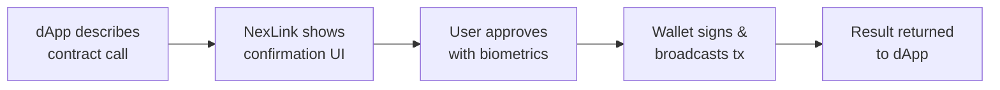
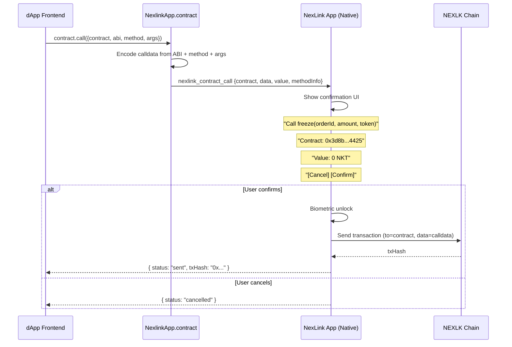
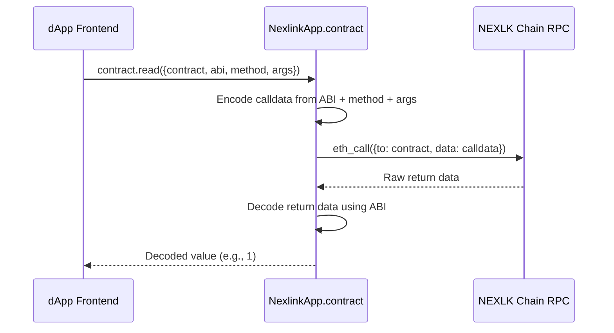
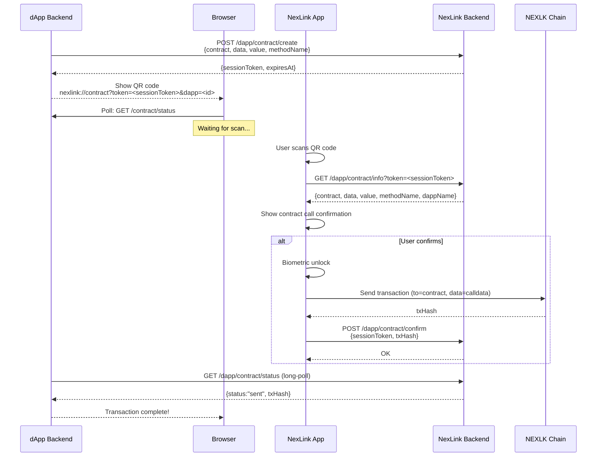
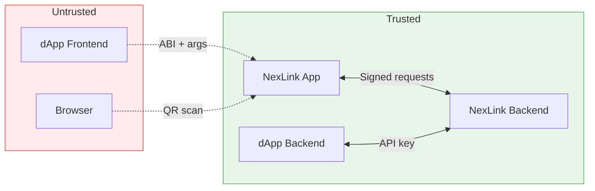

# NexLink dApp Contract Interaction

This document describes how dApps interact with their own smart contracts through the NexLink Wallet. It covers ABI-aware SDK calls, standard Web3 library usage, and external browser (QR code) flows.

For endpoint specifications, see [API Reference](API.md#contract-api). For authentication, see [Login & Registration](AUTH.md). For token payments, see [Payment Integration](PAYMENT.md).

---

## 1. Overview

### Three Layers of Contract Interaction

DApp developers deploy their own smart contracts (escrow, marketplace, token freeze, etc.) to the NEXLK chain. These contracts are called through the NexLink Wallet, which handles transaction signing, user confirmation, and broadcast.

NexLink provides three layers for contract interaction. Choose the one that fits your use case:

| Layer | Interface | DApp encodes calldata? | Confirmation UI | Use case |
|---|---|---|---|---|
| **Layer 1** | `window.ethereum` (EIP-1193) | Yes (via ethers.js / viem / web3.js) | Byte count | Standard Web3 — works with any wallet |
| **Layer 2** | `NexlinkApp.wallet.sendTransaction()` | Yes (manually) | Byte count | Direct bridge call — bypass `window.ethereum` wrapper |
| **Layer 3** | `NexlinkApp.contract.call()` | No (SDK encodes) | Decoded function name + args | ABI-aware — NexLink handles encoding |

**Choose Layer 1** when you want portability across wallets (MetaMask, WalletConnect, NexLink). Use standard ethers.js or viem — no NexLink-specific code.

**Choose Layer 2** when you need direct bridge access without a Web3 library. Same as Layer 1 but bypasses the `window.ethereum` wrapper.

**Choose Layer 3** when you want NexLink to handle ABI encoding and show decoded function calls in the confirmation UI (e.g., "Call `freeze(orderId, 100 USDK)`" instead of "Contract call (128 bytes)").

### How It Works (General Principle)



The dApp describes *what* contract function to call, the NexLink app handles authorization through its native UI, and the result flows back to the dApp.

---

## 2. Layer 1: Standard Web3 Libraries (EIP-1193)

NexLink injects a fully [EIP-1193](https://eips.ethereum.org/EIPS/eip-1193) compliant `window.ethereum` provider. Any standard Web3 library works without NexLink-specific code.

### ethers.js

```javascript
import { ethers } from 'ethers';

const provider = new ethers.BrowserProvider(window.ethereum);
const signer = await provider.getSigner();

const ESCROW_ABI = [
  "function freeze(bytes32 orderId, uint256 amount, address token)",
  "function release(bytes32 orderId, address recipient)",
  "function getOrderStatus(bytes32 orderId) view returns (uint8)",
  "function getBalance(address account, address token) view returns (uint256)"
];

const escrow = new ethers.Contract(ESCROW_ADDRESS, ESCROW_ABI, signer);

// Write call — NexLink shows confirmation UI
const tx = await escrow.freeze(orderId, 10000000, USDK_ADDRESS);
console.log("txHash:", tx.hash);
await tx.wait(); // Wait for on-chain confirmation

// Read call — no signing needed
const status = await escrow.getOrderStatus(orderId);
const balance = await escrow.getBalance(userAddress, USDK_ADDRESS);
```

### viem

```javascript
import { createWalletClient, createPublicClient, custom } from 'viem';

const walletClient = createWalletClient({
  transport: custom(window.ethereum)
});

const publicClient = createPublicClient({
  transport: custom(window.ethereum)
});

// Write call
const txHash = await walletClient.writeContract({
  address: ESCROW_ADDRESS,
  abi: escrowABI,
  functionName: 'freeze',
  args: [orderId, 10000000n, USDK_ADDRESS]
});

// Read call
const status = await publicClient.readContract({
  address: ESCROW_ADDRESS,
  abi: escrowABI,
  functionName: 'getOrderStatus',
  args: [orderId]
});
```

### Provider Discovery (EIP-6963)

NexLink also supports [EIP-6963](https://eips.ethereum.org/EIPS/eip-6963) for multi-wallet environments. Libraries that support EIP-6963 will automatically discover NexLink alongside other wallets.

```javascript
window.addEventListener('eip6963:announceProvider', (event) => {
  const { info, provider } = event.detail;
  // info.name === "NexLink Wallet"
  // info.rdns === "app.nexlink.wallet"
  // provider is the EIP-1193 provider
});

window.dispatchEvent(new Event('eip6963:requestProvider'));
```

### When to Use Layer 1

- Your dApp must work with multiple wallets (MetaMask, WalletConnect, NexLink)
- You already use ethers.js, viem, or web3.js
- You want zero NexLink-specific code in your frontend
- Standard byte-count confirmation UI is acceptable

---

## 3. Layer 3: NexlinkApp.contract SDK

The ABI-aware SDK handles calldata encoding and provides a decoded confirmation UI. Available on `window.NexlinkApp.contract` inside the NexLink dApp browser.

### Detection

```javascript
if (window.NexlinkApp && NexlinkApp.contract) {
  // In-app: contract SDK available
} else if (window.ethereum) {
  // EIP-1193 available (Layer 1 fallback)
} else {
  // External browser: use QR contract flow
}
```

### contract.call() — Write Transactions

Sends a state-changing transaction to a smart contract. Shows a native confirmation UI with decoded function name and arguments. Returns a [ContractCallResult](API.md#contractcallresult).

```javascript
const result = await NexlinkApp.contract.call({
  contract: "0x3d8b4425...",         // Contract address
  abi: ESCROW_ABI,                    // ABI array
  method: "freeze",                   // Function name
  args: [orderId, 10000000, USDK],    // Arguments
  value: "0"                          // Native token (wei), optional
});

if (result.status === "sent") {
  console.log("Transaction sent:", result.txHash);
}
```

#### Flow



#### Parameters

| Parameter | Type | Required | Description |
|---|---|---|---|
| `contract` | String | Yes | Contract address (hex, checksummed) |
| `abi` | Array | Yes | ABI array (standard Solidity ABI JSON format) |
| `method` | String | Yes | Function name (e.g., `"freeze"`) |
| `args` | Array | Yes | Function arguments in order |
| `value` | String | No | Native token value in wei (default `"0"`) |

#### Return Value

| Field | Type | Description |
|---|---|---|
| `status` | String | `"sent"`, `"cancelled"`, or `"failed"` |
| `txHash` | String | Transaction hash (present when `status` is `"sent"`) |
| `error` | String | Error message (present when `status` is `"failed"`) |

#### Error Cases

| Error | Cause | DApp Action |
|---|---|---|
| `"cancelled"` | User tapped Cancel | Show "Transaction cancelled" |
| `"invalid_contract"` | Contract address invalid | Fix the address |
| `"invalid_method"` | Method not found in ABI | Check ABI and method name |
| `"encode_error"` | Args don't match ABI types | Fix argument types |
| `"insufficient_gas"` | Not enough NKT for gas | Show "Insufficient gas" |
| `"tx_failed"` | On-chain transaction reverted | Show revert reason if available |

---

### contract.read() — View/Pure Calls

Calls a `view` or `pure` function on a smart contract. No signing required, no confirmation UI, no gas cost. Returns the decoded return value.

```javascript
const status = await NexlinkApp.contract.read({
  contract: "0x3d8b4425...",
  abi: ESCROW_ABI,
  method: "getOrderStatus",
  args: [orderId]
});

console.log("Order status:", status);  // e.g., 1
```

#### Flow



#### Parameters

| Parameter | Type | Required | Description |
|---|---|---|---|
| `contract` | String | Yes | Contract address (hex, checksummed) |
| `abi` | Array | Yes | ABI array |
| `method` | String | Yes | Function name (must be `view` or `pure`) |
| `args` | Array | Yes | Function arguments in order |

#### Return Value

Returns the decoded value(s) according to the ABI output specification. For single return values, returns the value directly. For multiple return values, returns an array.

```javascript
// Single return value: uint256
const balance = await NexlinkApp.contract.read({
  contract: escrowAddr,
  abi: ESCROW_ABI,
  method: "getBalance",
  args: [userAddr, tokenAddr]
});
// balance === 10000000

// Multiple return values
const [amount, token, status] = await NexlinkApp.contract.read({
  contract: escrowAddr,
  abi: ESCROW_ABI,
  method: "getOrderDetails",
  args: [orderId]
});
```

---

### contract.encode() — Calldata Helper

Encodes ABI calldata without sending a transaction. Useful when you need to build the calldata yourself for use with `NexlinkApp.wallet.sendTransaction()` or for logging/debugging.

```javascript
const calldata = NexlinkApp.contract.encode({
  abi: ESCROW_ABI,
  method: "freeze",
  args: [orderId, 10000000, USDK_ADDRESS]
});

console.log(calldata);
// "0x57e871e7000000000000000000000000..."
```

#### Parameters

| Parameter | Type | Required | Description |
|---|---|---|---|
| `abi` | Array | Yes | ABI array |
| `method` | String | Yes | Function name |
| `args` | Array | Yes | Function arguments in order |

#### Return Value

Returns the hex-encoded calldata string (prefixed with `0x`).

---

### ABI Format

The SDK accepts standard Solidity ABI JSON format, the same format used by ethers.js, viem, and web3.js.

**Full JSON format:**

```json
[
  {
    "type": "function",
    "name": "freeze",
    "inputs": [
      { "name": "orderId", "type": "bytes32" },
      { "name": "amount", "type": "uint256" },
      { "name": "token", "type": "address" }
    ],
    "outputs": [],
    "stateMutability": "nonpayable"
  },
  {
    "type": "function",
    "name": "getBalance",
    "inputs": [
      { "name": "account", "type": "address" }
    ],
    "outputs": [
      { "name": "", "type": "uint256" }
    ],
    "stateMutability": "view"
  }
]
```

**Human-readable format** (ethers.js style, also accepted):

```javascript
const ESCROW_ABI = [
  "function freeze(bytes32 orderId, uint256 amount, address token)",
  "function release(bytes32 orderId, address recipient)",
  "function dispute(bytes32 orderId)",
  "function getOrderStatus(bytes32 orderId) view returns (uint8)",
  "function getBalance(address account, address token) view returns (uint256)"
];
```

### Supported Types

| Solidity Type | Example Value | Notes |
|---|---|---|
| `uint256` | `10000000` or `"10000000"` | Integers or numeric strings |
| `int256` | `-1` or `"-1"` | Signed integers |
| `address` | `"0xaC2D...c526"` | Hex string, checksummed |
| `bytes32` | `"0x5468..."` | Hex string, 32 bytes |
| `bytes` | `"0x1234..."` | Dynamic-length hex string |
| `string` | `"hello"` | UTF-8 string |
| `bool` | `true` / `false` | Boolean |
| `uint256[]` | `[1, 2, 3]` | Array of uint256 |
| `tuple` | `{ field1: val1, field2: val2 }` | Struct |

---

## 4. Browser Contract Interaction (QR Code)

For users accessing the dApp in an external browser. The dApp displays a QR code; the user scans it with the NexLink app to sign and submit the contract call.

### Flow



### Step by Step

1. **DApp backend creates session** — calls `POST /dapp/contract/create` with the contract address, encoded calldata, value, and a human-readable method name. Receives a `sessionToken` (UUID, valid 5 minutes).

2. **Display QR code** — encode the deep link into a QR code:
   ```
   nexlink://contract?token=<sessionToken>&dapp=<dappId>
   ```

3. **Browser polls** — dApp frontend polls its own backend, which calls `GET /dapp/contract/status` (long-poll, 25s hold).

4. **User scans QR** — NexLink app parses the deep link, fetches contract call details from `GET /dapp/contract/info`, and shows the confirmation UI.

5. **User confirms** — biometric unlock → sign transaction → broadcast → report `txHash` via `POST /dapp/contract/confirm`.

6. **DApp receives result** — long-poll returns `"sent"` with `txHash`.

### Deep Link Format

```
nexlink://contract?token=<sessionToken>&dapp=<dappId>
```

| Parameter | Required | Description |
|---|---|---|
| `token` | Yes | One-time contract session UUID |
| `dapp` | Yes | dApp numeric ID |

> **Security:** No contract address, calldata, or value in the QR code. All details come from the NexLink backend after scanning.

### QR Code Expiry & Refresh

When the contract session expires, create a new session (`POST /dapp/contract/create`) and generate a new QR code.

```javascript
// Browser-side polling pseudocode
async function pollContractStatus(sessionToken) {
  while (true) {
    const res = await fetch(`/api/contract/status?token=${sessionToken}`);
    const data = await res.json();

    if (data.status === "sent") {
      showSuccess(data.txHash);
      return;
    }
    if (data.status === "expired") {
      showExpiredUI();    // "QR expired — click to refresh"
      return;
    }
    // status === "pending" → loop again immediately
  }
}
```

---

## 5. Confirmation UI

### What the User Sees

When a dApp requests a contract call, the NexLink app shows a native confirmation sheet:

**Layer 3 (ABI-aware) — Decoded:**

```
┌─────────────────────────────────┐
│        Contract Call            │
│                                 │
│  Function: freeze               │
│                                 │
│  orderId:  0x5468...a1b2        │
│  amount:   10000000             │
│  token:    0xaC2D...c526        │
│                                 │
│  Contract: 0x3d8b...4425        │
│  Value:    0 NKT                │
│  Gas:      ~45,000              │
│                                 │
│  dApp:     Danbao               │
│                                 │
│   [Cancel]        [Confirm]     │
└─────────────────────────────────┘
```

**Layer 1 / Layer 2 — Raw:**

```
┌─────────────────────────────────┐
│        Contract Call            │
│                                 │
│  To:       0x3d8b...4425        │
│  Data:     128 bytes            │
│  Value:    0 NKT                │
│  Gas:      ~45,000              │
│                                 │
│  dApp:     Danbao               │
│                                 │
│   [Cancel]        [Confirm]     │
└─────────────────────────────────┘
```

Layer 3 provides a better user experience by showing the decoded function name and parameters instead of raw byte counts.

---

## 6. Common Patterns

### ERC-20 Approve + Contract Call

Many contracts require an ERC-20 `approve()` before the contract can transfer tokens on the user's behalf. This is a two-step transaction:

```javascript
const USDK_ADDRESS = "0xaC2D085205D0A42121E48a9C20E7aE1a7102c526";
const ESCROW_ADDRESS = "0x3d8b4425...";

const ERC20_ABI = [
  "function approve(address spender, uint256 amount) returns (bool)",
  "function allowance(address owner, address spender) view returns (uint256)"
];

const ESCROW_ABI = [
  "function freeze(bytes32 orderId, uint256 amount, address token)"
];

// Step 1: Check existing allowance
const allowance = await NexlinkApp.contract.read({
  contract: USDK_ADDRESS,
  abi: ERC20_ABI,
  method: "allowance",
  args: [userAddress, ESCROW_ADDRESS]
});

// Step 2: Approve if needed (user sees confirmation #1)
if (allowance < amount) {
  const approveResult = await NexlinkApp.contract.call({
    contract: USDK_ADDRESS,
    abi: ERC20_ABI,
    method: "approve",
    args: [ESCROW_ADDRESS, amount]
  });

  if (approveResult.status !== "sent") {
    console.log("Approve cancelled or failed");
    return;
  }

  // Wait for approval to be mined before proceeding
  // (use Layer 1 provider or poll for receipt)
}

// Step 3: Call escrow contract (user sees confirmation #2)
const result = await NexlinkApp.contract.call({
  contract: ESCROW_ADDRESS,
  abi: ESCROW_ABI,
  method: "freeze",
  args: [orderId, amount, USDK_ADDRESS]
});
```

> **Note:** Each step requires separate user confirmation. The dApp cannot batch approvals and calls into a single transaction.

### Escrow: Freeze and Release

```javascript
const ESCROW_ABI = [
  "function freeze(bytes32 orderId, uint256 amount, address token)",
  "function release(bytes32 orderId, address recipient)",
  "function dispute(bytes32 orderId)",
  "function getOrderStatus(bytes32 orderId) view returns (uint8)"
];

// Buyer freezes tokens
const freezeResult = await NexlinkApp.contract.call({
  contract: ESCROW_ADDRESS,
  abi: ESCROW_ABI,
  method: "freeze",
  args: [orderId, 10000000, USDK_ADDRESS]
});

// Seller releases tokens (after confirming receipt)
const releaseResult = await NexlinkApp.contract.call({
  contract: ESCROW_ADDRESS,
  abi: ESCROW_ABI,
  method: "release",
  args: [orderId, buyerAddress]
});

// Check order status (no signing needed)
const status = await NexlinkApp.contract.read({
  contract: ESCROW_ADDRESS,
  abi: ESCROW_ABI,
  method: "getOrderStatus",
  args: [orderId]
});
// status: 0 = none, 1 = frozen, 2 = released, 3 = disputed
```

### Layer 1 Fallback Pattern

For dApps that want to use Layer 3 when available but fall back to standard ethers.js:

```javascript
import { ethers } from 'ethers';

async function callContract(contractAddr, abi, method, args) {
  // Prefer Layer 3 (decoded confirmation UI)
  if (window.NexlinkApp && NexlinkApp.contract) {
    return await NexlinkApp.contract.call({
      contract: contractAddr,
      abi: abi,
      method: method,
      args: args
    });
  }

  // Fallback to Layer 1 (standard ethers.js)
  if (window.ethereum) {
    const provider = new ethers.BrowserProvider(window.ethereum);
    const signer = await provider.getSigner();
    const contract = new ethers.Contract(contractAddr, abi, signer);
    const tx = await contract[method](...args);
    return { status: "sent", txHash: tx.hash };
  }

  throw new Error("No wallet available");
}
```

---

## 7. Security Model

### Trust Boundaries



### Key Security Properties

| Property | Mechanism |
|---|---|
| **User consent** | Every write call requires native confirmation UI with biometric unlock. DApp cannot auto-send. |
| **No blind signing** | Layer 3 shows decoded function name and parameters. Layer 1/2 show contract address and byte count. |
| **Contract address visible** | Confirmation UI always displays the target contract address. User can verify. |
| **Value display** | Native token value (NKT) is always shown. User can see if ETH/NKT is being sent. |
| **QR code safety** | QR contains only `sessionToken` + `dappId`. No contract address, calldata, or value. |
| **Read calls are free** | `contract.read()` never prompts the user. View/pure calls don't require signing. |
| **ABI integrity** | Layer 3: ABI provided by dApp frontend. User trusts the dApp to provide correct ABI. Layer 1: ABI handled by Web3 library. |

### Layer Comparison

| Concern | Layer 1 (EIP-1193) | Layer 3 (NexlinkApp.contract) | Browser QR |
|---|---|---|---|
| Who encodes calldata? | Web3 library (ethers/viem) | NexLink SDK | dApp backend |
| Confirmation detail | Byte count | Decoded function + args | Depends on backend info |
| Wallet portability | Works with any wallet | NexLink only | NexLink only |
| Read calls | Via Web3 library | `contract.read()` | Not applicable |
| Browser support | In-app only | In-app only | External browsers |

---

## 8. Implementation Checklist

### NexLink Backend (Go)

- [ ] `DappContractSession` model — `sessionToken`, `contract`, `data`, `value`, `methodName`, `expiresAt`, `status`
- [ ] `POST /dapp/contract/create` — create contract call session for QR flow
- [ ] `GET /dapp/contract/info` — return contract call details for scanned QR
- [ ] `POST /dapp/contract/confirm` — user confirms QR contract call
- [ ] `GET /dapp/contract/status` — long-poll for QR contract call result

### NexLink App (Dart)

- [ ] `ContractModule` bridge module (`contract_module.dart`)
- [ ] Bridge handler: `nexlink_contract_call` (write call)
- [ ] Bridge handler: `nexlink_contract_read` (read call)
- [ ] Bridge handler: `nexlink_contract_encode` (calldata encode)
- [ ] ABI encoder/decoder (extend existing `_selector`, `_padAddress`, `_padUint256`)
- [ ] Decoded contract call confirmation UI
- [ ] Deep link handler: `nexlink://contract` scheme

### JS SDK

- [ ] `NexlinkApp.contract.call()` in `_coreSdk`
- [ ] `NexlinkApp.contract.read()` in `_coreSdk`
- [ ] `NexlinkApp.contract.encode()` in `_coreSdk`
- [ ] ABI encoding logic in JavaScript (keccak256 selector + parameter encoding)
- [ ] Stub SDK contract namespace (for pre-load queuing)

### Documentation

- [x] CONTRACT.md — this document
- [x] API.md — add contract types and endpoints
- [x] SUMMARY.md — add Contract Interaction link
