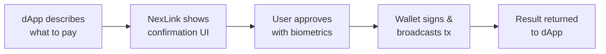
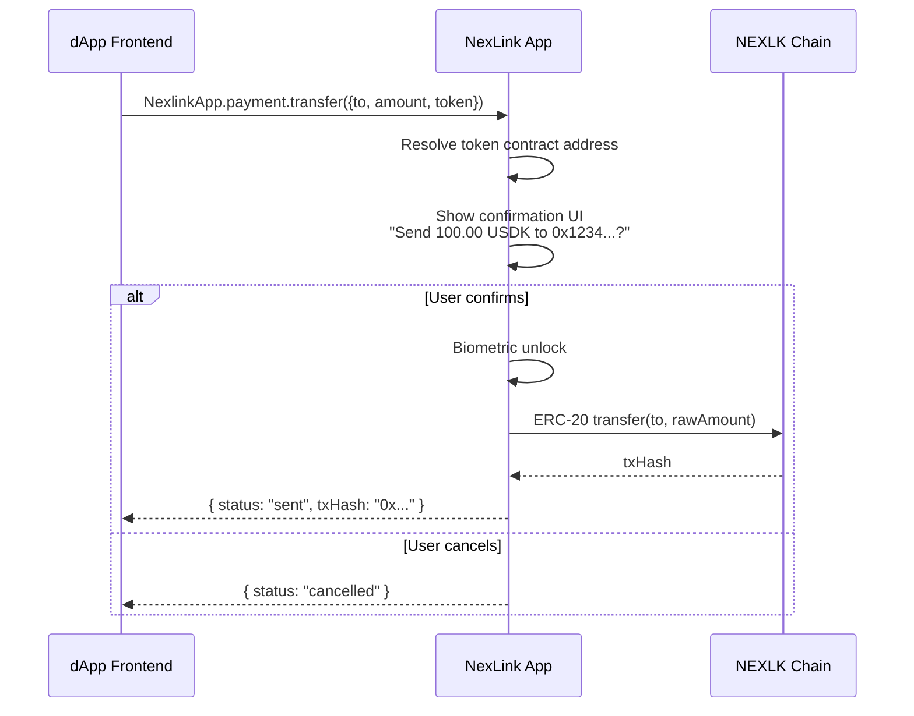
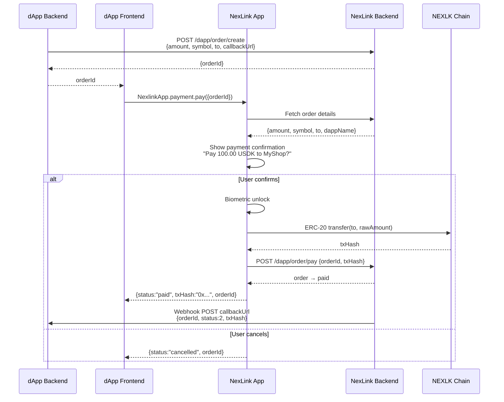
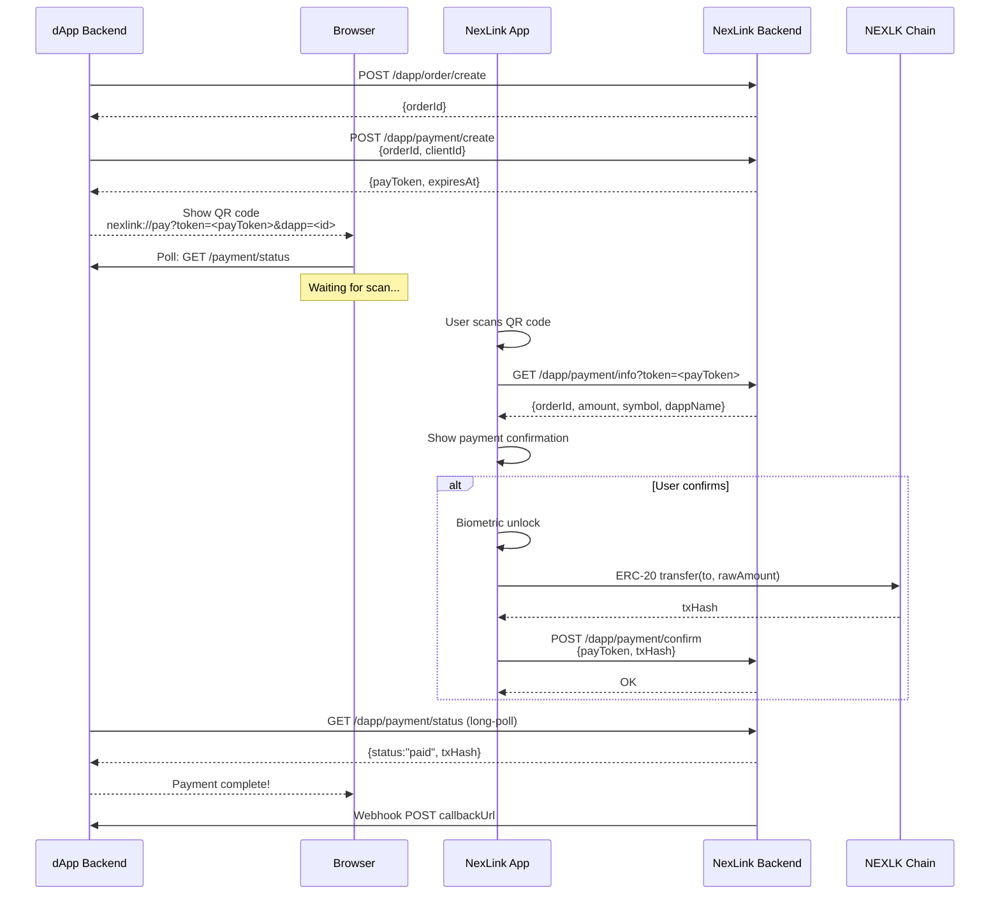
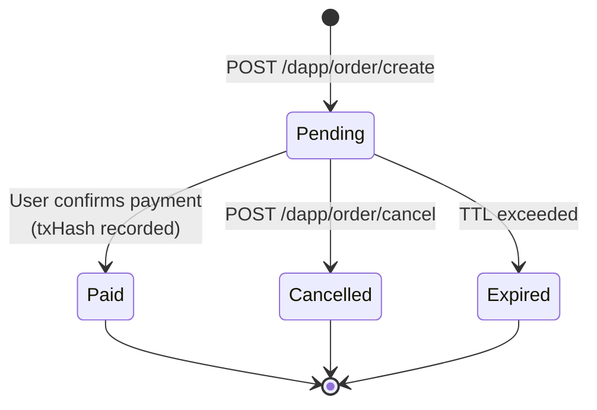
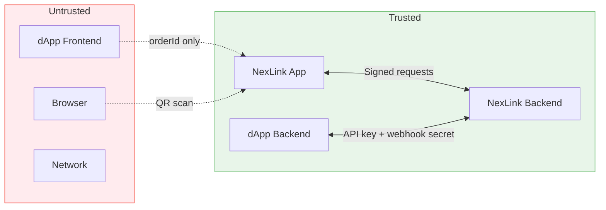

# NexLink dApp Payment Integration

This document describes how dApps interact with the NexLink Wallet to process USDK and CNYT token payments. It covers both in-app (WebView) and external browser (QR code) channels.

For endpoint specifications, see [API Reference](API.md#payment-api). For authentication, see [Login & Registration](AUTH.md).

---

## 1. Overview

### Two Payment Modes

| Mode | Use case | Backend order? | Webhook? | Browser support? |
|---|---|---|---|---|
| **Direct transfer** | P2P tips, donations, simple transfers | No | No | In-app only |
| **Order-based payment** | Commerce, subscriptions, checkout | Yes | Yes | In-app + browser QR |

**Choose direct transfer** when the dApp frontend knows the recipient and amount and no server-side confirmation is needed.

**Choose order-based payment** when the dApp backend must control the payment parameters and receive authoritative confirmation via webhook.

Both modes execute **real on-chain ERC-20 transactions** on the NEXLK chain. The NexLink app always shows a native confirmation UI before signing — the dApp cannot bypass user approval.

### How It Works (General Principle)



The dApp describes *what* it wants to pay, the NexLink app handles authorization through its native UI, and the result flows back to the dApp.

---

## 2. Token Registry

### Supported Tokens

| Token | Description | Chain | Contract Address | Decimals |
|---|---|---|---|---|
| **USDK** | USD-pegged stablecoin | NEXLK | `0xaC2D085205D0A42121E48a9C20E7aE1a7102c526` | 5 |
| **CNYT** | CNY-pegged stablecoin | NEXLK | `0x1e0df1f0813E6521819af9cAC158787f6f94471F` | 5 |

### NEXLK Chain

| Property | Value |
|---|---|
| Chain ID | `2026777` |
| Type | EVM-compatible |
| Native token | NKT |
| Consensus | Proof of Authority |

### Decimal Handling

Both tokens use **5 decimal places** (non-standard; ERC-20 default is 18).

| Human amount | Raw amount (smallest unit) | Conversion |
|---|---|---|
| `1.00` USDK | `100000` | × 10⁵ |
| `0.50` CNYT | `50000` | × 10⁵ |
| `1234.56789` USDK | `123456789` | × 10⁵ |

The JS SDK `transfer()` method accepts **human-readable amounts** (e.g., `"100.00"`). The native app handles conversion to raw units internally.

The order API `amount` field uses **raw units** (smallest unit, integer). The dApp backend must multiply by 10⁵ when creating orders.

---

## 3. Direct Transfer (Simple Mode)

For P2P payments, tips, and simple transfers. No backend needed — pure frontend interaction. **In-app only.**

### JS SDK Method

```javascript
const result = await NexlinkApp.payment.transfer({
  to: "0x1234...abcd",   // Recipient wallet address
  amount: "100.00",       // Human-readable amount
  token: "USDK"           // "USDK" or "CNYT"
});

if (result.status === "sent") {
  console.log("Transfer sent:", result.txHash);
}
```

### Flow



### Parameters

| Parameter | Type | Required | Description |
|---|---|---|---|
| `to` | String | Yes | Recipient wallet address (hex, checksummed) |
| `amount` | String | Yes | Human-readable amount (e.g., `"100.00"`, `"0.5"`) |
| `token` | String | Yes | Token symbol: `"USDK"` or `"CNYT"` |

### Return Value

| Field | Type | Description |
|---|---|---|
| `status` | String | `"sent"`, `"cancelled"`, or `"failed"` |
| `txHash` | String | Transaction hash (present when `status` is `"sent"`) |
| `error` | String | Error message (present when `status` is `"failed"`) |

### Error Cases

| Error | Cause | DApp Action |
|---|---|---|
| `"cancelled"` | User tapped Cancel | Show "Payment cancelled" |
| `"insufficient_balance"` | Not enough tokens | Show balance and suggest top-up |
| `"invalid_address"` | `to` is not a valid address | Fix the address |
| `"invalid_token"` | Token symbol not recognized | Use `"USDK"` or `"CNYT"` |
| `"invalid_amount"` | Amount is zero, negative, or malformed | Fix the amount |
| `"tx_failed"` | On-chain transaction reverted | Retry or contact support |

### Example: Tip Button

```javascript
// Simple tip button in a dApp
async function sendTip(recipientAddress, amount) {
  if (!window.NexlinkApp) {
    alert("Please open this dApp in the NexLink app");
    return;
  }

  const result = await NexlinkApp.payment.transfer({
    to: recipientAddress,
    amount: amount,
    token: "USDK"
  });

  if (result.status === "sent") {
    showSuccess(`Tip sent! TX: ${result.txHash}`);
  } else if (result.status === "cancelled") {
    // User cancelled — do nothing
  } else {
    showError(`Transfer failed: ${result.error}`);
  }
}
```

> **Note:** `transfer()` is available only inside the NexLink app. In external browsers, `window.NexlinkApp` is `undefined`. For browser support, use the order-based payment flow.

---

## 4. Order-Based Payment (Commerce Mode)

For e-commerce, subscriptions, and any flow where the dApp backend must control payment parameters and receive confirmation. Works **in-app and in external browsers**.

### 4.1 In-App Flow



#### Step by Step

1. **DApp backend creates order** — calls `POST /dapp/order/create` with amount, token symbol, recipient address, and callback URL. Receives `orderId` (UUID).

2. **DApp frontend triggers payment** — passes `orderId` to the user's browser/WebView. Frontend calls `NexlinkApp.payment.pay({ orderId })`.

3. **NexLink app fetches order** — contacts NexLink backend to retrieve order details (amount, symbol, recipient, dApp name/icon). Cross-validates that the order belongs to the current dApp.

4. **Native confirmation UI** — shows a payment sheet with the verified details: token, amount, recipient, dApp name. User cannot modify these values.

5. **User confirms** — biometric unlock (fingerprint/face). NexLink wallet builds the ERC-20 `transfer(to, amount)` calldata, signs, and broadcasts to the NEXLK chain.

6. **Report to backend** — NexLink app sends `txHash` to the backend via `POST /dapp/order/pay`. Backend transitions the order to `paid` status.

7. **Result to frontend** — Promise resolves with `{ status: "paid", txHash, orderId }`.

8. **Webhook to dApp backend** — NexLink backend delivers a signed webhook to the dApp's `callbackUrl` with order details and `txHash`. This is the **authoritative confirmation** — dApp backends should not trust the frontend callback alone.

#### JS SDK Method

```javascript
const result = await NexlinkApp.payment.pay({
  orderId: "nx-uuid-123"   // From POST /dapp/order/create
});

if (result.status === "paid") {
  console.log("Payment complete:", result.txHash);
  // Also wait for webhook on your backend for authoritative confirmation
}
```

#### Parameters

| Parameter | Type | Required | Description |
|---|---|---|---|
| `orderId` | String | Yes | Order UUID from [POST /dapp/order/create](API.md#post-dappordercreate) |

#### Return Value

| Field | Type | Description |
|---|---|---|
| `status` | String | `"paid"`, `"cancelled"`, or `"failed"` |
| `txHash` | String | Transaction hash (present when `status` is `"paid"`) |
| `orderId` | String | The order UUID |
| `error` | String | Error message (present when `status` is `"failed"`) |

#### Error Cases

| Error | Cause | DApp Action |
|---|---|---|
| `"cancelled"` | User tapped Cancel | Show "Payment cancelled" |
| `"order_not_found"` | Invalid `orderId` | Check order creation |
| `"order_expired"` | Order TTL exceeded | Create a new order |
| `"order_already_paid"` | Order was already paid | Show success (idempotent) |
| `"insufficient_balance"` | Not enough tokens | Show balance |
| `"tx_failed"` | On-chain transaction reverted | Retry or create new order |

---

### 4.2 Browser Flow (QR Code)

For users accessing the dApp in Chrome, Safari, or any external browser. The dApp displays a QR code; the user scans it with the NexLink app to complete payment.



#### Step by Step

1. **Create order** — same as in-app: `POST /dapp/order/create`.

2. **Create payment session** — `POST /dapp/payment/create` with `orderId` and `clientId`. Returns a `payToken` (UUID, valid 5 minutes).

3. **Display QR code** — encode the deep link into a QR code:
   ```
   nexlink://pay?token=<payToken>&dapp=<dappId>
   ```
   The QR code contains **no amount, no address, no callback URL** — only the token and dApp ID. All payment details are fetched from the backend after scanning.

4. **Browser polls** — dApp frontend polls its own backend, which in turn calls `GET /dapp/payment/status` (long-poll, 25s hold). Possible responses:
   - `"pending"` — no scan yet, reconnect immediately
   - `"paid"` — payment complete, includes `txHash`
   - `"expired"` — `payToken` TTL exceeded, offer refresh

5. **User scans QR** — NexLink app parses the deep link, fetches payment details from `GET /dapp/payment/info`, and shows the payment confirmation UI.

6. **User confirms** — same as in-app: biometric unlock → ERC-20 transfer → broadcast → report `txHash` via `POST /dapp/payment/confirm`.

7. **DApp receives result** — long-poll returns `"paid"` with `txHash`. Browser updates to show success.

8. **Webhook** — NexLink backend also delivers webhook to `callbackUrl` (same as in-app).

#### QR Code Expiry & Refresh

When the payment session expires:

```javascript
// Browser-side polling pseudocode
async function pollPaymentStatus(payToken) {
  while (true) {
    const res = await fetch(`/api/payment/status?token=${payToken}`);
    const data = await res.json();

    if (data.status === "paid") {
      showSuccess(data.txHash);
      return;
    }
    if (data.status === "expired") {
      showExpiredUI();    // "QR expired — click to refresh"
      return;
    }
    // status === "pending" → loop again immediately
  }
}
```

To refresh, create a new payment session (`POST /dapp/payment/create` with the same `orderId`) and generate a new QR code. The order itself does not expire when the payment session expires.

#### Deep Link Format

```
nexlink://pay?token=<payToken>&dapp=<dappId>
```

| Parameter | Required | Description |
|---|---|---|
| `token` | Yes | One-time payment session UUID |
| `dapp` | Yes | dApp numeric ID |

> **Security:** No amount, recipient, or callback in the QR code. Prevents QR code tampering attacks. All sensitive data comes from the NexLink backend.

---

## 5. Order Lifecycle

### Status Transitions



### Status Codes

| Status | Code | Description |
|---|---|---|
| Pending | `1` | Order created, awaiting payment |
| Paid | `2` | Payment confirmed, `txHash` recorded |
| Cancelled | `3` | Cancelled by dApp backend |
| Expired | `4` | Order TTL exceeded without payment |

### Idempotency

- **Order creation** is idempotent on `(dapp_id, externalOrderId)` when `externalOrderId` is provided. Creating an order with the same value returns the existing order instead of creating a duplicate.
- **Order payment** is idempotent on `orderId`. Paying an already-paid order returns success with the existing `txHash`.
- **Payment sessions** are NOT idempotent. Each `POST /dapp/payment/create` generates a new `payToken`. Multiple sessions can exist for the same order (e.g., when user refreshes QR).

### Expiration

| Component | Default TTL | Configurable? |
|---|---|---|
| Order | Set by dApp via `expireSeconds` | Yes (at creation) |
| Payment session (QR) | 5 minutes | No |

When an order expires, all associated payment sessions also expire. An expired order cannot be paid — the dApp must create a new order.

---

## 6. Webhook Callbacks

### Delivery Format

When an order transitions to `paid`, the NexLink backend delivers a signed HTTP POST to the dApp's `callbackUrl`.

```http
POST https://dapp.example.com/api/payment/callback
Content-Type: application/json
X-Nexlink-Timestamp: 1718700100
X-Nexlink-Signature: a1b2c3d4e5f6...

{
  "orderId": "nx-uuid-123",
  "externalOrderId": "shop-001",
  "status": 2,
  "amount": 10000000,
  "symbol": "USDK",
  "txHash": "0xabc123...",
  "paidAt": 1718700100
}
```

### Signature Verification

The dApp backend must verify the webhook signature before trusting the payload.

```
Step 1:  message = X-Nexlink-Timestamp + "." + raw_request_body
Step 2:  expected = HMAC-SHA256(key = <webhook_secret>, message = message)
Step 3:  compare HEX(expected) with X-Nexlink-Signature (constant-time)
Step 4:  check |now() - X-Nexlink-Timestamp| < 300 seconds (5-minute tolerance)
```

### Retry Policy

| Attempt | Delay | Total elapsed |
|---|---|---|
| 1st | Immediate | 0s |
| 2nd | 30 seconds | 30s |
| 3rd | 2 minutes | 2m 30s |
| 4th | 10 minutes | 12m 30s |
| 5th | 30 minutes | 42m 30s |

After 5 failed attempts, the callback is marked as `failed`. The dApp can retrieve the order status manually via `POST /dapp/order/query`.

### Idempotent Handling

Webhooks may be delivered more than once (network retries). The dApp backend must handle duplicates:

```
On receiving webhook:
  1. Verify signature
  2. Look up orderId in database
  3. If already processed → return 200 OK (do nothing)
  4. If new → process payment, update order status, return 200 OK
```

Return HTTP `200` to acknowledge receipt. Any non-2xx response triggers a retry.

---

## 7. Security Model

### Trust Boundaries



### Key Security Properties

| Property | Mechanism |
|---|---|
| **Amount integrity** | Order-based: amount defined server-side, frontend only passes `orderId`. Direct: native UI shows exact amount, user must confirm. |
| **Recipient integrity** | Order-based: recipient set in backend order. Direct: native UI shows full address. |
| **Replay prevention** | Each `orderId` can only be paid once. Each `payToken` is one-time use. |
| **QR code safety** | QR contains only `payToken` + `dappId` — no amount, no address, no callback URL. |
| **Webhook authenticity** | HMAC-SHA256 signature with timestamp. dApp verifies before processing. |
| **On-chain finality** | `txHash` can be independently verified on the NEXLK chain by any party. |
| **User consent** | Native confirmation UI with biometric unlock. DApp cannot auto-send. |

### Direct Transfer vs Order-Based Security

| Concern | Direct Transfer | Order-Based |
|---|---|---|
| Who defines amount? | dApp frontend (user confirms) | dApp backend (tamper-proof) |
| Backend confirmation? | No (txHash only) | Yes (webhook) |
| Replay risk | Low (unique tx per confirmation) | None (orderId is one-time) |
| Best for | Low-value P2P | Commerce, high-value |

---

## 8. Implementation Checklist

### NexLink Backend (Go)

- [ ] `POST /dapp/order/pay` — internal endpoint for in-app payment completion
- [ ] `DappPaymentSession` model — `payToken`, `orderId`, `expiresAt`, `status`
- [ ] `POST /dapp/payment/create` — create payment session for QR flow
- [ ] `GET /dapp/payment/info` — return order details for scanned QR
- [ ] `POST /dapp/payment/confirm` — user confirms QR payment
- [ ] `GET /dapp/payment/status` — long-poll for QR payment result
- [ ] Token contract registry (chainId → symbol → contract address)

### NexLink App (Dart)

- [ ] `PaymentModule` bridge module (`payment_module.dart`)
- [ ] Bridge handler: `nexlink_payment_pay` (order-based)
- [ ] Bridge handler: `nexlink_payment_transfer` (direct)
- [ ] Bridge handler: `nexlink_payment_getOrderStatus` (query)
- [ ] Payment confirmation UI sheet
- [ ] Deep link handler: `nexlink://pay` scheme
- [ ] ERC-20 transfer calldata builder (reuse from `WalletModule`)

### JS SDK

- [ ] `NexlinkApp.payment.pay()` in `_coreSdk`
- [ ] `NexlinkApp.payment.transfer()` in `_coreSdk`
- [ ] `NexlinkApp.payment.getOrderStatus()` in `_coreSdk`
- [ ] Stub SDK payment namespace (for pre-load queuing)

### Documentation

- [x] PAYMENT.md — this document
- [x] API.md — add payment types and endpoints
- [x] SUMMARY.md — add Payment Integration link
