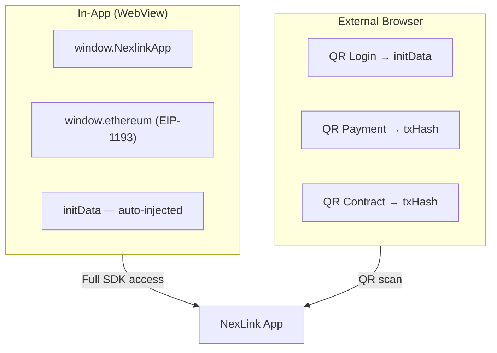

# NexLink dApp Platform

Developer documentation for building dApps on the NexLink platform.

---

## What is NexLink?

NexLink is a mobile wallet and messaging app with a built-in dApp browser. Third-party developers can build dApps that integrate with NexLink for user authentication, token payments, and smart contract interaction — all through a standardized SDK.

---

## What Can DApps Do?

| Capability | Description | Docs |
|---|---|---|
| **Authentication** | Identify users via signed initData (in-app) or QR code login (browser) | [Login & Registration](AUTH.md) |
| **Token Payments** | Accept USDK/CNYT payments via order-based or direct transfer flows | [Payment Integration](PAYMENT.md) |
| **Contract Interaction** | Call any smart contract on the NEXLK chain through the wallet | [Contract Interaction](CONTRACT.md) |

All capabilities work through two channels:

- **In-app** — dApp runs inside NexLink's WebView with full SDK access (`window.NexlinkApp`)
- **External browser** — dApp runs in Chrome/Safari with QR code flows for auth, payments, and contract calls

---

## Getting Started

### 1. Register Your dApp

Contact the NexLink platform administrator to register your dApp. You will receive:

| Credential | Purpose |
|---|---|
| `dapp_id` | Numeric identifier for your dApp |
| `secret_key` | Used for initData signature verification |
| `api_key` | Used for backend API authentication (`Bearer <api_key>`) |

### 2. Choose Your Integration

**Minimal integration (auth only):**

```javascript
// In-app: identity is available immediately
const initData = window.NexlinkApp.initData;
// Send to your backend for verification
const res = await fetch('/api/login', {
  method: 'POST',
  body: JSON.stringify({ initData })
});
```

**Add payments:**

```javascript
// Direct transfer (P2P, tips)
const result = await NexlinkApp.payment.transfer({
  to: "0x1234...abcd",
  amount: "10.00",
  token: "USDK"
});

// Order-based payment (commerce)
const result = await NexlinkApp.payment.pay({
  orderId: "uuid-from-your-backend"
});
```

**Add contract calls:**

```javascript
// Call any contract on the NEXLK chain
const result = await NexlinkApp.contract.call({
  contract: "0x3d8b4425...",
  abi: YOUR_CONTRACT_ABI,
  method: "freeze",
  args: [orderId, amount, tokenAddress]
});

// Read contract state (no signing needed)
const balance = await NexlinkApp.contract.read({
  contract: "0x3d8b4425...",
  abi: YOUR_CONTRACT_ABI,
  method: "getBalance",
  args: [userAddress]
});
```

### 3. Support External Browsers

For users outside the NexLink app, implement QR code flows:

```javascript
if (window.NexlinkApp) {
  // In-app: use SDK directly
} else {
  // Browser: show QR code for login/payment/contract
}
```

Each feature has a corresponding QR flow — see [AUTH.md](AUTH.md), [PAYMENT.md](PAYMENT.md), and [CONTRACT.md](CONTRACT.md) for details.

---

## Platform Overview

### Two Runtime Environments



| Feature | In-App | External Browser |
|---|---|---|
| Authentication | `NexlinkApp.initData` (automatic) | QR code → long-poll |
| Payment (direct) | `NexlinkApp.payment.transfer()` | Not available |
| Payment (order) | `NexlinkApp.payment.pay()` | QR code → long-poll |
| Contract (write) | `NexlinkApp.contract.call()` | QR code → long-poll |
| Contract (read) | `NexlinkApp.contract.read()` | Via `window.ethereum` or direct RPC |
| EIP-1193 provider | `window.ethereum` | Not available |

### NEXLK Chain

| Property | Value |
|---|---|
| Chain ID | `2026777` |
| Type | EVM-compatible |
| Native token | NKT |
| Consensus | Proof of Authority |

### Supported Tokens

| Token | Contract Address | Decimals |
|---|---|---|
| USDK | `0xaC2D085205D0A42121E48a9C20E7aE1a7102c526` | 5 |
| CNYT | `0x1e0df1f0813E6521819af9cAC158787f6f94471F` | 5 |

---

## JS SDK Reference

The NexLink SDK is injected as `window.NexlinkApp` when a dApp runs inside the NexLink app.

### Namespaces

| Namespace | Methods | Description |
|---|---|---|
| `NexlinkApp` | `.initData` | Signed user identity string |
| `NexlinkApp.payment` | `.pay()`, `.transfer()`, `.getOrderStatus()` | Token payment operations |
| `NexlinkApp.contract` | `.call()`, `.read()`, `.encode()` | Smart contract interaction |
| `NexlinkApp.wallet` | `.sendTransaction()`, `.getAddress()` | Low-level wallet access |
| `window.ethereum` | EIP-1193 standard methods | Standard Web3 provider |

### Detection

```javascript
// Check if running inside NexLink app
if (window.NexlinkApp) {
  // Full SDK available
  const initData = NexlinkApp.initData;
}

// Check specific capabilities
if (NexlinkApp.payment) { /* payment methods available */ }
if (NexlinkApp.contract) { /* contract methods available */ }
if (window.ethereum) { /* EIP-1193 provider available */ }
```

> For complete method signatures and parameters, see [API Reference](API.md).

---

## Documentation

| Document | Description |
|---|---|
| [API Reference](API.md) | Types, endpoints, and JS SDK method signatures |
| [Login & Registration](AUTH.md) | initData, signature verification, QR login, account binding |
| [Payment Integration](PAYMENT.md) | USDK/CNYT payments — direct transfer and order-based flows |
| [Contract Interaction](CONTRACT.md) | Smart contract calls — EIP-1193, NexLink SDK, and QR flows |

---

## Security Summary

| Principle | Detail |
|---|---|
| **Signed identity** | User identity (`initData`) is HMAC-SHA256 signed — cannot be forged by the dApp frontend |
| **User consent** | Every payment and contract call requires native confirmation UI with biometric unlock |
| **No blind signing** | Confirmation UI shows amount, recipient, or decoded function call before signing |
| **Server-side verification** | dApp backends verify `initData` signatures and webhook signatures independently |
| **QR code safety** | QR codes contain only session tokens — no sensitive data (amounts, addresses, callbacks) |
| **On-chain finality** | All transactions produce a `txHash` that can be independently verified on the NEXLK chain |
