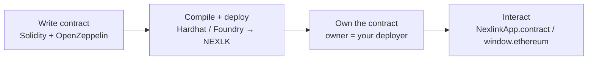

# Contract Deployment

> **Status: Supported today.** Deploying your own contracts to the NEXLK chain works with any standard EVM toolchain — nothing NexLink-specific is required. This document is the **deploy** half of the developer workflow; once deployed, you drive your contract through [Contract Interaction](CONTRACT.md). (The developer-portal **one-click fungible-token issuer** is a separate, managed path — this doc is the **self-deploy** route for custom tokens, NFTs, escrow, marketplaces, etc.)

You write a Solidity contract, deploy it to NEXLK (chain `2026777`) with Hardhat or Foundry, then call it from the NexLink Wallet. This page covers the shared setup, a **token** example, and an **NFT** example.



---

## 1. NEXLK network config

| Property | Value |
|---|---|
| Chain ID | `2026777` |
| RPC URL | your NEXLK RPC (set `NEXLINK_RPC_URL`) |
| Type | EVM-compatible — **Shanghai + Cancun** active from genesis; compile with Solidity `0.8.24` + `evmVersion: "cancun"` (as the reference contracts do) |

**Hardhat** (`hardhat.config.js`):

```javascript
module.exports = {
  solidity: {
    version: "0.8.24",
    settings: { evmVersion: "cancun" },     // matches NEXLK (Shanghai + Cancun active)
  },
  networks: {
    nexlk: {
      url: process.env.NEXLINK_RPC_URL,     // NEXLK RPC
      chainId: 2026777,
      accounts: [process.env.DEPLOYER_PRIVATE_KEY],
    },
  },
};
```

**Foundry** (`foundry.toml` + `--rpc-url $NEXLINK_RPC_URL --chain 2026777`) works identically — use whichever toolchain you prefer.

> **Keep the deployer key server-side.** The account you deploy from becomes the contract **owner** (the wallet allowed to `mint`, set config, etc.). Never ship it in frontend code.

---

## 2. Environment setup

```bash
npm i -D hardhat
npm i @openzeppelin/contracts        # audited ERC-20 / ERC-721 base contracts
npx hardhat init                     # or: forge init
```

Set `NEXLINK_RPC_URL` and `DEPLOYER_PRIVATE_KEY` in your environment (e.g. a `.env` the toolchain reads — never commit it).

---

## 3. Deploy a token (ERC-20)

A minimal, audited-base ERC-20 you can copy:

```solidity
// SPDX-License-Identifier: MIT
pragma solidity ^0.8.20;

import "@openzeppelin/contracts/token/ERC20/ERC20.sol";
import "@openzeppelin/contracts/access/Ownable.sol";

contract MyToken is ERC20, Ownable {
    constructor(address initialOwner)
        ERC20("My Token", "MYT")
        Ownable(initialOwner)
    {
        _mint(initialOwner, 1_000_000 * 10 ** decimals());  // initial supply
    }

    function mint(address to, uint256 amount) external onlyOwner {
        _mint(to, amount);   // owner-gated supply increases
    }
}
```

Deploy script (`scripts/deploy-token.js`):

```javascript
const [deployer] = await ethers.getSigners();
const Token = await ethers.getContractFactory("MyToken");
const token = await Token.deploy(deployer.address);   // initialOwner = issuer
await token.waitForDeployment();
console.log("Token:", await token.getAddress());
```

```bash
npx hardhat run scripts/deploy-token.js --network nexlk
```

> A **self-deployed** token like this is not the same as the developer-portal fungible-token issuer (which the platform tracks/approves). Use the portal issuer when you want managed issuance; self-deploy when you want a custom contract you fully control.

---

## 4. Deploy an NFT (ERC-721 / soulbound)

The NFT contracts (normal `NexTestNft.sol` and the soulbound `SoulboundNft.sol` variant) and the collection-owner model are documented in [NFT Issuance §2–§4](NFT.md). Deploy them exactly like the token above:

```javascript
// scripts/deploy-nft.js
const [deployer] = await ethers.getSigners();
const Nft = await ethers.getContractFactory("NexTestNft");  // or SoulboundNft
const nft = await Nft.deploy(deployer.address);             // initialOwner = issuer
await nft.waitForDeployment();
console.log("Collection:", await nft.getAddress());
```

```bash
npx hardhat run scripts/deploy-nft.js --network nexlk
```

For **honor** SBTs (bound to an identity, aggregated to the 主身份), the issuer must additionally hold a Foundation **root certificate** — see [Honor & Reputation §4](HONOR.md). Image/metadata storage (MinIO + IPFS) is in [NFT Issuance §6](NFT.md#6-metadata).

---

## 5. Interact with your deployed contract

Once deployed, every read/write goes through the standard [Contract Interaction](CONTRACT.md) layers — no redeploy of anything NexLink-side:

| From | How |
|---|---|
| **In-app (WebView)** | [`NexlinkApp.contract.call()` / `.read()`](CONTRACT.md#3-layer-3-nexlinkappcontract-sdk) or `window.ethereum` (EIP-1193) |
| **External browser** | [QR contract flow](CONTRACT.md#4-browser-contract-interaction-qr-code) |
| **Your backend** | the deployer/owner wallet via ethers/viem; reads via RPC `eth_call` |

Every user-triggered write shows a native confirmation + biometric before signing — you can't bypass user approval.

---

## 6. Security model

| Property | Mechanism |
|---|---|
| **Owner-key custody** | The deployer is the contract owner; keep that key server-side. Consider a separate owner vs. mint-signer for automated flows. |
| **Owner-gated mutations** | `onlyOwner` on `mint` / config; public entry points need their own guards (allowlist, caps, payment). |
| **User consent on in-app calls** | SDK calls show the decoded [confirmation UI](CONTRACT.md#5-confirmation-ui) + biometric. |
| **On-chain finality** | Deployment and every call produce a `txHash` verifiable on chain `2026777`. |

---

## 7. What Needs Building

### Available today
- [x] Deploy ERC-20 / ERC-721 (normal + soulbound) to NEXLK with any EVM toolchain
- [x] Interact via [`NexlinkApp.contract`](CONTRACT.md) / `window.ethereum` / QR flow

### Proposed
- [ ] Developer-portal one-click NFT issuance UX (paralleling the fungible-token issuer)
- [ ] Canonical audited contract templates (token, NFT normal/soulbound/enumerable) published for reuse
- [ ] On-chain source verification on the NEXLK explorer

### Documentation
- [x] DEPLOY.md — this document
- [x] [Contract Interaction](CONTRACT.md) · [NFT Issuance](NFT.md) · [Honor & Reputation](HONOR.md)

**See also:** [Contract Interaction](CONTRACT.md) (drive your deployed contract) · [NFT Issuance](NFT.md) (contract source + metadata) · [Honor & Reputation](HONOR.md) (root-certified honor issuance).
