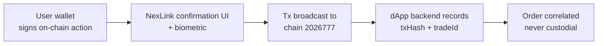

# NexLink dApp Escrow / Guaranteed Payment

> **Status: Shipped (contracts live on chain `2026777`).** The C2C and Guarantee escrow contracts are deployed and used by the **K币担保 (Danbao)** dApp. This document describes the authoritative on-chain model. It supersedes the legacy `freeze/release` example in [CONTRACT.md Section 6](CONTRACT.md#6-common-patterns) — see [Section 9](#9-legacy-single-escrow-abi) for the difference.

Escrow (担保支付) lets two parties transact without trusting each other: funds are **locked in a contract**, and only released when the deal completes — or refunded / adjudicated by a jury if it doesn't. This is the settlement layer behind **K币担保 (Danbao)**, NexLink's guaranteed-trade dApp.

> **Trust an anonymous counterparty without deanonymizing them.** An escrow platform can gate participation on a **zero-knowledge proof** — the user's 主身份 proves a required property (creditworthy / no negative record / KYC) for their anonymous identity, revealing nothing else. This is the flagship use case of the [Identity System §4](IDENTITY.md) + [Honor & Reputation](HONOR.md).

For simple, unconditional payments, use [Direct transfer / order-based payment](PAYMENT.md). Use escrow when the payer needs protection until goods/services are delivered.

For the raw contract-call mechanics, see [Contract Interaction](CONTRACT.md). For API/type specs, see [API Reference](API.md#escrow-api).

---

## 1. Overview

### The money model (why it is safe)

NexLink escrow follows one rule: **the user's own wallet signs every state-changing action.** The dApp backend never holds keys and never moves funds — it only *records* the resulting transaction hashes and on-chain trade IDs to correlate them with its own order. This is the same non-custodial principle as [order-based payment](PAYMENT.md#7-security-model).



| Property | Detail |
|---|---|
| **Who signs** | The user's NexLink wallet — via [`NexlinkApp.contract.call()`](CONTRACT.md#3-layer-3-nexlinkappcontract-sdk) or [`window.ethereum`](CONTRACT.md#2-layer-1-standard-web3-libraries-eip-1193) |
| **Who custodies funds** | The escrow contract on-chain. **Never** the dApp backend. |
| **Backend role** | Correlate: store `txHash` + `tradeId` against the order; drive off-chain UX (order status, auto-release worker, notifications). |
| **Dispute resolution** | Kleros-style [jury arbitration](#6-dispute-resolution-jury) on-chain, with admin/platform appeal. |

### Two escrow contracts

| Contract | Purpose | Who locks funds | Released to |
|---|---|---|---|
| **C2C** | Peer-to-peer trades, marketplace orders, bounties | The sender (seller for sell-crypto; buyer/funder for trade/bounty) | The receiver, on `pay()` |
| **Guarantee** | Merchant posts a refundable deposit to back a promise to a beneficiary | The merchant (sender) | Reclaimed by merchant, or paid to beneficiary on a conceded/adjudicated claim |

Both are [Kleros](https://kleros.io/) `MultipleArbitrableTokenTransaction`-style contracts: each escrow is an integer `transactionID` (also called `tradeId`), funds are an ERC-20 amount, and disputes escalate to an on-chain jury.

---

## 2. Contracts & Token Registry

**Chain:** NEXLK, chain ID `2026777` (EVM-compatible). All escrow amounts are ERC-20 token units.

### Deployed addresses (current testnet — override per environment)

| Contract | Address | Notes |
|---|---|---|
| **C2C** | `0x7781D90613061513aF33F99E9161473D76515AD0` | Redeployed 2026-06-23 — adds `owner` + admin-resolve for admin-QR dispute settlement |
| **Guarantee** | `0x0675Fe67E77F598868F6134eE1Cb9C47337F1e09` | |
| **JuryArbitrator** | `0x86e43067a077Dea4806C57bfc29de9299122f622` | Shared arbitrator for both escrows |

> Production deployments override these via environment config. Never hard-code addresses in a shipped dApp without a config override path.

### Settlement tokens

| Token | Address | Decimals |
|---|---|---|
| **USDK** | `0xaC2D085205D0A42121E48a9C20E7aE1a7102c526` | 5 |
| **CNYT** | `0x1e0df1f0813E6521819af9cAC158787f6f94471F` | 5 |

Both tokens use **5 decimals** (non-standard). Convert human amounts to base units by multiplying by 10⁵ — e.g. `100.00 USDK` → `10000000`. Never use floating point; scale the decimal string directly.

```javascript
// Scale a human amount string into integer base units (no float)
function toUnits(amount, decimals) {
  const [whole, frac = ""] = String(amount).split(".");
  const fracPadded = (frac + "0".repeat(decimals)).slice(0, decimals);
  return BigInt(`${whole}${fracPadded}`.replace(/^0+(?=\d)/, "") || "0");
}
toUnits("100.00", 5); // 10000000n
```

---

## 3. Roles by Order Kind

The **sender** is whoever locks funds; the **receiver** is whoever the funds are released to. Which real-world party plays which role depends on the deal:

| Order kind | Sender (locks funds) | Receiver (paid on release) | Contract | Open method |
|---|---|---|---|---|
| **C2C — sell crypto** | Seller (locks crypto before buyer pays fiat) | Buyer | C2C | `createTrade` |
| **Trade / escrowed purchase** | Buyer / funder (locks payment) | Seller / solver | C2C | `createTransaction` |
| **Bounty** | Funder (locks reward) | Solver | C2C | `createTransaction` |
| **Guarantee** | Merchant (locks deposit) | Beneficiary | Guarantee | `openGuarantee` |

---

## 4. C2C Escrow

The C2C contract is the Kleros `MultipleArbitrableTokenTransaction` core plus a lock-before-fiat `createTrade` / `reclaimTrade` wrapper.

### 4.1 ABI

```javascript
const C2C_ABI = [
  // Seller (sender) locks crypto for buyer (receiver). 4th arg is the PAYMENT
  // WINDOW: seconds the buyer has to pay (and dispute) before the seller may
  // reclaimTrade. Base auto-release to the buyer is disabled (timeout = max).
  "function createTrade(address buyer, address token, uint256 amount, uint256 paymentWindow, string metaEvidence) returns (uint256)",
  // Seller recovers the locked crypto if the buyer never paid (NoDispute-gated).
  "function reclaimTrade(uint256 transactionID)",
  // Generic core (trade/bounty where the buyer/funder is the sender).
  "function createTransaction(uint256 amount, address token, uint256 timeoutPayment, address receiver, string metaEvidence) returns (uint256)",
  "function pay(uint256 transactionID, uint256 amount)",
  "function reimburse(uint256 transactionID, uint256 amountReimbursed)",
  "function executeTransaction(uint256 transactionID)",
  "function payArbitrationFeeBySender(uint256 transactionID) payable",
  "function payArbitrationFeeByReceiver(uint256 transactionID) payable",
  "function submitEvidence(uint256 transactionID, string evidence)",
  "function getCountTransactions() view returns (uint256)"
];
```

### 4.2 Getting the `tradeId`

`createTrade` / `createTransaction` return the new `transactionID`, but you cannot read a return value from a signed transaction until it is mined. Instead, **read `getCountTransactions()` immediately before opening** — the next trade takes that id:

```javascript
// The next created trade's id === current count
const tradeId = Number(await NexlinkApp.contract.read({
  contract: C2C_ADDRESS,
  abi: C2C_ABI,
  method: "getCountTransactions",
  args: []
}));
```

Record this `tradeId` alongside the resulting `txHash` in your backend so both parties compute the same key.

### 4.3 Approve + open (two confirmations)

Locking funds is always **two wallet confirmations**: an ERC-20 `approve` so the escrow can pull the tokens, then the open call. Wait for `approve` to be **mined** before opening, or the open races an ineffective allowance.

```javascript
const ERC20_ABI = [
  "function approve(address spender, uint256 amount) returns (bool)",
  "function allowance(address owner, address spender) view returns (uint256)"
];

async function c2cCreateTrade({ buyer, tokenAddress, amount, paymentWindowSeconds, metaEvidence = "" }) {
  const units = toUnits(amount, 5);

  // 1. Ensure allowance (confirmation #1) — skip if already sufficient
  const allowance = await NexlinkApp.contract.read({
    contract: tokenAddress, abi: ERC20_ABI, method: "allowance",
    args: [(await NexlinkApp.wallet.getAccounts())[0], C2C_ADDRESS]
  });
  if (BigInt(allowance) < units) {
    await NexlinkApp.contract.call({
      contract: tokenAddress, abi: ERC20_ABI, method: "approve",
      args: [C2C_ADDRESS, units.toString()]
    });
    // wait for the approve receipt before continuing (poll or use a Layer 1 provider)
  }

  // 2. Snapshot the id, then open the trade (confirmation #2)
  const tradeId = Number(await NexlinkApp.contract.read({
    contract: C2C_ADDRESS, abi: C2C_ABI, method: "getCountTransactions", args: []
  }));
  const { txHash } = await NexlinkApp.contract.call({
    contract: C2C_ADDRESS, abi: C2C_ABI, method: "createTrade",
    args: [buyer, tokenAddress, units.toString(), paymentWindowSeconds, metaEvidence]
  });

  return { txHash, tradeId };
}
```

### 4.4 Lifecycle — sell-crypto (lock before fiat)

```mermaid
sequenceDiagram
    participant S as Seller (sender)
    participant C2C as C2C contract
    participant B as Buyer (receiver)
    participant API as dApp Backend

    S->>C2C: approve + createTrade(buyer, token, amount, paymentWindow)
    C2C-->>S: locked; tradeId
    S->>API: record { tradeId, freezeTx }
    Note over B: Buyer pays fiat off-platform within paymentWindow

    alt Deal completes
        S->>C2C: pay(tradeId, amount)
        C2C-->>B: amount released to buyer
        S->>API: record releaseTx
    else Buyer never paid (window elapsed, no dispute)
        S->>C2C: reclaimTrade(tradeId)
        C2C-->>S: locked crypto returned to seller
    else Dispute
        B->>C2C: payArbitrationFeeByReceiver(tradeId)
        S->>C2C: payArbitrationFeeBySender(tradeId)
        Note over C2C: escalates to Jury (Section 6)
    end
```

| Actor action | Method | Effect |
|---|---|---|
| Seller locks crypto for buyer | `createTrade(buyer, token, amount, paymentWindow, meta)` | Funds locked; `paymentWindow` = seconds buyer has to pay/dispute |
| Sender releases to receiver | `pay(tradeId, amount)` | Escrowed amount → receiver |
| Receiver returns funds (cancel) | `reimburse(tradeId, amount)` | Escrowed amount → back to sender |
| Seller reclaims (buyer never paid) | `reclaimTrade(tradeId)` | Locked crypto → seller, gated on no active dispute |
| Settle after timeout | `executeTransaction(tradeId)` | Releases per contract state once the window elapses |

### 4.5 Trade / bounty (buyer or funder is the sender)

Use the generic core when the party locking funds is the **payer** (a buyer paying for goods, or a funder posting a bounty):

```javascript
// Buyer/funder locks `amount`, to be released to `receiver` (seller/solver)
const tradeId = Number(await NexlinkApp.contract.read({
  contract: C2C_ADDRESS, abi: C2C_ABI, method: "getCountTransactions", args: []
}));
await NexlinkApp.contract.call({
  contract: C2C_ADDRESS, abi: C2C_ABI, method: "createTransaction",
  args: [toUnits(amount, 5).toString(), tokenAddress, timeoutSeconds, receiver, metaEvidence]
});
// Release with pay(tradeId, amount); cancel/refund with reimburse(tradeId, amount)
```

---

## 5. Guarantee Escrow

A merchant locks a **refundable deposit** that backs a promise to a beneficiary. If the merchant keeps the promise, they reclaim the deposit after a delay window; if they concede (or lose a dispute), the deposit pays the beneficiary.

### 5.1 ABI

```javascript
const GUARANTEE_ABI = [
  "function openGuarantee(address beneficiary, address token, uint256 amount, uint256 reclaimDelay, string metaEvidence) returns (uint256)",
  "function reclaimDeposit(uint256 transactionID)",
  "function pay(uint256 transactionID, uint256 amount)",
  "function payArbitrationFeeBySender(uint256 transactionID) payable",
  "function payArbitrationFeeByReceiver(uint256 transactionID) payable",
  "function getCountTransactions() view returns (uint256)"
];
```

### 5.2 Lifecycle

```mermaid
sequenceDiagram
    participant M as Merchant (sender)
    participant G as Guarantee contract
    participant Ben as Beneficiary (receiver)

    M->>G: approve + openGuarantee(beneficiary, token, amount, reclaimDelay)
    G-->>M: deposit locked; tradeId

    alt Promise kept (reclaimDelay elapses, no claim)
        M->>G: reclaimDeposit(tradeId)
        G-->>M: deposit returned to merchant
    else Merchant concedes a claim
        M->>G: pay(tradeId, amount)
        G-->>Ben: amount paid to beneficiary from the deposit
    else Disputed claim
        Ben->>G: payArbitrationFeeByReceiver(tradeId)
        M->>G: payArbitrationFeeBySender(tradeId)
        Note over G: escalates to Jury (Section 6)
    end
```

| Actor action | Method | Effect |
|---|---|---|
| Merchant posts deposit | `openGuarantee(beneficiary, token, amount, reclaimDelay, meta)` | Deposit locked; `reclaimDelay` = seconds before merchant may reclaim |
| Merchant reclaims (undisputed) | `reclaimDeposit(tradeId)` | Deposit → merchant, after the delay, if no active claim |
| Merchant concedes / pays claim | `pay(tradeId, amount)` | Amount → beneficiary from the deposit |

---

## 6. Dispute Resolution (Jury)

Both escrows escalate to a shared **JuryArbitrator** — a Kleros-style crowdsourced jury. A party opens a dispute by paying the arbitration fee (`payArbitrationFeeBySender` / `payArbitrationFeeByReceiver`, both `payable` in native NKT). The escrow then registers a case with the arbitrator.

### 6.1 Jury ABI

```javascript
const JURY_ABI = [
  "function postBond(uint256 caseId)",
  "function registerJuror(uint256 caseId)",
  "function vote(uint256 caseId, uint256 choice)",
  "function appealToPlatform(uint256 caseId)",
  "function getCase(uint256 caseId) view returns (address escrow, address partyA, address partyB, uint256 tradeAmount, uint8 phase, uint64 deadline, bool bondA, bool bondB, uint256 votesA, uint256 votesB, uint256 jurorCount, uint256 provisionalRuling, uint256 finalRuling, bool settled)"
];
```

| Method | Who | Purpose |
|---|---|---|
| `postBond(caseId)` | Disputing party | Stake a bond to escalate the case |
| `registerJuror(caseId)` | Any eligible juror | Join the jury pool for the case |
| `vote(caseId, choice)` | Registered juror | Cast a vote for a ruling option |
| `appealToPlatform(caseId)` | Losing party | Escalate to platform/admin resolution |
| `getCase(caseId)` (view) | Anyone | Read case phase, votes, ruling, settled flag |

### 6.2 Reading case state

```javascript
const c = await NexlinkApp.contract.read({
  contract: JURY_ADDRESS, abi: JURY_ABI, method: "getCase", args: [caseId]
});
// c[4] = phase, c[8]/c[9] = votesA/votesB, c[12] = finalRuling, c[13] = settled
```

The C2C contract (2026-06-23 redeploy) also exposes an `owner` + admin-resolve path so the platform can settle a dispute via an admin-QR flow when appropriate.

---

## 7. Using Escrow from a dApp

Escrow is just contract interaction — every escrow action goes through the layers in [CONTRACT.md](CONTRACT.md#1-overview):

| Environment | How to call escrow |
|---|---|
| **In-app (WebView)** | [`NexlinkApp.contract.call()`](CONTRACT.md#contractcall--write-transactions) (Layer 3, decoded confirmation) or `window.ethereum` (Layer 1, ethers/viem) |
| **In-app, reads** | [`NexlinkApp.contract.read()`](CONTRACT.md#contractread--viewpure-calls) for `getCountTransactions` / `getCase` |
| **External browser** | [QR contract flow](CONTRACT.md#4-browser-contract-interaction-qr-code) — backend creates a `/dapp/contract/create` session per escrow action, user scans to sign |

Because each escrow action is a separate signed transaction, a full trade is a **sequence** of contract sessions (approve → open → pay/reclaim), each with its own user confirmation. The dApp cannot batch them.

### metaEvidence

The `metaEvidence` string on `createTrade` / `createTransaction` / `openGuarantee` is a Kleros evidence pointer (typically an IPFS/HTTPS URI to a JSON describing the deal). Jurors read it during a dispute. Pass `""` if you are not using structured evidence.

---

## 8. Backend Correlation

The dApp backend (e.g. danbao-api) never signs. It records the on-chain references the wallet reports and correlates them with its order:

```mermaid
sequenceDiagram
    participant W as User Wallet
    participant Chain as C2C / Guarantee
    participant DB as dApp Backend

    W->>Chain: createTrade / openGuarantee
    Chain-->>W: txHash (+ tradeId snapshotted client-side)
    W->>DB: POST lock { orderNo, tradeId, freezeTx }
    Note over DB: store EscrowTradeID + buyer/seller AA addresses

    W->>Chain: pay / reclaim
    Chain-->>W: releaseTx
    W->>DB: POST settle { orderNo, tradeId, releaseTx }
    Note over DB: order marked settled; correlation complete
```

The backend stores, per order:

| Field | Source |
|---|---|
| `EscrowTradeID` | `tradeId` snapshotted from `getCountTransactions()` before the open |
| `BuyerAddress` / `SellerAddress` | The AA wallet addresses of each party, captured client-side when they act |
| `freezeTx` / `releaseTx` | The `txHash` of the open and release calls |

An off-chain auto-release worker can drive order state independently; the contract-side `paymentWindow` / `reclaimDelay` is the on-chain backstop.

For endpoint specs, see [API Reference — Escrow API](API.md#escrow-api).

---

## 9. Legacy Single-Escrow ABI

Earlier docs (and the third-party partner-custody adapter) reference a simpler **bytes32-keyed single-escrow** ABI:

```javascript
// LEGACY — partner-custody / illustrative only. NOT the in-app contract.
const LEGACY_ESCROW_ABI = [
  "function freeze(bytes32 orderId, uint256 amount, address token)",
  "function release(bytes32 orderId, address recipient)",
  "function dispute(bytes32 orderId)",
  "function getOrderStatus(bytes32 orderId) view returns (uint8)",
  "function getBalance(address account, address token) view returns (uint256)"
];
```

| Aspect | Legacy single-escrow | In-app C2C / Guarantee (authoritative) |
|---|---|---|
| Key type | `bytes32 orderId` (keccak of a seed) | `uint256 transactionID` / `tradeId` |
| Dispute | `dispute(orderId)` no-op stub | Kleros jury with bonds, voting, appeal |
| Roles | Single freeze/release | Sender/receiver, sell-crypto vs trade/bounty vs guarantee |
| Where used | Partner-custody correlation, examples | The deployed K币担保 (Danbao) flows |

Use the legacy ABI **only** for third-party partner platforms that custody funds in their own `bytes32`-keyed contract and report freeze/release tx hashes for correlation. All first-party escrow uses C2C / Guarantee.

---

## 10. Security Model

| Property | Mechanism |
|---|---|
| **Non-custodial** | The user's wallet signs every action. The backend never holds keys or moves funds. |
| **User consent** | Every `approve`, open, `pay`, `reclaim` is a native confirmation UI + biometric. No auto-send. |
| **Funds locked on-chain** | Escrowed tokens sit in the contract, not with any counterparty or the platform. |
| **Dispute fairness** | Kleros-style jury with bonded parties, juror voting, and a platform appeal path. |
| **Correlation integrity** | `tradeId` is derived deterministically (`getCountTransactions` snapshot); both sides compute the same key. |
| **On-chain finality** | Every action produces a `txHash` verifiable on chain `2026777` by any party. |
| **Timeout backstops** | `paymentWindow` / `reclaimDelay` prevent funds being locked forever if a party disappears. |

---

## 11. Implementation Status

### On-chain (chain 2026777) — shipped

- [x] C2C contract (`createTrade`, `createTransaction`, `pay`, `reimburse`, `reclaimTrade`, `executeTransaction`, arbitration fees, evidence)
- [x] Guarantee contract (`openGuarantee`, `reclaimDeposit`, `pay`, arbitration fees)
- [x] JuryArbitrator (bonds, juror registration, voting, platform appeal, `getCase`)
- [x] C2C admin-resolve path (owner + admin-QR dispute settlement)

### dApp integration (danbao) — shipped

- [x] Client-side wallet calls via viem + EIP-1193 (`danbao-web/lib/wallet/`)
- [x] Backend correlation of `tradeId` + freeze/release tx hashes (`danbao-api`)
- [x] Off-chain auto-release worker + order lifecycle
- [x] Third-party partner-custody escrow adapter (legacy `bytes32` correlation)

### Platform SDK — available today

- [x] Escrow works through the generic [`NexlinkApp.contract`](CONTRACT.md#3-layer-3-nexlinkappcontract-sdk) SDK and [`window.ethereum`](CONTRACT.md#2-layer-1-standard-web3-libraries-eip-1193) — no escrow-specific bridge method is required
- [x] QR contract sessions for external-browser signing

### Documentation

- [x] ESCROW.md — this document
- [ ] API.md — escrow correlation endpoints (see [Escrow API](API.md#escrow-api))
- [x] SUMMARY.md — Escrow link
