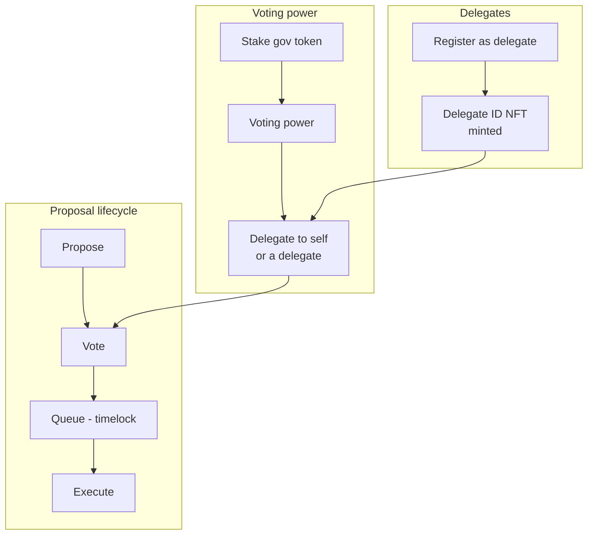
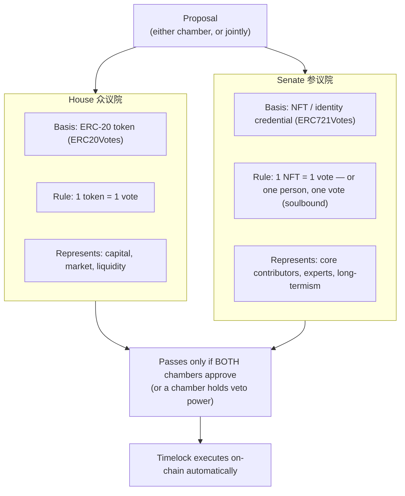

# NexLink dApp Community Governance

> **Status: Design / Proposed pattern.** The platform primitives needed to build governance — [`NexlinkApp.contract`](CONTRACT.md#3-layer-3-nexlinkappcontract-sdk) and [`window.ethereum`](CONTRACT.md#2-layer-1-standard-web3-libraries-eip-1193) — **ship today**. The governance contracts and Delegate-ID NFT described here are a **reference design** a dApp deploys to the NEXLK chain; they are not yet part of NexLink itself. All ABIs below are proposed shapes based on the [OpenZeppelin Governor](https://docs.openzeppelin.com/contracts/governance) standard — the same stack [Tally](https://www.tally.xyz/) drives (Tally has since rebranded to **Cactus**; same platform and URL).

Community governance (社区管理) lets a community **stake tokens for voting power, submit proposals, and vote** on them on-chain — a DAO. NexLink adds one twist inspired by Tally's delegate profiles: a **Delegate ID (代言人身份) is itself an NFT** — becoming a delegate mints a transferable-or-soulbound identity token that carries the delegate's public statement. For communities that want power balanced between capital and contributors, [Section 5](#5-bicameral-governance-house--senate) extends this into a **bicameral (House + Senate)** model where an ERC-20 chamber and an NFT chamber check each other.

Because every action is an ordinary contract call, governance needs **no governance-specific SDK** — it runs through the standard [Contract Interaction](CONTRACT.md) layers, each step signed by the user.

---

## 1. Overview



### Components

| Component | Standard | Role |
|---|---|---|
| **Governance token** | ERC-20 **Votes** (ERC20Votes / ERC-5805) | Balance + delegated voting power with historical snapshots |
| **Staking module** | Custom | Lock tokens to receive voting power (and optionally rewards); gate delegate eligibility |
| **Governor** | OpenZeppelin Governor | Proposals, voting, quorum, states |
| **Timelock** | TimelockController | Enforced delay between a passed proposal and execution |
| **Delegate ID NFT** | ERC-721 (optionally [soulbound](NFT.md#4-soulbound-tokens-sbt)) | On-chain delegate identity + statement URI |

### Roles

| Role | How you get it | Can do |
|---|---|---|
| **Member** | Hold/stake the gov token | Delegate voting power, vote (if self-delegated) |
| **Delegate** | Register → mint a Delegate ID NFT | Receive delegated power, vote on behalf of delegators |
| **Proposer** | Hold voting power ≥ proposal threshold | Submit proposals |

---

## 2. Voting Power: Stake & Delegate

Voting power comes from the **ERC20Votes** token, but it is only counted once **delegated** — even to yourself. Staking locks tokens into the staking module, which credits voting power (and can gate who is allowed to become a delegate).

### 2.1 Proposed ABIs

```javascript
const GOV_TOKEN_ABI = [
  "function balanceOf(address account) view returns (uint256)",
  "function delegate(address delegatee)",
  "function delegates(address account) view returns (address)",
  "function getVotes(address account) view returns (uint256)"
];

const STAKING_ABI = [
  "function stake(uint256 amount)",
  "function unstake(uint256 amount)",
  "function stakedOf(address account) view returns (uint256)",
  "function votingPowerOf(address account) view returns (uint256)"
];
```

### 2.2 Stake then delegate

```javascript
// 1. Approve + stake (two confirmations) — see ESCROW.md §4.3 for the approve pattern
await NexlinkApp.contract.call({
  contract: GOV_TOKEN_ADDRESS, abi: ERC20_ABI, method: "approve",
  args: [STAKING_ADDRESS, toUnits(amount, decimals).toString()]
});
await NexlinkApp.contract.call({
  contract: STAKING_ADDRESS, abi: STAKING_ABI, method: "stake",
  args: [toUnits(amount, decimals).toString()]
});

// 2. Delegate voting power (to yourself, or to a delegate's address)
await NexlinkApp.contract.call({
  contract: GOV_TOKEN_ADDRESS, abi: GOV_TOKEN_ABI, method: "delegate",
  args: [delegateeAddress]   // your own address to self-delegate
});

// Read current power (no signing)
const power = await NexlinkApp.contract.read({
  contract: GOV_TOKEN_ADDRESS, abi: GOV_TOKEN_ABI, method: "getVotes",
  args: [userAddress]
});
```

> **Snapshot voting.** Governor counts each voter's power at the proposal's snapshot block, so buying tokens after a proposal opens does not increase your weight on it. This is standard ERC20Votes behavior.

---

## 3. Delegate ID NFT

Registering as a delegate mints a **Delegate ID** — an ERC-721 whose `tokenURI` points to the delegate's public statement (name, platform, why delegate to me). This is the on-chain analogue of a Tally delegate profile. It can be issued **soulbound** (non-transferable — identity you cannot sell) or transferable; see [NFT.md](NFT.md#4-soulbound-tokens-sbt).

### 3.1 Proposed ABI

```javascript
const DELEGATE_ID_ABI = [
  // Mint the caller's Delegate ID with a statement URI; reverts if already registered
  "function registerDelegate(string statementURI) returns (uint256 tokenId)",
  "function updateStatement(uint256 tokenId, string statementURI)",
  "function resignDelegate(uint256 tokenId)",
  "function isDelegate(address account) view returns (bool)",
  "function tokenOfDelegate(address account) view returns (uint256)",
  "function tokenURI(uint256 tokenId) view returns (string)"
];
```

### 3.2 Become a delegate

```javascript
// statementURI is an IPFS/HTTPS URI to a JSON: { name, bio, platform, links }
const { txHash } = await NexlinkApp.contract.call({
  contract: DELEGATE_ID_ADDRESS, abi: DELEGATE_ID_ABI, method: "registerDelegate",
  args: [statementURI]
});
// Members can now delegate() their voting power to this delegate's address.
```

| Method | Purpose |
|---|---|
| `registerDelegate(statementURI)` | Mint the Delegate ID NFT for the caller |
| `updateStatement(tokenId, uri)` | Update the public delegate statement |
| `resignDelegate(tokenId)` | Burn/retire the Delegate ID |
| `isDelegate(account)` / `tokenOfDelegate(account)` | Look up delegate status and token id |

Displaying the delegate roster is a set of `read` calls: enumerate Delegate ID holders, resolve each `tokenURI`, and pair with `getVotes(delegateAddress)` for received power.

### 3.3 The Delegate ID as a credential gate

The Delegate ID is more than a profile — it is the **eligibility credential** ("议员资格证", a digital congressman's badge). The governance frontend and contracts can require it:

| Gate | Mechanism |
|---|---|
| **Roster listing** | Only wallets where `isDelegate(account)` is true appear in the delegate list — you cannot campaign without the NFT |
| **Delegation target** | The frontend (optionally the token contract) rejects `delegate(to)` unless `isDelegate(to)` — voting power can only flow to credentialed delegates |
| **Qualification issue** | Minting can be gated: open registration, community election, or a qualification review before `registerDelegate` succeeds |
| **Revocation** | `resignDelegate` (or a DAO-voted revoke) burns the credential, delisting the delegate |

Issued **soulbound**, the credential cannot be bought or sold — the delegate seat stays with the person who earned it (this is how [Optimism's Citizens' House](#54-real-world-precedents) works).

### 3.4 How voters choose a delegate

Voters pick a delegate from the roster using objective, on-chain metrics — all `read` calls:

| Metric | Source | What it tells a voter |
|---|---|---|
| **Participation rate** | Count of `castVote` events vs total proposals | Does this delegate actually show up and vote? |
| **Voting history** | Past `VoteCast` events (support + reason) | Do their positions match my interests? |
| **Received voting power** | `getVotes(delegateAddress)` | How much weight the community has already entrusted to them |
| **Statement** | `tokenURI` JSON (name, bio, platform, links) | Their declared governance platform |

### 3.5 Reputation upgrades (optional)

To keep delegates accountable after they receive power, the Delegate ID can be a **dynamic NFT** — a reputation medal that upgrades with verifiable work:

- Track participation on-chain (e.g. attestation records of consecutive votes cast).
- When a threshold is met (say, 10 consecutive proposals voted), upgrade the token's tier — its `tokenURI` metadata moves from bronze → silver → gold.
- Voters can then judge a delegate at a glance: a gold-tier Delegate ID is proof of sustained participation; a stale bronze one signals an absentee.

This turns the roster into a live reputation system instead of a list of promises.

---

## 4. Proposals & Voting

Uses the standard OpenZeppelin **Governor** interface.

### 4.1 Proposed ABI

```javascript
const GOVERNOR_ABI = [
  "function propose(address[] targets, uint256[] values, bytes[] calldatas, string description) returns (uint256 proposalId)",
  "function castVote(uint256 proposalId, uint8 support) returns (uint256)",
  "function castVoteWithReason(uint256 proposalId, uint8 support, string reason) returns (uint256)",
  "function state(uint256 proposalId) view returns (uint8)",
  "function proposalSnapshot(uint256 proposalId) view returns (uint256)",
  "function proposalDeadline(uint256 proposalId) view returns (uint256)",
  "function proposalThreshold() view returns (uint256)",
  "function quorum(uint256 timepoint) view returns (uint256)",
  "function queue(address[] targets, uint256[] values, bytes[] calldatas, bytes32 descriptionHash) returns (uint256)",
  "function execute(address[] targets, uint256[] values, bytes[] calldatas, bytes32 descriptionHash) payable returns (uint256)"
];
```

`support` values (Governor `VoteType`): `0` = Against, `1` = For, `2` = Abstain.

Proposal `state` enum: `0` Pending · `1` Active · `2` Canceled · `3` Defeated · `4` Succeeded · `5` Queued · `6` Expired · `7` Executed.

### 4.2 Lifecycle

```mermaid
sequenceDiagram
    participant P as Proposer
    participant Gov as Governor
    participant V as Voters / Delegates
    participant TL as Timelock

    P->>Gov: propose(targets, values, calldatas, description)
    Gov-->>P: proposalId (state: Pending)
    Note over Gov: after votingDelay, state becomes Active at snapshot block

    V->>Gov: castVote(proposalId, support)
    Note over Gov: power counted at snapshot; runs until deadline

    alt Quorum + majority For
        Gov->>Gov: state: Succeeded
        P->>Gov: queue(targets, values, calldatas, descriptionHash)
        Gov->>TL: schedule with delay
        Note over TL: timelock delay elapses
        P->>Gov: execute(...)
        Gov->>TL: run the actions
    else Failed
        Gov->>Gov: state: Defeated / Expired
    end
```

### 4.3 Create a proposal & vote

```javascript
// Create a proposal (caller must hold >= proposalThreshold voting power)
const { txHash } = await NexlinkApp.contract.call({
  contract: GOVERNOR_ADDRESS, abi: GOVERNOR_ABI, method: "propose",
  args: [targets, values, calldatas, description]
});

// Vote — 1 = For, 0 = Against, 2 = Abstain
await NexlinkApp.contract.call({
  contract: GOVERNOR_ADDRESS, abi: GOVERNOR_ABI, method: "castVoteWithReason",
  args: [proposalId, 1, "I support this because..."]
});

// Read state (no signing)
const state = await NexlinkApp.contract.read({
  contract: GOVERNOR_ADDRESS, abi: GOVERNOR_ABI, method: "state", args: [proposalId]
});
```

The `proposalId` is deterministic — `keccak256(abi.encode(targets, values, calldatas, keccak256(bytes(description))))` — so a frontend can compute it, and `queue`/`execute` re-supply the same arrays plus the `descriptionHash`.

---

## 5. Bicameral Governance (House + Senate)

A single token-weighted chamber lets capital alone decide everything. The **bicameral (两院制)** model splits power between two chambers that check each other — the community's NFT and ERC-20 token each carry a distinct political role:



### 5.1 The two chambers

| | **House (众议院)** | **Senate (参议院)** |
|---|---|---|
| Voting basis | ERC-20 governance token (ERC20Votes) | NFT / identity credential (ERC721Votes, optionally [soulbound](NFT.md#4-soulbound-tokens-sbt)) |
| Vote rule | 1 token = 1 vote — more capital, more weight | 1 NFT = 1 vote; soulbound issuance ≈ one person, one vote |
| Represents | Capital, liquidity providers, market sentiment | Core contributors, experts, the project's long-term values |
| Typical domain | Economic proposals: fees, emissions, budgets, incentives | Constitutional proposals: protocol upgrades, security parameters, vision |

### 5.2 Checks and balances

| Mechanism | How it works |
|---|---|
| **Concurrent majority** | A proposal executes only when it passes **both** chambers — the shared timelock refuses execution until both Governors have approved |
| **Senate veto** | The House freely passes routine economic proposals, but the Senate can veto a malicious one — e.g. a whale coalition voting to drain the treasury or rewrite core code |
| **Separated proposal rights** | The House may only originate "money" proposals (treasury, incentives); the Senate may only originate "law" proposals (protocol parameters, constitutional changes) |

Because Senate seats are NFTs — ideally soulbound — capital cannot buy them on the market, which is exactly the attack the veto exists to stop.

> **One person, one vote.** Soulbound Senate seats are counted at the voter's **主身份** — the identity that maps to a physical person, exactly one per person — so a user's multiple personas cannot inflate votes. See [Identity System](IDENTITY.md).

### 5.3 Implementation on the standard stack

The model needs no exotic machinery — it is **two Governor contracts + one shared timelock**:

1. **Governor A (House)** — reads voting power from the ERC20Votes token, exactly as in [Section 2](#2-voting-power-stake--delegate).
2. **Governor B (Senate)** — reads voting power from an **ERC721Votes** NFT. The NFT side supports the same `delegate()` mechanics:

```javascript
const NFT_VOTES_ABI = [
  "function delegate(address delegatee)",
  "function delegates(address account) view returns (address)",
  "function getVotes(address account) view returns (uint256)",  // = NFT count delegated
  "function balanceOf(address owner) view returns (uint256)"
];
```

3. **Shared TimelockController** — both Governors point at one timelock, wired so a proposal's actions are executed only after **both** chambers have passed and queued it (concurrent-majority gate), with the veto path cancelling a queued operation.

Both chambers surface in the dApp as two voting boards; a user participates in the House, the Senate, or both, depending on what they hold — every action still an ordinary user-signed [contract call](CONTRACT.md#contractcall--write-transactions).

### 5.4 Real-world precedents

| Project | Model |
|---|---|
| **Optimism Collective** | The canonical bicameral DAO: the **Token House** (OP, ERC-20) votes on economic/protocol matters, while the **Citizens' House** (non-transferable citizen NFT, one person one vote) allocates retroactive public-goods funding (RPGF). The chambers are independent and check each other. |
| **Nouns DAO** | Fully NFT-based governance: each Noun NFT is one vote and its voting power is delegable while the NFT stays in the holder's wallet — the pattern the Senate chamber uses. |

---

## 6. Using Governance from a dApp

| Action | Layer | User signs? |
|---|---|---|
| `stake` / `unstake`, `delegate`, `registerDelegate` | [`contract.call()`](CONTRACT.md#contractcall--write-transactions) | Yes |
| `propose`, `castVote`, `queue`, `execute` | [`contract.call()`](CONTRACT.md#contractcall--write-transactions) | Yes |
| `getVotes`, `state`, `quorum`, delegate roster, `tokenURI` | [`contract.read()`](CONTRACT.md#contractread--viewpure-calls) | No |
| External browser | [QR contract flow](CONTRACT.md#4-browser-contract-interaction-qr-code) per action | Yes (via scan) |

Because Governor is a standard interface, [Layer 1 (ethers/viem)](CONTRACT.md#2-layer-1-standard-web3-libraries-eip-1193) works unchanged — existing Tally-style frontends can point at the NEXLK chain and NexLink's `window.ethereum` provider with no NexLink-specific code.

> **Off-chain signaling first.** Mature DAOs usually run a free, gasless **signal poll** (Snapshot-style signed messages) to gauge sentiment before spending gas on the binding on-chain vote: signal poll → author the code → on-chain Governor vote → automatic execution. The signal phase is plain message-signing (`personalSign`), so it too needs nothing beyond the existing SDK.

---

## 7. Security Model

| Property | Mechanism |
|---|---|
| **Every action user-signed** | Stake, delegate, propose, vote, queue, execute are each a native confirmation + biometric. No custody. |
| **Snapshot voting** | Power is fixed at the proposal snapshot block — no vote-buying after a proposal opens. |
| **Timelock delay** | Passed proposals wait in a timelock before execution, giving members time to exit if they disagree. |
| **Proposal threshold** | Only holders above a voting-power threshold can propose, limiting spam. |
| **Sybil resistance via stake** | Voting power is backed by staked tokens; delegate eligibility can require a minimum stake. |
| **Delegate accountability** | The Delegate ID NFT ties a public statement to an on-chain identity; soulbound issuance prevents selling reputation. |
| **Whale capture resistance** | [Bicameral mode](#5-bicameral-governance-house--senate): concurrent majority + Senate veto stop a token-whale coalition from unilaterally passing malicious proposals; soulbound Senate seats cannot be bought. |
| **Governance-attack awareness** | Snapshot voting also blunts flash-loan / borrowed-token voting: power borrowed after the snapshot block counts for nothing. |
| **Transparent tallies** | Votes and results are on-chain and independently verifiable on chain `2026777`. |

---

## 8. What Needs Building

Governance runs on the existing contract SDK, but the **contracts and their deployment are the dApp's responsibility** and are not yet authored here:

### Contracts (deploy to NEXLK chain 2026777)
- [ ] ERC20Votes governance token (or wrap an existing token)
- [ ] Staking module (`stake`/`unstake`, voting-power accounting, delegate-eligibility gate)
- [ ] Governor + TimelockController (thresholds, quorum, voting delay/period)
- [ ] Delegate ID NFT (ERC-721; soulbound option per [NFT.md](NFT.md#4-soulbound-tokens-sbt); credential gating + optional reputation tiers per [Section 3](#3-delegate-id-nft))
- [ ] Bicameral option: second Governor reading an ERC721Votes NFT (Senate) + shared timelock with concurrent-majority / veto wiring ([Section 5](#5-bicameral-governance-house--senate))

### Platform SDK — available today
- [x] `NexlinkApp.contract.call()` / `.read()` cover every governance action
- [x] `window.ethereum` (EIP-1193 + EIP-6963) for standard Governor frontends
- [x] QR contract sessions for external-browser signing

### Optional platform enhancements
- [ ] A governance helper namespace (`NexlinkApp.governance.*`) wrapping the standard ABIs for convenience
- [ ] Indexed proposal/delegate listing endpoints (so frontends avoid heavy on-chain enumeration)

### Documentation
- [x] GOVERNANCE.md — this design spec
- [ ] API.md — optional indexer endpoints (mark as proposed)
- [x] SUMMARY.md — Governance link
