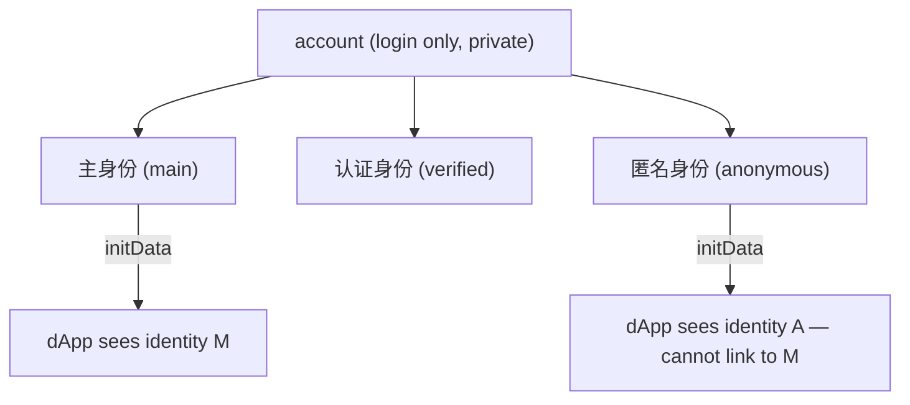
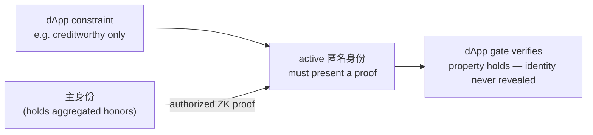

# NexLink Identity System

> **Status: Design / Proposed.** The identity model described here is not yet shipped. Today [`initData`](AUTH.md) identifies the single logged-in user. This document specifies the **multi-identity** model a dApp will build against, and the **zero-knowledge trust** interface it introduces, so integrations can be designed ahead of the platform work. Nothing here is callable yet.

A NexLink user logs in with one **account (注册账号)**, but **acts as an identity (身份)** — a persona with its own contacts, wallet, nickname, and payments. One account can hold several identities and switch between them. To a dApp, **each identity looks like a distinct user**; the account behind them is private.

---

## 1. The three kinds of identity (身份三类)

| Type | 原文 | What it is | Count |
|---|---|---|---|
| **Main identity** | **主身份** | The user's **real / physical identity**. The default on login. The anchor all honors aggregate to. | **exactly one per person** |
| **Verified identity** | **认证身份** | A persona **certified through the 主身份** (linked to the real person, but a distinct acting identity). Can carry credible credentials. | many |
| **Anonymous identity** | **匿名身份** | An anonymous persona for privacy — not publicly tied to the real identity. | many |

- **主身份 is the "one person" unit.** Because it maps to a physical identity and there is exactly one per person, it is the basis for anti-Sybil, credit, and one-person-one-vote.
- Two identities of the same user are **indistinguishable from two different people** to a dApp and to other users.

### Each identity is an on-chain SBT (Foundation contract)

Every identity — 主身份 / 认证身份 / 匿名身份 — is itself a **non-transferable on-chain soulbound token (SBT)** held in the wallet, minted by **a single Identity contract that the NexLink Foundation maintains** — no third party can issue identities. The `identity_type` is on-chain metadata.

The **Foundation is the Root CA** for the platform's trust system: it runs this Identity contract and **root-certifies honor issuers** (see [Honor & Reputation](HONOR.md)). Identity SBTs — and honor SBTs — display in **both the wallet and the personal homepage (个人主页)**.

---

## 2. What a dApp sees

A dApp authenticates the **active identity**, never the account or the other identities.

| A dApp can | A dApp cannot |
|---|---|
| Identify the active identity (its `uid`, nickname, avatar) via [`initData`](AUTH.md) | See the account, or that two identities share one |
| Receive payments / contract calls from the active identity's wallet | Enumerate a user's other identities |
| Request a **zero-knowledge proof** about the person (§4) | Learn the real identity behind a 匿名身份 |



> **initData is per-identity.** When the identity model ships, the signed `initData` a dApp receives ([Login & Registration](AUTH.md)) identifies the **currently active identity**. Switching identity yields a different `initData`. Design your account model around the identity, not the person.

---

## 3. Honor aggregation to the main identity

Honors and credentials ([Honor & Reputation](HONOR.md)) **bind to the identity that earns them**, but **all of a person's honors aggregate up to their 主身份** — the person-level résumé. Because the 主身份 is one-per-person, this makes person-level facts **un-dodgeable**:

- A **bad record** earned on any persona still surfaces at the 主身份 — a user cannot escape it by switching identity.
- **One-person-one-vote** is counted at the 主身份 — extra identities add no votes (see [Community Governance](GOVERNANCE.md)).
- **On-chain credit** is evaluated at the person level.

The aggregation is **inward** — the user's own consolidated view plus person-level enforcement. It is **never** exposed to other users as a public link between personas.

---

## 4. Trust without deanonymization — the ZK proof

The hard question: a dApp needs to **trust** a counterparty, but the counterparty is acting as an **匿名身份**. NexLink resolves this with a **zero-knowledge proof**, and it is **the dApp/platform that sets the rule (由交易平台决定)** — not NexLink.

1. The dApp declares a **constraint (约束条件)** — e.g. *"only creditworthy users may open a trade."*
2. To satisfy it, the user's **主身份 issues an authorized zero-knowledge proof** on behalf of the active identity, attesting the required property (creditworthy / no negative record / holds KYC) **without revealing the real identity or linking the persona to the 主身份**.
3. **No proof → the dApp's gate rejects participation** (原文: "如果不提供，就无法参与").



So **privacy and trust both hold**: the dApp learns *"this anonymous user clears the bar,"* never *who* they are. **Escrow ([Escrow](ESCROW.md)) is the flagship use case** — a guaranteed-trade dApp can require a ZK-attested credit/reputation bar while keeping the trader anonymous.

### 4.1 Proposed SDK surface

```javascript
// dApp asks the active identity to prove it meets a named constraint.
// The 主身份 produces the proof; the persona stays anonymous.
const { proof, publicSignals } = await NexlinkApp.identity.prove({
  constraint: "credit.noNegativeRecord",   // platform-defined predicate
  // optional params, e.g. { minCreditTier: 2 }
});

// The dApp backend (or a verifier contract) checks the proof against the
// published verification key — learns only that the predicate holds.
```

> `NexlinkApp.identity.*` and the predicate registry are **proposed**, not shipped. The proof is over the person's aggregated honors held at the 主身份.

---

## 5. Security model

| Property | Mechanism |
|---|---|
| **Account privacy** | Login identifiers (email/phone) are never surfaced socially; a dApp sees only an identity's `uid`/nickname. |
| **Identity isolation** | Each identity is a distinct signed subject; a dApp cannot enumerate or link a user's other identities. |
| **Anonymity of 匿名身份** | The real person behind an anonymous persona is never exposed; aggregation to 主身份 is inward-only. |
| **Un-dodgeable person facts** | Negative records, credit, and one-person-one-vote resolve at the one-per-person 主身份. |
| **Trust without exposure** | ZK proofs attest a property (creditworthy, KYC, no negative record) without revealing identity — the dApp sets the constraint. |
| **User consent** | Every proof is **authorized** by the user, like a signature — the platform never proves a fact silently. |

---

## 6. What Needs Building

- [ ] Identity model (主身份 / 认证身份 / 匿名身份) + per-identity `initData`
- [ ] Honor aggregation to 主身份 (person-level rollup) — see [Honor & Reputation](HONOR.md)
- [ ] ZK proof service: 主身份-issued, user-authorized proofs over aggregated honors (creditworthy / no negative record / KYC)
- [ ] Predicate registry + verification keys a dApp backend / contract can check
- [ ] `NexlinkApp.identity.prove()` SDK surface

### Documentation
- [x] IDENTITY.md — this document
- [ ] API.md — `identity.prove` signature + predicate list (mark proposed)
- [x] SUMMARY.md — Identity link

**See also:** [Honor & Reputation](HONOR.md) · [Community Governance](GOVERNANCE.md) (one-person-one-vote at 主身份) · [Escrow](ESCROW.md) (ZK-gated participation) · [Login & Registration](AUTH.md).
