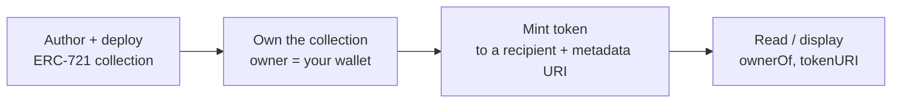

# NexLink dApp NFT Issuance

> **Status: Supported via the contract SDK; first-party issuance UX is Design / Proposed.** You can **deploy and mint NFTs today** on the NEXLK chain and drive minting/reads through [`NexlinkApp.contract`](CONTRACT.md#3-layer-3-nexlinkappcontract-sdk) — the reference ERC-721 (`nex_test_nft/contracts/NexTestNft.sol`) is real. A one-click issuance flow in the developer portal (like the existing fungible-token issuer) is **not built yet** for NFTs; that part is proposed. Fungible token issuance already exists in the developer portal and is out of scope here.

NFT issuance (NFT发行) covers two kinds of non-fungible token:

| Kind | Chinese | Transferable? | Typical use |
|---|---|---|---|
| **Normal NFT** | 普通代币 | Yes | Collectibles, art, tickets, memberships you can trade/sell |
| **Soulbound token (SBT)** | 灵魂代币 | **No** — bound to one wallet | Identity, credentials, badges, [Delegate ID](GOVERNANCE.md#3-delegate-id-nft), non-transferable proofs |

Both are ERC-721 contracts on the NEXLK chain (`2026777`). The only difference is whether transfers are allowed.

---

## 1. Overview

Issuing an NFT is two phases:



1. **Deploy a collection** — a one-time deployment of an ERC-721 contract (normal or soulbound). This is done with a standard toolchain (Hardhat/Foundry) pointed at the NEXLK RPC, not through the in-app SDK.
2. **Mint tokens** — issue individual NFTs to recipients. Minting is an ordinary contract call, so it runs through the [contract SDK](CONTRACT.md) with a native confirmation, or from your backend/deployer wallet.

There is **no NFT-specific SDK** — mint and read are plain `contract.call()` / `contract.read()`.

---

## 2. Reference Contract (Normal NFT)

`nex_test_nft/contracts/NexTestNft.sol` is a minimal, real ERC-721 you can copy. It uses OpenZeppelin v5 (`ERC721URIStorage` + `Ownable`) with owner-gated minting and per-token metadata URIs.

```solidity
// SPDX-License-Identifier: MIT
pragma solidity ^0.8.20;

import "@openzeppelin/contracts/token/ERC721/ERC721.sol";
import "@openzeppelin/contracts/token/ERC721/extensions/ERC721URIStorage.sol";
import "@openzeppelin/contracts/access/Ownable.sol";

contract NexTestNft is ERC721, ERC721URIStorage, Ownable {
    uint256 private _nextId;

    constructor(address initialOwner)
        ERC721("Nex Test NFT", "NTN")
        Ownable(initialOwner)
    {}

    function mint(address to, string memory uri)
        external
        onlyOwner
        returns (uint256 tokenId)
    {
        tokenId = _nextId++;
        _safeMint(to, tokenId);
        _setTokenURI(tokenId, uri);
    }

    function tokenURI(uint256 tokenId)
        public view override(ERC721, ERC721URIStorage)
        returns (string memory) { return super.tokenURI(tokenId); }

    function supportsInterface(bytes4 interfaceId)
        public view override(ERC721, ERC721URIStorage)
        returns (bool) { return super.supportsInterface(interfaceId); }
}
```

| Design choice | Why |
|---|---|
| `onlyOwner` mint | Only the collection owner (issuer) can create tokens — prevents open minting. Drop this for a public mint. |
| Sequential `_nextId` | Simple, gas-cheap token ids starting at 0. |
| `ERC721URIStorage` | Per-token metadata URI (set at mint) rather than a shared baseURI. |

---

## 3. Deploying a Collection

Deploy the collection with any EVM toolchain against the NEXLK chain — the **full workflow (network config, Hardhat/Foundry setup, deploy script, verification)** lives in **[Contract Deployment](DEPLOY.md)**; the NFT-specific parts are:

```javascript
// scripts/deploy-nft.js — deploy NexTestNft (or SoulboundNft)
const [deployer] = await ethers.getSigners();
const Nft = await ethers.getContractFactory("NexTestNft");
const nft = await Nft.deploy(deployer.address);   // initialOwner = issuer
await nft.waitForDeployment();
console.log("Collection:", await nft.getAddress());
```

The deployer becomes the collection **owner** — the wallet allowed to `mint`. Keep this key server-side (backend/deployer), or set the owner to a wallet whose mints you drive through the confirmation UI. See [Contract Deployment §1](DEPLOY.md) for the NEXLK network config and toolchain setup.

---

## 4. Soulbound Tokens (SBT)

A soulbound token is an ERC-721 that **cannot be transferred** after it is minted — it is permanently bound to the receiving wallet. In OpenZeppelin v5, gate the internal `_update` hook: allow mint (`from == 0`) and burn (`to == 0`), but revert on wallet-to-wallet transfers.

> **Honors & credentials.** When a soulbound token is used as an **honor** (a degree, credit record, or negative record) bound to a person, it binds to an **identity** and aggregates to the **主身份** — see [Honor & Reputation](HONOR.md) and [Identity System](IDENTITY.md).

```solidity
// SPDX-License-Identifier: MIT
pragma solidity ^0.8.20;

import "@openzeppelin/contracts/token/ERC721/ERC721.sol";
import "@openzeppelin/contracts/token/ERC721/extensions/ERC721URIStorage.sol";
import "@openzeppelin/contracts/access/Ownable.sol";

contract SoulboundNft is ERC721, ERC721URIStorage, Ownable {
    uint256 private _nextId;

    error Soulbound(); // non-transferable

    constructor(address initialOwner)
        ERC721("Nex Soulbound", "NSBT")
        Ownable(initialOwner)
    {}

    function mint(address to, string memory uri) external onlyOwner returns (uint256 tokenId) {
        tokenId = _nextId++;
        _safeMint(to, tokenId);
        _setTokenURI(tokenId, uri);
    }

    // Allow mint (from == 0) and burn (to == 0); block transfers.
    function _update(address to, uint256 tokenId, address auth)
        internal override returns (address)
    {
        address from = _ownerOf(tokenId);
        if (from != address(0) && to != address(0)) revert Soulbound();
        return super._update(to, tokenId, auth);
    }

    function tokenURI(uint256 tokenId)
        public view override(ERC721, ERC721URIStorage) returns (string memory)
        { return super.tokenURI(tokenId); }

    function supportsInterface(bytes4 interfaceId)
        public view override(ERC721, ERC721URIStorage) returns (bool)
        { return super.supportsInterface(interfaceId); }
}
```

| Use case | Why soulbound |
|---|---|
| [Delegate ID](GOVERNANCE.md#3-delegate-id-nft) | A governance identity you cannot sell — reputation stays with the person |
| Credentials / certifications | A diploma or KYC badge is meaningless if transferable |
| Membership / role badges | Access rights bound to one account |
| Proof-of-participation | Event attendance, contribution history |

> Whether to allow **burn** (holder can give up the token) is a policy choice — the example above allows it (`to == 0` passes). Remove that allowance for a fully permanent token.

---

## 5. Minting via the Contract SDK

Minting is a normal write call. Use the [contract SDK](CONTRACT.md#contractcall--write-transactions) when the mint is triggered from an owner's in-app session, or call from your backend deployer wallet for automated issuance.

```javascript
const NFT_ABI = [
  "function mint(address to, string uri) returns (uint256)",
  "function ownerOf(uint256 tokenId) view returns (address)",
  "function balanceOf(address owner) view returns (uint256)",
  "function tokenURI(uint256 tokenId) view returns (string)"
];

// Mint to a recipient with a metadata URI (owner-only mint → owner must be the signer)
const { txHash } = await NexlinkApp.contract.call({
  contract: NFT_ADDRESS,
  abi: NFT_ABI,
  method: "mint",
  args: [recipientAddress, "ipfs://bafy.../metadata.json"]
});
```

Reading is free (no signing):

```javascript
const owner  = await NexlinkApp.contract.read({ contract: NFT_ADDRESS, abi: NFT_ABI, method: "ownerOf",   args: [tokenId] });
const uri    = await NexlinkApp.contract.read({ contract: NFT_ADDRESS, abi: NFT_ABI, method: "tokenURI",  args: [tokenId] });
const count  = await NexlinkApp.contract.read({ contract: NFT_ADDRESS, abi: NFT_ABI, method: "balanceOf", args: [userAddress] });
```

| Environment | Mint | Read |
|---|---|---|
| **In-app (WebView)** | [`contract.call()`](CONTRACT.md#contractcall--write-transactions) or `window.ethereum` | [`contract.read()`](CONTRACT.md#contractread--viewpure-calls) |
| **External browser** | [QR contract flow](CONTRACT.md#4-browser-contract-interaction-qr-code) | Direct RPC `eth_call` |
| **Automated (backend)** | Deployer wallet via ethers/viem | RPC `eth_call` |

---

## 6. Metadata

`tokenURI` returns a URI (commonly `ipfs://` or `https://`) resolving to a JSON document following the ERC-721 metadata schema:

```json
{
  "name": "NexLink Founder Badge #1",
  "description": "Awarded to early community members.",
  "image": "https://s3.bywenyue.com/nft/.../image.png",   // MinIO — fast CDN display
  "image_ipfs": "ipfs://bafy.../image.png",                // IPFS — immutable proof (存证)
  "attributes": [
    { "trait_type": "Tier", "value": "Founder" },
    { "trait_type": "Year", "value": "2026" }
  ]
}
```

### Store the image at two addresses — MinIO + IPFS

Every NFT image is kept in **both** stores, for two different jobs:

| Store | Field | Purpose |
|---|---|---|
| **MinIO** (`https://s3.…`) | `image` | **Fast display** — a CDN URL wallets and galleries render instantly |
| **IPFS** (`ipfs://…`) | `image_ipfs` | **Provenance / 存证** — content-addressed and immutable, so the image can't be silently swapped |

Upload the image to MinIO (speed) *and* pin it to IPFS (proof) at mint time, and put both URLs in the metadata. Renderers use `image` for speed and can verify against `image_ipfs`.

> **Pin the metadata JSON to IPFS too, and point `tokenURI` at that IPFS copy** — that's what makes the record tamper-evident after mint. You may mirror the JSON to MinIO for fast reads, but the canonical, provable `tokenURI` should be the `ipfs://` one. Set it at mint via `mint(to, uri)`.

---

## 7. Displaying NFTs in a dApp

To show a user's NFTs from a collection: read `balanceOf(user)`, then enumerate tokens (via a `tokenOfOwnerByIndex` enumerable extension, transfer-event indexing, or a backend indexer), resolve each `tokenURI`, and render the metadata. For rich galleries across many collections, run a backend indexer rather than enumerating on-chain per request.

---

## 8. Security Model

| Property | Mechanism |
|---|---|
| **Controlled minting** | `onlyOwner` mint restricts issuance to the collection owner. Public mints must add their own guards (allowlist, payment, supply cap). |
| **User consent on in-app mint** | Mints via the SDK show the decoded [`mint(...)` confirmation](CONTRACT.md#5-confirmation-ui) + biometric. |
| **Non-transferability (SBT)** | Soulbound tokens revert on transfer at the `_update` hook — cannot be sold or moved. |
| **Immutable metadata** | Content-addressed URIs (IPFS) keep metadata tamper-evident after mint. |
| **On-chain provenance** | Ownership and mint history are verifiable on chain `2026777`. |
| **Owner-key custody** | If minting is automated, protect the owner/deployer key server-side; consider a mint-signer separate from the collection owner. |

---

## 9. What Needs Building

### Available today
- [x] Deploy ERC-721 collections to NEXLK (`2026777`) — reference `NexTestNft.sol`
- [x] Soulbound variant via the `_update` override shown above
- [x] Mint + read through [`NexlinkApp.contract`](CONTRACT.md#3-layer-3-nexlinkappcontract-sdk) / `window.ethereum` / [QR flow](CONTRACT.md#4-browser-contract-interaction-qr-code)

### Proposed (not built)
- [ ] Developer-portal NFT issuance UX (collection create + mint), paralleling the existing fungible-token issuer
- [ ] Canonical audited collection templates (normal + soulbound + enumerable) published for dApps to reuse
- [ ] Backend NFT indexer + listing endpoints (owner galleries without on-chain enumeration)
- [ ] Optional `NexlinkApp.nft.*` convenience namespace over the standard ERC-721 ABI

### Documentation
- [x] NFT.md — this document
- [ ] API.md — optional indexer/issuance endpoints (mark as proposed)
- [x] SUMMARY.md — NFT link
