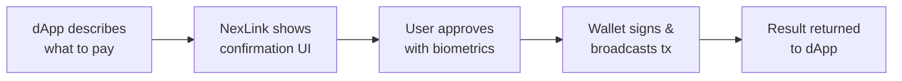
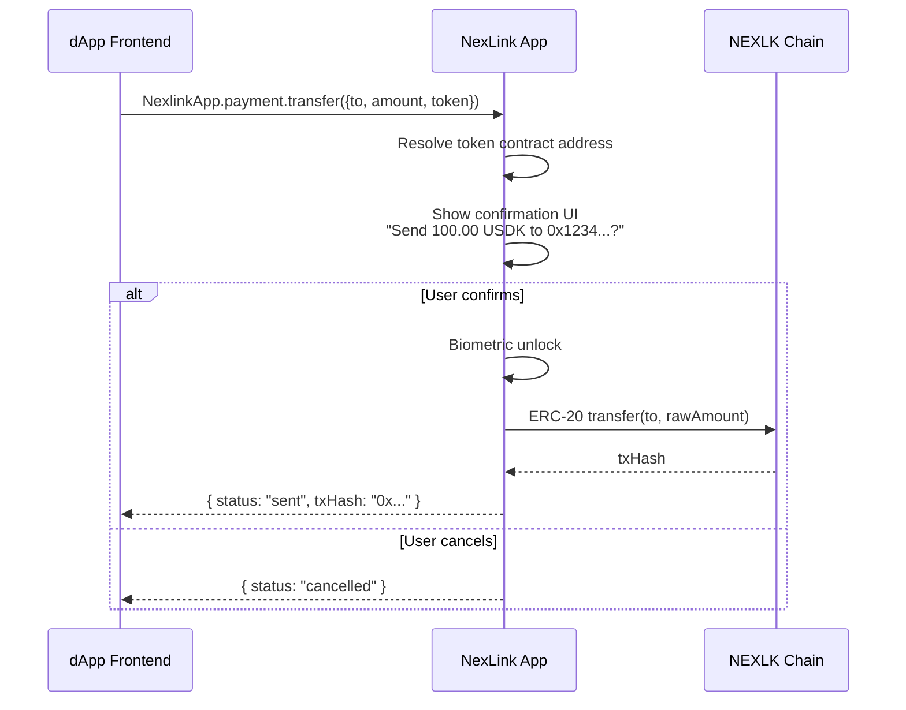
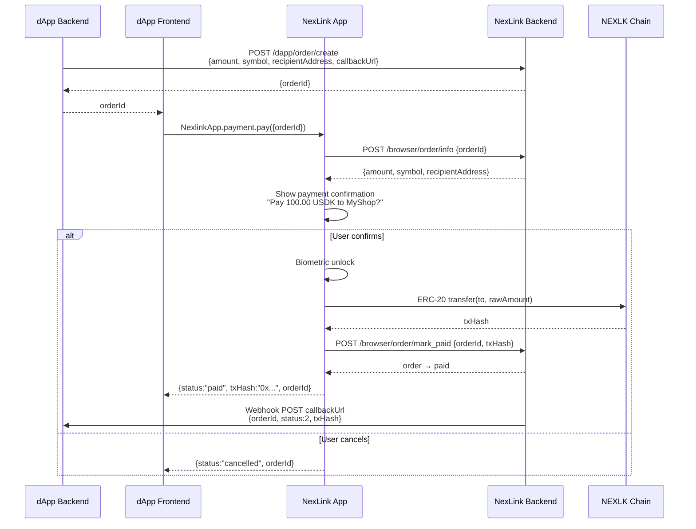
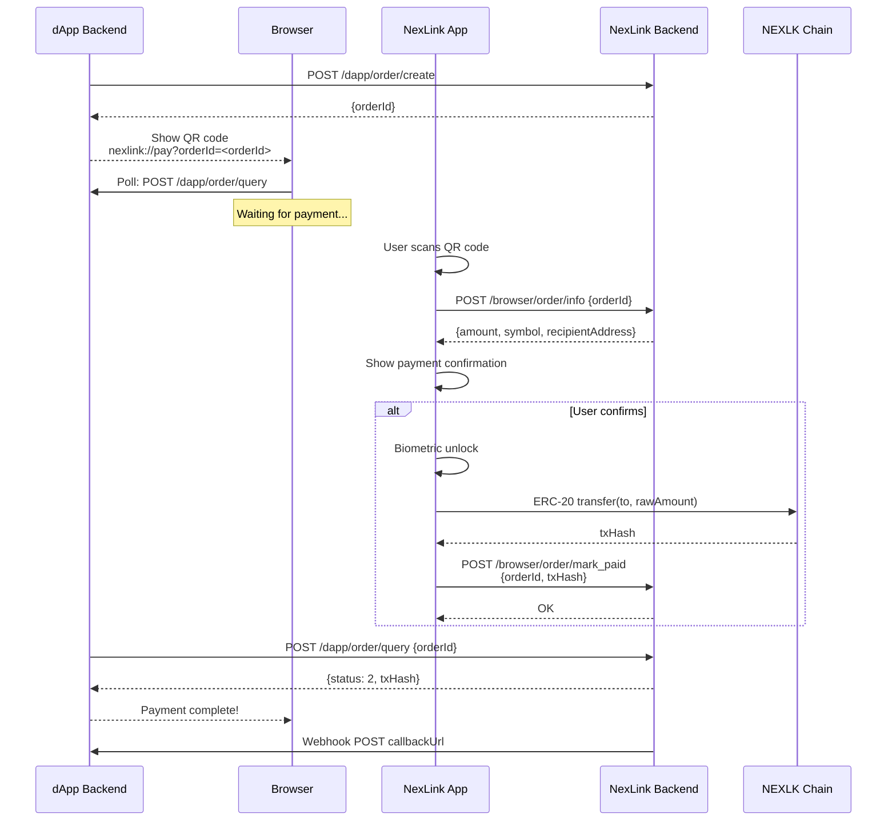
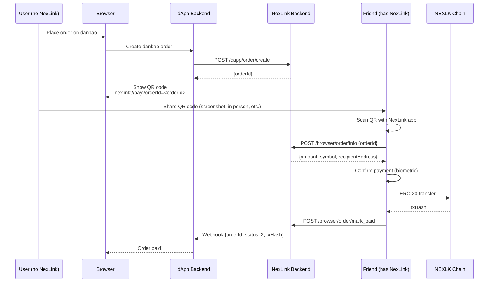
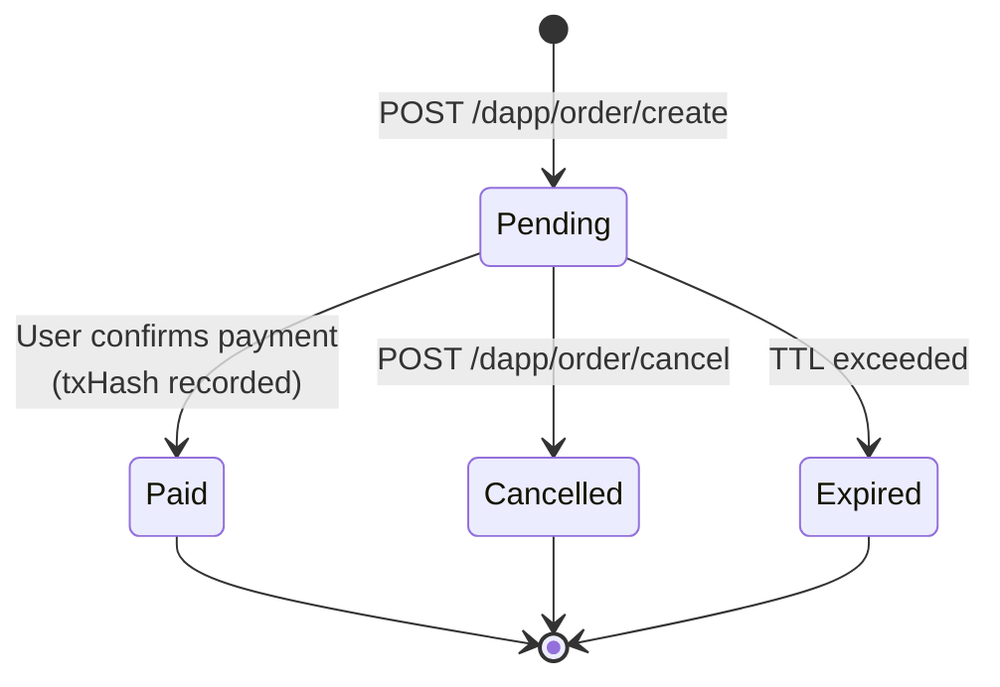
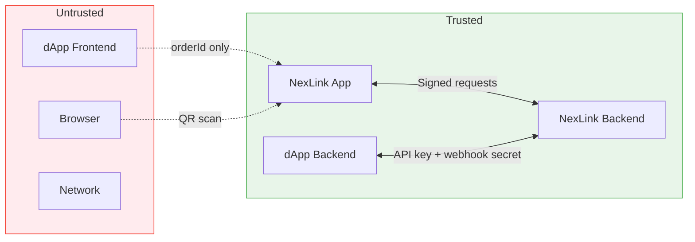

# Payment Integration

This document describes how dApps interact with the NexLink Wallet to process USDK and CNYT token payments. It covers both in-app (WebView) and external browser (QR code) channels.

For endpoint specifications, see [API Reference](/broken/pages/zhCmtq6pk3ml84jjhwkN#payment-api). For authentication, see [Login & Registration](AUTH.md).

***

## 1. Overview

### Two Payment Modes

| Mode                    | Use case                              | Backend order? | Webhook? | Browser support?    |
| ----------------------- | ------------------------------------- | -------------- | -------- | ------------------- |
| **Direct transfer**     | P2P tips, donations, simple transfers | No             | No       | In-app only         |
| **Order-based payment** | Commerce, subscriptions, checkout     | Yes            | Yes      | In-app + browser QR |

**Choose direct transfer** when the dApp frontend knows the recipient and amount and no server-side confirmation is needed.

**Choose order-based payment** when the dApp backend must control the payment parameters and receive authoritative confirmation via webhook.

Both modes execute **real on-chain ERC-20 transactions** on the NEXLK chain. The NexLink app always shows a native confirmation UI before signing — the dApp cannot bypass user approval.

### How It Works (General Principle)



The dApp describes _what_ it wants to pay, the NexLink app handles authorization through its native UI, and the result flows back to the dApp.

***

## 2. Token Registry

### Supported Tokens

| Token    | Description           | Chain | Contract Address                             | Decimals |
| -------- | --------------------- | ----- | -------------------------------------------- | -------- |
| **USDK** | USD-pegged stablecoin | NEXLK | `0xaC2D085205D0A42121E48a9C20E7aE1a7102c526` | 5        |
| **CNYT** | CNY-pegged stablecoin | NEXLK | `0x1e0df1f0813E6521819af9cAC158787f6f94471F` | 5        |

### NEXLK Chain

| Property     | Value              |
| ------------ | ------------------ |
| Chain ID     | `2026777`          |
| Type         | EVM-compatible     |
| Native token | NKT                |
| Consensus    | Proof of Authority |

### Decimal Handling

Both tokens use **5 decimal places** (non-standard; ERC-20 default is 18).

| Human amount      | Raw amount (smallest unit) | Conversion |
| ----------------- | -------------------------- | ---------- |
| `1.00` USDK       | `100000`                   | × 10⁵      |
| `0.50` CNYT       | `50000`                    | × 10⁵      |
| `1234.56789` USDK | `123456789`                | × 10⁵      |

The JS SDK `transfer()` method accepts **human-readable amounts** (e.g., `"100.00"`). The native app handles conversion to raw units internally.

The order API `amount` field uses **raw units** (smallest unit, integer). The dApp backend must multiply by 10⁵ when creating orders.

***

## 3. Direct Transfer (Simple Mode)

For P2P payments, tips, and simple transfers. No backend needed — pure frontend interaction. **In-app only.**

### JS SDK Method

```javascript
const result = await NexlinkApp.payment.transfer({
  to: "0x1234...abcd",   // Recipient wallet address
  amount: "100.00",       // Human-readable amount
  token: "USDK"           // "USDK" or "CNYT"
});

if (result.status === "sent") {
  console.log("Transfer sent:", result.txHash);
}
```

### Flow



### Parameters

| Parameter | Type   | Required | Description                                       |
| --------- | ------ | -------- | ------------------------------------------------- |
| `to`      | String | Yes      | Recipient wallet address (hex, checksummed)       |
| `amount`  | String | Yes      | Human-readable amount (e.g., `"100.00"`, `"0.5"`) |
| `token`   | String | Yes      | Token symbol: `"USDK"` or `"CNYT"`                |

### Return Value (on success)

| Field    | Type   | Description                                        |
| -------- | ------ | -------------------------------------------------- |
| `status` | String | Always `"sent"` (Promise only resolves on success) |
| `txHash` | String | On-chain transaction hash                          |

### Error Handling

On cancellation or failure, the Promise **rejects** with an error. Use `try/catch`:

```javascript
try {
  const result = await NexlinkApp.payment.transfer({ to, amount, token });
  console.log("Sent:", result.txHash);
} catch (e) {
  if (e.message === "user_rejected") {
    // User cancelled — do nothing
  } else {
    showError(e.message);
  }
}
```

| Error message                        | Cause                                    | DApp Action                    |
| ------------------------------------ | ---------------------------------------- | ------------------------------ |
| `user_rejected`                      | User tapped Cancel or declined biometric | Show "cancelled" or do nothing |
| `to, amount, and token are required` | Missing parameters                       | Fix the parameters             |
| `unsupported token: X`               | Token symbol not recognized              | Use `"USDK"` or `"CNYT"`       |

### Example: Tip Button

```javascript
// Simple tip button in a dApp
async function sendTip(recipientAddress, amount) {
  if (!window.NexlinkApp) {
    alert("Please open this dApp in the NexLink app");
    return;
  }

  try {
    const result = await NexlinkApp.payment.transfer({
      to: recipientAddress,
      amount: amount,
      token: "USDK"
    });
    showSuccess(`Tip sent! TX: ${result.txHash}`);
  } catch (e) {
    if (e.message === "user_rejected") {
      // User cancelled — do nothing
    } else {
      showError(`Transfer failed: ${e.message}`);
    }
  }
}
```

> **Note:** `transfer()` is available only inside the NexLink app. In external browsers, `window.NexlinkApp` is `undefined`. For browser support, use the order-based payment flow.

***

## 4. Order-Based Payment (Commerce Mode)

For e-commerce, subscriptions, and any flow where the dApp backend must control payment parameters and receive confirmation. Works **in-app and in external browsers**.

### 4.1 In-App Flow



#### Step by Step

1. **DApp backend creates order** — calls `POST /dapp/order/create` with amount, token symbol, recipient address, and callback URL. Receives `orderId` (UUID).
2. **DApp frontend triggers payment** — passes `orderId` to the user's browser/WebView. Frontend calls `NexlinkApp.payment.pay({ orderId })`.
3. **NexLink app fetches order** — contacts NexLink backend to retrieve order details (amount, symbol, recipient, dApp name/icon). Cross-validates that the order belongs to the current dApp.
4. **Native confirmation UI** — shows a payment sheet with the verified details: token, amount, recipient, dApp name. User cannot modify these values.
5. **User confirms** — biometric unlock (fingerprint/face). NexLink wallet builds the ERC-20 `transfer(to, amount)` calldata, signs, and broadcasts to the NEXLK chain.
6. **Report to backend** — NexLink app sends `txHash` to the backend via `POST /browser/order/mark_paid`. Backend transitions the order to `paid` status.
7. **Result to frontend** — Promise resolves with `{ status: "paid", txHash, orderId }`.
8. **Webhook to dApp backend** — NexLink backend delivers a signed webhook to the dApp's `callbackUrl` with order details and `txHash`. This is the **authoritative confirmation** — dApp backends should not trust the frontend callback alone.

#### JS SDK Method

```javascript
try {
  const result = await NexlinkApp.payment.pay({
    orderId: "nx-uuid-123"   // From POST /dapp/order/create
  });

  console.log("Payment complete:", result.txHash);
  // Also wait for webhook on your backend for authoritative confirmation
} catch (e) {
  if (e.message === "user_rejected") {
    // User cancelled
  } else {
    console.error("Payment failed:", e.message);
  }
}
```

#### Parameters

| Parameter | Type   | Required | Description                                                                                        |
| --------- | ------ | -------- | -------------------------------------------------------------------------------------------------- |
| `orderId` | String | Yes      | Order UUID from [POST /dapp/order/create](/broken/pages/zhCmtq6pk3ml84jjhwkN#post-dappordercreate) |

#### Return Value (on success)

| Field     | Type   | Description                                                                                   |
| --------- | ------ | --------------------------------------------------------------------------------------------- |
| `status`  | String | `"paid"` (Promise only resolves on success) or `"already_processed"` (order was already paid) |
| `txHash`  | String | On-chain transaction hash (present when `status` is `"paid"`)                                 |
| `orderId` | String | The order UUID                                                                                |

#### Error Handling

On cancellation or failure, the Promise **rejects** with an error. Use `try/catch`:

```javascript
try {
  const result = await NexlinkApp.payment.pay({ orderId });
  if (result.status === "paid") {
    console.log("Payment complete:", result.txHash);
  } else if (result.status === "already_processed") {
    console.log("Order was already paid");
  }
} catch (e) {
  if (e.message === "user_rejected") {
    // User cancelled — do nothing
  } else {
    showError(e.message);
  }
}
```

| Error message             | Cause                                    | DApp Action              |
| ------------------------- | ---------------------------------------- | ------------------------ |
| `user_rejected`           | User tapped Cancel or declined biometric | Show "Payment cancelled" |
| `orderId is required`     | Missing `orderId`                        | Check order creation     |
| Order expired (localized) | Order TTL exceeded                       | Create a new order       |
| `unsupported token: X`    | Token not in registry                    | Contact support          |

***

### 4.2 Browser Flow (QR Code)

For users accessing the dApp in Chrome, Safari, or any external browser. The dApp displays a QR code; the user scans it with the NexLink app to complete payment.



#### Step by Step

1. **Create order** — same as in-app: `POST /dapp/order/create`.
2.  **Display QR code** — encode the `orderId` into a deep link QR code:

    ```
    nexlink://pay?orderId=<orderId>
    ```

    The QR code contains only the `orderId` (a UUID — not guessable). All payment details are fetched from the backend after scanning.
3. **Browser polls** — dApp frontend polls its own backend, which in turn calls `POST /dapp/order/query` to check order status. When `status` changes to `2` (paid), show success.
4. **User scans QR** — NexLink app parses the deep link, fetches order details from `POST /browser/order/info`, and shows the payment confirmation UI.
5. **User confirms** — same as in-app: biometric unlock → ERC-20 transfer → broadcast → report `txHash` via `POST /browser/order/mark_paid`.
6. **DApp receives result** — order query returns `status: 2` with `txHash`. Browser updates to show success.
7. **Webhook** — NexLink backend also delivers webhook to `callbackUrl` (same as in-app). This is the **authoritative confirmation**.

#### QR Code Expiry & Refresh

The QR code's validity is tied to the order's `expireAt`. When an order expires:

```javascript
// Browser-side polling pseudocode
async function pollOrderStatus(orderId) {
  while (true) {
    const res = await fetch(`/api/order/status?orderId=${orderId}`);
    const data = await res.json();

    if (data.status === 2) {  // paid
      showSuccess(data.txHash);
      return;
    }
    if (data.status === 4) {  // expired
      showExpiredUI();    // "Order expired — click to retry"
      return;
    }
    // status === 1 (pending) → wait and poll again
    await new Promise(r => setTimeout(r, 3000));
  }
}
```

To refresh, create a new order (`POST /dapp/order/create`) and generate a new QR code.

#### Deep Link Format

```
nexlink://pay?orderId=<orderId>
```

| Parameter | Required | Description        |
| --------- | -------- | ------------------ |
| `orderId` | Yes      | Nexlink order UUID |

> **Security:** The `orderId` is a UUID — not guessable. No amount, recipient, or callback in the QR code. All sensitive data comes from the NexLink backend. Payment still requires user confirmation with biometrics.

***

### 4.3 Delegated Payment (Pay on Behalf)

The order-based payment system does **not enforce payer identity**. The `orderId` is the only thing needed to complete a payment — any NexLink user with sufficient balance can scan the QR code and pay, regardless of who created the order.

This enables a **delegated payment** flow for danbao users who registered via standard username/password (Method 1 in [AUTH.md](AUTH.md)) and do not have a NexLink account:



#### Why this works

| Property                     | Detail                                                                                                                                                                      |
| ---------------------------- | --------------------------------------------------------------------------------------------------------------------------------------------------------------------------- |
| **No payer check**           | `POST /browser/order/mark_paid` records the `txHash` but does not verify that the on-chain sender matches the order creator                                                 |
| **Order is payer-agnostic**  | The order defines _what_ to pay (amount, token, recipient) — not _who_ pays                                                                                                 |
| **Payer tracked**            | The `paid_by_user_id` column records which NexLink user actually paid. The webhook includes `paidByUserId` so the dApp backend can distinguish self-pay from delegated pay. |
| **On-chain finality**        | The `txHash` proves the payment happened regardless of who sent it                                                                                                          |
| **Webhook is authoritative** | danbao backend trusts the webhook confirmation, not the browser                                                                                                             |

#### Payer identification

When a friend scans the payment QR code and confirms, the NexLink backend records:

| Field             | Where                      | Value                                                        |
| ----------------- | -------------------------- | ------------------------------------------------------------ |
| `paid_by_user_id` | `nexlink_dapp_order` table | Friend's NexLink user ID                                     |
| `paidByUserId`    | Webhook payload            | Same value — dApp backend can compare with the order creator |
| `txHash`          | Both                       | On-chain tx hash — the `from` address is the friend's wallet |

The dApp backend can use `paidByUserId` to detect delegated payments. When `paidByUserId` differs from the expected user (or the order has no associated NexLink user), the payment was delegated.

#### Confirmation UX

When the friend scans the QR code, the NexLink app shows a native confirmation sheet with:

* **dApp name** — fetched from `/browser/order/info` (e.g., "Pay to danbao")
* **Amount and token** — e.g., "100.00 USDK"
* **Recipient address** — shortened hex address
* **Biometric unlock** — required before the on-chain transfer executes

After successful payment, the NexLink app shows a success toast and fires `POST /browser/order/mark_paid` to notify the backend.

#### When this applies

This scenario only arises in the **general browser** context. In the dApp browser (inside the NexLink app), the user always has a NexLink account and wallet — they pay directly.

| Context                                  | User has NexLink? | Payment method                                   |
| ---------------------------------------- | ----------------- | ------------------------------------------------ |
| **dApp browser**                         | Always yes        | Direct: `NexlinkApp.payment.pay()`               |
| **General browser** + NexLink account    | Yes               | QR code: scan with own NexLink app               |
| **General browser** + no NexLink account | No                | Delegated: share QR with someone who has NexLink |

#### Wallet recharge

The same principle applies to danbao's internal wallet recharge. Since recharge itself is an on-chain NexLink payment, a user without NexLink can share the recharge QR code with a friend. Once paid, the internal balance is credited to the user's danbao account.

***

## 5. Order Lifecycle

### Status Transitions



### Status Codes

| Status    | Code | Description                          |
| --------- | ---- | ------------------------------------ |
| Pending   | `1`  | Order created, awaiting payment      |
| Paid      | `2`  | Payment confirmed, `txHash` recorded |
| Cancelled | `3`  | Cancelled by dApp backend            |
| Expired   | `4`  | Order TTL exceeded without payment   |

### Idempotency

* **Order creation** is idempotent on `(dapp_id, externalOrderId)` when `externalOrderId` is provided. Creating an order with the same value returns the existing order instead of creating a duplicate.
* **Order payment** is idempotent on `orderId`. Paying an already-paid order returns success with the existing `txHash`.

### Expiration

| Component | Default TTL                     | Configurable?     |
| --------- | ------------------------------- | ----------------- |
| Order     | Set by dApp via `expireSeconds` | Yes (at creation) |

An expired order cannot be paid — the dApp must create a new order.

***

## 6. Webhook Callbacks

### Delivery Format

When an order transitions to `paid`, the NexLink backend delivers a signed HTTP POST to the dApp's `callbackUrl`.

```http
POST https://dapp.example.com/api/payment/callback
Content-Type: application/json
X-Nexlink-Timestamp: 1718700100
X-Nexlink-Signature: a1b2c3d4e5f6...

{
  "orderId": "nx-uuid-123",
  "externalOrderId": "shop-001",
  "status": 2,
  "amount": 10000000,
  "symbol": "USDK",
  "txHash": "0xabc123...",
  "paidAt": 1718700100,
  "paidByUserId": 42
}
```

### Signature Verification

The dApp backend must verify the webhook signature before trusting the payload.

```
Step 1:  message = X-Nexlink-Timestamp + "." + raw_request_body
Step 2:  expected = HMAC-SHA256(key = <webhook_secret>, message = message)
Step 3:  compare HEX(expected) with X-Nexlink-Signature (constant-time)
Step 4:  check |now() - X-Nexlink-Timestamp| < 300 seconds (5-minute tolerance)
```

### Retry Policy

| Attempt | Delay      | Total elapsed |
| ------- | ---------- | ------------- |
| 1st     | Immediate  | 0s            |
| 2nd     | 30 seconds | 30s           |
| 3rd     | 2 minutes  | 2m 30s        |
| 4th     | 10 minutes | 12m 30s       |
| 5th     | 30 minutes | 42m 30s       |

After 5 failed attempts, the callback is marked as `failed`. The dApp can retrieve the order status manually via `POST /dapp/order/query`.

### Idempotent Handling

Webhooks may be delivered more than once (network retries). The dApp backend must handle duplicates:

```
On receiving webhook:
  1. Verify signature
  2. Look up orderId in database
  3. If already processed → return 200 OK (do nothing)
  4. If new → process payment, update order status, return 200 OK
```

Return HTTP `200` to acknowledge receipt. Any non-2xx response triggers a retry.

***

## 7. Security Model

### Trust Boundaries



### Key Security Properties

| Property                 | Mechanism                                                                                                                         |
| ------------------------ | --------------------------------------------------------------------------------------------------------------------------------- |
| **Amount integrity**     | Order-based: amount defined server-side, frontend only passes `orderId`. Direct: native UI shows exact amount, user must confirm. |
| **Recipient integrity**  | Order-based: recipient set in backend order. Direct: native UI shows full address.                                                |
| **Replay prevention**    | Each `orderId` can only be paid once.                                                                                             |
| **QR code safety**       | QR contains only `orderId` (UUID) — no amount, no address, no callback URL.                                                       |
| **Webhook authenticity** | HMAC-SHA256 signature with timestamp. dApp verifies before processing.                                                            |
| **On-chain finality**    | `txHash` can be independently verified on the NEXLK chain by any party.                                                           |
| **User consent**         | Native confirmation UI with biometric unlock. DApp cannot auto-send.                                                              |

### Direct Transfer vs Order-Based Security

| Concern               | Direct Transfer                  | Order-Based                 |
| --------------------- | -------------------------------- | --------------------------- |
| Who defines amount?   | dApp frontend (user confirms)    | dApp backend (tamper-proof) |
| Backend confirmation? | No (txHash only)                 | Yes (webhook)               |
| Replay risk           | Low (unique tx per confirmation) | None (orderId is one-time)  |
| Best for              | Low-value P2P                    | Commerce, high-value        |

***

## 8. Implementation Checklist

### NexLink Backend (Go)

* [x] `POST /browser/order/info` — internal endpoint for fetching order details
* [x] `POST /browser/order/mark_paid` — internal endpoint for in-app payment completion
* [x] `DappOrder` model with `recipientAddress` field
* [x] `OrderService` — business logic (create, query, cancel, mark paid)
* [x] `CallbackDispatcher` — webhook delivery with exponential backoff
* [x] Token contract registry (chainId → symbol → contract address)

### NexLink App (Dart)

* [x] `PaymentModule` bridge module (`payment_module.dart`)
* [x] Bridge handler: `nexlink_payment_pay` (order-based)
* [x] Bridge handler: `nexlink_payment_transfer` (direct)
* [x] Bridge handler: `nexlink_payment_getOrderStatus` (query)
* [x] `DappOrderClient` — API client for order endpoints
* [x] Payment confirmation UI sheet
* [x] Deep link handler: `nexlink://pay?orderId=<orderId>`
* [x] ERC-20 transfer via `RecordingWalletService.send()`

### JS SDK

* [x] `NexlinkApp.payment.pay()` in `_coreSdk`
* [x] `NexlinkApp.payment.transfer()` in `_coreSdk`
* [x] `NexlinkApp.payment.getOrderStatus()` in `_coreSdk`
* [x] Stub SDK payment namespace (for pre-load queuing)

### Documentation

* [x] PAYMENT.md — this document
* [x] API.md — add payment types and endpoints
* [x] SUMMARY.md — add Payment Integration link
