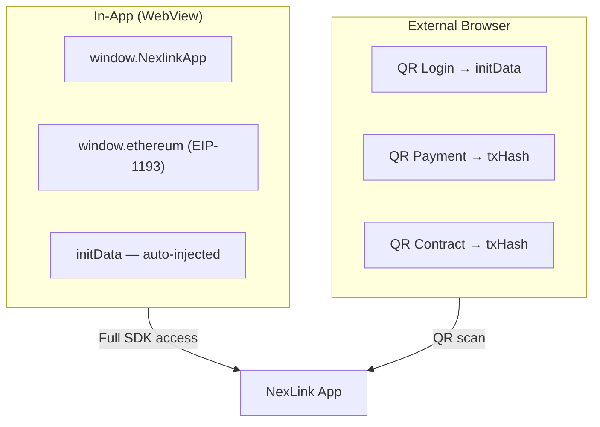

# NexLink dApp Platform

Developer documentation for building dApps on the NexLink platform.

---

## What is NexLink?

NexLink is a mobile wallet and messaging app with a built-in dApp browser. Third-party developers can build dApps that integrate with NexLink for user authentication, token payments, and smart contract interaction — all through a standardized SDK.

---

## What Can DApps Do?

| Capability | Description | Docs | Status |
|---|---|---|---|
| **Authentication** | Identify users via signed initData (in-app) or QR code login (browser) | [Login & Registration](AUTH.md) | Shipped |
| **Identity** | Multi-identity personas (主身份 / 认证 / 匿名); honors aggregate to 主身份; zero-knowledge trust proofs | [Identity System](IDENTITY.md) | Design |
| **Token Payments** | Accept USDK/CNYT payments via order-based or direct transfer flows | [Payment Integration](PAYMENT.md) | Shipped |
| **Escrow / Guaranteed Payment** | Lock funds until a deal completes; C2C + Guarantee contracts with jury dispute (K币担保) | [Escrow](ESCROW.md) | Shipped |
| **Subscription Payment** | Recurring billing where the user confirms every charge — no silent auto-deduction | [Subscription](SUBSCRIPTION.md) | Design |
| **Contract Interaction** | Call any smart contract on the NEXLK chain through the wallet | [Contract Interaction](CONTRACT.md) | Shipped |
| **NFT Issuance** | Issue normal and soulbound (SBT) ERC-721 tokens | [NFT Issuance](NFT.md) | SDK-ready |
| **Honor / Reputation** | Soulbound honors & negative records; on-chain reputation (信任体系) | [Honor & Reputation](HONOR.md) | Design |
| **Community Governance** | Stake, propose, and vote; Delegate ID as an NFT (Tally-style DAO) | [Governance](GOVERNANCE.md) | Design |

All capabilities work through two channels:

- **In-app** — dApp runs inside NexLink's WebView with full SDK access (`window.NexlinkApp`)
- **External browser** — dApp runs in Chrome/Safari with QR code flows for payments and contract calls (QR auth is planned but not yet implemented — see [AUTH.md Section 3.1](AUTH.md))

---

## Getting Started

### 1. Register Your dApp

Contact the NexLink platform administrator to register your dApp. You will receive:

| Credential | Purpose |
|---|---|
| `dapp_id` | Numeric identifier for your dApp |
| `secret_key` | Used for initData signature verification and API request signing (MD5 signature) |

### 2. Choose Your Integration

**Minimal integration (auth only):**

```javascript
// In-app: wait for SDK to be ready, then read initData
NexlinkApp.onReady(async function () {
  const initData = NexlinkApp.initData;
  if (!initData) return; // not in Nexlink app

  // Send to your backend for verification
  const res = await fetch('/api/login', {
    method: 'POST',
    body: JSON.stringify({ initData })
  });
});
```

**Add payments:**

```javascript
// Direct transfer (P2P, tips)
const result = await NexlinkApp.payment.transfer({
  to: "0x1234...abcd",
  amount: "10.00",
  token: "USDK"
});

// Order-based payment (commerce)
const result = await NexlinkApp.payment.pay({
  orderId: "uuid-from-your-backend"
});
```

**Add contract calls:**

```javascript
// Call any contract on the NEXLK chain
const result = await NexlinkApp.contract.call({
  contract: "0x3d8b4425...",
  abi: YOUR_CONTRACT_ABI,
  method: "freeze",
  args: [orderId, amount, tokenAddress]
});

// Read contract state (no signing needed)
const balance = await NexlinkApp.contract.read({
  contract: "0x3d8b4425...",
  abi: YOUR_CONTRACT_ABI,
  method: "getBalance",
  args: [userAddress]
});
```

### 3. Support External Browsers

For users outside the NexLink app, implement QR code flows:

```javascript
if (window.NexlinkApp) {
  // In-app: use SDK directly
} else {
  // Browser: show QR code for login/payment/contract
}
```

Each feature has a corresponding QR flow — see [AUTH.md](AUTH.md), [PAYMENT.md](PAYMENT.md), and [CONTRACT.md](CONTRACT.md) for details.

---

## Platform Overview

### Two Runtime Environments



| Feature | In-App | External Browser |
|---|---|---|
| Authentication | `NexlinkApp.initData` (automatic) | QR code → long-poll |
| Payment (direct) | `NexlinkApp.payment.transfer()` | Not available |
| Payment (order) | `NexlinkApp.payment.pay()` | QR code → long-poll |
| Contract (write) | `NexlinkApp.contract.call()` | QR code → long-poll |
| Contract (read) | `NexlinkApp.contract.read()` | Direct RPC call to NEXLK chain |
| EIP-1193 provider | `window.ethereum` | Not available |

### NEXLK Chain

| Property | Value |
|---|---|
| Chain ID | `2026777` |
| Type | EVM-compatible |
| Native token | NKT |
| Consensus | Proof of Authority |

### Supported Tokens

| Token | Contract Address | Decimals |
|---|---|---|
| USDK | `0xaC2D085205D0A42121E48a9C20E7aE1a7102c526` | 5 |
| CNYT | `0x1e0df1f0813E6521819af9cAC158787f6f94471F` | 5 |

---

## JS SDK Reference

### SDK Availability

The NexLink SDK (`window.NexlinkApp`) is **auto-injected** by the NexLink WebView when a dApp loads inside the app. No `<script>` tag is needed — the app injects the SDK via inline JavaScript before the page's own scripts run.

| Environment | `window.NexlinkApp` | `window.ethereum` | How it works |
|---|---|---|---|
| **Inside NexLink app** | Available (auto-injected) | Available (auto-injected) | WebView injects SDK at `document_start` — no action needed from the dApp |
| **External browser** | `undefined` | `undefined` | No NexLink WebView — SDK does not exist |

**There is no external JS file that provides the SDK.** Unlike platforms where you load a `<script src="...">` to get the SDK, NexLink injects everything automatically. Your dApp code simply checks whether `window.NexlinkApp` exists.

For dApps that need to work in both environments, always guard SDK calls:

```javascript
if (window.NexlinkApp) {
  // Running inside NexLink app — full SDK access
  NexlinkApp.onReady(async () => {
    const initData = NexlinkApp.initData;
    // use payment, contract, wallet APIs...
  });
} else {
  // Running in a regular browser — no SDK available
  // Use QR code flows for login, payments, and contract calls
  // See AUTH.md, PAYMENT.md, CONTRACT.md for QR flow details
}
```

> **Note:** A no-op fallback file (`nexlink-sdk.js`) is hosted at `/static/nexlink-sdk.js` on the NexLink API server. It provides stub methods that log warnings instead of crashing. This file is **optional** — it exists only as a development convenience for testing dApp pages in a regular browser without `if (window.NexlinkApp)` guards. It is not needed in production and does not provide any real functionality.

### Namespaces

| Namespace | Methods | Description |
|---|---|---|
| `NexlinkApp` | `.initData` | Signed user identity string |
| `NexlinkApp.payment` | `.pay()`, `.transfer()`, `.getOrderStatus()` | Token payment operations |
| `NexlinkApp.contract` | `.call()`, `.read()`, `.encode()` | Smart contract interaction |
| `NexlinkApp.wallet` | `.getAccounts()`, `.sendTransaction()`, `.personalSign()`, etc. | Low-level wallet access (8 methods) |
| `window.ethereum` | EIP-1193 standard methods | Standard Web3 provider |

### Detection

```javascript
// Check if running inside NexLink app
if (window.NexlinkApp) {
  // Full SDK available — auto-injected by WebView
  NexlinkApp.onReady(() => {
    const initData = NexlinkApp.initData;
  });
} else {
  // External browser — window.NexlinkApp is undefined
  // Fall back to QR code flows
}

// Check specific capabilities (only after confirming NexlinkApp exists)
if (window.NexlinkApp) {
  if (NexlinkApp.payment) { /* payment methods available */ }
  if (NexlinkApp.contract) { /* contract methods available */ }
}
if (window.ethereum) { /* EIP-1193 provider available (in-app only) */ }
```

> For complete method signatures and parameters, see [API Reference](API.md).

---

## Documentation

| Document | Description |
|---|---|
| [API Reference](API.md) | Types, endpoints, and JS SDK method signatures |
| [Login & Registration](AUTH.md) | initData, signature verification, QR login, account binding |
| [Identity System](IDENTITY.md) | Multi-identity model (主身份/认证/匿名), honor aggregation, zero-knowledge trust proofs |
| [Payment Integration](PAYMENT.md) | USDK/CNYT payments — direct transfer and order-based flows |
| [Escrow / Guaranteed Payment](ESCROW.md) | C2C + Guarantee escrow contracts, roles, jury dispute (K币担保) |
| [Subscription Payment](SUBSCRIPTION.md) | Confirm-before-charge recurring billing (design spec) |
| [Contract Interaction](CONTRACT.md) | Smart contract calls — EIP-1193, NexLink SDK, and QR flows |
| [NFT Issuance](NFT.md) | Normal and soulbound (SBT) ERC-721 issuance and minting |
| [Honor & Reputation](HONOR.md) | Soulbound honors, negative records, reputation, and ZK proofs of honors |
| [Community Governance](GOVERNANCE.md) | Staking, proposals, voting, and Delegate ID NFT (design spec) |

---

## Security Summary

| Principle | Detail |
|---|---|
| **Signed identity** | User identity (`initData`) is HMAC-SHA256 signed — cannot be forged by the dApp frontend |
| **User consent** | Every payment and contract call requires native confirmation UI with biometric unlock |
| **No blind signing** | Confirmation UI shows amount, recipient, or decoded function call before signing |
| **Server-side verification** | dApp backends verify `initData` signatures and webhook signatures independently |
| **QR code safety** | QR codes contain only session tokens — no sensitive data (amounts, addresses, callbacks) |
| **On-chain finality** | All transactions produce a `txHash` that can be independently verified on the NEXLK chain |
