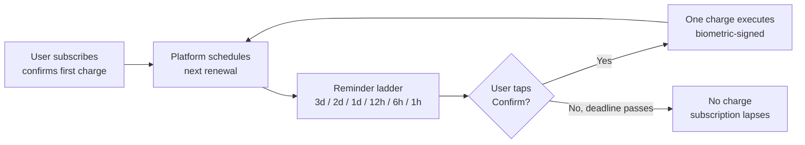
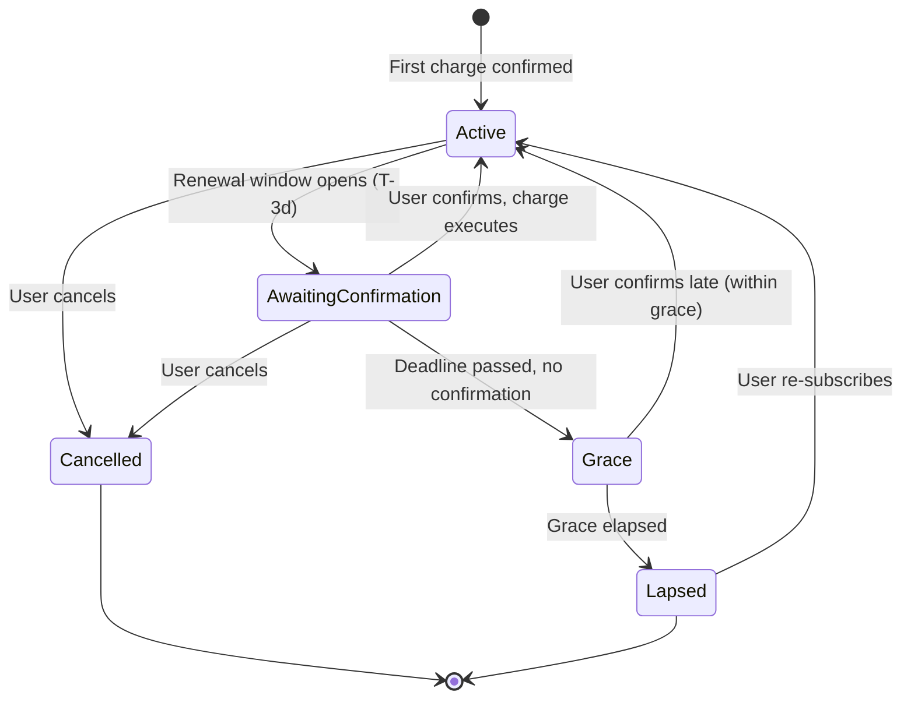
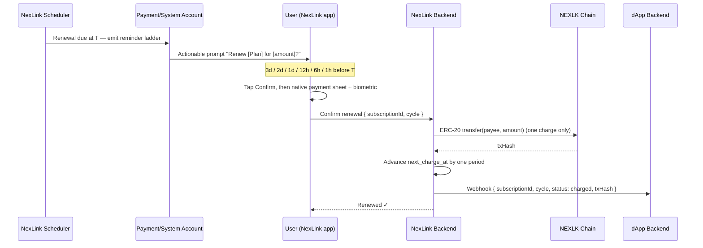

# NexLink dApp Subscription Payment

> **Status: Design / Proposed.** No subscription code ships yet. This document specifies the intended model so it can be reviewed and built. The design is deliberately **security-first**: NexLink will **not** support silent, contract-driven recurring deductions. See [Section 2](#2-why-not-auto-deduct) for the rationale. Nothing here is callable today; the [`NexlinkApp.subscription`](#5-proposed-js-sdk) namespace and `/dapp/subscription/*` endpoints are proposals.

Subscription payment (订阅支付) supports recurring billing — like a monthly Claude plan — where a user pays a fixed amount every period for continued access. The hard requirement that shapes this entire design: **every charge requires an explicit, fresh user confirmation.** The platform never pulls funds on a schedule without the user tapping *Confirm*.

For one-off payments, see [Payment Integration](PAYMENT.md). For held-funds-until-delivery, see [Escrow](ESCROW.md).

---

## 1. Overview

A subscription is a **plan** (amount, token, period, payee) that a user opts into. Instead of granting the payee a standing allowance to drain the wallet, NexLink treats each renewal as a **fresh, user-confirmed payment** — with the platform doing the remembering: it sends a ladder of reminders before each due date and presents a one-tap confirmation.



| Principle | Detail |
|---|---|
| **Confirm before every charge** | Each renewal is a discrete payment the user must approve with the native confirmation UI + biometric — exactly like [multisig](#4-the-multisig-analogy) co-signing. |
| **No standing allowance** | The subscription grants **no** on-chain `approve` that a spender could pull against later. |
| **Reminders, not surprises** | The platform pushes a confirmation prompt at 3 days, 2 days, 1 day, 12 hours, 6 hours, and 1 hour before the charge. |
| **Lapse by default** | If the user does not confirm by the deadline, **nothing is charged.** The subscription simply lapses — users are never billed for something they forgot to cancel. |
| **Cancel anytime** | Cancelling stops all future reminders and charges immediately. There is nothing on-chain to revoke. |

---

## 2. Why Not Auto-Deduct

The obvious way to build subscriptions on EVM is a standing ERC-20 `approve` (often unlimited) to a subscription contract that pulls the amount each period. **NexLink rejects this model.**

| Auto-deduct (rejected) | Confirm-before-charge (NexLink) |
|---|---|
| User signs one unlimited `approve`; contract pulls forever | User signs each charge individually |
| A compromised or malicious spender/contract can **drain the whole balance** | A charge can only ever move the exact confirmed amount |
| Users keep getting billed for subscriptions they forgot | No confirmation → no charge → automatic lapse |
| Revoking requires an on-chain `approve(0)` the user rarely does | Cancel is an off-chain toggle; there is no allowance to revoke |
| "Set and forget" favors the merchant | Consent stays with the user every cycle |

> The threat is concrete: unlimited-allowance drains are one of the most common ways funds are stolen in DeFi. A subscription is not worth handing a third party a key to your wallet. NexLink keeps the wallet's rule intact — **the dApp cannot move funds without a per-charge user signature.**

---

## 3. Lifecycle & Reminder Ladder

### 3.1 States



| State | Meaning |
|---|---|
| `active` | Paid through the current period; next renewal scheduled |
| `awaiting_confirmation` | Renewal window is open; reminders are being sent; waiting for the user to confirm |
| `grace` | Deadline passed without confirmation; short grace period before access is cut |
| `lapsed` | No confirmation and grace elapsed; **no charge occurred**; access ends |
| `cancelled` | User cancelled; no further reminders or charges |

### 3.2 The reminder ladder

When a renewal comes due at time **T**, the platform's subscription scheduler sends an **actionable confirmation prompt** at each of these offsets before T:

| Reminder | Sent at | Message intent |
|---|---|---|
| 1 | **T − 3 days** | "Your [Plan] renews in 3 days for [amount]. Confirm to continue." |
| 2 | **T − 2 days** | Reminder + Confirm |
| 3 | **T − 1 day** | Reminder + Confirm |
| 4 | **T − 12 hours** | Reminder + Confirm |
| 5 | **T − 6 hours** | Reminder + Confirm |
| 6 | **T − 1 hour** | Final reminder — "renews in 1 hour unless you confirm/cancel" |

Once the user confirms from **any** reminder, the charge executes, the remaining reminders for that cycle are cancelled, and the next period is scheduled. If T passes with no confirmation, the subscription moves to `grace` and no funds move.

Reminders are delivered from a NexLink **payment/system account** through the same channels the app already uses for actionable messages — an in-chat confirmation card (with a **Confirm** / **Cancel** button, like the bot's inline keyboards) and/or a push notification that deep-links to the confirmation sheet.

### 3.3 Charge flow (on confirm)



The on-chain charge is a single, ordinary [order-based payment](PAYMENT.md#4-order-based-payment-commerce-mode) — the subscription layer just schedules it and requires the user's confirmation. There is no new signing primitive; the safety comes from *never skipping the confirmation.*

---

## 4. The Multisig Analogy

The design mirrors how NexLink's multisig wallet protects funds: a transaction does not execute until the required party actively co-signs it. A subscription charge is the same — it does not execute until the **user** co-signs *that specific charge*. The platform can propose the charge on schedule, but it can never be the party that authorizes the movement of funds. This is what keeps user assets safe and prevents "useless" (unwanted, forgotten) subscriptions from draining a balance.

---

## 5. Proposed JS SDK

> **Proposed — not implemented.** Namespace `NexlinkApp.subscription`, analogous to [`NexlinkApp.payment`](API.md#js-sdk--payment-methods).

```javascript
// Present a plan to the user and create the subscription after they confirm
// the FIRST charge (native sheet + biometric). Returns once active.
const sub = await NexlinkApp.subscription.subscribe({
  planId: "plan-uuid-from-your-backend"
});
// → { subscriptionId, status: "active", nextChargeAt: 1720000000 }

// Query current status without a backend round-trip
const status = await NexlinkApp.subscription.getStatus({ subscriptionId });
// → { status: "active" | "awaiting_confirmation" | "grace" | "lapsed" | "cancelled",
//     nextChargeAt, currentCycle }

// Cancel — stops all future reminders and charges immediately
await NexlinkApp.subscription.cancel({ subscriptionId });
```

| Method | Requires user confirm? | Purpose |
|---|---|---|
| `subscribe({ planId })` | Yes (first charge) | Opt in; confirm and execute the first period's charge |
| `getStatus({ subscriptionId })` | No | Read current state and next charge time |
| `cancel({ subscriptionId })` | No (or a tap) | Stop future reminders/charges |

Renewal confirmations are **not** initiated by the dApp frontend — they are driven by the platform's reminder prompts. The dApp learns the result via [webhook](#7-webhooks-proposed).

---

## 6. Proposed Backend API

> **Proposed — not implemented.** Follows the existing [`/dapp/*` MD5-signature auth](API.md#dapp-authentication) convention.

| Method | Path | Purpose |
|---|---|---|
| POST | `/dapp/subscription/plan/create` | Define a plan: `{ name, amount, symbol, periodSeconds, payeeAddress, callbackUrl, reminderLadder? }` |
| POST | `/dapp/subscription/query` | Get a subscription's status, cycles, and next charge time |
| POST | `/dapp/subscription/cancel` | Cancel a subscription from the backend (e.g. account closed) |
| POST | `/browser/subscription/confirm` | *(Internal, JWT)* Called by the app when the user confirms a renewal from a reminder |

`reminderLadder` defaults to `["3d","2d","1d","12h","6h","1h"]` and is configurable per plan (a plan may opt into fewer/more reminders, but the confirm-before-charge rule is non-negotiable).

---

## 7. Webhooks (Proposed)

The dApp backend is the source of truth for entitlement. It should grant access only on a signed webhook, never on the frontend result. Signature verification is identical to [payment webhooks](PAYMENT.md#6-webhook-callbacks).

```http
POST https://dapp.example.com/api/subscription/callback
X-Nexlink-Timestamp: 1720000000
X-Nexlink-Signature: <hmac-sha256>

{
  "subscriptionId": "sub-uuid",
  "planId": "plan-uuid",
  "cycle": 4,
  "status": "charged",        // charged | lapsed | cancelled
  "amount": 1000000,
  "symbol": "USDK",
  "txHash": "0xabc...",        // present when status = charged
  "chargedAt": 1720000000,
  "nextChargeAt": 1722678400   // present when status = charged
}
```

| `status` | Meaning | dApp action |
|---|---|---|
| `charged` | Renewal confirmed and paid | Extend access to `nextChargeAt` |
| `lapsed` | User did not confirm before the deadline | Revoke access at period end |
| `cancelled` | User cancelled | Revoke access at period end |

---

## 8. Security Model

| Property | Mechanism |
|---|---|
| **Per-charge consent** | Every renewal requires a fresh native confirmation + biometric. No standing allowance exists. |
| **Bounded loss** | A charge can only move the exact confirmed amount to the fixed payee — never more. |
| **No silent billing** | No confirmation → no charge → automatic lapse. Users cannot be billed for forgotten subscriptions. |
| **Instant off-chain cancel** | Cancelling stops the scheduler; there is no on-chain allowance to revoke. |
| **Amount/payee integrity** | Plan parameters are set server-side under [MD5 auth](API.md#dapp-authentication); the confirmation sheet shows the exact amount and payee. |
| **Authoritative confirmation** | Entitlement is granted on a [signed webhook](#7-webhooks-proposed), not on the frontend. |

---

## 9. What Needs Building

This feature is **not implemented**. Delivering it requires:

### NexLink Backend
- [ ] `SubscriptionPlan` + `Subscription` models (plan params, state machine, `next_charge_at`, cycle counter)
- [ ] Subscription scheduler that emits the reminder ladder (3d/2d/1d/12h/6h/1h) per cycle
- [ ] Actionable reminder delivery from a payment/system account (in-chat confirm card + push), reusing the existing actionable-message plumbing
- [ ] `/dapp/subscription/*` endpoints (MD5 auth) + `/browser/subscription/confirm` (JWT)
- [ ] Renewal charge = one order-based payment; advance state; dispatch webhook
- [ ] Grace-period handling and lapse transition

### NexLink App (Dart)
- [ ] `SubscriptionModule` bridge module + handlers (`subscribe`, `getStatus`, `cancel`)
- [ ] Renewal confirmation sheet reachable from a reminder deep link
- [ ] Reminder confirm/cancel actions wired to `/browser/subscription/confirm`

### JS SDK
- [ ] `NexlinkApp.subscription.subscribe() / getStatus() / cancel()` + stub-SDK queuing

### Documentation
- [x] SUBSCRIPTION.md — this design spec
- [ ] API.md — subscription types/endpoints (mark as proposed)
- [x] SUMMARY.md — Subscription link
