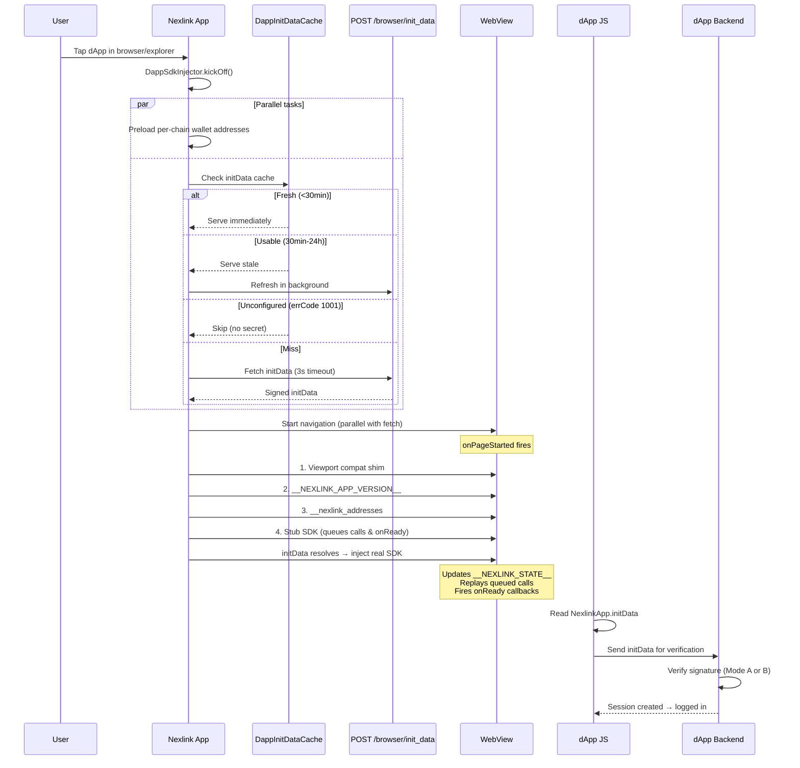
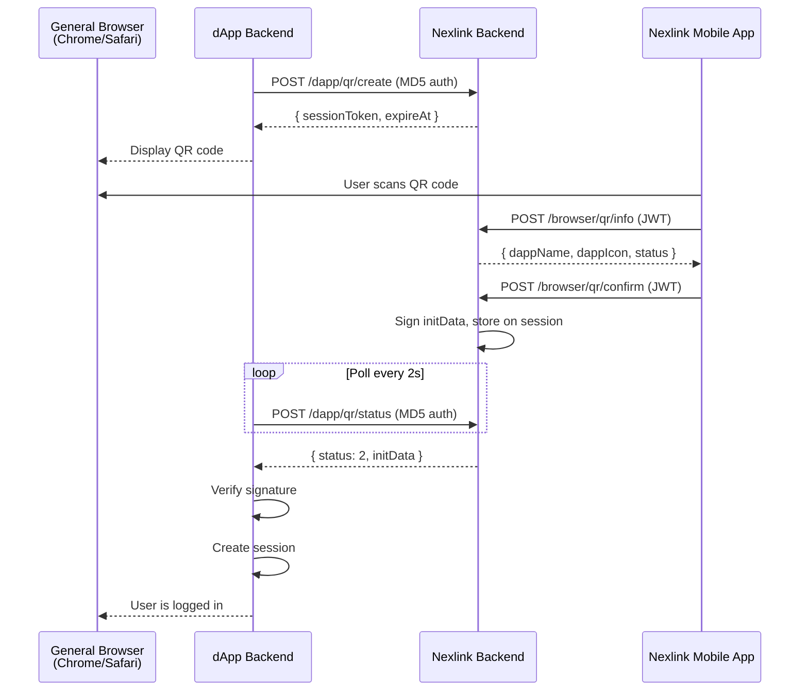
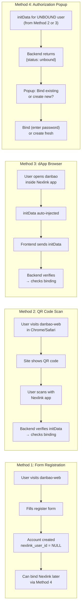
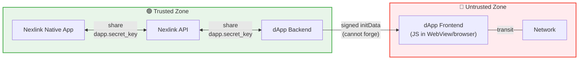

# AUTH

## Nexlink dApp 登录与注册

用户在 Nexlink 原生应用内打开 dApp（或从外部浏览器扫描二维码），平台会提供一段经过加密签名的身份载荷——无需任何用户名/密码表单。

### How to Read This Document

本文档面向两类读者：

| 读者                                      | 应阅读内容                                           |
| --------------------------------------- | ----------------------------------------------- |
| 集成 Nexlink 登录的**任意 dApp 开发者**           | **第一部分**（第 1-7 节）：登录流程、签名验证、二维码深链接、可嵌入小组件       |
| **快速 API 查询**                           | **第二部分**（第 8-10 节）：每个接口的请求/响应规范、initData 载荷格式   |
| 将 Nexlink 接入现有 OAuth2 应用的 **Danbao 团队** | 快速浏览第一部分以了解背景，然后聚焦于**第三部分**（第 11-22 节）：迁移、接口、前端 |

**第四部分**（安全与可扩展性）无论面向哪类读者，对生产部署都很重要。**第五部分**跟踪实现状态。

***

## 第一部分：dApp 开发者指南

***

### 1. Authentication Architecture

#### Two access contexts

| 场景                | 用户如何进入                           | 认证方式               |
| ----------------- | -------------------------------- | ------------------ |
| **dApp 浏览器**（应用内） | 在 Nexlink 移动应用内打开 dApp           | 自动注入 `initData`    |
| **普通浏览器**（外部）     | 在 Chrome/Safari 等浏览器中访问 dApp URL | 使用 Nexlink 应用扫描二维码 |

#### Key concepts

| 概念        | 值                              |
| --------- | ------------------------------ |
| 全局 JS 对象  | `window.NexlinkApp`            |
| 签名载荷      | `initData`（URL 编码字符串）          |
| HMAC 密钥标签 | `"NexlinkData"`                |
| 密钥来源      | `dapps.secret_key`（每个 dApp 独立） |
| 签名算法      | HMAC-SHA256                    |
| 远程验证      | `POST /dapp/verify`            |

#### initData fields

| 字段            | 必填 | 说明                                                                    |
| ------------- | -- | --------------------------------------------------------------------- |
| `user`        | 是  | JSON 字符串化的用户对象（`uid`、`openim_id`、`nickname`、`avatar`、`language_code`） |
| `user_id`     | 是  | 用户的永久 `uid`（等同于 `user.uid`）——稳定且非顺序的键；绝不是内部顺序 id                      |
| `auth_date`   | 是  | Unix 秒——服务器拒绝早于 24h 的载荷                                               |
| `dapp_id`     | 是  | 来自 `dapps` 表的数字 ID                                                    |
| `query_id`    | 是  | 每个 WebView 会话唯一                                                       |
| `start_param` | 否  | 来自打开 URL 的深链接参数                                                       |
| `hash`        | 是  | 所有其他字段的 HMAC-SHA256 十六进制签名                                            |

***

### 2. Login Flow: dApp Browser (In-App)

当用户在 Nexlink 应用内打开 dApp 时，登录是**完全自动的**——无需任何用户交互。

> **SDK 注入：** NexLink WebView 会在 `document_start` 时通过内联 JavaScript 自动注入 `window.NexlinkApp` 和 `window.ethereum`。**你的 HTML 中不需要任何 `<script>` 标签。** 在你的页面脚本运行时，SDK 已经可用。使用 `NexlinkApp.onReady(cb)` 等待 `initData` 加载完成（它可能仍在从服务器获取）。
>
> 在外部浏览器（Chrome、Safari 等）中，`window.NexlinkApp` 为 `undefined`——参见[第 3 节](AUTH.md#3-login-flow-general-browser-qr-code-scan)了解二维码回退方案。

#### Detailed injection pipeline



**如果 initData 获取超时（3s）或失败：** 真实 SDK 仍会被注入，但 `initData = ""`。EIP-1193 钱包桥（`window.ethereum`）仍然可用。dApp 将作为一个没有签名身份的普通网页运行。

#### Relevant code locations

| 步骤                | 文件                                                                      |
| ----------------- | ----------------------------------------------------------------------- |
| init\_data API 调用 | `nexlink/lib/pages/dapp/dapp_apis.dart` → `DappApis.initData()`         |
| init\_data 缓存     | `nexlink/lib/pages/dapp/dapp_browser/dapp_init_data_cache.dart`         |
| Dart 端 HMAC 签名器   | `nexlink/lib/pages/dapp/dapp_browser/init_data.dart` → `InitDataSigner` |
| Go 端 HMAC 签名器     | `nexlink-api/internal/api/nexlinkdapp/handler_verify.go`                |
| Go 端 initData 生成器 | `nexlink-api/internal/api/nexlinkdapp/handler_browser.go`               |
| SDK 注入器管线         | `nexlink/lib/pages/dapp/dapp_browser/dapp_sdk_injector.dart`            |
| JS SDK（桩 + 真实）    | `nexlink/lib/pages/dapp/dapp_browser/js_bridge.dart`                    |
| 桥接模块              | `nexlink/lib/pages/dapp/dapp_browser/bridge/modules/`                   |
| 浏览器页面             | `nexlink/lib/pages/dapp/dapp_browser/dapp_browser_logic.dart`           |

#### dApp frontend code (in-app)

```html
<script>
  // The SDK is auto-injected by the NexLink WebView — no <script> tag needed.
  // Wait for SDK to be ready (initData may still be loading)
  NexlinkApp.onReady(async function () {
    const initData = NexlinkApp.initData;
    if (!initData) {
      // Not running inside NexLink app — show QR login instead
      showQrLogin();
      return;
    }

    // Send signed payload to your backend
    const res = await fetch('/api/auth/nexlink-login', {
      method: 'POST',
      headers: { 'Content-Type': 'application/json' },
      body: JSON.stringify({ initData }),
    });
    const { token } = await res.json();
    // Store session token, proceed to app
    localStorage.setItem('session', token);
    window.location.href = '/dashboard';
  });
</script>
```

**注意事项：** 在真实 SDK 到达之前，在模块加载时把 `initData` 作为原始值捕获的代码（`const id = NexlinkApp.initData`）会得到一个空字符串。始终使用 `NexlinkApp.onReady(cb)` 来等待签名载荷。

***

### 3. Login Flow: General Browser (QR Code Scan)

当用户在普通浏览器（而非 Nexlink 应用内）中访问 dApp URL 时，`window.NexlinkApp` 为 `undefined`——SDK 仅由 NexLink WebView 注入。dApp 必须检测到这一点并回退到**二维码登录流程**。



**Nexlink 应用绝不接触任何外部 URL。** 它只与 Nexlink 后端通信。二维码中不包含任何回调 URL——只有一个令牌和 dApp ID。这彻底消除了 `callback=https://evil.com` 攻击途径。

#### 3.1. QR Code Login Protocol

**Step 1: dApp backend creates QR session via Nexlink API**

dApp 后端（而非浏览器）向 **Nexlink 后端**请求一个二维码登录会话。dApp 通过 MD5 签名认证头（`dapp_id`、`request_time`、`sign`）来标识，而不是通过请求体字段。

```
POST https://nexlink-api/dapp/qr/create
Headers: dapp_id, request_time, sign (MD5 signature auth)
{ "expireSeconds": 300 }

→ { "sessionToken": "abc123...", "dappId": "my_dapp", "status": 1, "expireAt": 1718700000 }
```

* `sessionToken` 是一次性随机令牌（UUID），在请求的有效期内有效（默认取自服务器配置）。
* 存储在 Nexlink 后端的 `nexlink_qr_auth_session` 表中，作用域限定于已认证的 dApp。
* dApp 后端将令牌转发给浏览器。

**Step 2: Browser displays QR code and polls dApp backend**

```js
// Detect environment
if (window.NexlinkApp && window.NexlinkApp.platform === 'flutter' && NexlinkApp.initData) {
  // In-app: use initData directly
  loginWithInitData(NexlinkApp.initData);
} else {
  // External browser: show QR code
  showQrLogin();
}

async function showQrLogin() {
  // dApp backend proxied the /dapp/qr/create call
  const res = await fetch('/api/auth/qr/create', { method: 'POST' }).then(r => r.json());
  const { sessionToken, expireAt } = res.data || res;

  // QR code contains ONLY token — no callback URL
  renderQrCode(`nexlink://auth?token=${sessionToken}`);

  // Poll dApp backend (which polls Nexlink backend)
  pollQrStatus(sessionToken, expireAt);
}

async function pollQrStatus(sessionToken, expireAt) {
  while (Date.now() / 1000 < expireAt) {
    try {
      const res = await fetch('/api/auth/qr/status', {
        method: 'POST',
        headers: { 'Content-Type': 'application/json' },
        body: JSON.stringify({ sessionToken }),
      }).then(r => r.json());
      const data = res.data || res;

      if (data.status === 2) {  // confirmed
        loginWithInitData(data.initData);
        return;
      }
      if (data.status === 4) {  // expired
        showExpiredMessage();
        return;
      }
      // status === 1 (pending) → wait 2s then poll again
      await new Promise(r => setTimeout(r, 2000));
    } catch (e) {
      // Network error — wait 2s then retry
      await new Promise(r => setTimeout(r, 2000));
    }
  }
}
```

**Step 3: User scans with Nexlink app**

Nexlink 移动应用会：

1. 打开内置二维码扫描器或摄像头。
2. 解析深链接：`nexlink://auth?token=abc123&dapp=my_dapp`。
3. 调用 `POST /browser/qr/info` 获取 dApp 信息（名称、图标、域名）以用于确认对话框。
4. 显示确认对话框：_"登录到 \[dApp Name]？"_，并附上 dApp 的名称和域名。
5. 确认后，应用调用 **Nexlink 后端**（而非任何外部 URL）：

```
POST https://nexlink-api/browser/qr/confirm
Authorization: Bearer <user's nexlinkToken>
{
  "sessionToken": "abc123"
}
```

6. Nexlink 后端查找用户，生成签名的 `initData`（使用 `dapps` 表中该 dApp 的 `secret_key`），并将其存储在会话行上。

**Step 4: dApp backend polls for result**

dApp 后端向 Nexlink 后端轮询已确认的 initData：

```
POST https://nexlink-api/dapp/qr/status
Headers: dapp_id, request_time, sign (MD5 signature auth)
{ "sessionToken": "abc123" }

→ pending:   { "sessionToken": "abc123", "dappId": "my_dapp", "status": 1, "expireAt": 1718700000 }
→ confirmed: { "sessionToken": "abc123", "dappId": "my_dapp", "status": 2, "initData": "user=%7B...%7D&hash=...", "expireAt": 1718700000 }
→ expired:   { "sessionToken": "abc123", "dappId": "my_dapp", "status": 4, "expireAt": 1718700000 }
```

状态码：`1` = 待处理，`2` = 已确认，`3` = 失败，`4` = 已过期。

在状态 `2`（已确认）时，dApp 后端会：

1. **验证 initData** 签名（模式 A 使用本地密钥，或者由于它来自经认证通道的 Nexlink API 而信任它）。
2. 通过 `nexlink_user_id` **查找用户**。如果未找到，返回 `"unbound"`——dApp 处理绑定或账号创建（danbao 的实现参见第 13 节，或自行实现）。
3. **签发自己的会话令牌**（OAuth2 令牌、JWT 等）。
4. 将会话令牌返回给浏览器（通过浏览器对 `/api/auth/qr/status` 的轮询）。

dApp 后端将 `POST /dapp/qr/status` 调用代理到 Nexlink 后端。当前实现使用短轮询（浏览器每 2 秒轮询一次）。未来升级到长轮询或 SSE 的计划在第 24 节中跟踪。

```js
// dApp backend (Node.js example) — proxies Nexlink status poll
app.post('/api/auth/qr/status', async (req, res) => {
  const { sessionToken } = req.body;
  const nexlink = await nexlinkApi.post('/dapp/qr/status', { sessionToken });
  const data = nexlink.data || nexlink;

  if (data.status === 2) {  // confirmed
    // Verify and create session
    const result = verifyNexlinkInitData(data.initData, process.env.NEXLINK_DAPP_SECRET);
    if (!result.valid) return res.status(401).end();

    const user = await db.upsertUser({ nexlinkUid: result.user.uid });
    const token = createJWT({ sub: user.id });

    return res.json({ status: 2, sessionToken: token });
  }

  // status 1 (pending) or 4 (expired) — browser will poll again
  res.json({ status: data.status });
});
```

***

### 4. initData Signature Verification

从任一登录流程收到 initData 后，你的后端必须先验证 HMAC-SHA256 签名，才能信任该载荷。有两种模式：本地验证（推荐）和通过 Nexlink API 的远程验证。

#### 4.1. Algorithm

两步式 HMAC-SHA256 派生：

```
Step 1: secret_key = HMAC_SHA256(key="NexlinkData", message=<dapp_secret_key>)

Step 2: data_check_string = sort(all_fields_except_hash)
                              .map(k => k + "=" + v)
                              .join("\n")

Step 3: computed_hash = HEX(HMAC_SHA256(key=secret_key, message=data_check_string))

Step 4: if (computed_hash === received_hash) → VALID
```

**重要：** 在步骤 1 中，`"NexlinkData"` 是 **HMAC 密钥**，而 `dapp_secret_key` 是**消息**。这与 Dart 的 `Hmac(sha256, utf8.encode(hmacKeyLabel))` 构造器（第二个参数 = 密钥）以及 Go 的 `hmac.New(sha256.New, []byte(hmacKeyLabel))`（第二个参数 = 密钥）的工作方式一致。两种实现已验证一致。

#### 4.2. Mode A — Local Verification (Recommended)

dApp 后端持有 `secret_key` 并在本地验证。无需调用 Nexlink 网络。

**Go：**

```go
// maxAge: how long initData stays valid. Default 24h.
// High-security dApps should use shorter windows (e.g., 5*time.Minute).
func VerifyNexlinkInitData(initData, dappSecret string, maxAge ...time.Duration) (*VerifyResult, error) {
    ttl := 24 * time.Hour
    if len(maxAge) > 0 { ttl = maxAge[0] }

    v, _ := url.ParseQuery(initData)
    hash := v.Get("hash")
    v.Del("hash")

    keys := make([]string, 0, len(v))
    for k := range v { keys = append(keys, k) }
    sort.Strings(keys)
    parts := make([]string, len(keys))
    for i, k := range keys { parts[i] = k + "=" + v.Get(k) }
    dataCheckString := strings.Join(parts, "\n")

    mac1 := hmac.New(sha256.New, []byte("NexlinkData"))
    mac1.Write([]byte(dappSecret))
    secretKey := mac1.Sum(nil)

    mac2 := hmac.New(sha256.New, secretKey)
    mac2.Write([]byte(dataCheckString))
    computed := hex.EncodeToString(mac2.Sum(nil))

    // hmac.Equal is constant-time — safe against timing attacks
    if !hmac.Equal([]byte(computed), []byte(hash)) {
        return nil, errors.New("bad signature")
    }
    authDate, _ := strconv.ParseInt(v.Get("auth_date"), 10, 64)
    if time.Now().Unix()-authDate > int64(ttl.Seconds()) {
        return nil, errors.New("expired")
    }
    return &VerifyResult{ /* ... */ }, nil
}
```

**Node.js**（供使用 Node.js 的第三方 dApp 开发者参考）：

```js
import { createHmac, timingSafeEqual } from 'crypto';

// maxAge: how long initData stays valid (seconds). Default 86400 (24h).
// High-security dApps should use shorter windows (e.g., 300 = 5 minutes).
function verifyNexlinkInitData(initData, dappSecret, { maxAge = 86400 } = {}) {
  const params = new URLSearchParams(initData);
  const hash = params.get('hash');
  if (!hash) return { valid: false, reason: 'missing hash' };
  params.delete('hash');

  const dataCheckString = [...params.entries()]
    .sort(([a], [b]) => a.localeCompare(b))
    .map(([k, v]) => `${k}=${v}`)
    .join('\n');

  const secretKey = createHmac('sha256', 'NexlinkData')
    .update(dappSecret).digest();
  const computed = createHmac('sha256', secretKey)
    .update(dataCheckString).digest();

  // IMPORTANT: Use constant-time comparison to prevent timing side-channel attacks.
  // Never use === or !== to compare HMAC digests.
  const hashBuf = Buffer.from(hash, 'hex');
  if (computed.length !== hashBuf.length || !timingSafeEqual(computed, hashBuf)) {
    return { valid: false, reason: 'bad signature' };
  }

  const authDate = parseInt(params.get('auth_date'), 10);
  if (Date.now() / 1000 - authDate > maxAge) {
    return { valid: false, reason: 'expired' };
  }

  return {
    valid: true,
    user: JSON.parse(params.get('user')),
    authDate,
    queryId: params.get('query_id'),
    dappId: parseInt(params.get('dapp_id'), 10),
  };
}
```

**关于 Node.js `createHmac` 的说明：** `createHmac('sha256', 'NexlinkData')`——第二个参数是密钥。`.update(dappSecret)` 提供消息。这与算法一致。

#### 4.3. Mode B — Remote Verification

适用于不希望存储密钥的 dApp。调用 Nexlink API 进行验证：

```
POST /dapp/verify
{ "initData": "user=...&hash=...", "clientId": 42 }

→ 200: { "errCode": 0, "data": { "valid": true, "user": {...} } }
→ 401: { "errCode": 40002, "errMsg": "bad signature" }
```

***

### 5. Deep Link Format for QR Codes

展示给用户的二维码编码了一个 Nexlink 深链接。Nexlink 应用解析该深链接以识别二维码会话。

```
nexlink://auth?token=<sessionToken>&dapp=<dappId>
```

| 参数      | 必填 | 说明                              |
| ------- | -- | ------------------------------- |
| `token` | 是  | 一次性二维码会话令牌（来自 Nexlink 后端的 UUID） |
| `dapp`  | 否  | dApp 符号（用于路由；后端从会话中解析 dApp 信息）  |

**无回调 URL。** 二维码绝不包含任何外部 URL。Nexlink 应用只与 Nexlink 后端通信。

Nexlink 应用为 `nexlink://auth` scheme 注册了一个处理器（`NexlinkUrlRouter` → `RouteType.auth`），它会：

1. 解析 `token` 和 `dapp` 查询参数
2. 调用 `POST /browser/qr/info { sessionToken }` 获取 dApp 信息（名称、图标、域名）以用于确认对话框
3. 显示："登录到 **\[dApp Name]**？"，并附上 dApp 的域名
4. 确认后：在 Nexlink 后端调用 `POST /browser/qr/confirm { sessionToken }`——后端查找用户、签名 initData，并将其存储在会话行上

***

### 6. Dual-Mode dApp Template

> **注意：** 两条路径都已完整实现。应用内路径直接使用 `window.NexlinkApp.initData`；二维码路径使用 `/dapp/qr/create` 和 `/dapp/qr/status` 接口。

一个既能在 Nexlink 内部又能在外部浏览器中工作的 dApp 完整模式：

```js
class NexlinkAuth {
  constructor({ apiBase }) {
    this.apiBase = apiBase;
  }

  async login() {
    // Check if running inside Nexlink app
    if (window.NexlinkApp && window.NexlinkApp.platform === 'flutter') {
      return this.loginInApp();
    } else {
      return this.loginWithQr();
    }
  }

  // --- In-app login (automatic) ---
  async loginInApp() {
    return new Promise((resolve, reject) => {
      const tryLogin = async () => {
        const initData = window.NexlinkApp.initData;
        if (!initData) {
          reject(new Error('No initData available'));
          return;
        }

        const res = await fetch(`${this.apiBase}/auth/nexlink-login`, {
          method: 'POST',
          headers: { 'Content-Type': 'application/json' },
          body: JSON.stringify({ initData }),
        });

        if (!res.ok) reject(new Error('Login failed'));
        resolve(await res.json());
      };

      if (NexlinkApp.initData) {
        tryLogin();
      } else {
        NexlinkApp.onReady(tryLogin);
      }
    });
  }

  // --- QR code login (external browser) ---
  async loginWithQr() {
    // 1. Create QR session (dApp backend proxies to Nexlink API)
    const res = await fetch(
      `${this.apiBase}/auth/qr/create`,
      { method: 'POST' }
    ).then(r => r.json());
    const { sessionToken, expireAt } = res.data || res;

    // 2. Build deep link and render QR — NO callback URL
    const deepLink = `nexlink://auth?token=${sessionToken}`;

    this.renderQrCode(deepLink);

    // 3. Poll dApp backend for confirmation
    return this.pollStatus(sessionToken, expireAt);
  }

  renderQrCode(data) {
    // Use qrcode.js, qr-code-styling, or similar
    const container = document.getElementById('qr-container');
    // ... render QR code with `data` ...
  }

  async pollStatus(sessionToken, expireAt) {
    while (Date.now() / 1000 < expireAt) {
      try {
        const res = await fetch(`${this.apiBase}/auth/qr/status`, {
          method: 'POST',
          headers: { 'Content-Type': 'application/json' },
          body: JSON.stringify({ sessionToken }),
        }).then(r => r.json());
        const data = res.data || res;

        if (data.status === 2) {  // confirmed
          return { initData: data.initData };
        }
        if (data.status === 4) {  // expired
          throw new Error('QR code expired');
        }
        // status 1 (pending) → wait 2s then poll again
        await new Promise(r => setTimeout(r, 2000));
      } catch (e) {
        if (e.message === 'QR code expired') throw e;
        // Network error — wait 2s then retry
        await new Promise(r => setTimeout(r, 2000));
      }
    }
    throw new Error('QR code expired');
  }
}
```

用法：

```js
const auth = new NexlinkAuth({
  apiBase: 'https://api.my-dapp.com',
});

try {
  const { initData } = await auth.login();
  // Send initData to your backend for verification + session creation
  const session = await fetch('/api/auth/nexlink-login', {
    method: 'POST',
    headers: { 'Content-Type': 'application/json' },
    body: JSON.stringify({ initData }),
  }).then(r => r.json());
  localStorage.setItem('session', session.token);
} catch (e) {
  console.error('Login failed:', e);
}
```

***

### 7. Nexlink Login Widget (Hosted Embeddable Script)

> 登录小组件和所有二维码登录接口均已实现。小组件在 `/static/nexlink-login-widget.js` 处提供。若要在不使用小组件的情况下手动集成，请参见**双模式模板**（第 6 节）。

双模式模板（第 6 节）要求每个 dApp 开发者自行实现二维码渲染、长轮询逻辑和环境检测。**托管登录小组件**将所有这些打包进一个 `<script>` 标签——类似 Telegram 的登录小组件。

#### 7.1. dApp developer usage

```html
<!-- Drop-in: one script tag + one callback -->
<div id="nexlink-login"></div>
<script src="https://nexlink-api/static/nexlink-login-widget.js"
  data-target="#nexlink-login"
  data-api-base="https://api.my-dapp.com"
  data-onauth="onNexlinkAuth">
</script>
<script>
  function onNexlinkAuth(initData) {
    // initData is the signed payload string: "user=%7B...%7D&hash=..."
    // Send to your backend for verification + session creation
    fetch('/api/auth/nexlink-login', {
      method: 'POST',
      headers: { 'Content-Type': 'application/json' },
      body: JSON.stringify({ initData }),
    })
    .then(r => r.json())
    .then(({ token }) => {
      localStorage.setItem('session', token);
      window.location.href = '/dashboard';
    });
  }
</script>
```

#### 7.2. What the widget does internally

```mermaid
flowchart TD
    A["nexlink-login-widget.js<br/>(hosted on Nexlink CDN)"] --> B["Read data-* attributes<br/>from &lt;script&gt; tag"]
    B --> C{"window.NexlinkApp<br/>exists?"}

    C -->|YES| D["In-app mode (auto-login)"]
    D --> D1["NexlinkApp.onReady(cb)"]
    D1 --> D2["Read NexlinkApp.initData"]
    D2 --> D3["Call data-onauth callback"]

    C -->|NO| E["Browser mode (QR login)"]
    E --> E1["POST to dApp backend<br/>(proxies /dapp/qr/create)"]
    E1 --> E2["Render QR code<br/>(nexlink://auth?token=...)"]
    E2 --> E3["Poll every 2s<br/>(proxies /dapp/qr/status)"]
    E3 --> E4{"status?"}
    E4 -->|2 (confirmed)| E5["Call data-onauth(initData)"]
    E4 -->|4 (expired)| E6["Show retry button"]

    style A fill:#4a9eff,color:#fff
    style C fill:#ff9800,color:#fff
    style E4 fill:#ff9800,color:#fff
```

**小组件 UI 特性：** 品牌化的"Login with NexLink"按钮、二维码显示、轮询指示器、过期后重试、通过 `data-theme` 支持明/暗主题。

#### 7.3. Widget `<script>` attributes

| 属性                 | 必填 | 默认值                | 说明                                               |
| ------------------ | -- | ------------------ | ------------------------------------------------ |
| `data-target`      | 否  | `"#nexlink-login"` | 容器元素的 CSS 选择器                                    |
| `data-api-base`    | 是  | —                  | 你的 dApp 后端 API 的基础 URL（小组件调用你的后端，而非直接调用 Nexlink） |
| `data-create-path` | 否  | `"/qr/create"`     | 在你的后端创建二维码会话的路径                                  |
| `data-status-path` | 否  | `"/qr/status"`     | 在你的后端轮询二维码会话状态的路径                                |
| `data-onauth`      | 否  | `"onNexlinkAuth"`  | 全局回调函数名，以 `initData` 字符串为参数调用                    |
| `data-expire`      | 否  | `"300"`            | 会话过期时间（秒）                                        |
| `data-theme`       | 否  | `"light"`          | `"light"` 或 `"dark"`                             |

#### 7.4. Widget vs manual integration

| 方面        | 小组件（`<script>` 标签）  | 手动（第 6 节 NexlinkAuth 类） |
| --------- | ------------------- | ----------------------- |
| **搭建工作量** | 5 行 HTML            | 约 100 行 JS + 二维码库       |
| **二维码渲染** | 内置                  | 开发者自带二维码库               |
| **长轮询**   | 内置                  | 开发者实现                   |
| **环境检测**  | 内置                  | 开发者实现                   |
| **UI/样式** | 品牌化，可通过 `data-*` 配置 | 完全自定义                   |
| **更新**    | 从 CDN 自动更新          | 开发者必须手动更新               |
| **可定制性**  | 限于 `data-*` 属性      | 完全控制                    |
| **适用于**   | 快速集成、标准登录页面         | 自定义 UI、SPA、非标准流程        |

#### 7.5. Widget implementation (Nexlink-side)

小组件 JS 文件由 Nexlink 后端在 `/static/nexlink-login-widget.js` 处提供。核心行为：

```js
// nexlink-login-widget.js — simplified overview of actual implementation
(function () {
  'use strict';

  // 1. Read config from script tag's data-* attributes
  var config = {
    target: script.getAttribute('data-target') || '#nexlink-login',
    apiBase: script.getAttribute('data-api-base'),       // YOUR dApp backend
    createPath: script.getAttribute('data-create-path') || '/qr/create',
    statusPath: script.getAttribute('data-status-path') || '/qr/status',
    onauth: script.getAttribute('data-onauth') || 'onNexlinkAuth',
    expire: parseInt(script.getAttribute('data-expire') || '300', 10),
    theme: script.getAttribute('data-theme') || 'light',
  };

  // 2. In-app fast path: auto-login if inside NexLink WebView
  if (window.NexlinkApp && window.NexlinkApp.platform === 'flutter' && window.NexlinkApp.initData) {
    window[config.onauth](window.NexlinkApp.initData);
    return;
  }

  // 3. Browser mode: render "Login with NexLink" button
  var container = document.querySelector(config.target);
  // ... renders button, on click calls startSession() ...

  function startSession() {
    // Call dApp backend (which proxies to POST /dapp/qr/create)
    fetch(config.apiBase + config.createPath, {
      method: 'POST',
      headers: { 'Content-Type': 'application/json' },
      body: JSON.stringify({ expireSeconds: config.expire }),
    }).then(r => r.json()).then(resp => {
      var data = resp.data || resp;
      // Render QR code with deep link
      var qrUri = 'nexlink://auth?token=' + data.sessionToken;
      showQr(qrUri);
      // Start polling
      startPolling(data.sessionToken, data.expireAt);
    });
  }

  function startPolling(sessionToken, expireAt) {
    setInterval(function () {
      if (Date.now() / 1000 > expireAt) { showExpired(); return; }

      fetch(config.apiBase + config.statusPath, {
        method: 'POST',
        headers: { 'Content-Type': 'application/json' },
        body: JSON.stringify({ sessionToken }),
      }).then(r => r.json()).then(resp => {
        var data = resp.data || resp;
        if (data.status === 2) {       // confirmed
          window[config.onauth](data.initData);
        } else if (data.status === 4) { // expired
          showExpired();
        }
      });
    }, 2000);
  }
})();
```

**重要：** 小组件调用你的 **dApp 后端**（`data-api-base`），而非直接调用 Nexlink API。你的后端使用 MD5 签名认证来代理创建/状态调用。这样可将 dApp 密钥保留在服务器端。

#### 7.6. Security considerations for hosted widget

| 关注点                              | 缓解措施                                                                         |
| -------------------------------- | ---------------------------------------------------------------------------- |
| 小组件 JS 通过 CDN 提供——可能被篡改          | 使用 `integrity` 哈希提供；托管在与 API 相同的域名下                                          |
| 小组件从浏览器调用 dApp 后端                | 小组件使用 `data-api-base` 调用你自己的后端，后端再用 MD5 认证代理到 Nexlink API。不会向浏览器暴露任何 dApp 密钥 |
| `data-onauth` 回调在浏览器中接收 initData | 与应用内流程相同——浏览器获得 initData 但无法伪造它。后端仍须验证签名                                     |
| 跨源请求                             | 小组件调用你自己的后端（同源或已配置 CORS）                                                     |

***

## 第二部分：API 接口参考

关于完整的 API 规范——类型、接口、请求/响应格式和错误码——请参见独立的 [**API 参考**](API.md)。

下表提供快速概览。实现细节请参见第三部分。

#### Endpoint Summary

| 方法   | 路径                            | 认证                 | 说明                          |
| ---- | ----------------------------- | ------------------ | --------------------------- |
| POST | `/browser/init_data`          | JWT (nexlinkToken) | 生成签名 initData（仅限移动应用）       |
| POST | `/dapp/qr/create`             | MD5 signature      | 创建二维码登录会话                   |
| POST | `/browser/qr/info`            | JWT (nexlinkToken) | 获取二维码会话信息 + dApp 详情（移动应用）   |
| POST | `/browser/qr/confirm`         | JWT (nexlinkToken) | 确认二维码扫描，生成 initData（移动应用）   |
| POST | `/dapp/qr/status`             | MD5 signature      | 轮询二维码结果（确认后返回 initData）     |
| POST | `/dapp/verify`                | None               | 远程 initData 验证              |
| POST | `/api/v1/user/login-nexlink`  | None               | 验证 initData → 登录或 "unbound" |
| POST | `/api/v1/user/bind-nexlink`   | None               | 将 Nexlink 绑定到现有账号           |
| POST | `/api/v1/user/create-nexlink` | None               | 从 Nexlink 创建账号              |
| POST | `/api/v1/user/unbind-nexlink` | `Bearer <session>` | 断开 Nexlink 绑定               |

***

## 第三部分：Danbao 集成指南

***

### 11. Overview & Current Auth

Danbao（`danbao/`）拥有**独立的自有认证系统**，早于 Nexlink dApp 浏览器出现。为了作为 Nexlink dApp 工作，danbao 必须同时支持两条认证路径——现有的用户名/密码流程和新的基于 initData 的流程。

#### 11.1. Danbao's current auth (standalone)

Danbao 使用一个完整的 OAuth2 服务器（`danbao-api/pkg/oauth2server/`）：

* **授权类型（Grant types）：** `password`、`refresh_token`、`authorization_code`
* **令牌类型：** 不透明的 256 位 bearer 令牌（非 JWT），存储在 PostgreSQL 中
* **有效期（TTLs）：** 访问令牌 2h，刷新令牌 7d
* **用户登录：** `POST /api/v1/user/login`，携带 `{ username, password }` → 返回 `{ access_token, refresh_token }`
* **管理员登录：** `POST /api/v1/admin/login`——相同流程，但校验 `is_admin` 标志和 scope `"admin"`
* **中间件：** 每个请求都校验 bearer 令牌，将用户 ID 注入请求上下文
* **前端（danbao-web）：** 在 localStorage 中存储令牌，每个请求携带 `Authorization: Bearer <token>`
* **前端（danbao-admin）：** 相同模式，此外在每次 `check()` 调用时重新校验 `is_admin`

***

### 12. Database Migration

当前的 `users` 表**没有列可存储 Nexlink 用户 ID**，且 `password_hash` / `email` 均为 `NOT NULL`——这阻碍了从 initData 自动创建账号。

**阻碍 initData 用户的当前 schema 约束：**

| 列               | 约束                            | 问题                       |
| --------------- | ----------------------------- | ------------------------ |
| `password_hash` | `VARCHAR(255) NOT NULL`       | initData 用户没有密码          |
| `email`         | `VARCHAR(255) NOT NULL`       | initData 不包含 email       |
| `username`      | `VARCHAR(64) NOT NULL UNIQUE` | 需要从 Nexlink 身份生成一个       |
| （缺失）            | —                             | 没有列可存储 `nexlink_user_id` |

**所需迁移：**

```sql
-- File: danbao-api/internal/db/migrations/000018_nexlink_user_binding.sql

-- 1. Add Nexlink binding column (nullable — existing users won't have it)
ALTER TABLE users
  ADD COLUMN nexlink_user_id BIGINT;

-- Unique constraint: one Nexlink user → one danbao user
CREATE UNIQUE INDEX users_nexlink_user_id_uniq
  ON users(nexlink_user_id) WHERE nexlink_user_id IS NOT NULL;

-- 2. Allow passwordless users (initData-created accounts)
ALTER TABLE users
  ALTER COLUMN password_hash DROP NOT NULL;

-- 3. Allow email-less users (initData doesn't provide email)
ALTER TABLE users
  ALTER COLUMN email DROP NOT NULL;
```

**迁移后更新的用户表：**

| 列                 | 类型           | 约束              | 备注                                        |
| ----------------- | ------------ | --------------- | ----------------------------------------- |
| `id`              | BIGSERIAL    | PK              | danbao 内部 ID                              |
| `username`        | VARCHAR(64)  | NOT NULL UNIQUE | 对 initData 用户生成为 `"nx_{id}"`（id = 本表的 PK） |
| `password_hash`   | VARCHAR(255) | **NULLABLE**    | 对仅 initData 用户为 NULL                      |
| `email`           | VARCHAR(255) | **NULLABLE**    | 对仅 initData 用户为 NULL                      |
| `nexlink_user_id` | BIGINT       | UNIQUE（可空）      | **新增**——Nexlink 数字用户 ID                   |
| `display_name`    | VARCHAR(64)  | 可空              | 从 initData 的 `nickname` 同步                |
| `avatar_url`      | VARCHAR(512) | 可空              | 从 initData 的 `avatar` 同步                  |
| ...               |              |                 | （其他列不变）                                   |

***

### 13. Four Login Methods — One Account

每个 danbao 用户最终都会得到**一个账号**，无论他们最初以何种方式进入。四种入口方式为：

| # | 方式             | 场景                  | 是否需要 Nexlink 账号？ |
| - | -------------- | ------------------- | ---------------- |
| 1 | **表单注册**       | 普通浏览器               | 否                |
| 2 | **二维码扫描**      | 普通浏览器 + Nexlink 应用  | 是                |
| 3 | **dApp 浏览器登录** | Nexlink 应用内         | 是（自动）            |
| 4 | **浏览器授权弹窗**    | 普通浏览器（initData 到达后） | 是                |

所有基于 Nexlink 的方式（2、3、4）都会向 dApp 后端传递相同的 `initData` 载荷。后端以相同方式处理它们：验证签名 → 查找 `nexlink_user_id` → 响应。



**Method 1: Form registration**

标准注册——不涉及任何 Nexlink 身份。

```
POST /api/v1/user/register
{ "username": "john_doe", "password": "...", "email": "john@mail.com" }
    │
    ▼
Validate: username must NOT start with "nx_" (reserved for initData-created accounts)
    │
    ▼
INSERT INTO users (
  username,        -- "john_doe"
  password_hash,   -- bcrypt("password")
  email,           -- "john@mail.com"
  nexlink_user_id  -- NULL (not bound)
)
    │
    ▼
Issue OAuth2 token → user is logged in
```

用户之后照常通过 `POST /user/login { username, password }` 登录。

**Methods 2 & 3: Nexlink login (QR scan or in-app)**

两种方式都会向同一个后端接口传递 `initData`。当 `nexlink_user_id` 未知时，后端**不会**自动创建账号——它返回 `"unbound"` 状态，以便前端展示授权弹窗（方式 4）。

```
initData arrives (via QR poll or in-app SDK)
    │
    ▼
POST /api/v1/user/login-nexlink
{ "initData": "user=%7B...%7D&hash=..." }
    │
    ▼
Backend:
  1. Verify initData signature → extract the nexlink uid (from user_id / user.uid)
  2. SELECT * FROM users WHERE nexlink_user_id = 79552634
    │
    ├── FOUND → already bound
    │   → sync profile (display_name, avatar_url)
    │   → issue OAuth2 token
    │   → return { status: "ok", token, user }
    │
    └── NOT FOUND → unbound
        → return { status: "unbound", nexlinkUser: { uid, openim_id, nickname, avatar } }
```

当前端收到 `"ok"` 时，用户已登录。当它收到 `"unbound"` 时，会触发授权弹窗（方式 4）。

**Method 4: Browser authorization popup**

当 initData 对应一个未知的 `nexlink_user_id` 到达时，前端会显示一个弹窗：

```
┌──────────────────────────────────────────────┐
│                                              │
│  Welcome, John!                              │
│  Your Nexlink account is not yet linked.     │
│                                              │
│  ┌────────────────────────────────────────┐  │
│  │  I have an existing account            │  │
│  │  (enter username + password to bind)   │  │
│  └────────────────────────────────────────┘  │
│                                              │
│  ┌────────────────────────────────────────┐  │
│  │  Create a new account                  │  │
│  │  (auto-create from Nexlink identity)   │  │
│  └────────────────────────────────────────┘  │
│                                              │
└──────────────────────────────────────────────┘
```

**选项 A —— 绑定现有账号：** 用户输入其 danbao 用户名和密码。接口参见第 16 节。

**选项 B —— 创建新账号：** 一键完成，无需表单。接口参见第 17 节。

用户之后可以通过 `POST /user/set-password` 设置密码，以启用表单登录。

**Returning user (already bound)**

一旦某账号设置了 `nexlink_user_id`，所有后续的 Nexlink 登录（二维码或应用内）都会跳过弹窗：

```
initData.user.uid = 79552634
    │
    ▼
SELECT * FROM users WHERE nexlink_user_id = 79552634
    → found: danbao user id=1
    │
    ▼
UPDATE users SET
  display_name = initData.nickname,   -- sync profile
  avatar_url = initData.avatar,
  last_login_at = NOW()
WHERE nexlink_user_id = 79552634
    │
    ▼
Issue OAuth2 token → return { status: "ok", token, user }
```

**Account completion**

| 入口路径                  | 缺少什么              | 如何补全                                           |
| --------------------- | ----------------- | ---------------------------------------------- |
| 方式 1（表单）              | `nexlink_user_id` | 通过二维码或应用内登录 → 绑定（方式 4，选项 A）                    |
| 方式 2/3 → 选项 B（创建新账号）  | 密码、email、自定义用户名   | 设置 → "Set password"（`POST /user/set-password`） |
| 方式 2/3 → 选项 A（绑定现有账号） | 无——已完整            | —                                              |

**Why duplicates are impossible**

| 防护                                   | 方式                           |
| ------------------------------------ | ---------------------------- |
| `nexlink_user_id UNIQUE` 约束          | DB 拒绝具有相同 Nexlink 用户 ID 的第二行 |
| 选项 A 绑定时检查 `nexlink_user_id IS NULL` | 不会覆盖已绑定的账号                   |
| 选项 B 在 `INSERT` 前检查 `SELECT`         | 仅在无匹配时创建                     |
| `"unbound"` 响应阻止静默自动创建               | 用户必须显式选择绑定或创建                |
| 表单注册中保留 `nx_` 前缀                     | 防止与自动生成的 `nx_{id}` 用户名发生冲突   |

***

### 14. Backend Service Methods

```go
// FindByNexlinkUserID looks up a danbao user by Nexlink ID.
// Returns ErrNotFound if no account is bound.
func (s *Service) FindByNexlinkUserID(ctx context.Context, nexlinkUserID int64) (UserResp, error) {
    e, err := s.repo.FindByNexlinkUserID(ctx, nexlinkUserID)
    if err != nil {
        return UserResp{}, err
    }
    return toResp(e), nil
}

// CreateNexlinkUser creates a new passwordless user bound to a Nexlink identity.
// Called when user chooses "Create new account" in the authorization popup.
// Username is set to "nx_{id}" where id is the users table PK (always unique).
func (s *Service) CreateNexlinkUser(
    ctx context.Context,
    nexlinkUserID int64,
    nickname string,
    avatar string,
) (UserResp, error) {
    // Single query: INSERT with username derived from the auto-generated id
    e, err := s.repo.CreateNexlinkUser(ctx, nexlinkUserID, nickname, avatar)
    if err != nil {
        return UserResp{}, err
    }
    return toResp(e), nil
}

// SetNexlinkUserID binds a Nexlink identity to an existing account.
// Called when user chooses "Bind existing account" in the authorization popup.
func (s *Service) SetNexlinkUserID(ctx context.Context, userID int64, nexlinkUserID int64) error {
    return s.repo.SetNexlinkUserID(ctx, userID, nexlinkUserID)
}

// ClearNexlinkUserID removes the Nexlink binding from an account.
// Called when user disconnects their Nexlink identity (Section 18).
func (s *Service) ClearNexlinkUserID(ctx context.Context, userID int64) error {
    return s.repo.ClearNexlinkUserID(ctx, userID)
}

// UpdateProfile syncs display name and avatar from initData.
func (s *Service) UpdateProfile(ctx context.Context, userID int64, nickname, avatar string) error {
    return s.repo.UpdateProfile(ctx, userID, nickname, avatar)
}
```

```sql
-- name: FindByNexlinkUserID :one
SELECT * FROM users WHERE nexlink_user_id = $1;

-- name: CreateNexlinkUser :one
-- username = "nx_{id}" — uses nextval/currval to derive from the auto-generated PK.
-- This guarantees uniqueness since id is the primary key.
-- ON CONFLICT prevents duplicate insert errors from concurrent requests (e.g., double-click).
INSERT INTO users (
  id, username, nexlink_user_id,
  display_name, avatar_url
) VALUES (
  nextval('users_id_seq'),
  'nx_' || currval('users_id_seq'),
  $1, $2, $3
)
ON CONFLICT (nexlink_user_id) DO NOTHING
RETURNING *;

-- name: SetNexlinkUserID :exec
UPDATE users SET nexlink_user_id = $1 WHERE id = $2;

-- name: ClearNexlinkUserID :exec
UPDATE users SET nexlink_user_id = NULL WHERE id = $1;
```

***

### 15. Endpoint: `POST /user/login-nexlink`

验证 initData，查找已绑定的用户，并返回 `"ok"` 或 `"unbound"`。

#### 15.1. Handler

```go
// POST /api/v1/user/login-nexlink
func (h *Handler) LoginNexlink(w http.ResponseWriter, r *http.Request) {
    var req struct {
        InitData string `json:"initData"`
    }
    json.NewDecoder(r.Body).Decode(&req)

    // 1. Verify initData signature
    result, err := VerifyNexlinkInitData(req.InitData, h.dappSecret)
    if err != nil {
        http.Error(w, "unauthorized", 401)
        return
    }

    // 2. Replay prevention — reject reused initData (see Section 15.2)
    if err := h.checkReplay(r.Context(), result.QueryID); err != nil {
        http.Error(w, "initData already used", 403)
        return
    }

    // 3. Look up existing bound user
    user, err := h.userService.FindByNexlinkUserID(r.Context(), result.User.ID)
    if errors.Is(err, ErrNotFound) {
        // No account bound to this nexlink_user_id → tell frontend
        json.NewEncoder(w).Encode(map[string]any{
            "status": "unbound",
            "nexlinkUser": map[string]any{
                "id":       result.User.ID,
                "nickname": result.User.Nickname,
                "avatar":   result.User.Avatar,
            },
        })
        return
    }
    if err != nil {
        http.Error(w, "internal error", 500)
        return
    }

    // 4. Sync profile from initData (skip if unchanged)
    if user.DisplayName != result.User.Nickname || user.AvatarURL != result.User.Avatar {
        _ = h.userService.UpdateProfile(r.Context(), user.ID, result.User.Nickname, result.User.Avatar)
    }

    // 5. Issue danbao OAuth2 token
    token, err := h.oauth2.PasswordGrantInternal(user.ID, user.Username, "user")
    if err != nil {
        http.Error(w, "internal error", 500)
        return
    }

    // 6. Return same response shape as /user/login
    json.NewEncoder(w).Encode(map[string]any{
        "status":        "ok",
        "access_token":  token.AccessToken,
        "refresh_token": token.RefreshToken,
        "token_type":    "Bearer",
        "expires_in":    token.ExpiresIn,
        "user":          user,
    })
}
```

#### 15.2. Replay prevention (query\_id tracking)

在 `auth_date` 有效期窗口内（默认 24h），一个被截获的 initData 字符串可能被重放到任意接口。initData 中的 `query_id` 字段对每个 WebView 会话唯一，应加以跟踪以防止重用。

```go
// checkReplay is called by every endpoint that accepts initData, after signature verification.
func (h *Handler) checkReplay(ctx context.Context, queryID string) error {
    // SET NX with TTL = auth_date max age (24h).
    // If the key already exists, this initData was already consumed.
    ok, err := h.redis.SetNX(ctx, "initdata:used:"+queryID, "1", 24*time.Hour).Result()
    if err != nil {
        return fmt.Errorf("replay check failed: %w", err)
    }
    if !ok {
        return errors.New("initData already used")
    }
    return nil
}
```

| 方面  | 详情                                     |
| --- | -------------------------------------- |
| 存储  | Redis `SET NX`，TTL 匹配 auth\_date 最大有效期 |
| 键格式 | `initdata:used:{query_id}`             |
| 作用域 | 每个 dApp 实例（每个 dApp 后端跟踪自己的）            |
| 内存  | 每个键约 100 字节 × 24h 内登录次数——可忽略不计         |
| 可选  | 安全要求较低的 dApp 可跳过此检查                    |

**关于二维码流程的说明：** 在二维码流程中，initData 在确认时由 Nexlink 后端生成，并通过状态接口一次性交付（一次性读取 + 删除）。`query_id` 仍然存在，因此同样适用相同的防重放检查。

***

### 16. Endpoint: `POST /user/bind-nexlink`

将 Nexlink 身份链接到一个现有的 danbao 账号（方式 4，选项 A）。

#### 16.1. Handler

```go
// POST /api/v1/user/bind-nexlink
func (h *Handler) BindNexlink(w http.ResponseWriter, r *http.Request) {
    var req struct {
        Username string `json:"username"`
        Password string `json:"password"`
        InitData string `json:"initData"`
    }
    json.NewDecoder(r.Body).Decode(&req)

    // 1. Rate limit — prevent brute-forcing passwords (see Section 16.2)
    key := "bind:" + sha256Hex(req.InitData)
    if !h.rateLimiter.Allow(key, 5, 10*time.Minute) {
        http.Error(w, "too many attempts, try again later", 429)
        return
    }

    // 2. Verify initData
    result, err := VerifyNexlinkInitData(req.InitData, h.dappSecret)
    if err != nil {
        http.Error(w, "unauthorized", 401)
        return
    }

    // 3. Replay prevention (see Section 15.2)
    if err := h.checkReplay(r.Context(), result.QueryID); err != nil {
        http.Error(w, "initData already used", 403)
        return
    }

    // 4. Authenticate with username/password
    user, err := h.userService.Authenticate(r.Context(), req.Username, req.Password)
    if err != nil {
        http.Error(w, "invalid credentials", 401)
        return
    }

    // 5. Check not already bound
    if user.NexlinkUserID != nil {
        http.Error(w, "account already bound to a Nexlink user", 409)
        return
    }

    // 6. Bind
    err = h.userService.SetNexlinkUserID(r.Context(), user.ID, result.User.ID)
    if err != nil {
        // UNIQUE constraint violation → this Nexlink user is bound elsewhere
        http.Error(w, "nexlink user already bound to another account", 409)
        return
    }

    // 7. Issue token
    token, err := h.oauth2.PasswordGrantInternal(user.ID, user.Username, "user")
    if err != nil {
        http.Error(w, "internal error", 500)
        return
    }

    json.NewEncoder(w).Encode(map[string]any{
        "status":        "ok",
        "access_token":  token.AccessToken,
        "refresh_token": token.RefreshToken,
        "token_type":    "Bearer",
        "expires_in":    token.ExpiresIn,
        "user":          user,
    })
}
```

| 列                 | 绑定前             | 绑定后             |
| ----------------- | --------------- | --------------- |
| `username`        | `john_doe`      | `john_doe`      |
| `password_hash`   | `$2a$10$...`    | `$2a$10$...`    |
| `email`           | `john@mail.com` | `john@mail.com` |
| `nexlink_user_id` | **NULL**        | **79552634**    |

#### 16.2. Brute-force protection

此接口接受 用户名 + 密码 + initData。持有有效 initData 的攻击者可能尝试暴力破解密码。

| 防护            | 实现                               |
| ------------- | -------------------------------- |
| 按 initData 限流 | 每个 initData 每 10 分钟 5 次绑定尝试      |
| 按 IP 限流       | 每个 IP 每 10 分钟 20 次绑定尝试           |
| 账号锁定          | 跨所有 initData 累计 10 次失败绑定后锁定账号    |
| 日志            | 记录所有失败绑定尝试，包含 IP、initData 哈希、用户名 |

***

### 17. Endpoint: `POST /user/create-nexlink`

从 Nexlink 身份创建一个新的无密码账号（方式 4，选项 B）。

#### 17.1. Handler

```go
// POST /api/v1/user/create-nexlink
func (h *Handler) CreateNexlink(w http.ResponseWriter, r *http.Request) {
    var req struct {
        InitData string `json:"initData"`
    }
    json.NewDecoder(r.Body).Decode(&req)

    // 1. Verify initData
    result, err := VerifyNexlinkInitData(req.InitData, h.dappSecret)
    if err != nil {
        http.Error(w, "unauthorized", 401)
        return
    }

    // 2. Replay prevention — blocks stolen initData reuse (see Section 15.2)
    if err := h.checkReplay(r.Context(), result.QueryID); err != nil {
        http.Error(w, "initData already used", 403)
        return
    }

    // 3. Rate limit per Nexlink user ID (see Section 17.3)
    key := fmt.Sprintf("create-nexlink:%d", result.User.ID)
    if !h.rateLimiter.Allow(key, 3, 10*time.Minute) {
        http.Error(w, "too many attempts", 429)
        return
    }

    // 4. Create passwordless user (ON CONFLICT handles race condition, see Section 17.2)
    user, err := h.userService.CreateNexlinkUser(r.Context(), result.User.ID, result.User.Nickname, result.User.Avatar)
    if err != nil {
        // ON CONFLICT returned no rows — user already exists, fall back to login
        user, err = h.userService.FindByNexlinkUserID(r.Context(), result.User.ID)
        if err != nil {
            http.Error(w, "internal error", 500)
            return
        }
    }

    // 5. Issue token
    token, err := h.oauth2.PasswordGrantInternal(user.ID, user.Username, "user")
    if err != nil {
        http.Error(w, "internal error", 500)
        return
    }

    json.NewEncoder(w).Encode(map[string]any{
        "status":        "ok",
        "access_token":  token.AccessToken,
        "refresh_token": token.RefreshToken,
        "token_type":    "Bearer",
        "expires_in":    token.ExpiresIn,
        "user":          user,
    })
}
```

**关键点：** initData 验证之后，danbao 签发自己的 OAuth2 令牌。danbao 系统的其余部分（中间件、刷新、吊销）保持不变。initData 只是**入口点**——它取代了用户名/密码步骤，但下游的一切都保持不变。

#### 17.2. Race condition protection (ON CONFLICT)

使用相同 initData 的并发请求（例如用户双击）由 SQL 中的 `ON CONFLICT (nexlink_user_id) DO NOTHING` 处理（参见第 14 节）。如果 `RETURNING` 没有返回任何行，说明用户已存在——回退到 `FindByNexlinkUserID` 并为现有账号签发令牌。

#### 17.3. Abuse prevention

此接口仅接受 initData——没有密码，没有 CAPTCHA。持有被窃取 initData 的攻击者可能以受害者身份创建账号。防重放检查（第 15.2 节）是主要防线。限流增加了一层次要防护。

| 防护                      | 它防止什么                            |
| ----------------------- | -------------------------------- |
| 防重放检查（`query_id`）       | 被窃取 initData 的重用——攻击者无法用他人身份创建账号 |
| 按 `nexlink_user_id` 限流  | 每个用户每 10 分钟 3 次创建尝试              |
| `ON CONFLICT`（第 17.2 节） | 双击引起的竞态条件                        |

***

### 18. Endpoint: `POST /user/unbind-nexlink`

将 Nexlink 身份从 danbao 账号断开。如果用户的 Nexlink 账号被攻破，这可防止攻击者使用 `login-nexlink` 访问该 danbao 账号。

#### 18.1. Handler

```go
// POST /api/v1/user/unbind-nexlink
// Requires: valid danbao session token (user must be logged in with password)
func (h *Handler) UnbindNexlink(w http.ResponseWriter, r *http.Request) {
    userID := r.Context().Value("userID").(int64) // from auth middleware

    // 1. Load user
    user, err := h.userService.FindByID(r.Context(), userID)
    if err != nil {
        http.Error(w, "not found", 404)
        return
    }

    // 2. Require password — prevent unbinding via stolen Nexlink initData session
    if user.PasswordHash == nil || *user.PasswordHash == "" {
        // Passwordless user (initData-only) cannot unbind — they'd lose all access
        http.Error(w, "set a password before unbinding", 400)
        return
    }

    var req struct {
        Password string `json:"password"`
    }
    json.NewDecoder(r.Body).Decode(&req)

    // 3. Verify password
    if err := bcrypt.CompareHashAndPassword([]byte(*user.PasswordHash), []byte(req.Password)); err != nil {
        http.Error(w, "invalid password", 401)
        return
    }

    // 4. Clear nexlink_user_id
    err = h.userService.ClearNexlinkUserID(r.Context(), userID)
    if err != nil {
        http.Error(w, "internal error", 500)
        return
    }

    // 5. Revoke all existing sessions — attacker's tokens become invalid immediately
    _ = h.oauth2.RevokeAllTokens(r.Context(), userID)

    json.NewEncoder(w).Encode(map[string]string{"status": "ok"})
}
```

#### 18.2. Rules

| 规则              | 原因                          |
| --------------- | --------------------------- |
| 需要有效会话（基于密码的登录） | 防止攻击者通过被窃取的 initData 解绑     |
| 需要密码确认          | 额外验证——解绑是破坏性操作              |
| 解绑后吊销所有会话       | 攻击者现有的令牌立即失效                |
| 无密码用户无法解绑       | 他们会失去所有访问权限（没有密码可登录）        |
| 解绑后用户之后可重新绑定    | 在下次 Nexlink 登录时通过授权弹窗（方式 4） |

***

### 19. Password Login (nullable password\_hash)

迁移后，`password_hash` 变为可空。现有的 `Authenticate` 方法必须拒绝没有密码的用户：

```go
func (s *Service) Authenticate(ctx context.Context, username, password string) (Entity, error) {
    e, err := s.repo.FindByUsername(ctx, username)
    if err != nil { return Entity{}, ErrInvalidCredentials }

    // Reject passwordless users (initData-only accounts)
    if e.PasswordHash == "" {
        return Entity{}, ErrInvalidCredentials
    }

    if err := bcrypt.CompareHashAndPassword(
        []byte(e.PasswordHash), []byte(password),
    ); err != nil {
        return Entity{}, ErrInvalidCredentials
    }
    return e, nil
}
```

***

### 20. Frontend Changes (danbao-web)

```js
// danbao-web login page — handles all 4 methods
async function login() {
  if (window.NexlinkApp && NexlinkApp.initData) {
    // Method 3: Inside Nexlink app — use initData
    await loginWithInitData(NexlinkApp.initData);
  } else {
    // Method 1: form login, or Method 2: QR code scan
    // QR scan also calls loginWithInitData after poll completes
    const res = await api.post('/user/login', { username, password });
    authStore.setToken(res.access_token);
    router.push('/modules/profile');
  }
}

// Shared handler for Method 2 (QR) and Method 3 (in-app)
async function loginWithInitData(initData) {
  const res = await api.post('/user/login-nexlink', { initData });

  if (res.status === 'ok') {
    // Already bound — logged in
    authStore.setToken(res.access_token);
    router.push('/modules/profile');
    return;
  }

  if (res.status === 'unbound') {
    // Method 4: Show authorization popup
    showBindingPopup(res.nexlinkUser, initData);
  }
}

// Method 4: Browser authorization popup
function showBindingPopup(nexlinkUser, initData) {
  // Show dialog: "Welcome, {nexlinkUser.nickname}!"
  // Option A: "I have an existing account" → show username/password form
  // Option B: "Create a new account" → one-click create
}

async function bindExistingAccount(username, password, initData) {
  const res = await api.post('/user/bind-nexlink', {
    username, password, initData,
  });
  authStore.setToken(res.access_token);
  router.push('/modules/profile');
}

async function createNexlinkAccount(initData) {
  const res = await api.post('/user/create-nexlink', { initData });
  authStore.setToken(res.access_token);
  router.push('/modules/profile');
}
```

***

### 21. Registration Flow

注册**不是一个独立的流程**——它发生在首次登录尝试期间，取决于用户选择哪种方式。

#### 21.1. Method 1: Form registration (general browser)

用户在普通浏览器（无 `window.NexlinkApp`）中访问 danbao-web 并填写传统的注册表单：

```
┌─────────────────────────────┐
│ Username:  [           ]    │
│ Email:     [           ]    │
│ Password:  [           ]    │
│ Confirm:   [           ]    │
│                             │
│       [  Register  ]        │
└─────────────────────────────┘
```

账号以 `nexlink_user_id = NULL` 创建。用户之后可以在通过二维码或应用内登录时绑定其 Nexlink 身份——授权弹窗（第 13 节，方式 4）负责处理绑定。

#### 21.2. Methods 2 & 3: QR code scan or dApp browser login

当 initData 对应一个数据库中不存在的 `nexlink_user_id` 到达时，`POST /user/login-nexlink` 接口返回 `{ status: "unbound" }`。前端显示授权弹窗（第 13 节，方式 4）。

如果用户选择 **"Create a new account"** → `POST /user/create-nexlink` 创建一个设置了 `nexlink_user_id` 的无密码账号。这就是注册步骤——无需表单。

如果用户选择 **"I have an existing account"** → `POST /user/bind-nexlink` 将 Nexlink 身份链接到现有账号。不会发生新的注册。

#### 21.3. Account completion

| 入口路径            | 缺少什么              | 如何补全                                           |
| --------------- | ----------------- | ---------------------------------------------- |
| 方式 1（表单）        | `nexlink_user_id` | 通过二维码或应用内登录 → 授权弹窗 → 绑定                        |
| 方式 2/3 → 创建新账号  | 密码、email、自定义用户名   | 设置 → "Set password"（`POST /user/set-password`） |
| 方式 2/3 → 绑定现有账号 | 无——已完整            | —                                              |

一旦双方都已填写，该账号即可从两种场景（Nexlink 应用 + 普通浏览器）获得完整访问权限。

#### 21.4. Nexlink Platform Registration (prerequisite)

用户在使用任何 dApp 之前必须拥有 Nexlink 账号。原生应用注册流程：

```
Phone/Email input → Verification code → Set password → Set profile → Done
```

| 步骤      | 实现                                               |
| ------- | ------------------------------------------------ |
| 手机/邮箱校验 | `nexlink/lib/pages/register/register_logic.dart` |
| 验证码     | `nexlink/lib/pages/register/verify_phone/`       |
| 密码设置    | `nexlink/lib/pages/register/set_password/`       |
| 资料设置    | `nexlink/lib/pages/register/set_self_info/`      |

***

### 22. Code Locations

| 组件               | 文件                                                                  |
| ---------------- | ------------------------------------------------------------------- |
| OAuth2 服务        | `danbao/danbao-api/pkg/oauth2server/service.go`                     |
| 令牌存储（PostgreSQL） | `danbao/danbao-api/pkg/oauth2server/store.go`                       |
| 用户登录处理器          | `danbao/danbao-api/internal/modules/user/handle.go`                 |
| 管理员登录处理器         | `danbao/danbao-api/internal/modules/user/admin_handle.go`           |
| 管理员认证中间件         | `danbao/danbao-api/pkg/adminauth/adminauth.go`                      |
| OAuth2 路由        | `danbao/danbao-api/internal/router/oauth2.go`                       |
| 请求中间件            | `danbao/danbao-api/internal/router/middleware.go`                   |
| DB 迁移            | `danbao/danbao-api/internal/db/migrations/000003_oauth2_tokens.sql` |
| Web 登录页面         | `danbao/danbao-web/app/(auth)/login/page.tsx`                       |
| Web 认证 hook      | `danbao/danbao-web/hooks/use-auth.ts`                               |
| Web 认证 store     | `danbao/danbao-web/store/use-auth-store.ts`                         |
| 管理员认证 provider   | `danbao/danbao-admin/src/provider/authProvider.ts`                  |

***

## 第四部分：安全与运维

***

### 23. Security Model

本节涵盖整体信任模型和威胁缓解。接口级别的安全措施（限流、防重放、暴力破解防护）在第三部分中随每个接口内联记录。

#### Trust boundaries



#### Threat mitigations

| 威胁                 | 缓解措施                                              |
| ------------------ | ------------------------------------------------- |
| dApp JS 窃取用户的主令牌   | 主令牌绝不进入 WebView                                   |
| dApp JS 伪造用户身份     | 没有密钥无法生成 HMAC 哈希                                  |
| 重放攻击（重用旧 initData） | `auth_date` 过期（24h 服务器强制），`query_id` 跟踪（第 15.2 节） |
| 跨 dApp 冒充          | 每个 dApp 拥有自己的 HMAC 密钥                             |
| 陈旧的缓存 initData     | 缓存 TTL：30 分钟新鲜、24h 最大可用、后台刷新                      |
| 二维码重放              | 一次性令牌，2-5 分钟后过期                                   |
| 二维码拦截              | 没有 Nexlink 应用确认，令牌毫无用处                            |
| 中间人攻击              | 所有接口都要求 HTTPS/TLS                                 |
| 绑定接口暴力破解           | 限流 + 账号锁定（第 16.2 节）                               |
| 创建接口滥用             | 防重放 + 限流（第 17.3 节）                                |
| Nexlink 账号被攻破      | 带会话吊销的解绑流程（第 18 节）                                |

#### QR login specific security

* 二维码令牌是**一次性的**——在首次成功确认时被消费。
* 二维码令牌在短窗口（2-5 分钟）后**过期**。
* 移动应用在发送 initData 之前必须显示**确认对话框**。
* 浏览器轮询接口**仅返回一次**会话令牌，随后将其删除。
* 二维码确认期间发送的 `initData` 与应用内使用的 HMAC 签名载荷相同——相同的验证、相同的安全保证。

***

### 24. Performance & Scalability

这些优化对于初始部署并非必需，但应随流量增长而加以考虑。

#### Profile sync optimization

回访用户登录时会在每次登录同步 `display_name` 和 `avatar_url`。在规模化时，若值未变化则跳过写入（已集成到第 15 节的处理器中）：

```go
if e.DisplayName != nickname || e.AvatarURL != avatar {
    _ = s.repo.UpdateProfile(ctx, e.ID, nickname, avatar)
}
```

#### QR long-polling scalability

当前的 `QrStatus` 处理器为每个等待中的浏览器保持一个连接，并通过一个 ticker 每 1 秒轮询一次数据库。这对中等流量可行，但在规模化时会成为瓶颈。

**当前方案（对 <1000 个并发二维码会话足够）：**

```
Browser → long-poll → dApp backend → long-poll → Nexlink backend
                                                   ↕ (1s ticker)
                                                   PostgreSQL/Redis
```

**规模化方案（对 >1000 个并发二维码会话）：**

```
Browser → SSE/WebSocket → dApp backend → SSE → Nexlink backend
                                                ↕ (pub/sub)
                                                Redis pub/sub
```

| 方案                  | 连接                         | DB 查询     | 使用时机           |
| ------------------- | -------------------------- | --------- | -------------- |
| 当前（ticker 轮询）       | 每个浏览器 1 个 + 每个 dApp 后端 1 个 | 每会话 1 次/秒 | <1000 个并发二维码会话 |
| Redis pub/sub + SSE | 每个浏览器 1 个（SSE）             | 等待时 0 次   | >1000 个并发二维码会话 |

**Redis pub/sub 实现：**

```go
// Future: upgrade QrAuthHandler.SessionStatus to use Redis pub/sub
// instead of client-side polling every 2s.
func (h *QrAuthHandler) SessionStatusLongPoll(c *gin.Context) {
    var req qrAuthStatusReq
    c.ShouldBindJSON(&req)

    // Subscribe to channel for this token
    ch := h.redis.Subscribe(c, "qr:"+req.SessionToken)
    defer ch.Close()

    // Check current status first (might already be confirmed)
    sess, _ := h.svc.Status(c, dappID, req.SessionToken)
    if sess.Status != SessionStatusPending {
        apiresp.GinSuccess(c, toQrAuthView(sess))
        return
    }

    // Wait for pub/sub notification or timeout
    select {
    case <-ch.Channel():
        sess, _ = h.svc.Status(c, dappID, req.SessionToken)
        apiresp.GinSuccess(c, toQrAuthView(sess))
    case <-time.After(25 * time.Second):
        apiresp.GinSuccess(c, toQrAuthView(sess)) // still pending
    case <-c.Done():
        return
    }
}

// In ConfirmSession, after storing initData:
h.redis.Publish(ctx, "qr:"+sessionToken, "confirmed")
```

***

## 第五部分：实现状态

***

### 25. Implementation Checklist

#### Already implemented

* [x] Nexlink 后端的 initData 生成（`POST /browser/init_data`）
* [x] Go 端 HMAC 签名和验证（`handler_verify.go`、`handler_browser.go`）
* [x] Dart 端 HMAC 签名（`init_data.dart` → `InitDataSigner`）
* [x] 向 WebView 注入 JS SDK（`JsBridge.buildScript()`）
* [x] 带排队重放的桩 SDK（`JsBridge.stubScript`）
* [x] 带 stale-while-revalidate 的 initData 缓存（`DappInitDataCache`）
* [x] 按链注入地址（`window.__nexlink_addresses`）
* [x] 远程验证接口（`POST /dapp/verify`）
* [x] 桥接模块架构（注册表 + 每模块处理器）
* [x] 二维码扫描器硬件访问（`home_logic.dart` → `MobileScannerController`）
* [x] Danbao OAuth2 服务器（password、refresh\_token、authorization\_code 授权）
* [x] Danbao 用户/管理员登录接口

#### To be implemented: Danbao endpoints (Part III)

* [ ] DB 迁移 `000018_nexlink_user_binding.sql`——添加 `nexlink_user_id` 列；使 `password_hash` 和 `email` 可空（第 12 节）
* [ ] 更新 `Entity` 结构体——添加 `NexlinkUserID` 字段
* [ ] `FindByNexlinkUserID` 查询——按 `nexlink_user_id` 查找（第 14 节）
* [ ] `CreateNexlinkUser` 查询——带 `ON CONFLICT` 插入，不含密码/email（第 14 节）
* [ ] `SetNexlinkUserID` repo 方法——将 Nexlink ID 绑定到现有账号（第 14 节）
* [ ] `ClearNexlinkUserID` repo 方法——移除 Nexlink 绑定（第 14 节）
* [ ] `RevokeAllTokens` OAuth2 方法——删除某用户 ID 的所有令牌（第 18 节）
* [ ] `POST /user/login-nexlink`——验证 initData，返回 `"ok"` 或 `"unbound"`（第 15 节）
* [ ] `POST /user/bind-nexlink`——验证 initData + 密码，绑定到现有账号（第 16 节）
* [ ] `POST /user/create-nexlink`——验证 initData，创建无密码账号（第 17 节）
* [ ] `POST /user/unbind-nexlink`——断开 Nexlink 身份，吊销会话（第 18 节）
* [ ] `POST /user/set-password`——让 initData 创建的用户设置用户名/密码/email
* [ ] 为 NULL password\_hash 加固 `Authenticate`——在密码登录时拒绝无密码用户（第 19 节）
* [ ] 在 `POST /user/register` 中拒绝 `nx_` 前缀——保留给自动生成的用户名（第 13 节）
* [ ] 双模式登录页面——检测 `window.NexlinkApp`，用 initData 自动登录或显示表单/二维码（第 20 节）
* [ ] 授权弹窗 UI——显示"绑定现有账号"/"创建新账号"（第 20 节）
* [ ] 设置密码 UI——供 initData 创建用户使用的设置页面（第 20 节）
* [ ] 解绑 UI——用于断开 Nexlink 身份的设置页面按钮（第 18 节）

#### To be implemented: Security hardening (Part III, Part IV)

* [ ] initData 防重放——在 Redis 中跟踪 `query_id`，拒绝重用的 initData（第 15.2 节）
* [ ] `POST /user/bind-nexlink` 上的限流器——每个 initData 每 10 分钟 5 次尝试 + 按 IP 限制（第 16.2 节）
* [ ] `POST /user/create-nexlink` 上的限流器——每个 `nexlink_user_id` 每 10 分钟 3 次尝试（第 17.3 节）
* [ ] 账号锁定——10 次失败绑定尝试后锁定；需要管理员/邮件重置（第 16.2 节）

#### Implemented: QR login (Part I, Section 3)

* [x] Nexlink 后端：`POST /dapp/qr/create`——创建二维码会话（作用域限定 dappId，可配置 TTL）
* [x] Nexlink 后端：`POST /browser/qr/confirm`——用户确认登录，后端签名 initData 并与令牌一起存储
* [x] Nexlink 后端：`POST /dapp/qr/status`——dApp 后端轮询已确认的 initData
* [x] Nexlink 后端：二维码会话存储——`nexlink_qr_auth_session` 表，带 SELECT FOR UPDATE 并发控制
* [x] Nexlink 应用：深链接处理器——`nexlink://auth?token=&dapp=` scheme 解析
* [x] Nexlink 应用：二维码确认对话框——显示 dApp 名称、域名、确认/取消
* [x] Nexlink 应用：确认动作——在 Nexlink 后端调用 `POST /browser/qr/confirm`
* [x] Nexlink 应用：二维码扫描器——处理从二维码扫描到的 `nexlink://` URI

#### Implemented: Login Widget (Part I, Section 7)

* [x] Nexlink 后端：`nexlink-login-widget.js`——托管的可嵌入脚本，带环境检测、二维码渲染、轮询循环
* [x] Nexlink 后端：内联 QR SVG 生成器——嵌入小组件中（若无二维码库则回退到文本 SVG）
* [x] Nexlink 后端：小组件 CSS——品牌化、作用域限定的样式，支持明/暗主题
* [x] Nexlink 后端：静态资源服务——从 `/static/nexlink-login-widget.js` 提供小组件 JS，带缓存头和 CORS
* [ ] Nexlink 后端：CORS 配置——允许已注册的 dApp 域名从浏览器调用 `/dapp/qr/create` 和 `/dapp/qr/status`（小组件改为调用 dApp 后端，由其代理）

#### To be implemented: Scalability (Part IV, Section 24)

* [ ] 用于二维码状态的 Redis pub/sub——用 `SUBSCRIBE qr:{token}` 通道替换基于 ticker 的轮询
* [ ] 用于二维码状态的 SSE 接口——升级到 Server-Sent Events
* [ ] 连接数监控——跟踪并发二维码长轮询连接；接近上限时告警

#### To be implemented: General improvements

* [ ] `NexlinkApp.version`——当前硬编码为 `'0.0.0'`，应反映真实应用版本
* [ ] `NexlinkApp.checkVersion()` / `NexlinkApp.requestUpgrade()`——仅为桩
* [ ] 会话失效（`POST /dapp/session/invalidate`）——接口规范已存在，需要实现
* [ ] 密钥轮换（`POST /dapp/rotate-secret`）——接口规范已存在，需要实现

***

### 26. References

* [Nexlink Mini App 规范](https://github.com/nexlink-dapp/dapp-docs/blob/main/docs/NEXLINK_MINIAPP_SPEC.md)——完整的 JS SDK 和 API 规范
* [Nexlink 架构](https://github.com/nexlink-dapp/dapp-docs/blob/main/docs/architecture-README.md)——应用版本管理和升级系统
