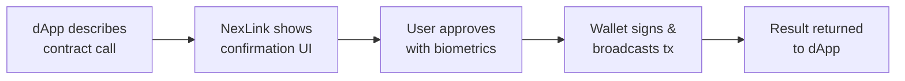
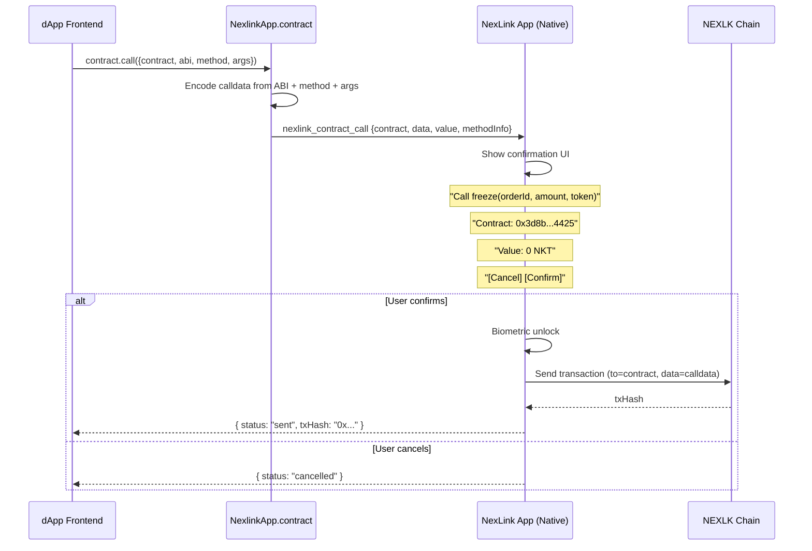
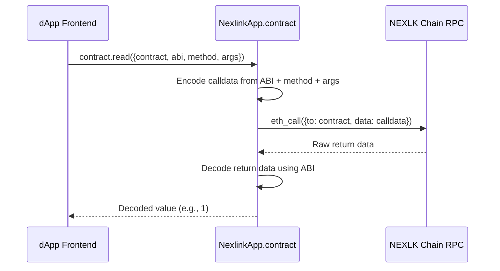
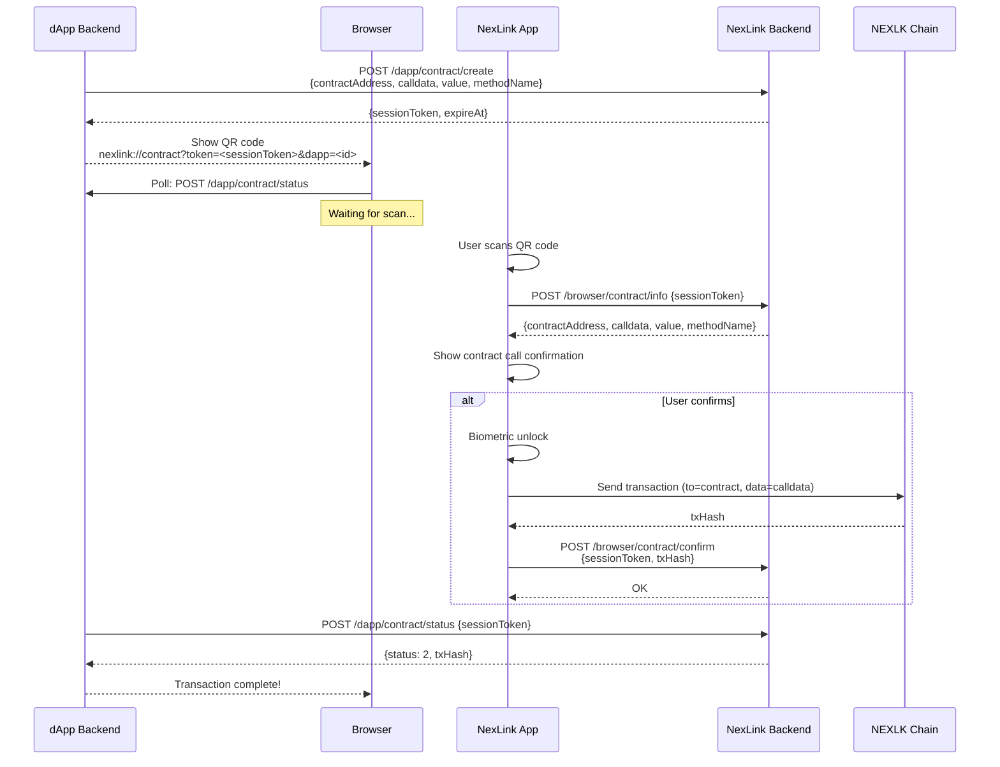
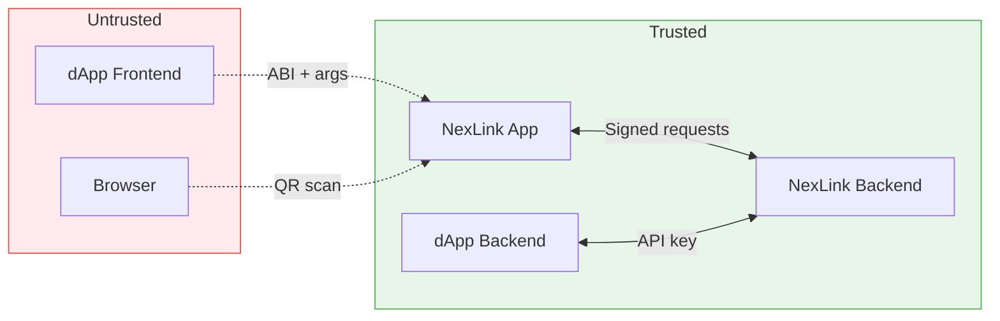

# NexLink dApp 合约交互（Contract Interaction）

本文档介绍 dApp 如何通过 NexLink 钱包与其自有的智能合约进行交互。内容涵盖具备 ABI 感知能力的 SDK 调用、标准 Web3 库的使用方式，以及外部浏览器（二维码）流程。

有关接口规范，请参阅 [API 参考](API.md#contract-api)。有关身份认证，请参阅 [登录与注册](AUTH.md)。有关代币支付，请参阅 [支付集成](PAYMENT.md)。

---

## 1. Overview

### Three Layers of Contract Interaction

dApp 开发者将其自有的智能合约（担保、市场、代币冻结等）部署到 NEXLK 链上。这些合约通过 NexLink 钱包进行调用，钱包负责处理交易签名、用户确认和广播。

NexLink 为合约交互提供了三个层级。请选择适合你使用场景的层级：

| 层级 | 接口 | dApp 是否编码 calldata？ | 确认界面 | 使用场景 |
|---|---|---|---|---|
| **Layer 1** | `window.ethereum` (EIP-1193) | 是（通过 ethers.js / viem / web3.js） | 字节数 | 标准 Web3 — 适用于任何钱包 |
| **Layer 2** | `NexlinkApp.wallet.sendTransaction()` | 是（手动） | 字节数 | 直接桥接调用 — 绕过 `window.ethereum` 封装 |
| **Layer 3** | `NexlinkApp.contract.call()` | 否（SDK 编码） | 解码后的函数名 + 参数 | ABI 感知 — 由 NexLink 处理编码 |

**选择 Layer 1** 当你希望在多个钱包（MetaMask、WalletConnect、NexLink）之间具备可移植性时。使用标准的 ethers.js 或 viem — 无需任何 NexLink 专用代码。

**选择 Layer 2** 当你需要在没有 Web3 库的情况下直接访问桥接时。与 Layer 1 相同，但绕过了 `window.ethereum` 封装。

**选择 Layer 3** 当你希望由 NexLink 处理 ABI 编码，并在确认界面中展示解码后的函数调用时（例如显示"调用 `freeze(orderId, 100 USDK)`"而非"合约调用（128 字节）"）。

### How It Works (General Principle)



dApp 描述*要调用哪个*合约函数，NexLink 应用通过其原生 UI 处理授权，结果再回传给 dApp。

---

## 2. Layer 1: Standard Web3 Libraries (EIP-1193)

NexLink 注入了一个完全兼容 [EIP-1193](https://eips.ethereum.org/EIPS/eip-1193) 的 `window.ethereum` provider（提供者）。任何标准 Web3 库均可正常使用，无需任何 NexLink 专用代码。

### ethers.js

```javascript
import { ethers } from 'ethers';

const provider = new ethers.BrowserProvider(window.ethereum);
const signer = await provider.getSigner();

const ESCROW_ABI = [
  "function freeze(bytes32 orderId, uint256 amount, address token)",
  "function release(bytes32 orderId, address recipient)",
  "function getOrderStatus(bytes32 orderId) view returns (uint8)",
  "function getBalance(address account, address token) view returns (uint256)"
];

const escrow = new ethers.Contract(ESCROW_ADDRESS, ESCROW_ABI, signer);

// Write call — NexLink shows confirmation UI
const tx = await escrow.freeze(orderId, 10000000, USDK_ADDRESS);
console.log("txHash:", tx.hash);
await tx.wait(); // Wait for on-chain confirmation

// Read call — no signing needed
const status = await escrow.getOrderStatus(orderId);
const balance = await escrow.getBalance(userAddress, USDK_ADDRESS);
```

### viem

```javascript
import { createWalletClient, createPublicClient, custom } from 'viem';

const walletClient = createWalletClient({
  transport: custom(window.ethereum)
});

const publicClient = createPublicClient({
  transport: custom(window.ethereum)
});

// Write call
const txHash = await walletClient.writeContract({
  address: ESCROW_ADDRESS,
  abi: escrowABI,
  functionName: 'freeze',
  args: [orderId, 10000000n, USDK_ADDRESS]
});

// Read call
const status = await publicClient.readContract({
  address: ESCROW_ADDRESS,
  abi: escrowABI,
  functionName: 'getOrderStatus',
  args: [orderId]
});
```

### Provider Discovery (EIP-6963)

NexLink 还支持用于多钱包环境的 [EIP-6963](https://eips.ethereum.org/EIPS/eip-6963)。支持 EIP-6963 的库会自动在其他钱包旁发现 NexLink。

```javascript
window.addEventListener('eip6963:announceProvider', (event) => {
  const { info, provider } = event.detail;
  // info.name === "NexLink Wallet"
  // info.rdns === "app.nexlink.wallet"
  // provider is the EIP-1193 provider
});

window.dispatchEvent(new Event('eip6963:requestProvider'));
```

### When to Use Layer 1

- 你的 dApp 必须适配多个钱包（MetaMask、WalletConnect、NexLink）
- 你已经在使用 ethers.js、viem 或 web3.js
- 你希望前端中不含任何 NexLink 专用代码
- 标准的字节数确认界面可以接受

---

## 3. Layer 3: NexlinkApp.contract SDK

具备 ABI 感知能力的 SDK 负责处理 calldata（调用数据）编码，并提供解码后的确认界面。可在 NexLink dApp 浏览器内通过 `window.NexlinkApp.contract` 使用。

### Detection

```javascript
if (window.NexlinkApp && NexlinkApp.contract) {
  // In-app: contract SDK available
} else if (window.ethereum) {
  // EIP-1193 available (Layer 1 fallback)
} else {
  // External browser: use QR contract flow
}
```

### contract.call() — Write Transactions

向智能合约发送一笔改变状态的交易。展示一个原生确认界面，其中包含解码后的函数名和参数。返回一个 [ContractCallResult](API.md#contractcallresult)。

```javascript
try {
  const result = await NexlinkApp.contract.call({
    contract: "0x3d8b4425...",         // Contract address
    abi: ESCROW_ABI,                    // ABI array
    method: "freeze",                   // Function name
    args: [orderId, 10000000, USDK],    // Arguments
    value: "0"                          // Native token (wei), optional
  });
  console.log("Transaction sent:", result.txHash);
} catch (e) {
  if (e.message === "user_rejected") {
    console.log("User cancelled");
  } else {
    console.error("Contract call failed:", e.message);
  }
}
```

#### Flow



#### Parameters

| 参数 | 类型 | 是否必需 | 说明 |
|---|---|---|---|
| `contract` | String | 是 | 合约地址（十六进制，校验和格式） |
| `abi` | Array | 是 | ABI 数组（标准 Solidity ABI JSON 格式） |
| `method` | String | 是 | 函数名（例如 `"freeze"`） |
| `args` | Array | 是 | 按顺序排列的函数参数 |
| `value` | String | 否 | 以 wei 计的原生代币金额（默认 `"0"`） |

#### Return Value (on success)

| 字段 | 类型 | 说明 |
|---|---|---|
| `status` | String | 始终为 `"sent"`（Promise 仅在成功时 resolve） |
| `txHash` | String | 链上交易哈希 |

> **多签钱包：** Promise **不会**返回 `txHash`，而是**被 reject**，携带一条“已发送给联签人”的消息，因为交易正等待联签人审批。参见[多签钱包：联签人审批](#多签钱包联签人审批)——请按“待处理”处理，而非失败。

#### Error Handling

在取消或失败时，Promise 会以错误 **reject**。请使用 `try/catch`：

```javascript
try {
  const result = await NexlinkApp.contract.call({
    contract: ESCROW_ADDRESS,
    abi: ESCROW_ABI,
    method: "freeze",
    args: [orderId, amount, USDK_ADDRESS]
  });
  console.log("Transaction sent:", result.txHash);
} catch (e) {
  if (e.message === "user_rejected") {
    // User cancelled — do nothing
  } else {
    showError(e.message);
  }
}
```

| 错误信息 | 原因 | dApp 应采取的操作 |
|---|---|---|
| `user_rejected` | 用户点击取消或拒绝生物识别 | 显示"交易已取消" |
| `contract, abi, method, and args are required` | 缺少参数 | 修正参数 |
| ABI encoding errors | 参数与 ABI 类型不匹配 | 修正参数类型 |

---

### contract.read() — View/Pure Calls

调用智能合约上的 `view` 或 `pure` 函数。无需签名，无确认界面，无 gas 消耗。返回解码后的返回值。

```javascript
const status = await NexlinkApp.contract.read({
  contract: "0x3d8b4425...",
  abi: ESCROW_ABI,
  method: "getOrderStatus",
  args: [orderId]
});

console.log("Order status:", status);  // e.g., 1
```

#### Flow



#### Parameters

| 参数 | 类型 | 是否必需 | 说明 |
|---|---|---|---|
| `contract` | String | 是 | 合约地址（十六进制，校验和格式） |
| `abi` | Array | 是 | ABI 数组 |
| `method` | String | 是 | 函数名（必须为 `view` 或 `pure`） |
| `args` | Array | 是 | 按顺序排列的函数参数 |

#### Return Value

根据 ABI 输出规范返回解码后的值。对于单个返回值，直接返回该值；对于多个返回值，返回一个数组。

```javascript
// Single return value: uint256
const balance = await NexlinkApp.contract.read({
  contract: escrowAddr,
  abi: ESCROW_ABI,
  method: "getBalance",
  args: [userAddr, tokenAddr]
});
// balance === 10000000

// Multiple return values
const [amount, token, status] = await NexlinkApp.contract.read({
  contract: escrowAddr,
  abi: ESCROW_ABI,
  method: "getOrderDetails",
  args: [orderId]
});
```

---

### contract.encode() — Calldata Helper

在不发送交易的情况下对 ABI calldata（调用数据）进行编码。当你需要自行构建 calldata 以用于 `NexlinkApp.wallet.sendTransaction()`，或用于日志记录/调试时，此方法很有用。

```javascript
const calldata = NexlinkApp.contract.encode({
  abi: ESCROW_ABI,
  method: "freeze",
  args: [orderId, 10000000, USDK_ADDRESS]
});

console.log(calldata);
// "0x57e871e7000000000000000000000000..."
```

#### Parameters

| 参数 | 类型 | 是否必需 | 说明 |
|---|---|---|---|
| `abi` | Array | 是 | ABI 数组 |
| `method` | String | 是 | 函数名 |
| `args` | Array | 是 | 按顺序排列的函数参数 |

#### Return Value

返回十六进制编码的 calldata 字符串（以 `0x` 为前缀）。

---

### ABI Format

该 SDK 接受标准的 Solidity ABI JSON 格式，即 ethers.js、viem 和 web3.js 所使用的相同格式。

**完整 JSON 格式：**

```json
[
  {
    "type": "function",
    "name": "freeze",
    "inputs": [
      { "name": "orderId", "type": "bytes32" },
      { "name": "amount", "type": "uint256" },
      { "name": "token", "type": "address" }
    ],
    "outputs": [],
    "stateMutability": "nonpayable"
  },
  {
    "type": "function",
    "name": "getBalance",
    "inputs": [
      { "name": "account", "type": "address" }
    ],
    "outputs": [
      { "name": "", "type": "uint256" }
    ],
    "stateMutability": "view"
  }
]
```

**人类可读格式**（ethers.js 风格，同样被接受）：

```javascript
const ESCROW_ABI = [
  "function freeze(bytes32 orderId, uint256 amount, address token)",
  "function release(bytes32 orderId, address recipient)",
  "function dispute(bytes32 orderId)",
  "function getOrderStatus(bytes32 orderId) view returns (uint8)",
  "function getBalance(address account, address token) view returns (uint256)"
];
```

### Supported Types

| Solidity 类型 | 示例值 | 备注 |
|---|---|---|
| `uint256` | `10000000` or `"10000000"` | 整数或数字字符串 |
| `int256` | `-1` or `"-1"` | 有符号整数 |
| `address` | `"0xaC2D...c526"` | 十六进制字符串，校验和格式 |
| `bytes32` | `"0x5468..."` | 十六进制字符串，32 字节 |
| `bytes` | `"0x1234..."` | 动态长度十六进制字符串 |
| `string` | `"hello"` | UTF-8 字符串 |
| `bool` | `true` / `false` | 布尔值 |
| `uint256[]` | `[1, 2, 3]` | uint256 数组 |
| `tuple` | `{ field1: val1, field2: val2 }` | 结构体 |

---

## 4. Browser Contract Interaction (QR Code)

适用于在外部浏览器中访问 dApp 的用户。dApp 展示一个二维码；用户使用 NexLink 应用扫描它以签名并提交合约调用。

### Flow



### Step by Step

1. **dApp 后端创建会话** — 调用 `POST /dapp/contract/create`，携带 `contractAddress`、`calldata`、`value`，以及可选的 `methodName`。收到一个 `sessionToken`（UUID）和 `expireAt` 时间戳。

2. **展示二维码** — 将深度链接编码为二维码：
   ```
   nexlink://contract?token=<sessionToken>&dapp=<dappId>
   ```

3. **浏览器轮询** — dApp 前端轮询其自有后端，后端调用 `POST /dapp/contract/status`，携带 `sessionToken`。

4. **用户扫描二维码** — NexLink 应用解析深度链接，从 `POST /browser/contract/info` 获取合约调用详情，并展示确认界面。

5. **用户确认** — 生物识别解锁 → 交易签名 → 广播 → 通过 `POST /browser/contract/confirm` 上报 `txHash`。

6. **dApp 接收结果** — 状态查询返回 `status: 2`（已确认）以及 `txHash`。

### Deep Link Format

```
nexlink://contract?token=<sessionToken>&dapp=<dappId>
```

| 参数 | 是否必需 | 说明 |
|---|---|---|
| `token` | 是 | 一次性合约会话 UUID |
| `dapp` | 是 | dApp 数字 ID |

> **安全性：** 二维码中不包含任何合约地址、calldata 或 value。所有详情均在扫描后从 NexLink 后端获取。

### QR Code Expiry & Refresh

当合约会话过期时，创建一个新会话（`POST /dapp/contract/create`）并生成新的二维码。

```javascript
// Browser-side polling pseudocode
async function pollContractStatus(sessionToken) {
  while (true) {
    const res = await fetch(`/api/contract/status`, {
      method: 'POST',
      body: JSON.stringify({ sessionToken }),
    });
    const data = await res.json();

    if (data.data.status === 2) {  // confirmed
      showSuccess(data.data.txHash);
      return;
    }
    if (data.data.status === 4) {  // expired
      showExpiredUI();    // "QR expired — click to refresh"
      return;
    }
    // status === 1 (pending) → wait and poll again
    await new Promise(r => setTimeout(r, 3000));
  }
}
```

---

## 5. Confirmation UI

### What the User Sees

当 dApp 请求一次合约调用时，NexLink 应用会展示一个原生确认弹窗：

**Layer 3（ABI 感知）— 解码后：**

```
┌─────────────────────────────────┐
│        Contract Call            │
│                                 │
│  Function: freeze               │
│                                 │
│  orderId:  0x5468...a1b2        │
│  amount:   10000000             │
│  token:    0xaC2D...c526        │
│                                 │
│  Contract: 0x3d8b...4425        │
│  Value:    0 NKT                │
│  Gas:      ~45,000              │
│                                 │
│  dApp:     Danbao               │
│                                 │
│   [Cancel]        [Confirm]     │
└─────────────────────────────────┘
```

**Layer 1 / Layer 2 — 原始数据：**

```
┌─────────────────────────────────┐
│        Contract Call            │
│                                 │
│  To:       0x3d8b...4425        │
│  Data:     128 bytes            │
│  Value:    0 NKT                │
│  Gas:      ~45,000              │
│                                 │
│  dApp:     Danbao               │
│                                 │
│   [Cancel]        [Confirm]     │
└─────────────────────────────────┘
```

Layer 3 通过展示解码后的函数名和参数（而非原始字节数）提供了更好的用户体验。

---

## 6. Common Patterns

### ERC-20 Approve + Contract Call

许多合约在能够代表用户转移代币之前，都要求先执行一次 ERC-20 `approve()`。这是一个两步交易：

```javascript
const USDK_ADDRESS = "0xaC2D085205D0A42121E48a9C20E7aE1a7102c526";
const ESCROW_ADDRESS = "0x3d8b4425...";

const ERC20_ABI = [
  "function approve(address spender, uint256 amount) returns (bool)",
  "function allowance(address owner, address spender) view returns (uint256)"
];

const ESCROW_ABI = [
  "function freeze(bytes32 orderId, uint256 amount, address token)"
];

// Step 1: Check existing allowance
const allowance = await NexlinkApp.contract.read({
  contract: USDK_ADDRESS,
  abi: ERC20_ABI,
  method: "allowance",
  args: [userAddress, ESCROW_ADDRESS]
});

// Step 2: Approve if needed (user sees confirmation #1)
if (allowance < amount) {
  try {
    await NexlinkApp.contract.call({
      contract: USDK_ADDRESS,
      abi: ERC20_ABI,
      method: "approve",
      args: [ESCROW_ADDRESS, amount]
    });
  } catch (e) {
    console.log("Approve cancelled or failed:", e.message);
    return;
  }

  // Wait for approval to be mined before proceeding
  // (use Layer 1 provider or poll for receipt)
}

// Step 3: Call escrow contract (user sees confirmation #2)
const result = await NexlinkApp.contract.call({
  contract: ESCROW_ADDRESS,
  abi: ESCROW_ABI,
  method: "freeze",
  args: [orderId, amount, USDK_ADDRESS]
});
```

> **注意：** 每一步都需要用户单独确认。dApp 无法将授权和调用合并为单笔交易。

### Escrow: Freeze and Release

```javascript
const ESCROW_ABI = [
  "function freeze(bytes32 orderId, uint256 amount, address token)",
  "function release(bytes32 orderId, address recipient)",
  "function dispute(bytes32 orderId)",
  "function getOrderStatus(bytes32 orderId) view returns (uint8)"
];

// Buyer freezes tokens
const freezeResult = await NexlinkApp.contract.call({
  contract: ESCROW_ADDRESS,
  abi: ESCROW_ABI,
  method: "freeze",
  args: [orderId, 10000000, USDK_ADDRESS]
});

// Seller releases tokens (after confirming receipt)
const releaseResult = await NexlinkApp.contract.call({
  contract: ESCROW_ADDRESS,
  abi: ESCROW_ABI,
  method: "release",
  args: [orderId, buyerAddress]
});

// Check order status (no signing needed)
const status = await NexlinkApp.contract.read({
  contract: ESCROW_ADDRESS,
  abi: ESCROW_ABI,
  method: "getOrderStatus",
  args: [orderId]
});
// status: 0 = none, 1 = frozen, 2 = released, 3 = disputed
```

### Layer 1 Fallback Pattern

对于希望在可用时使用 Layer 3、否则回退到标准 ethers.js 的 dApp：

```javascript
import { ethers } from 'ethers';

async function callContract(contractAddr, abi, method, args) {
  // Prefer Layer 3 (decoded confirmation UI)
  if (window.NexlinkApp && NexlinkApp.contract) {
    return await NexlinkApp.contract.call({
      contract: contractAddr,
      abi: abi,
      method: method,
      args: args
    });
  }

  // Fallback to Layer 1 (standard ethers.js)
  if (window.ethereum) {
    const provider = new ethers.BrowserProvider(window.ethereum);
    const signer = await provider.getSigner();
    const contract = new ethers.Contract(contractAddr, abi, signer);
    const tx = await contract[method](...args);
    return { status: "sent", txHash: tx.hash };
  }

  throw new Error("No wallet available");
}
```

### 多签钱包：联签人审批

连接的钱包可能是**多签（M-of-N）钱包**。此时写交易**不会立即执行**——NexLink 会将其作为提案发送给该钱包的联签人，只有在足够多的联签人批准后，交易才会上链。

这会改变写调用的返回：

* **单签钱包**——`contract.call()` / `NexlinkApp.wallet.sendTransaction()` / `eth_sendTransaction` 照常 resolve 出 `txHash`。
* **多签钱包**——调用会**被 reject**（Promise 抛出），并携带一条“已发送给联签人”的消息，例如：
  > “这是多签钱包，交易已发送给联签人审批，待足够联签人签名后自动执行。”

  在 EIP-1193（Layer 1）下，这会表现为一个 JSON-RPC 错误，错误码 `-32603`，并携带该消息。

**这个 reject 不是失败。** 请将其视为“等待联签人审批”：交易会在达到签名阈值后异步执行——如果联签人拒绝，则不会执行。

#### 如何处理

**不要**依赖立即返回来判断成功。请以链上状态为准进行核对：

```javascript
try {
  const result = await NexlinkApp.contract.call({ contract, abi, method, args });
  onSubmitted(result.txHash);           // 单签：已执行
} catch (e) {
  if (e.message === "user_rejected") return;      // 用户取消
  if (isMultisigPending(e)) {
    onPendingCoSignerApproval();         // “等待联签人审批…”
    return;                             // 不是错误
  }
  showError(e.message);
}

// 通过事件 / 轮询检测最终上链——绝不要依赖调用返回，
// 因为多签场景下它永远不会 resolve 出交易哈希：
escrow.on("Frozen", (orderId) => onOrderFrozen(orderId));
// 或轮询 getOrderStatus(orderId) 直到状态改变。

function isMultisigPending(e) {
  return typeof e?.message === "string" && e.message.includes("多签");
}
```

对于**担保 / 支付**类 dApp 这一点至关重要：当多签用户“锁仓”“卖出”或 `approve` 时，被 reject 的调用**并未**转移任何资金——只有在联签人批准后转账才会执行。请以链上事件驱动你的订单状态，而不是以 SDK 调用是否 resolve 为准。

#### 消费策略（代币上限）

多签钱包还可能带有链上**分级消费策略**。超过单代币上限的 `approve` / `transfer` / `increaseAllowance` 金额会走延迟、需守护人审批的队列，而不会立即执行。因此即便是本可单签的步骤也可能被延后。同样地：在把某一步视为完成前，请从链上确认授权额度 / 余额——不要因为 `approve` 调用返回就假定它已生效。

---

## 7. Security Model

### Trust Boundaries



### Key Security Properties

| 属性 | 机制 |
|---|---|
| **用户同意** | 每次写入调用都需要带有生物识别解锁的原生确认界面。dApp 无法自动发送。 |
| **无盲签** | Layer 3 展示解码后的函数名和参数。Layer 1/2 展示合约地址和字节数。 |
| **合约地址可见** | 确认界面始终显示目标合约地址。用户可以核验。 |
| **金额展示** | 始终显示原生代币金额（NKT）。用户可以看到是否有 ETH/NKT 被发送。 |
| **二维码安全** | 二维码仅包含 `sessionToken` + `dappId`。不含任何合约地址、calldata 或 value。 |
| **读取调用免费** | `contract.read()` 从不提示用户。View/pure 调用无需签名。 |
| **ABI 完整性** | Layer 3：ABI 由 dApp 前端提供。用户信任 dApp 会提供正确的 ABI。Layer 1：ABI 由 Web3 库处理。 |

### Layer Comparison

| 关注点 | Layer 1 (EIP-1193) | Layer 3 (NexlinkApp.contract) | Browser QR |
|---|---|---|---|
| 由谁编码 calldata？ | Web3 库（ethers/viem） | NexLink SDK | dApp 后端 |
| 确认详情 | 字节数 | 解码后的函数 + 参数 | 取决于后端信息 |
| 钱包可移植性 | 适用于任何钱包 | 仅限 NexLink | 仅限 NexLink |
| 读取调用 | 通过 Web3 库 | `contract.read()` | 不适用 |
| 浏览器支持 | 仅限应用内 | 仅限应用内 | 外部浏览器 |

---

## 8. Implementation Checklist

### NexLink Backend (Go)

- [x] `ContractSession` 模型 — `sessionToken`、`contractAddress`、`calldata`、`value`、`methodName`、`expireAt`、`status`
- [x] `ContractSessionService` — 业务逻辑（create、info、confirm、status）
- [x] `POST /dapp/contract/create` — 为二维码流程创建合约调用会话（MD5 认证）
- [x] `POST /browser/contract/info` — 为已扫描的二维码返回合约调用详情（JWT 认证）
- [x] `POST /browser/contract/confirm` — 用户确认二维码合约调用（JWT 认证）
- [x] `POST /dapp/contract/status` — 查询合约调用会话状态（MD5 认证）

### NexLink App (Dart)

- [x] `ContractModule` 桥接模块（`contract_module.dart`）
- [x] 桥接处理器：`nexlink_contract_call`（写入调用）
- [x] 桥接处理器：`nexlink_contract_read`（读取调用）
- [x] 桥接处理器：`nexlink_contract_encode`（calldata 编码）
- [x] `AbiCodec` — ABI 编码器/解码器（位于 `nexlink_wallet` 中的 `abi_codec.dart`）
- [x] `BridgeRpcHelper` — 用于 `eth_call` 的共享 JSON-RPC 辅助工具
- [x] 解码后的合约调用确认界面
- [x] 深度链接处理器：`nexlink://contract?token=<sessionToken>`

### JS SDK

- [x] `_coreSdk` 中的 `NexlinkApp.contract.call()`
- [x] `_coreSdk` 中的 `NexlinkApp.contract.read()`
- [x] `_coreSdk` 中的 `NexlinkApp.contract.encode()`
- [x] Stub SDK 合约命名空间（用于加载前排队）

### Documentation

- [x] CONTRACT.md — 本文档
- [x] API.md — 添加合约类型和接口
- [x] SUMMARY.md — 添加合约交互链接
