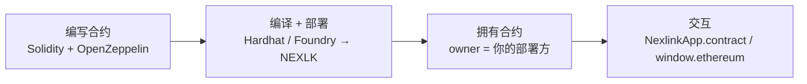

# NexLink 合约部署（Contract Deployment）

> **状态：现已支持。** 向 NEXLK 链部署你自己的合约，使用任意标准 EVM 工具链即可——无需任何 NexLink 专用工具。本文档是开发者工作流的**部署**环节；部署完成后，你通过[合约交互](CONTRACT.md)驱动合约。（开发者门户的**一键同质化代币发行器**是另一条受管理的路径——本文档是自定义代币、NFT、担保、市场等的**自助部署**路线。）

你编写 Solidity 合约，用 Hardhat 或 Foundry 将其部署到 NEXLK（链 `2026777`），随后从 NexLink 钱包调用它。本页涵盖通用配置、一个**代币**示例与一个 **NFT** 示例。



---

## 1. NEXLK 网络配置

| 属性 | 值 |
|---|---|
| 链 ID | `2026777` |
| RPC 地址 | 你的 NEXLK RPC（设置 `NEXLINK_RPC_URL`） |
| 类型 | 兼容 EVM（EVM ≥ Shanghai；Solidity `^0.8.20`） |

**Hardhat**（`hardhat.config.js`）：

```javascript
module.exports = {
  solidity: "0.8.20",
  networks: {
    nexlk: {
      url: process.env.NEXLINK_RPC_URL,     // NEXLK RPC
      chainId: 2026777,
      accounts: [process.env.DEPLOYER_PRIVATE_KEY],
    },
  },
};
```

**Foundry**（`foundry.toml` + `--rpc-url $NEXLINK_RPC_URL --chain 2026777`）用法相同——任选其一。

> **部署私钥务必放在服务端。** 你用来部署的账户会成为合约 **owner**（有权 `mint`、设置配置等的钱包）。切勿将其放入前端代码。

---

## 2. 环境准备

```bash
npm i -D hardhat
npm i @openzeppelin/contracts        # 经审计的 ERC-20 / ERC-721 基础合约
npx hardhat init                     # 或：forge init
```

在环境变量中设置 `NEXLINK_RPC_URL` 与 `DEPLOYER_PRIVATE_KEY`（例如工具链读取的 `.env`——切勿提交到仓库）。

---

## 3. 部署代币（ERC-20）

一个可直接复制、基于审计合约的最小 ERC-20：

```solidity
// SPDX-License-Identifier: MIT
pragma solidity ^0.8.20;

import "@openzeppelin/contracts/token/ERC20/ERC20.sol";
import "@openzeppelin/contracts/access/Ownable.sol";

contract MyToken is ERC20, Ownable {
    constructor(address initialOwner)
        ERC20("My Token", "MYT")
        Ownable(initialOwner)
    {
        _mint(initialOwner, 1_000_000 * 10 ** decimals());  // 初始发行量
    }

    function mint(address to, uint256 amount) external onlyOwner {
        _mint(to, amount);   // 仅 owner 可增发
    }
}
```

部署脚本（`scripts/deploy-token.js`）：

```javascript
const [deployer] = await ethers.getSigners();
const Token = await ethers.getContractFactory("MyToken");
const token = await Token.deploy(deployer.address);   // initialOwner = 发行方
await token.waitForDeployment();
console.log("Token:", await token.getAddress());
```

```bash
npx hardhat run scripts/deploy-token.js --network nexlk
```

> 这样**自助部署**的代币与开发者门户的同质化代币发行器（由平台跟踪/审核）不同。需要受管理的发行时用门户发行器；需要完全自控的自定义合约时用自助部署。

---

## 4. 部署 NFT（ERC-721 / 灵魂绑定）

NFT 合约（普通 `NexTestNft.sol` 与灵魂绑定变体 `SoulboundNft.sol`）及合约 owner 模型见 [NFT 发行 §2–§4](NFT.md)。部署方式与上面的代币完全相同：

```javascript
// scripts/deploy-nft.js
const [deployer] = await ethers.getSigners();
const Nft = await ethers.getContractFactory("NexTestNft");  // 或 SoulboundNft
const nft = await Nft.deploy(deployer.address);             // initialOwner = 发行方
await nft.waitForDeployment();
console.log("Collection:", await nft.getAddress());
```

```bash
npx hardhat run scripts/deploy-nft.js --network nexlk
```

对于**荣誉** SBT（绑定到身份、汇总到主身份），发行方还须持有基金会的**根证书**——见 [荣誉与声誉 §4](HONOR.md)。图片/元数据存储（MinIO + IPFS）见 [NFT 发行 §6](NFT.md#6-metadata)。

---

## 5. 与你部署的合约交互

部署后，一切读/写都通过标准的[合约交互](CONTRACT.md)层进行——NexLink 侧无需任何重新部署：

| 从哪里 | 如何 |
|---|---|
| **应用内（WebView）** | [`NexlinkApp.contract.call()` / `.read()`](CONTRACT.md#3-layer-3-nexlinkappcontract-sdk) 或 `window.ethereum`（EIP-1193） |
| **外部浏览器** | [二维码合约流程](CONTRACT.md#4-browser-contract-interaction-qr-code) |
| **你的后端** | 部署方/owner 钱包经 ethers/viem；读取经 RPC `eth_call` |

每一次由用户触发的写操作在签名前都会显示原生确认 + 生物识别——你无法绕过用户授权。

---

## 6. 安全模型

| 属性 | 机制 |
|---|---|
| **owner 私钥托管** | 部署方即合约 owner；该私钥务必放在服务端。自动化流程可考虑将 owner 与 mint 签名者分离。 |
| **仅 owner 可变更** | 对 `mint` / 配置加 `onlyOwner`；公开入口需自行加保护（白名单、上限、付费）。 |
| **应用内调用的用户授权** | SDK 调用会显示解码后的[确认界面](CONTRACT.md#5-confirmation-ui) + 生物识别。 |
| **链上最终性** | 部署与每次调用都产生可在链 `2026777` 上验证的 `txHash`。 |

---

## 7. 待建设内容

### 现已可用
- [x] 用任意 EVM 工具链向 NEXLK 部署 ERC-20 / ERC-721（普通 + 灵魂绑定）
- [x] 经 [`NexlinkApp.contract`](CONTRACT.md) / `window.ethereum` / 二维码流程交互

### 提案
- [ ] 开发者门户一键 NFT 发行 UX（对标同质化代币发行器）
- [ ] 发布可复用的经审计合约模板（代币、NFT 普通/灵魂绑定/可枚举）
- [ ] NEXLK 区块浏览器上的链上源码验证

### 文档
- [x] DEPLOY.md —— 本文档
- [x] [合约交互](CONTRACT.md) · [NFT 发行](NFT.md) · [荣誉与声誉](HONOR.md)

**另见：** [合约交互](CONTRACT.md)（驱动你部署的合约）· [NFT 发行](NFT.md)（合约源码 + 元数据）· [荣誉与声誉](HONOR.md)（根认证的荣誉发行）。
