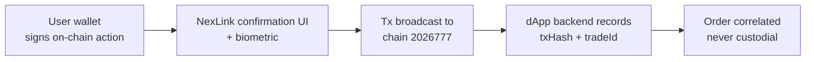

# NexLink dApp 担保支付（Escrow / Guaranteed Payment）

> **状态：已上线（合约已部署于链 `2026777`）。** C2C 与 Guarantee 担保合约已部署，并由 **K币担保 (Danbao)** dApp 使用。本文档描述权威的链上模型。它取代了 [CONTRACT.md 第 6 节](CONTRACT.md#6-common-patterns) 中过时的 `freeze/release` 示例——两者区别参见 [第 9 节](#9-legacy-single-escrow-abi)。

担保支付（担保支付）让互不信任的双方完成交易：资金被**锁定在合约中**，仅在交易完成时才释放——若未完成，则退款或由陪审团仲裁。这是 **K币担保 (Danbao)**（NexLink 的担保交易 dApp）背后的结算层。

> **在不去匿名化的情况下信任匿名交易对手。** 担保平台可用**零知识证明**为参与设门槛——用户的主身份为其匿名身份证明所需属性（有信用 / 无不良记录 / KYC），不泄露其他任何信息。这是[身份系统 第 4 节](IDENTITY.md) + [荣誉与声誉](HONOR.md)的旗舰场景。

对于简单的无条件支付，请使用 [直接转账 / 订单支付](PAYMENT.md)。当付款方在货物/服务交付前需要保护时，请使用担保支付。

关于底层合约调用机制，参见 [合约交互](CONTRACT.md)。关于 API/类型规范，参见 [API 参考](API.md#escrow-api)。

---

## 1. Overview

### The money model (why it is safe)

NexLink 担保支付遵循一条规则：**用户自己的钱包对每一个改变状态的操作签名。** dApp 后端从不持有密钥，也从不转移资金——它只*记录*生成的交易哈希和链上交易 ID，以便与自己的订单进行关联。这与 [订单支付](PAYMENT.md#7-security-model) 采用的是同一套非托管原则。



| 属性 | 详情 |
|---|---|
| **谁签名** | 用户的 NexLink 钱包——通过 [`NexlinkApp.contract.call()`](CONTRACT.md#3-layer-3-nexlinkappcontract-sdk) 或 [`window.ethereum`](CONTRACT.md#2-layer-1-standard-web3-libraries-eip-1193) |
| **谁托管资金** | 链上的担保合约。**绝不**是 dApp 后端。 |
| **后端职责** | 关联：将 `txHash` + `tradeId` 与订单一起存储；驱动链下 UX（订单状态、自动释放工作进程、通知）。 |
| **争议解决** | 链上 Kleros 风格的 [陪审团仲裁](#6-dispute-resolution-jury)，并附带管理员/平台申诉。 |

### Two escrow contracts

| 合约 | 用途 | 谁锁定资金 | 释放给谁 |
|---|---|---|---|
| **C2C** | 点对点交易、市场订单、悬赏 | 发送方（卖币场景为卖方；交易/悬赏场景为买方/出资方） | 接收方，在 `pay()` 时 |
| **Guarantee** | 商户缴纳可退还的保证金，以担保对受益人的承诺 | 商户（发送方） | 由商户取回，或在让步/仲裁裁定的索赔中支付给受益人 |

两者都是 [Kleros](https://kleros.io/) `MultipleArbitrableTokenTransaction` 风格的合约：每笔担保都是一个整数 `transactionID`（也称 `tradeId`），资金为 ERC-20 金额，争议会升级至链上陪审团。

---

## 2. Contracts & Token Registry

**链：** NEXLK，链 ID `2026777`（兼容 EVM）。所有担保金额均以 ERC-20 代币单位计。

### Deployed addresses (current testnet — override per environment)

| 合约 | 地址 | 备注 |
|---|---|---|
| **C2C** | `0x7781D90613061513aF33F99E9161473D76515AD0` | 于 2026-06-23 重新部署——新增 `owner` + 管理员裁决，用于管理员二维码争议结算 |
| **Guarantee** | `0x0675Fe67E77F598868F6134eE1Cb9C47337F1e09` | |
| **JuryArbitrator** | `0x86e43067a077Dea4806C57bfc29de9299122f622` | 两个担保合约共用的仲裁者 |

> 生产环境部署通过环境配置覆盖这些地址。切勿在已上线的 dApp 中硬编码地址而不提供配置覆盖路径。

### Settlement tokens

| 代币 | 地址 | 小数位 |
|---|---|---|
| **USDK** | `0xaC2D085205D0A42121E48a9C20E7aE1a7102c526` | 5 |
| **CNYT** | `0x1e0df1f0813E6521819af9cAC158787f6f94471F` | 5 |

两种代币均使用 **5 位小数**（非标准）。将人类可读金额乘以 10⁵ 转换为基本单位——例如 `100.00 USDK` → `10000000`。切勿使用浮点数；直接对小数字符串进行缩放。

```javascript
// Scale a human amount string into integer base units (no float)
function toUnits(amount, decimals) {
  const [whole, frac = ""] = String(amount).split(".");
  const fracPadded = (frac + "0".repeat(decimals)).slice(0, decimals);
  return BigInt(`${whole}${fracPadded}`.replace(/^0+(?=\d)/, "") || "0");
}
toUnits("100.00", 5); // 10000000n
```

---

## 3. Roles by Order Kind

**发送方**是锁定资金的一方；**接收方**是资金释放给的一方。哪一方现实角色扮演哪个角色取决于交易本身：

| 订单类型 | 发送方（锁定资金） | 接收方（释放时收款） | 合约 | 开启方法 |
|---|---|---|---|---|
| **C2C — 卖币** | 卖方（在买方支付法币前锁定加密货币） | 买方 | C2C | `createTrade` |
| **交易 / 担保购买** | 买方 / 出资方（锁定付款） | 卖方 / 解决者 | C2C | `createTransaction` |
| **悬赏** | 出资方（锁定奖励） | 解决者 | C2C | `createTransaction` |
| **Guarantee** | 商户（锁定保证金） | 受益人 | Guarantee | `openGuarantee` |

---

## 4. C2C Escrow

C2C 合约是 Kleros `MultipleArbitrableTokenTransaction` 核心，再加上一层先锁定后收法币的 `createTrade` / `reclaimTrade` 封装。

### 4.1 ABI

```javascript
const C2C_ABI = [
  // Seller (sender) locks crypto for buyer (receiver). 4th arg is the PAYMENT
  // WINDOW: seconds the buyer has to pay (and dispute) before the seller may
  // reclaimTrade. Base auto-release to the buyer is disabled (timeout = max).
  "function createTrade(address buyer, address token, uint256 amount, uint256 paymentWindow, string metaEvidence) returns (uint256)",
  // Seller recovers the locked crypto if the buyer never paid (NoDispute-gated).
  "function reclaimTrade(uint256 transactionID)",
  // Generic core (trade/bounty where the buyer/funder is the sender).
  "function createTransaction(uint256 amount, address token, uint256 timeoutPayment, address receiver, string metaEvidence) returns (uint256)",
  "function pay(uint256 transactionID, uint256 amount)",
  "function reimburse(uint256 transactionID, uint256 amountReimbursed)",
  "function executeTransaction(uint256 transactionID)",
  "function payArbitrationFeeBySender(uint256 transactionID) payable",
  "function payArbitrationFeeByReceiver(uint256 transactionID) payable",
  "function submitEvidence(uint256 transactionID, string evidence)",
  "function getCountTransactions() view returns (uint256)"
];
```

### 4.2 Getting the `tradeId`

`createTrade` / `createTransaction` 会返回新的 `transactionID`，但在交易被打包之前，你无法从已签名的交易中读取返回值。因此，应在开启前**立即读取 `getCountTransactions()`**——下一笔交易将采用该 id：

```javascript
// The next created trade's id === current count
const tradeId = Number(await NexlinkApp.contract.read({
  contract: C2C_ADDRESS,
  abi: C2C_ABI,
  method: "getCountTransactions",
  args: []
}));
```

在后端将此 `tradeId` 与生成的 `txHash` 一起记录，使双方计算出相同的键。

### 4.3 Approve + open (two confirmations)

锁定资金始终是**两次钱包确认**：先进行一次 ERC-20 `approve`，使担保合约能够拉取代币，然后再进行开启调用。请等待 `approve` 被**打包**后再开启，否则开启操作会与尚未生效的授权额度产生竞态。

```javascript
const ERC20_ABI = [
  "function approve(address spender, uint256 amount) returns (bool)",
  "function allowance(address owner, address spender) view returns (uint256)"
];

async function c2cCreateTrade({ buyer, tokenAddress, amount, paymentWindowSeconds, metaEvidence = "" }) {
  const units = toUnits(amount, 5);

  // 1. Ensure allowance (confirmation #1) — skip if already sufficient
  const allowance = await NexlinkApp.contract.read({
    contract: tokenAddress, abi: ERC20_ABI, method: "allowance",
    args: [(await NexlinkApp.wallet.getAccounts())[0], C2C_ADDRESS]
  });
  if (BigInt(allowance) < units) {
    await NexlinkApp.contract.call({
      contract: tokenAddress, abi: ERC20_ABI, method: "approve",
      args: [C2C_ADDRESS, units.toString()]
    });
    // wait for the approve receipt before continuing (poll or use a Layer 1 provider)
  }

  // 2. Snapshot the id, then open the trade (confirmation #2)
  const tradeId = Number(await NexlinkApp.contract.read({
    contract: C2C_ADDRESS, abi: C2C_ABI, method: "getCountTransactions", args: []
  }));
  const { txHash } = await NexlinkApp.contract.call({
    contract: C2C_ADDRESS, abi: C2C_ABI, method: "createTrade",
    args: [buyer, tokenAddress, units.toString(), paymentWindowSeconds, metaEvidence]
  });

  return { txHash, tradeId };
}
```

### 4.4 Lifecycle — sell-crypto (lock before fiat)

```mermaid
sequenceDiagram
    participant S as Seller (sender)
    participant C2C as C2C contract
    participant B as Buyer (receiver)
    participant API as dApp Backend

    S->>C2C: approve + createTrade(buyer, token, amount, paymentWindow)
    C2C-->>S: locked; tradeId
    S->>API: record { tradeId, freezeTx }
    Note over B: Buyer pays fiat off-platform within paymentWindow

    alt Deal completes
        S->>C2C: pay(tradeId, amount)
        C2C-->>B: amount released to buyer
        S->>API: record releaseTx
    else Buyer never paid (window elapsed, no dispute)
        S->>C2C: reclaimTrade(tradeId)
        C2C-->>S: locked crypto returned to seller
    else Dispute
        B->>C2C: payArbitrationFeeByReceiver(tradeId)
        S->>C2C: payArbitrationFeeBySender(tradeId)
        Note over C2C: escalates to Jury (Section 6)
    end
```

| 参与方操作 | 方法 | 效果 |
|---|---|---|
| 卖方为买方锁定加密货币 | `createTrade(buyer, token, amount, paymentWindow, meta)` | 资金被锁定；`paymentWindow` = 买方支付/发起争议的秒数 |
| 发送方释放给接收方 | `pay(tradeId, amount)` | 担保金额 → 接收方 |
| 接收方退回资金（取消） | `reimburse(tradeId, amount)` | 担保金额 → 退回发送方 |
| 卖方取回（买方从未付款） | `reclaimTrade(tradeId)` | 锁定的加密货币 → 卖方，须以无进行中的争议为条件 |
| 超时后结算 | `executeTransaction(tradeId)` | 窗口过期后按合约状态进行释放 |

### 4.5 Trade / bounty (buyer or funder is the sender)

当锁定资金的一方是**付款方**（购买货物的买方，或发布悬赏的出资方）时，使用通用核心：

```javascript
// Buyer/funder locks `amount`, to be released to `receiver` (seller/solver)
const tradeId = Number(await NexlinkApp.contract.read({
  contract: C2C_ADDRESS, abi: C2C_ABI, method: "getCountTransactions", args: []
}));
await NexlinkApp.contract.call({
  contract: C2C_ADDRESS, abi: C2C_ABI, method: "createTransaction",
  args: [toUnits(amount, 5).toString(), tokenAddress, timeoutSeconds, receiver, metaEvidence]
});
// Release with pay(tradeId, amount); cancel/refund with reimburse(tradeId, amount)
```

---

## 5. Guarantee Escrow

商户锁定一笔**可退还的保证金**，以担保对受益人的承诺。如果商户履行承诺，则在延迟窗口过后取回保证金；如果商户让步（或输掉争议），则保证金支付给受益人。

### 5.1 ABI

```javascript
const GUARANTEE_ABI = [
  "function openGuarantee(address beneficiary, address token, uint256 amount, uint256 reclaimDelay, string metaEvidence) returns (uint256)",
  "function reclaimDeposit(uint256 transactionID)",
  "function pay(uint256 transactionID, uint256 amount)",
  "function payArbitrationFeeBySender(uint256 transactionID) payable",
  "function payArbitrationFeeByReceiver(uint256 transactionID) payable",
  "function getCountTransactions() view returns (uint256)"
];
```

### 5.2 Lifecycle

```mermaid
sequenceDiagram
    participant M as Merchant (sender)
    participant G as Guarantee contract
    participant Ben as Beneficiary (receiver)

    M->>G: approve + openGuarantee(beneficiary, token, amount, reclaimDelay)
    G-->>M: deposit locked; tradeId

    alt Promise kept (reclaimDelay elapses, no claim)
        M->>G: reclaimDeposit(tradeId)
        G-->>M: deposit returned to merchant
    else Merchant concedes a claim
        M->>G: pay(tradeId, amount)
        G-->>Ben: amount paid to beneficiary from the deposit
    else Disputed claim
        Ben->>G: payArbitrationFeeByReceiver(tradeId)
        M->>G: payArbitrationFeeBySender(tradeId)
        Note over G: escalates to Jury (Section 6)
    end
```

| 参与方操作 | 方法 | 效果 |
|---|---|---|
| 商户缴纳保证金 | `openGuarantee(beneficiary, token, amount, reclaimDelay, meta)` | 保证金被锁定；`reclaimDelay` = 商户可取回前的秒数 |
| 商户取回（无争议） | `reclaimDeposit(tradeId)` | 保证金 → 商户，在延迟过后、且无进行中的索赔时 |
| 商户让步 / 支付索赔 | `pay(tradeId, amount)` | 金额 → 受益人，从保证金中支付 |

---

## 6. Dispute Resolution (Jury)

两个担保合约都会升级至一个共用的 **JuryArbitrator**——一个 Kleros 风格的众包陪审团。一方通过支付仲裁费（`payArbitrationFeeBySender` / `payArbitrationFeeByReceiver`，二者均以原生 NKT 计费且为 `payable`）来发起争议。随后担保合约会向仲裁者登记一个案件。

### 6.1 Jury ABI

```javascript
const JURY_ABI = [
  "function postBond(uint256 caseId)",
  "function registerJuror(uint256 caseId)",
  "function vote(uint256 caseId, uint256 choice)",
  "function appealToPlatform(uint256 caseId)",
  "function getCase(uint256 caseId) view returns (address escrow, address partyA, address partyB, uint256 tradeAmount, uint8 phase, uint64 deadline, bool bondA, bool bondB, uint256 votesA, uint256 votesB, uint256 jurorCount, uint256 provisionalRuling, uint256 finalRuling, bool settled)"
];
```

| 方法 | 谁 | 用途 |
|---|---|---|
| `postBond(caseId)` | 争议方 | 质押保证金以升级案件 |
| `registerJuror(caseId)` | 任何符合条件的陪审员 | 加入该案件的陪审团池 |
| `vote(caseId, choice)` | 已登记的陪审员 | 为某个裁决选项投票 |
| `appealToPlatform(caseId)` | 败诉方 | 升级至平台/管理员裁决 |
| `getCase(caseId)` (view) | 任何人 | 读取案件阶段、投票、裁决、已结算标志 |

### 6.2 Reading case state

```javascript
const c = await NexlinkApp.contract.read({
  contract: JURY_ADDRESS, abi: JURY_ABI, method: "getCase", args: [caseId]
});
// c[4] = phase, c[8]/c[9] = votesA/votesB, c[12] = finalRuling, c[13] = settled
```

C2C 合约（2026-06-23 重新部署）还提供了一个 `owner` + 管理员裁决路径，以便平台在适当时通过管理员二维码流程结算争议。

---

## 7. Using Escrow from a dApp

担保支付本质上就是合约交互——每一个担保操作都会经过 [CONTRACT.md](CONTRACT.md#1-overview) 中的各层：

| 环境 | 如何调用担保支付 |
|---|---|
| **应用内（WebView）** | [`NexlinkApp.contract.call()`](CONTRACT.md#contractcall--write-transactions)（第 3 层，带解码确认）或 `window.ethereum`（第 1 层，ethers/viem） |
| **应用内，读取** | [`NexlinkApp.contract.read()`](CONTRACT.md#contractread--viewpure-calls) 用于 `getCountTransactions` / `getCase` |
| **外部浏览器** | [二维码合约流程](CONTRACT.md#4-browser-contract-interaction-qr-code)——后端为每个担保操作创建一个 `/dapp/contract/create` 会话，用户扫码签名 |

由于每个担保操作都是一笔独立的已签名交易，一次完整交易是一**系列**合约会话（approve → open → pay/reclaim），每一步都有各自的用户确认。dApp 无法将它们批量合并。

### metaEvidence

`createTrade` / `createTransaction` / `openGuarantee` 上的 `metaEvidence` 字符串是一个 Kleros 证据指针（通常是指向描述交易的 JSON 的 IPFS/HTTPS URI）。陪审员在争议期间会读取它。如果你不使用结构化证据，请传入 `""`。

---

## 8. Backend Correlation

dApp 后端（例如 danbao-api）从不签名。它记录钱包上报的链上引用，并将它们与自己的订单进行关联：

```mermaid
sequenceDiagram
    participant W as User Wallet
    participant Chain as C2C / Guarantee
    participant DB as dApp Backend

    W->>Chain: createTrade / openGuarantee
    Chain-->>W: txHash (+ tradeId snapshotted client-side)
    W->>DB: POST lock { orderNo, tradeId, freezeTx }
    Note over DB: store EscrowTradeID + buyer/seller AA addresses

    W->>Chain: pay / reclaim
    Chain-->>W: releaseTx
    W->>DB: POST settle { orderNo, tradeId, releaseTx }
    Note over DB: order marked settled; correlation complete
```

后端为每个订单存储：

| 字段 | 来源 |
|---|---|
| `EscrowTradeID` | 在开启前从 `getCountTransactions()` 快照得到的 `tradeId` |
| `BuyerAddress` / `SellerAddress` | 各方在操作时于客户端捕获的 AA 钱包地址 |
| `freezeTx` / `releaseTx` | 开启与释放调用的 `txHash` |

一个链下自动释放工作进程可以独立驱动订单状态；合约侧的 `paymentWindow` / `reclaimDelay` 是链上的兜底保障。

关于接口规范，参见 [API 参考 — Escrow API](API.md#escrow-api)。

---

## 9. Legacy Single-Escrow ABI

早期文档（以及第三方合作方托管适配器）引用了一个更简单的 **bytes32 键单担保** ABI：

```javascript
// LEGACY — partner-custody / illustrative only. NOT the in-app contract.
const LEGACY_ESCROW_ABI = [
  "function freeze(bytes32 orderId, uint256 amount, address token)",
  "function release(bytes32 orderId, address recipient)",
  "function dispute(bytes32 orderId)",
  "function getOrderStatus(bytes32 orderId) view returns (uint8)",
  "function getBalance(address account, address token) view returns (uint256)"
];
```

| 方面 | 旧版单担保 | 应用内 C2C / Guarantee（权威） |
|---|---|---|
| 键类型 | `bytes32 orderId`（某个种子的 keccak） | `uint256 transactionID` / `tradeId` |
| 争议 | `dispute(orderId)` 空操作桩 | Kleros 陪审团，带保证金、投票、申诉 |
| 角色 | 单一 freeze/release | 发送方/接收方，卖币 vs 交易/悬赏 vs 担保 |
| 使用场景 | 合作方托管对账、示例 | 已部署的 K币担保 (Danbao) 流程 |

**仅**在第三方合作平台于其自有 `bytes32` 键合约中托管资金、并上报 freeze/release 交易哈希以供对账时，才使用旧版 ABI。所有第一方担保支付均使用 C2C / Guarantee。

---

## 10. Security Model

| 属性 | 机制 |
|---|---|
| **非托管** | 用户的钱包对每一个操作签名。后端从不持有密钥或转移资金。 |
| **用户同意** | 每一次 `approve`、开启、`pay`、`reclaim` 都是原生确认界面 + 生物识别。没有自动发送。 |
| **资金链上锁定** | 担保代币存放在合约中，而非任何交易对手方或平台处。 |
| **争议公平性** | Kleros 风格陪审团，带有质押保证金的当事方、陪审员投票和平台申诉路径。 |
| **对账完整性** | `tradeId` 是确定性推导的（`getCountTransactions` 快照）；双方计算出相同的键。 |
| **链上终局性** | 每个操作都会产生一个 `txHash`，任何一方均可在链 `2026777` 上验证。 |
| **超时兜底** | `paymentWindow` / `reclaimDelay` 防止在某一方消失时资金被永久锁定。 |

---

## 11. Implementation Status

### On-chain (chain 2026777) — shipped

- [x] C2C 合约（`createTrade`、`createTransaction`、`pay`、`reimburse`、`reclaimTrade`、`executeTransaction`、仲裁费、证据）
- [x] Guarantee 合约（`openGuarantee`、`reclaimDeposit`、`pay`、仲裁费）
- [x] JuryArbitrator（保证金、陪审员登记、投票、平台申诉、`getCase`）
- [x] C2C 管理员裁决路径（owner + 管理员二维码争议结算）

### dApp integration (danbao) — shipped

- [x] 通过 viem + EIP-1193 的客户端钱包调用（`danbao-web/lib/wallet/`）
- [x] 后端关联 `tradeId` + freeze/release 交易哈希（`danbao-api`）
- [x] 链下自动释放工作进程 + 订单生命周期
- [x] 第三方合作方托管担保适配器（旧版 `bytes32` 对账）

### Platform SDK — available today

- [x] 担保支付通过通用的 [`NexlinkApp.contract`](CONTRACT.md#3-layer-3-nexlinkappcontract-sdk) SDK 和 [`window.ethereum`](CONTRACT.md#2-layer-1-standard-web3-libraries-eip-1193) 工作——无需担保支付专用的桥接方法
- [x] 用于外部浏览器签名的二维码合约会话

### Documentation

- [x] ESCROW.md — 本文档
- [ ] API.md — 担保对账接口（参见 [Escrow API](API.md#escrow-api)）
- [x] SUMMARY.md — Escrow 链接
