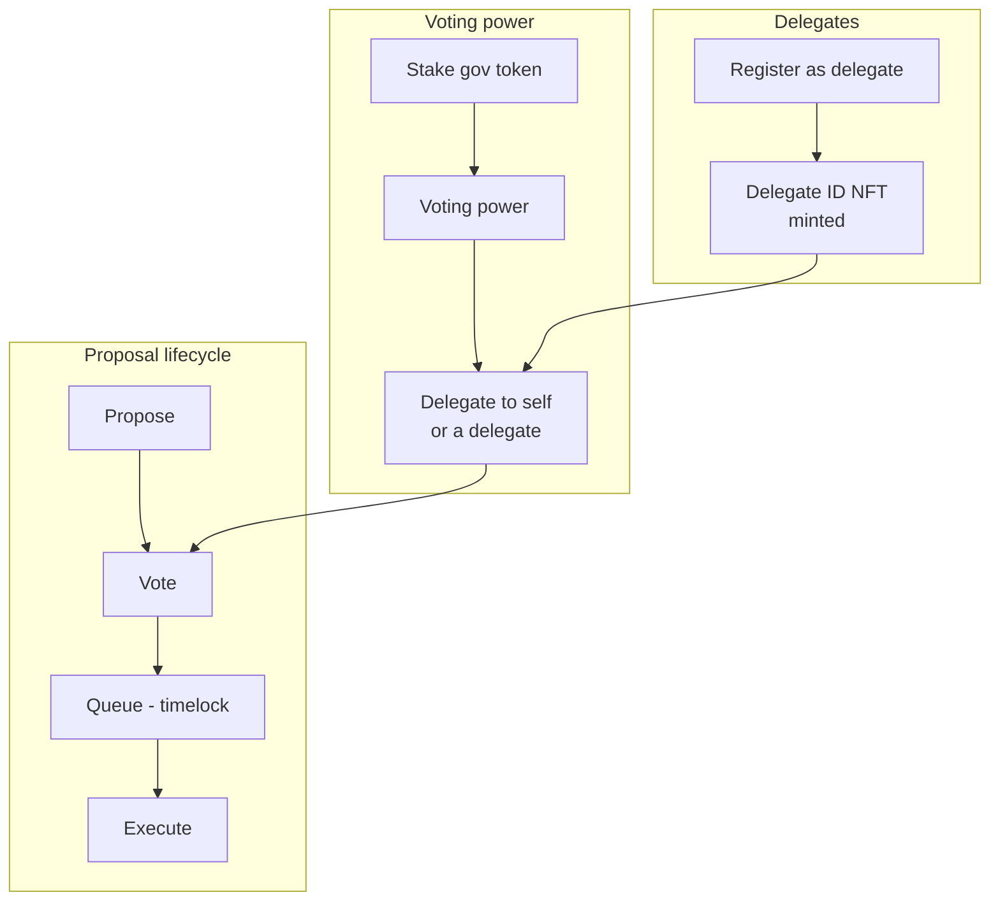

# NexLink dApp 社区治理（Community Governance）

> **状态：设计 / 提案模式。** 构建治理所需的平台原语 —— [`NexlinkApp.contract`](CONTRACT.md#3-layer-3-nexlinkappcontract-sdk) 与 [`window.ethereum`](CONTRACT.md#2-layer-1-standard-web3-libraries-eip-1193) —— **今天即可使用**。此处描述的治理智能合约与代言人身份 NFT（Delegate-ID NFT）是 dApp 部署到 NEXLK 链上的**参考设计**；它们尚未成为 NexLink 本身的一部分。下方所有 ABI 均为基于 [OpenZeppelin Governor](https://docs.openzeppelin.com/contracts/governance) 标准（也是 [Tally](https://www.tally.xyz/) 所采用的同一套技术栈）的提案形态。

社区治理（社区管理）让社区能够**质押代币以获得投票权、提交提案并对其进行投票** —— 即一个 DAO。NexLink 借鉴 Tally 的代言人档案，增加了一个特色：**代言人身份（Delegate ID，代言人身份）本身就是一个 NFT** —— 成为代言人会铸造一枚可转让或灵魂绑定的身份代币，该代币承载着代言人的公开声明。

由于每一项操作都是普通的合约调用，治理**不需要任何专用于治理的 SDK** —— 它通过标准的[合约交互](CONTRACT.md)层运行，每一步都由用户签名。

---

## 1. Overview



### Components

| 组件 | 标准 | 作用 |
|---|---|---|
| **治理代币** | ERC-20 **Votes**（ERC20Votes / ERC-5805） | 余额 + 带历史快照的委托投票权 |
| **质押模块** | 自定义 | 锁定代币以获得投票权（并可选获取奖励）；限定代言人资格 |
| **Governor** | OpenZeppelin Governor | 提案、投票、法定人数、状态 |
| **Timelock** | TimelockController | 在提案通过与执行之间强制施加延迟 |
| **代言人身份 NFT** | ERC-721（可选[灵魂绑定](NFT.md#4-soulbound-tokens-sbt)） | 链上代言人身份 + 声明 URI |

### Roles

| 角色 | 如何获得 | 可执行操作 |
|---|---|---|
| **成员** | 持有/质押治理代币 | 委托投票权、投票（若已自我委托） |
| **代言人** | 注册 → 铸造代言人身份 NFT | 接收被委托的投票权、代表委托人投票 |
| **提案人** | 持有的投票权 ≥ 提案门槛 | 提交提案 |

---

## 2. Voting Power: Stake & Delegate

投票权来自 **ERC20Votes** 代币，但只有在**委托**之后才会被计入 —— 即使是委托给你自己。质押会将代币锁入质押模块，该模块记入投票权（并可限定谁被允许成为代言人）。

### 2.1 Proposed ABIs

```javascript
const GOV_TOKEN_ABI = [
  "function balanceOf(address account) view returns (uint256)",
  "function delegate(address delegatee)",
  "function delegates(address account) view returns (address)",
  "function getVotes(address account) view returns (uint256)"
];

const STAKING_ABI = [
  "function stake(uint256 amount)",
  "function unstake(uint256 amount)",
  "function stakedOf(address account) view returns (uint256)",
  "function votingPowerOf(address account) view returns (uint256)"
];
```

### 2.2 Stake then delegate

```javascript
// 1. Approve + stake (two confirmations) — see ESCROW.md §4.3 for the approve pattern
await NexlinkApp.contract.call({
  contract: GOV_TOKEN_ADDRESS, abi: ERC20_ABI, method: "approve",
  args: [STAKING_ADDRESS, toUnits(amount, decimals).toString()]
});
await NexlinkApp.contract.call({
  contract: STAKING_ADDRESS, abi: STAKING_ABI, method: "stake",
  args: [toUnits(amount, decimals).toString()]
});

// 2. Delegate voting power (to yourself, or to a delegate's address)
await NexlinkApp.contract.call({
  contract: GOV_TOKEN_ADDRESS, abi: GOV_TOKEN_ABI, method: "delegate",
  args: [delegateeAddress]   // your own address to self-delegate
});

// Read current power (no signing)
const power = await NexlinkApp.contract.read({
  contract: GOV_TOKEN_ADDRESS, abi: GOV_TOKEN_ABI, method: "getVotes",
  args: [userAddress]
});
```

> **快照投票。** Governor 在提案的快照区块处统计每位投票者的投票权，因此在提案开启后再购买代币不会增加你对该提案的投票权重。这是标准的 ERC20Votes 行为。

---

## 3. Delegate ID NFT

注册成为代言人会铸造一枚**代言人身份（Delegate ID）** —— 一个 ERC-721，其 `tokenURI` 指向代言人的公开声明（姓名、平台、为何委托给我）。这是 Tally 代言人档案的链上对应物。它可以以**灵魂绑定**方式（不可转让 —— 你无法出售的身份）或可转让方式发行；参见 [NFT.md](NFT.md#4-soulbound-tokens-sbt)。

### 3.1 Proposed ABI

```javascript
const DELEGATE_ID_ABI = [
  // Mint the caller's Delegate ID with a statement URI; reverts if already registered
  "function registerDelegate(string statementURI) returns (uint256 tokenId)",
  "function updateStatement(uint256 tokenId, string statementURI)",
  "function resignDelegate(uint256 tokenId)",
  "function isDelegate(address account) view returns (bool)",
  "function tokenOfDelegate(address account) view returns (uint256)",
  "function tokenURI(uint256 tokenId) view returns (string)"
];
```

### 3.2 Become a delegate

```javascript
// statementURI is an IPFS/HTTPS URI to a JSON: { name, bio, platform, links }
const { txHash } = await NexlinkApp.contract.call({
  contract: DELEGATE_ID_ADDRESS, abi: DELEGATE_ID_ABI, method: "registerDelegate",
  args: [statementURI]
});
// Members can now delegate() their voting power to this delegate's address.
```

| 方法 | 用途 |
|---|---|
| `registerDelegate(statementURI)` | 为调用者铸造代言人身份 NFT |
| `updateStatement(tokenId, uri)` | 更新公开的代言人声明 |
| `resignDelegate(tokenId)` | 销毁/退役代言人身份 |
| `isDelegate(account)` / `tokenOfDelegate(account)` | 查询代言人状态与 token id |

展示代言人名册是一组 `read` 调用：枚举代言人身份持有者、解析各自的 `tokenURI`，并与 `getVotes(delegateAddress)` 配对以得出所接收的投票权。

---

## 4. Proposals & Voting

使用标准的 OpenZeppelin **Governor** 接口。

### 4.1 Proposed ABI

```javascript
const GOVERNOR_ABI = [
  "function propose(address[] targets, uint256[] values, bytes[] calldatas, string description) returns (uint256 proposalId)",
  "function castVote(uint256 proposalId, uint8 support) returns (uint256)",
  "function castVoteWithReason(uint256 proposalId, uint8 support, string reason) returns (uint256)",
  "function state(uint256 proposalId) view returns (uint8)",
  "function proposalSnapshot(uint256 proposalId) view returns (uint256)",
  "function proposalDeadline(uint256 proposalId) view returns (uint256)",
  "function proposalThreshold() view returns (uint256)",
  "function quorum(uint256 timepoint) view returns (uint256)",
  "function queue(address[] targets, uint256[] values, bytes[] calldatas, bytes32 descriptionHash) returns (uint256)",
  "function execute(address[] targets, uint256[] values, bytes[] calldatas, bytes32 descriptionHash) payable returns (uint256)"
];
```

`support` 值（Governor `VoteType`）：`0` = Against，`1` = For，`2` = Abstain。

提案 `state` 枚举：`0` Pending · `1` Active · `2` Canceled · `3` Defeated · `4` Succeeded · `5` Queued · `6` Expired · `7` Executed。

### 4.2 Lifecycle

```mermaid
sequenceDiagram
    participant P as Proposer
    participant Gov as Governor
    participant V as Voters / Delegates
    participant TL as Timelock

    P->>Gov: propose(targets, values, calldatas, description)
    Gov-->>P: proposalId (state: Pending)
    Note over Gov: after votingDelay, state becomes Active at snapshot block

    V->>Gov: castVote(proposalId, support)
    Note over Gov: power counted at snapshot; runs until deadline

    alt Quorum + majority For
        Gov->>Gov: state: Succeeded
        P->>Gov: queue(targets, values, calldatas, descriptionHash)
        Gov->>TL: schedule with delay
        Note over TL: timelock delay elapses
        P->>Gov: execute(...)
        Gov->>TL: run the actions
    else Failed
        Gov->>Gov: state: Defeated / Expired
    end
```

### 4.3 Create a proposal & vote

```javascript
// Create a proposal (caller must hold >= proposalThreshold voting power)
const { txHash } = await NexlinkApp.contract.call({
  contract: GOVERNOR_ADDRESS, abi: GOVERNOR_ABI, method: "propose",
  args: [targets, values, calldatas, description]
});

// Vote — 1 = For, 0 = Against, 2 = Abstain
await NexlinkApp.contract.call({
  contract: GOVERNOR_ADDRESS, abi: GOVERNOR_ABI, method: "castVoteWithReason",
  args: [proposalId, 1, "I support this because..."]
});

// Read state (no signing)
const state = await NexlinkApp.contract.read({
  contract: GOVERNOR_ADDRESS, abi: GOVERNOR_ABI, method: "state", args: [proposalId]
});
```

`proposalId` 是确定性的 —— `keccak256(abi.encode(targets, values, calldatas, keccak256(bytes(description))))` —— 因此前端可以自行计算它，而 `queue`/`execute` 会重新提供相同的数组外加 `descriptionHash`。

---

## 5. Using Governance from a dApp

| 操作 | 层 | 用户签名？ |
|---|---|---|
| `stake` / `unstake`、`delegate`、`registerDelegate` | [`contract.call()`](CONTRACT.md#contractcall--write-transactions) | 是 |
| `propose`、`castVote`、`queue`、`execute` | [`contract.call()`](CONTRACT.md#contractcall--write-transactions) | 是 |
| `getVotes`、`state`、`quorum`、代言人名册、`tokenURI` | [`contract.read()`](CONTRACT.md#contractread--viewpure-calls) | 否 |
| 外部浏览器 | 每项操作走 [QR 合约流程](CONTRACT.md#4-browser-contract-interaction-qr-code) | 是（通过扫码） |

由于 Governor 是标准接口，[第 1 层（ethers/viem）](CONTRACT.md#2-layer-1-standard-web3-libraries-eip-1193)无需改动即可工作 —— 现有的 Tally 风格前端可以指向 NEXLK 链与 NexLink 的 `window.ethereum` provider，无需任何 NexLink 专用代码。

---

## 6. Security Model

| 属性 | 机制 |
|---|---|
| **每项操作均由用户签名** | 质押、委托、发起提案、投票、排队、执行各自都是一次原生确认 + 生物识别。无托管。 |
| **快照投票** | 投票权在提案快照区块处固定 —— 提案开启后无法买票。 |
| **时间锁延迟** | 通过的提案在执行前于时间锁中等待，让持不同意见的成员有时间退出。 |
| **提案门槛** | 只有投票权高于门槛的持有者才能发起提案，以限制垃圾提案。 |
| **通过质押实现抗女巫攻击** | 投票权由质押的代币背书；代言人资格可要求最低质押量。 |
| **代言人问责** | 代言人身份 NFT 将公开声明与链上身份绑定；灵魂绑定发行可防止出售声誉。 |
| **透明计票** | 投票与结果均在链上，可在链 `2026777` 上独立验证。 |

---

## 7. What Needs Building

治理运行于现有的合约 SDK 之上，但**智能合约及其部署是 dApp 的责任**，此处尚未编写：

### Contracts (deploy to NEXLK chain 2026777)
- [ ] ERC20Votes 治理代币（或包装一个现有代币）
- [ ] 质押模块（`stake`/`unstake`、投票权记账、代言人资格限定）
- [ ] Governor + TimelockController（门槛、法定人数、投票延迟/投票期）
- [ ] 代言人身份 NFT（ERC-721；灵魂绑定选项参见 [NFT.md](NFT.md#4-soulbound-tokens-sbt)）

### Platform SDK — available today
- [x] `NexlinkApp.contract.call()` / `.read()` 覆盖每一项治理操作
- [x] `window.ethereum`（EIP-1193 + EIP-6963）用于标准 Governor 前端
- [x] QR 合约会话用于外部浏览器签名

### Optional platform enhancements
- [ ] 一个治理辅助命名空间（`NexlinkApp.governance.*`），封装标准 ABI 以提供便利
- [ ] 已建索引的提案/代言人列表端点（使前端得以避免繁重的链上枚举）

### Documentation
- [x] GOVERNANCE.md —— 本设计规范
- [ ] API.md —— 可选的索引器端点（标记为提案）
- [x] SUMMARY.md —— 治理链接
