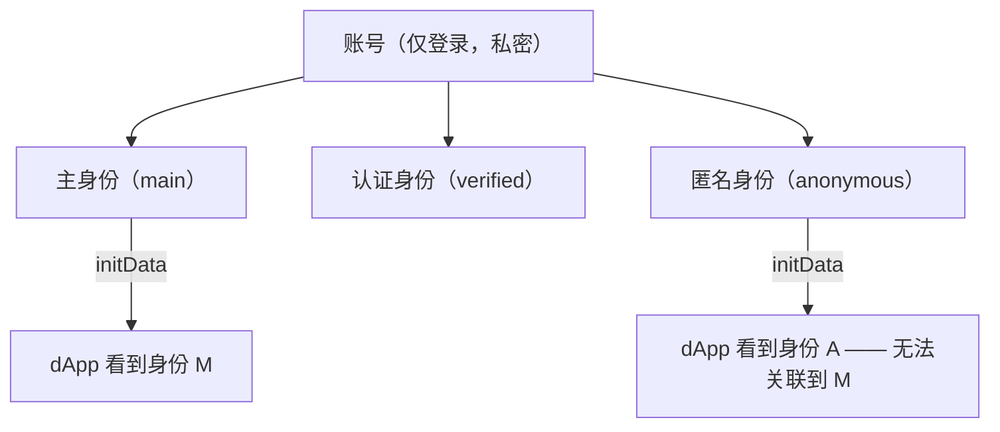
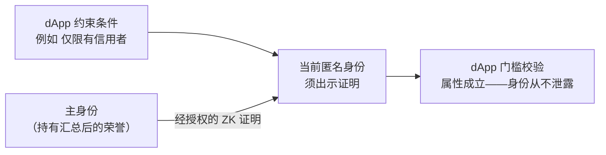

# NexLink 身份系统（Identity System）

> **状态：设计 / 提案。** 本文所述的身份模型尚未上线。目前 [`initData`](AUTH.md) 标识的是单一的登录用户。本文档规范 dApp 未来将对接的**多身份**模型，以及它引入的**零知识信任**接口，以便提前设计集成。本文所述内容目前均不可调用。

NexLink 用户使用一个**账号（注册账号）**登录，但以**身份（身份）**的形式活动——每个身份拥有各自的联系人、钱包、昵称与支付。一个账号可持有多个身份并在其间切换。对 dApp 而言，**每个身份看起来都是一个独立的用户**；其背后的账号是私密的。

---

## 1. 身份三类

| 类型 | 原文 | 含义 | 数量 |
|---|---|---|---|
| **主身份（Main）** | **主身份** | 用户的**真实 / 物理身份**。登录后默认进入。所有荣誉汇总的锚点。 | **每人有且仅一个** |
| **认证身份（Verified）** | **认证身份** | 通过**主身份认证**的人格（与真实的人关联，但是独立的活动身份）。可承载可信凭证。 | 多个 |
| **匿名身份（Anonymous）** | **匿名身份** | 用于隐私的匿名人格——不公开关联到真实身份。 | 多个 |

- **主身份是"一个人"的计量单位。** 因为它对应物理身份且每人仅一个，它是防女巫、信用与"一人一票"的基础。
- 同一用户的两个身份，对 dApp 和其他用户而言，**与两个不同的人无异**。

### 每个身份本身就是链上 SBT（基金会合约）

每个身份——主身份 / 认证身份 / 匿名身份——本身都是持有在钱包中的**不可转让链上灵魂代币（SBT）**，由 **NexLink 基金会维护的唯一身份合约**铸造——任何第三方都不能发行身份。`identity_type` 是链上元数据。

**基金会是整个信任体系的根 CA（Root CA）**：它运行该身份合约，并**为荣誉发行方做根认证**（见 [荣誉与声誉](HONOR.md)）。身份 SBT——以及荣誉 SBT——同时在**钱包**与**个人主页**中显示。

---

## 2. dApp 能看到什么

dApp 认证的是**当前活动的身份**，绝不是账号或其他身份。

| dApp 可以 | dApp 不可以 |
|---|---|
| 通过 [`initData`](AUTH.md) 识别当前身份（其 `uid`、昵称、头像） | 看到账号，或看出两个身份属于同一人 |
| 接收来自当前身份钱包的支付 / 合约调用 | 枚举一个用户的其他身份 |
| 请求关于该人的**零知识证明**（见第 4 节） | 得知某个匿名身份背后的真实身份 |



> **initData 按身份区分。** 身份模型上线后，dApp 收到的已签名 `initData`（[AUTH.md](AUTH.md)）标识的是**当前活动的身份**。切换身份会得到不同的 `initData`。请围绕身份而非"人"来设计你的账户模型。

---

## 3. 荣誉汇总到主身份

荣誉与凭证（[HONOR.md](HONOR.md)）**绑定到获得它的身份**，但**一个人的所有荣誉都会向上汇总到其主身份**——即人这一层级的履历。由于主身份每人仅一个，这让人层面的事实**无法规避**：

- 在任何人格上获得的**不良记录**，仍会在主身份处显现——用户无法通过切换身份来逃避。
- **一人一票**在主身份处计票——多余的身份不会带来额外票数（见 [GOVERNANCE.md](GOVERNANCE.md)）。
- **链上信用**在人这一层级评估。

该汇总是**向内的**——是用户自己的合并视图与人层面的强制执行。它**绝不会**作为人格之间的公开关联暴露给其他用户。

---

## 4. 不去匿名化地建立信任——零知识证明

难点：dApp 需要**信任**一个交易对手，但对方以**匿名身份**活动。NexLink 用**零知识证明**解决，且**由交易平台决定规则（由交易平台决定）**——而非 NexLink。

1. dApp 声明一个**约束条件（约束条件）**——例如*"仅有信用的用户可发起交易"*。
2. 为满足它，用户的**主身份代表当前身份签发一份经授权的零知识证明**，证明所需属性（有信用 / 无不良记录 / 已 KYC）**且不泄露真实身份、也不将该人格与主身份关联**。
3. **不提供证明 → dApp 的门槛拒绝其参与**（原文："如果不提供，就无法参与"）。



如此**隐私与信任兼得**：dApp 只得知*"这个匿名用户达标"*，绝不知道*他是谁*。**担保（[ESCROW.md](ESCROW.md)）是旗舰场景**——担保交易 dApp 可要求 ZK 证明的信用 / 声誉门槛，同时让交易者保持匿名。

### 4.1 拟定的 SDK 接口

```javascript
// dApp 请求当前身份证明其满足某个具名约束。
// 由主身份生成证明；人格保持匿名。
const { proof, publicSignals } = await NexlinkApp.identity.prove({
  constraint: "credit.noNegativeRecord",   // 平台定义的谓词
  // 可选参数，例如 { minCreditTier: 2 }
});

// dApp 后端（或验证合约）用已发布的验证密钥校验证明——
// 只得知该谓词成立。
```

> `NexlinkApp.identity.*` 与谓词注册表均为**提案**，尚未上线。证明是针对主身份处汇总后的荣誉进行的。

---

## 5. 安全模型

| 属性 | 机制 |
|---|---|
| **账号隐私** | 登录标识（邮箱/手机号）从不社交化暴露；dApp 只看到身份的 `uid`/昵称。 |
| **身份隔离** | 每个身份都是独立的签名主体；dApp 无法枚举或关联用户的其他身份。 |
| **匿名身份的匿名性** | 匿名人格背后的真实的人从不暴露；向主身份的汇总仅向内。 |
| **无法规避的人层面事实** | 不良记录、信用、一人一票都在每人仅一个的主身份处结算。 |
| **不暴露地建立信任** | ZK 证明证实某属性（有信用、KYC、无不良记录）而不泄露身份——由 dApp 设定约束。 |
| **用户授权** | 每份证明都由用户**授权**，如同签名——平台绝不静默地证明事实。 |

---

## 6. 待建设内容

- [ ] 身份模型（主身份 / 认证身份 / 匿名身份）+ 按身份区分的 `initData`
- [ ] 荣誉向主身份汇总（人层面 rollup）——见 [HONOR.md](HONOR.md)
- [ ] ZK 证明服务：由主身份签发、经用户授权、针对汇总荣誉的证明（有信用 / 无不良记录 / KYC）
- [ ] 谓词注册表 + dApp 后端 / 合约可校验的验证密钥
- [ ] `NexlinkApp.identity.prove()` SDK 接口

### 文档
- [x] IDENTITY.md —— 本文档
- [ ] API.md —— `identity.prove` 签名 + 谓词列表（标注为提案）
- [x] SUMMARY.md —— 身份系统链接

**另见：** [荣誉与声誉](HONOR.md) · [社区治理](GOVERNANCE.md)（一人一票在主身份处计票）· [担保支付](ESCROW.md)（ZK 门槛参与）· [登录与注册](AUTH.md)。
