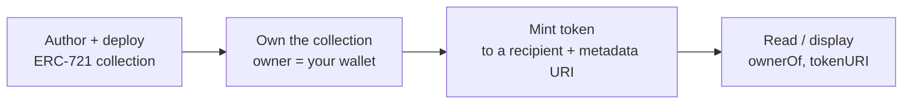

# NexLink dApp NFT 发行（NFT Issuance）

> **状态：可通过合约 SDK 支持；官方发行 UX 处于设计 / 提案阶段。** 你现在就可以在 NEXLK 链上**部署并铸造 NFT**，并通过 [`NexlinkApp.contract`](CONTRACT.md#3-layer-3-nexlinkappcontract-sdk) 驱动铸造/读取——参考的 ERC-721 合约（`nex_test_nft/contracts/NexTestNft.sol`）是真实可用的。开发者门户中的一键发行流程（类似现有的同质化代币发行器）目前**尚未构建**用于 NFT；该部分仍处于提案阶段。同质化代币发行已经存在于开发者门户中，不在本文档范围内。

NFT 发行（NFT发行）涵盖两类非同质化代币：

| 类型 | 中文 | 是否可转让？ | 典型用途 |
|---|---|---|---|
| **普通 NFT（普通代币）** | 普通代币 | 是 | 可交易/出售的收藏品、艺术品、门票、会员身份 |
| **灵魂绑定代币（SBT，灵魂代币）** | 灵魂代币 | **否**——绑定到单个钱包 | 身份、凭证、徽章、[Delegate ID](GOVERNANCE.md#3-delegate-id-nft)、不可转让的证明 |

二者都是 NEXLK 链（`2026777`）上的 ERC-721 合约。唯一的区别在于是否允许转让。

---

## 1. Overview

发行 NFT 分为两个阶段：



1. **部署合集** —— 一次性部署一个 ERC-721 合约（普通或灵魂绑定）。这通过指向 NEXLK RPC 的标准工具链（Hardhat/Foundry）完成，而非通过应用内 SDK。
2. **铸造代币** —— 向接收方发行单个 NFT。铸造是普通的合约调用，因此它可以通过[合约 SDK](CONTRACT.md) 携带原生确认运行，或从你的后端/部署者钱包运行。

**没有 NFT 专用 SDK**——铸造和读取都是普通的 `contract.call()` / `contract.read()`。

---

## 2. Reference Contract (Normal NFT)

`nex_test_nft/contracts/NexTestNft.sol` 是一个可直接复制的、精简且真实的 ERC-721 合约。它使用 OpenZeppelin v5（`ERC721URIStorage` + `Ownable`），采用 owner 门控的铸造和按代币的元数据 URI。

```solidity
// SPDX-License-Identifier: MIT
pragma solidity ^0.8.20;

import "@openzeppelin/contracts/token/ERC721/ERC721.sol";
import "@openzeppelin/contracts/token/ERC721/extensions/ERC721URIStorage.sol";
import "@openzeppelin/contracts/access/Ownable.sol";

contract NexTestNft is ERC721, ERC721URIStorage, Ownable {
    uint256 private _nextId;

    constructor(address initialOwner)
        ERC721("Nex Test NFT", "NTN")
        Ownable(initialOwner)
    {}

    function mint(address to, string memory uri)
        external
        onlyOwner
        returns (uint256 tokenId)
    {
        tokenId = _nextId++;
        _safeMint(to, tokenId);
        _setTokenURI(tokenId, uri);
    }

    function tokenURI(uint256 tokenId)
        public view override(ERC721, ERC721URIStorage)
        returns (string memory) { return super.tokenURI(tokenId); }

    function supportsInterface(bytes4 interfaceId)
        public view override(ERC721, ERC721URIStorage)
        returns (bool) { return super.supportsInterface(interfaceId); }
}
```

| 设计选择 | 原因 |
|---|---|
| `onlyOwner` 铸造 | 只有合集的拥有者（owner，即发行方）才能创建代币——防止开放铸造。若要公开铸造可去掉此限制。 |
| 顺序递增的 `_nextId` | 简单、省 gas 的代币 id，从 0 开始。 |
| `ERC721URIStorage` | 按代币的元数据 URI（在铸造时设置），而非共享的 baseURI。 |

---

## 3. Deploying a Collection

使用任意 EVM 工具链针对 NEXLK 链进行部署。以下是 Hardhat 网络配置示例：

```javascript
// hardhat.config.js
module.exports = {
  solidity: "0.8.20",
  networks: {
    nexlk: {
      url: process.env.NEXLINK_RPC_URL,   // NEXLK chain RPC
      chainId: 2026777,
      accounts: [process.env.DEPLOYER_PRIVATE_KEY],
    },
  },
};
```

```javascript
// scripts/deploy.js
const [deployer] = await ethers.getSigners();
const Nft = await ethers.getContractFactory("NexTestNft");
const nft = await Nft.deploy(deployer.address);   // initialOwner = issuer
await nft.waitForDeployment();
console.log("Collection:", await nft.getAddress());
```

部署者成为合集的**拥有者（owner）**——即被允许 `mint` 的钱包。请将此密钥保管在服务端（后端/部署者），或将 owner 设为一个由你通过确认 UI 驱动其铸造的钱包。

---

## 4. Soulbound Tokens (SBT)

灵魂绑定代币是一种在铸造后**无法转让**的 ERC-721——它被永久绑定到接收钱包。在 OpenZeppelin v5 中，通过对内部 `_update` 钩子加门控实现：允许铸造（`from == 0`）和销毁（`to == 0`），但对钱包到钱包的转让进行回退（revert）。

```solidity
// SPDX-License-Identifier: MIT
pragma solidity ^0.8.20;

import "@openzeppelin/contracts/token/ERC721/ERC721.sol";
import "@openzeppelin/contracts/token/ERC721/extensions/ERC721URIStorage.sol";
import "@openzeppelin/contracts/access/Ownable.sol";

contract SoulboundNft is ERC721, ERC721URIStorage, Ownable {
    uint256 private _nextId;

    error Soulbound(); // non-transferable

    constructor(address initialOwner)
        ERC721("Nex Soulbound", "NSBT")
        Ownable(initialOwner)
    {}

    function mint(address to, string memory uri) external onlyOwner returns (uint256 tokenId) {
        tokenId = _nextId++;
        _safeMint(to, tokenId);
        _setTokenURI(tokenId, uri);
    }

    // Allow mint (from == 0) and burn (to == 0); block transfers.
    function _update(address to, uint256 tokenId, address auth)
        internal override returns (address)
    {
        address from = _ownerOf(tokenId);
        if (from != address(0) && to != address(0)) revert Soulbound();
        return super._update(to, tokenId, auth);
    }

    function tokenURI(uint256 tokenId)
        public view override(ERC721, ERC721URIStorage) returns (string memory)
        { return super.tokenURI(tokenId); }

    function supportsInterface(bytes4 interfaceId)
        public view override(ERC721, ERC721URIStorage) returns (bool)
        { return super.supportsInterface(interfaceId); }
}
```

| 用例 | 为何采用灵魂绑定 |
|---|---|
| [Delegate ID](GOVERNANCE.md#3-delegate-id-nft) | 一种无法出售的治理身份——声誉留在本人身上 |
| 凭证 / 认证 | 若可转让，文凭或 KYC 徽章便毫无意义 |
| 会员身份 / 角色徽章 | 绑定到单个账户的访问权限 |
| 参与证明 | 活动出席、贡献历史 |

> 是否允许**销毁**（持有者可放弃该代币）是一项策略选择——上面的示例允许销毁（`to == 0` 通过）。若要打造完全永久的代币，请去掉该许可。

---

## 5. Minting via the Contract SDK

铸造是一次普通的写入调用。当铸造由 owner 的应用内会话触发时，使用[合约 SDK](CONTRACT.md#contractcall--write-transactions)；对于自动化发行，则从你的后端部署者钱包调用。

```javascript
const NFT_ABI = [
  "function mint(address to, string uri) returns (uint256)",
  "function ownerOf(uint256 tokenId) view returns (address)",
  "function balanceOf(address owner) view returns (uint256)",
  "function tokenURI(uint256 tokenId) view returns (string)"
];

// Mint to a recipient with a metadata URI (owner-only mint → owner must be the signer)
const { txHash } = await NexlinkApp.contract.call({
  contract: NFT_ADDRESS,
  abi: NFT_ABI,
  method: "mint",
  args: [recipientAddress, "ipfs://bafy.../metadata.json"]
});
```

读取是免费的（无需签名）：

```javascript
const owner  = await NexlinkApp.contract.read({ contract: NFT_ADDRESS, abi: NFT_ABI, method: "ownerOf",   args: [tokenId] });
const uri    = await NexlinkApp.contract.read({ contract: NFT_ADDRESS, abi: NFT_ABI, method: "tokenURI",  args: [tokenId] });
const count  = await NexlinkApp.contract.read({ contract: NFT_ADDRESS, abi: NFT_ABI, method: "balanceOf", args: [userAddress] });
```

| 环境 | 铸造 | 读取 |
|---|---|---|
| **应用内（WebView）** | [`contract.call()`](CONTRACT.md#contractcall--write-transactions) 或 `window.ethereum` | [`contract.read()`](CONTRACT.md#contractread--viewpure-calls) |
| **外部浏览器** | [QR 合约流程](CONTRACT.md#4-browser-contract-interaction-qr-code) | 直接 RPC `eth_call` |
| **自动化（后端）** | 通过 ethers/viem 使用部署者钱包 | RPC `eth_call` |

---

## 6. Metadata

`tokenURI` 返回一个 URI（通常为 `ipfs://` 或 `https://`），解析后指向一份遵循 ERC-721 元数据规范的 JSON 文档：

```json
{
  "name": "NexLink Founder Badge #1",
  "description": "Awarded to early community members.",
  "image": "ipfs://bafy.../image.png",
  "attributes": [
    { "trait_type": "Tier", "value": "Founder" },
    { "trait_type": "Year", "value": "2026" }
  ]
}
```

将元数据和图片托管在 IPFS（或其他内容寻址/不可变的存储）上，使代币内容在铸造后无法被悄然更改。在铸造时通过 `mint(to, uri)` 设置该 URI。

---

## 7. Displaying NFTs in a dApp

要展示某用户在某合集中的 NFT：读取 `balanceOf(user)`，然后枚举代币（通过 `tokenOfOwnerByIndex` 可枚举扩展、转账事件（transfer-event）索引，或后端索引器），解析每个 `tokenURI`，并渲染元数据。对于跨多个合集的丰富画廊，请运行后端索引器，而不要每次请求都在链上枚举。

---

## 8. Security Model

| 属性 | 机制 |
|---|---|
| **受控铸造** | `onlyOwner` 铸造将发行限制为合集拥有者。公开铸造必须自行添加防护（allowlist、支付、供应量上限）。 |
| **应用内铸造的用户同意** | 通过 SDK 进行的铸造会显示已解码的 [`mint(...)` 确认](CONTRACT.md#5-confirmation-ui) 及生物识别。 |
| **不可转让性（SBT）** | 灵魂绑定代币在 `_update` 钩子处对转让进行回退——无法被出售或转移。 |
| **不可变元数据** | 内容寻址的 URI（IPFS）使元数据在铸造后可被检测是否被篡改。 |
| **链上来源（溯源）** | 拥有权与铸造历史在链 `2026777` 上可验证。 |
| **owner 密钥托管** | 若铸造是自动化的，请在服务端保护 owner/部署者密钥；可考虑使用独立于合集拥有者的铸造签名者。 |

---

## 9. What Needs Building

### Available today
- [x] 向 NEXLK（`2026777`）部署 ERC-721 合集——参考 `NexTestNft.sol`
- [x] 通过上文所示的 `_update` 覆写实现灵魂绑定变体
- [x] 通过 [`NexlinkApp.contract`](CONTRACT.md#3-layer-3-nexlinkappcontract-sdk) / `window.ethereum` / [QR 流程](CONTRACT.md#4-browser-contract-interaction-qr-code) 进行铸造与读取

### Proposed (not built)
- [ ] 开发者门户 NFT 发行 UX（创建合集 + 铸造），与现有的同质化代币发行器并行
- [ ] 发布经审计的规范合集模板（普通 + 灵魂绑定 + 可枚举）供 dApp 复用
- [ ] 后端 NFT 索引器 + 列表接口（无需链上枚举的拥有者画廊）
- [ ] 在标准 ERC-721 ABI 之上可选的 `NexlinkApp.nft.*` 便捷命名空间

### Documentation
- [x] NFT.md —— 本文档
- [ ] API.md —— 可选的索引器/发行接口（标注为提案）
- [x] SUMMARY.md —— NFT 链接
