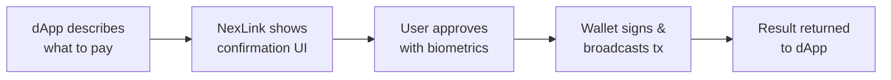
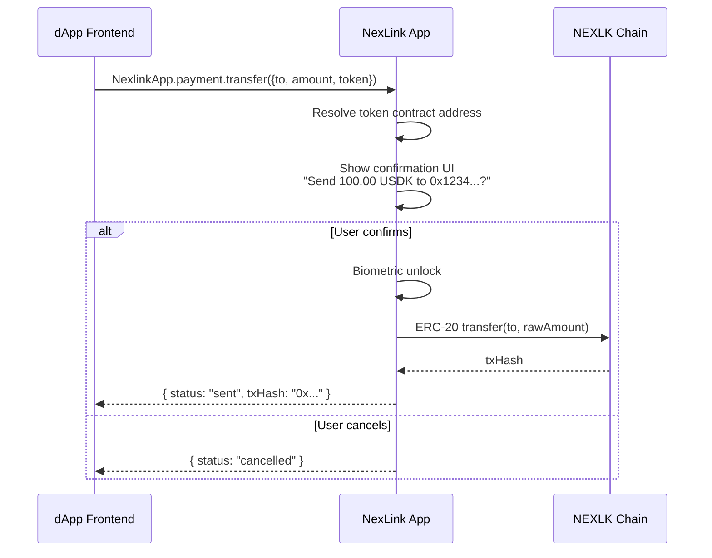
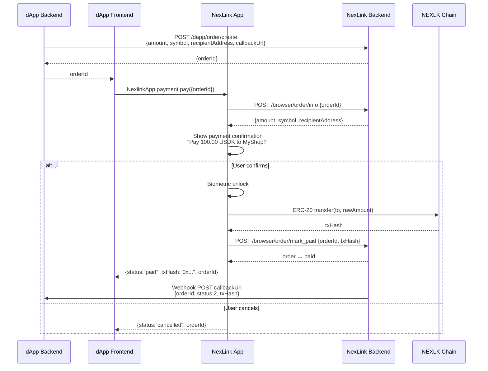
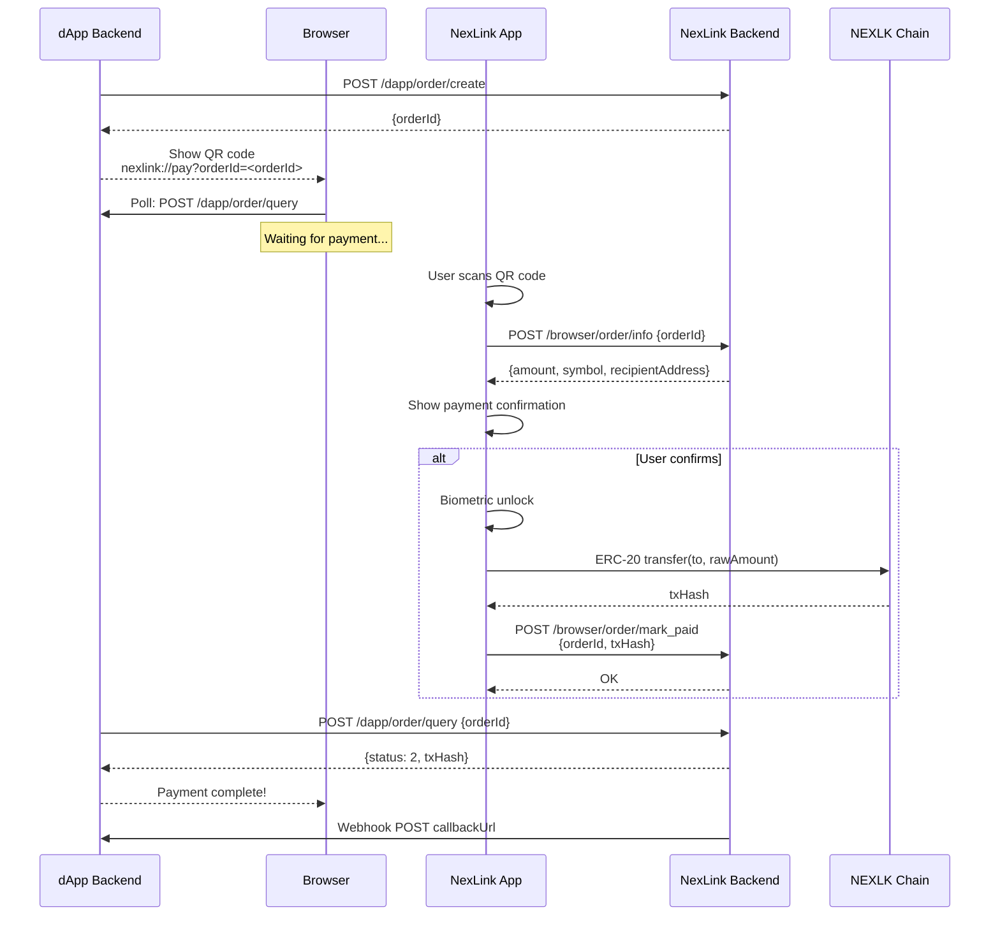
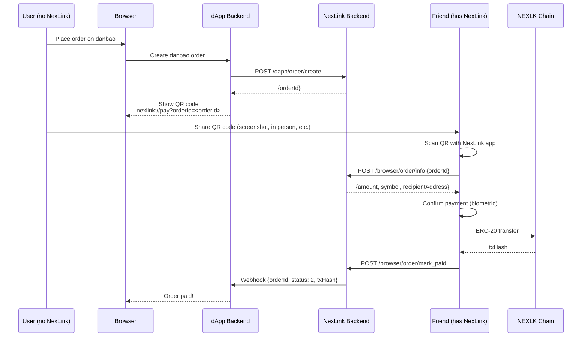
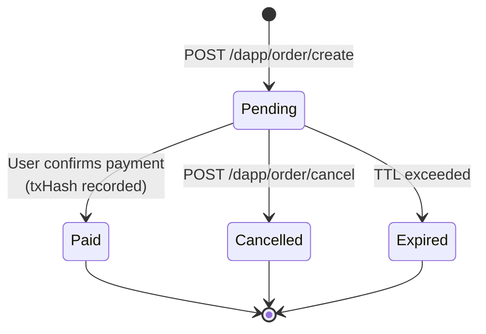
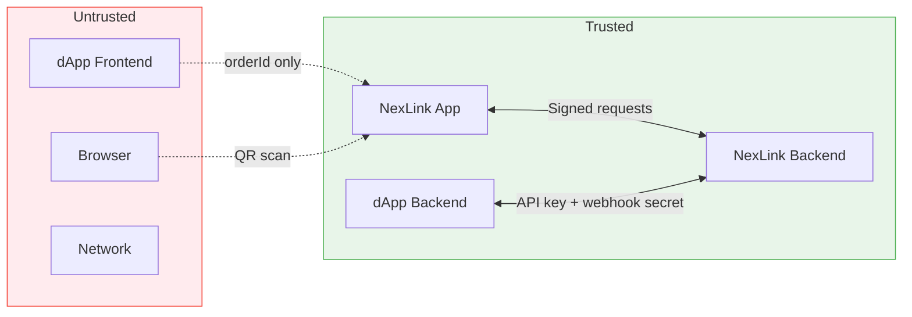

# NexLink dApp 支付集成

本文档介绍 dApp 如何与 NexLink 钱包交互以处理 USDK 与 CNYT 代币支付。内容涵盖应用内（WebView）与外部浏览器（二维码）两种渠道。

有关端点规范，请参阅 [API 参考](API.md#payment-api)。有关认证，请参阅 [登录与注册](AUTH.md)。

---

## 1. Overview

### Two Payment Modes

| 模式 | 适用场景 | 后端订单？ | Webhook？ | 浏览器支持？ |
|---|---|---|---|---|
| **直接转账** | P2P 打赏、捐赠、简单转账 | 否 | 否 | 仅应用内 |
| **订单支付** | 电商、订阅、结账 | 是 | 是 | 应用内 + 浏览器二维码 |

**选择直接转账**：当 dApp 前端已知收款方和金额，且无需服务端确认时。

**选择订单支付**：当 dApp 后端必须控制支付参数，并通过 Webhook 接收权威确认时。

两种模式都会在 NEXLK 链上执行**真实的链上 ERC-20 交易**。NexLink 应用在签名前始终会显示原生确认界面——dApp 无法绕过用户授权。

### How It Works (General Principle)



dApp 描述*要*支付的内容，NexLink 应用通过其原生界面处理授权，随后结果回流至 dApp。

---

## 2. Token Registry

### Supported Tokens

| 代币 | 说明 | 链 | 合约地址 | 精度 |
|---|---|---|---|---|
| **USDK** | 锚定美元的稳定币 | NEXLK | `0xaC2D085205D0A42121E48a9C20E7aE1a7102c526` | 5 |
| **CNYT** | 锚定人民币的稳定币 | NEXLK | `0x1e0df1f0813E6521819af9cAC158787f6f94471F` | 5 |

### NEXLK Chain

| 属性 | 值 |
|---|---|
| Chain ID | `2026777` |
| 类型 | EVM 兼容 |
| 原生代币 | NKT |
| 共识 | Proof of Authority |

### Decimal Handling

两种代币都使用 **5 位小数**（非标准；ERC-20 默认为 18）。

| 人类可读金额 | 原始金额（最小单位） | 换算 |
|---|---|---|
| `1.00` USDK | `100000` | × 10⁵ |
| `0.50` CNYT | `50000` | × 10⁵ |
| `1234.56789` USDK | `123456789` | × 10⁵ |

JS SDK 的 `transfer()` 方法接受**人类可读金额**（例如 `"100.00"`）。原生应用在内部处理向最小单位的换算。

订单 API 的 `amount` 字段使用**最小单位**（最小单位，整数）。dApp 后端在创建订单时必须乘以 10⁵。

---

## 3. Direct Transfer (Simple Mode)

适用于 P2P 支付、打赏和简单转账。无需后端——纯前端交互。**仅应用内。**

### JS SDK Method

```javascript
const result = await NexlinkApp.payment.transfer({
  to: "0x1234...abcd",   // Recipient wallet address
  amount: "100.00",       // Human-readable amount
  token: "USDK"           // "USDK" or "CNYT"
});

if (result.status === "sent") {
  console.log("Transfer sent:", result.txHash);
}
```

### Flow



### Parameters

| 参数 | 类型 | 必填 | 说明 |
|---|---|---|---|
| `to` | String | 是 | 收款方钱包地址（十六进制，带校验和） |
| `amount` | String | 是 | 人类可读金额（例如 `"100.00"`、`"0.5"`） |
| `token` | String | 是 | 代币符号：`"USDK"` 或 `"CNYT"` |

### Return Value (on success)

| 字段 | 类型 | 说明 |
|---|---|---|
| `status` | String | 始终为 `"sent"`（Promise 仅在成功时 resolve） |
| `txHash` | String | 链上交易哈希 |

### Error Handling

在取消或失败时，Promise 会**拒绝（reject）**并返回一个错误。请使用 `try/catch`：

```javascript
try {
  const result = await NexlinkApp.payment.transfer({ to, amount, token });
  console.log("Sent:", result.txHash);
} catch (e) {
  if (e.message === "user_rejected") {
    // User cancelled — do nothing
  } else {
    showError(e.message);
  }
}
```

| 错误信息 | 原因 | dApp 应对 |
|---|---|---|
| `user_rejected` | 用户点击取消或拒绝生物识别 | 显示"已取消"或不做任何操作 |
| `to, amount, and token are required` | 缺少参数 | 修正参数 |
| `unsupported token: X` | 无法识别的代币符号 | 使用 `"USDK"` 或 `"CNYT"` |

### Example: Tip Button

```javascript
// Simple tip button in a dApp
async function sendTip(recipientAddress, amount) {
  if (!window.NexlinkApp) {
    alert("Please open this dApp in the NexLink app");
    return;
  }

  try {
    const result = await NexlinkApp.payment.transfer({
      to: recipientAddress,
      amount: amount,
      token: "USDK"
    });
    showSuccess(`Tip sent! TX: ${result.txHash}`);
  } catch (e) {
    if (e.message === "user_rejected") {
      // User cancelled — do nothing
    } else {
      showError(`Transfer failed: ${e.message}`);
    }
  }
}
```

> **注意：** `transfer()` 仅在 NexLink 应用内可用。在外部浏览器中，`window.NexlinkApp` 为 `undefined`。若需浏览器支持，请使用订单支付流程。

---

## 4. Order-Based Payment (Commerce Mode)

适用于电商、订阅，以及任何 dApp 后端必须控制支付参数并接收确认的流程。可在**应用内和外部浏览器**中工作。

### 4.1 In-App Flow



#### Step by Step

1. **dApp 后端创建订单** — 调用 `POST /dapp/order/create`，传入金额、代币符号、收款方地址和回调 URL。返回 `orderId`（UUID）。

2. **dApp 前端触发支付** — 将 `orderId` 传递给用户的浏览器/WebView。前端调用 `NexlinkApp.payment.pay({ orderId })`。

3. **NexLink 应用获取订单** — 联系 NexLink 后端以检索订单详情（金额、符号、收款方、dApp 名称/图标）。交叉验证该订单是否属于当前 dApp。

4. **原生确认界面** — 显示一个包含已验证详情的支付表单：代币、金额、收款方、dApp 名称。用户无法修改这些值。

5. **用户确认** — 生物识别解锁（指纹/人脸）。NexLink 钱包构建 ERC-20 `transfer(to, amount)` calldata，签名，并广播至 NEXLK 链。

6. **上报后端** — NexLink 应用通过 `POST /browser/order/mark_paid` 将 `txHash` 发送至后端。后端将订单转换为 `paid` 状态。

7. **结果返回前端** — Promise 以 `{ status: "paid", txHash, orderId }` resolve。

8. **Webhook 发往 dApp 后端** — NexLink 后端向 dApp 的 `callbackUrl` 投递一个已签名的 Webhook，包含订单详情和 `txHash`。这是**权威确认**——dApp 后端不应仅信任前端回调。

#### JS SDK Method

```javascript
try {
  const result = await NexlinkApp.payment.pay({
    orderId: "nx-uuid-123"   // From POST /dapp/order/create
  });

  console.log("Payment complete:", result.txHash);
  // Also wait for webhook on your backend for authoritative confirmation
} catch (e) {
  if (e.message === "user_rejected") {
    // User cancelled
  } else {
    console.error("Payment failed:", e.message);
  }
}
```

#### Parameters

| 参数 | 类型 | 必填 | 说明 |
|---|---|---|---|
| `orderId` | String | 是 | 来自 [POST /dapp/order/create](API.md#post-dappordercreate) 的订单 UUID |

#### Return Value (on success)

| 字段 | 类型 | 说明 |
|---|---|---|
| `status` | String | `"paid"`（Promise 仅在成功时 resolve）或 `"already_processed"`（订单已支付） |
| `txHash` | String | 链上交易哈希（当 `status` 为 `"paid"` 时存在） |
| `orderId` | String | 订单 UUID |

#### Error Handling

在取消或失败时，Promise 会**拒绝（reject）**并返回一个错误。请使用 `try/catch`：

```javascript
try {
  const result = await NexlinkApp.payment.pay({ orderId });
  if (result.status === "paid") {
    console.log("Payment complete:", result.txHash);
  } else if (result.status === "already_processed") {
    console.log("Order was already paid");
  }
} catch (e) {
  if (e.message === "user_rejected") {
    // User cancelled — do nothing
  } else {
    showError(e.message);
  }
}
```

| 错误信息 | 原因 | dApp 应对 |
|---|---|---|
| `user_rejected` | 用户点击取消或拒绝生物识别 | 显示"支付已取消" |
| `orderId is required` | 缺少 `orderId` | 检查订单创建 |
| Order expired（本地化） | 超过订单 TTL | 创建新订单 |
| `unsupported token: X` | 代币不在注册表中 | 联系支持 |

---

### 4.2 Browser Flow (QR Code)

适用于在 Chrome、Safari 或任何外部浏览器中访问 dApp 的用户。dApp 显示一个二维码；用户使用 NexLink 应用扫描该码以完成支付。



#### Step by Step

1. **创建订单** — 与应用内相同：`POST /dapp/order/create`。

2. **显示二维码** — 将 `orderId` 编码进一个深链接二维码：
   ```
   nexlink://pay?orderId=<orderId>
   ```
   二维码仅包含 `orderId`（一个 UUID——不可猜测）。所有支付详情都在扫描后从后端获取。

3. **浏览器轮询** — dApp 前端轮询自己的后端，后端再调用 `POST /dapp/order/query` 以检查订单状态。当 `status` 变为 `2`（已支付）时，显示成功。

4. **用户扫描二维码** — NexLink 应用解析深链接，从 `POST /browser/order/info` 获取订单详情，并显示支付确认界面。

5. **用户确认** — 与应用内相同：生物识别解锁 → ERC-20 转账 → 广播 → 通过 `POST /browser/order/mark_paid` 上报 `txHash`。

6. **dApp 接收结果** — 订单查询返回 `status: 2` 及 `txHash`。浏览器更新以显示成功。

7. **Webhook** — NexLink 后端还会向 `callbackUrl` 投递 Webhook（与应用内相同）。这是**权威确认**。

#### QR Code Expiry & Refresh

二维码的有效性与订单的 `expireAt` 绑定。当订单过期时：

```javascript
// Browser-side polling pseudocode
async function pollOrderStatus(orderId) {
  while (true) {
    const res = await fetch(`/api/order/status?orderId=${orderId}`);
    const data = await res.json();

    if (data.status === 2) {  // paid
      showSuccess(data.txHash);
      return;
    }
    if (data.status === 4) {  // expired
      showExpiredUI();    // "Order expired — click to retry"
      return;
    }
    // status === 1 (pending) → wait and poll again
    await new Promise(r => setTimeout(r, 3000));
  }
}
```

若要刷新，请创建一个新订单（`POST /dapp/order/create`）并生成一个新的二维码。

#### Deep Link Format

```
nexlink://pay?orderId=<orderId>
```

| 参数 | 必填 | 说明 |
|---|---|---|
| `orderId` | 是 | Nexlink 订单 UUID |

> **安全：** `orderId` 是一个 UUID——不可猜测。二维码中不含金额、收款方或回调。所有敏感数据均来自 NexLink 后端。支付仍需用户通过生物识别确认。

---

### 4.3 Delegated Payment (Pay on Behalf)

订单支付系统**不强制校验付款方身份**。完成一笔支付所需的唯一信息就是 `orderId`——任何余额充足的 NexLink 用户都可以扫描二维码并付款，无论订单由谁创建。

这为通过标准用户名/密码注册（[AUTH.md](AUTH.md) 中的方式一）且没有 NexLink 账户的 danbao 用户启用了一种**代付**流程：



#### Why this works

| 属性 | 详情 |
|---|---|
| **无付款方校验** | `POST /browser/order/mark_paid` 记录 `txHash`，但不验证链上发送方是否与订单创建者匹配 |
| **订单与付款方无关** | 订单定义了*要*支付什么（金额、代币、收款方）——而非*由谁*付款 |
| **追踪付款方** | `paid_by_user_id` 列记录实际付款的 NexLink 用户。Webhook 包含 `paidByUserId`，以便 dApp 后端区分自付与代付。 |
| **链上终局性** | 无论由谁发送，`txHash` 都证明支付已发生 |
| **Webhook 为权威** | danbao 后端信任 Webhook 确认，而非浏览器 |

#### Payer identification

当好友扫描支付二维码并确认时，NexLink 后端记录：

| 字段 | 位置 | 值 |
|---|---|---|
| `paid_by_user_id` | `nexlink_dapp_order` 表 | 好友的 NexLink 用户 ID |
| `paidByUserId` | Webhook 载荷 | 相同的值——dApp 后端可与订单创建者比对 |
| `txHash` | 两者 | 链上交易哈希——`from` 地址是好友的钱包 |

dApp 后端可使用 `paidByUserId` 检测代付。当 `paidByUserId` 与预期用户不同（或订单没有关联的 NexLink 用户）时，即为代付。

#### Confirmation UX

当好友扫描二维码时，NexLink 应用会显示一个原生确认表单，包含：

- **dApp 名称** — 从 `/browser/order/info` 获取（例如"Pay to danbao"）
- **金额与代币** — 例如"100.00 USDK"
- **收款方地址** — 缩短的十六进制地址
- **生物识别解锁** — 在链上转账执行前必须完成

支付成功后，NexLink 应用会显示一个成功提示（toast），并触发 `POST /browser/order/mark_paid` 以通知后端。

#### When this applies

此场景仅出现在**通用浏览器**上下文中。在 dApp 浏览器（NexLink 应用内）中，用户始终拥有 NexLink 账户和钱包——他们直接付款。

| 上下文 | 用户是否有 NexLink？ | 支付方式 |
|---|---|---|
| **dApp 浏览器** | 始终有 | 直接：`NexlinkApp.payment.pay()` |
| **通用浏览器** + NexLink 账户 | 有 | 二维码：用自己的 NexLink 应用扫描 |
| **通用浏览器** + 无 NexLink 账户 | 无 | 代付：将二维码分享给拥有 NexLink 的人 |

#### Wallet recharge

同样的原则适用于 danbao 的内部钱包充值。由于充值本身就是一笔链上 NexLink 支付，没有 NexLink 的用户可以将充值二维码分享给好友。一旦支付完成，内部余额将记入该用户的 danbao 账户。

---

## 5. Order Lifecycle

### Status Transitions



### Status Codes

| 状态 | 代码 | 说明 |
|---|---|---|
| 待支付 | `1` | 订单已创建，等待支付 |
| 已支付 | `2` | 支付已确认，`txHash` 已记录 |
| 已取消 | `3` | 由 dApp 后端取消 |
| 已过期 | `4` | 订单 TTL 已超时且未支付 |

### Idempotency

- **订单创建**在提供 `externalOrderId` 时，对 `(dapp_id, externalOrderId)` 幂等。使用相同的值创建订单会返回现有订单，而非创建重复项。
- **订单支付**对 `orderId` 幂等。为已支付的订单再次付款会返回成功，并附带现有的 `txHash`。

### Expiration

| 组件 | 默认 TTL | 可配置？ |
|---|---|---|
| 订单 | 由 dApp 通过 `expireSeconds` 设置 | 是（在创建时） |

已过期的订单无法支付——dApp 必须创建新订单。

---

## 6. Webhook Callbacks

### Delivery Format

当订单转换为 `paid` 时，NexLink 后端会向 dApp 的 `callbackUrl` 投递一个已签名的 HTTP POST。

```http
POST https://dapp.example.com/api/payment/callback
Content-Type: application/json
X-Nexlink-Timestamp: 1718700100
X-Nexlink-Signature: a1b2c3d4e5f6...

{
  "orderId": "nx-uuid-123",
  "externalOrderId": "shop-001",
  "status": 2,
  "amount": 10000000,
  "symbol": "USDK",
  "txHash": "0xabc123...",
  "paidAt": 1718700100,
  "paidByUserId": 42
}
```

### Signature Verification

dApp 后端在信任载荷之前必须验证 Webhook 签名。

```
Step 1:  message = X-Nexlink-Timestamp + "." + raw_request_body
Step 2:  expected = HMAC-SHA256(key = <webhook_secret>, message = message)
Step 3:  compare HEX(expected) with X-Nexlink-Signature (constant-time)
Step 4:  check |now() - X-Nexlink-Timestamp| < 300 seconds (5-minute tolerance)
```

### Retry Policy

| 尝试 | 延迟 | 累计耗时 |
|---|---|---|
| 第 1 次 | 立即 | 0s |
| 第 2 次 | 30 秒 | 30s |
| 第 3 次 | 2 分钟 | 2m 30s |
| 第 4 次 | 10 分钟 | 12m 30s |
| 第 5 次 | 30 分钟 | 42m 30s |

在 5 次尝试失败后，回调将被标记为 `failed`。dApp 可通过 `POST /dapp/order/query` 手动检索订单状态。

### Idempotent Handling

Webhook 可能被投递多次（网络重试）。dApp 后端必须处理重复项：

```
On receiving webhook:
  1. Verify signature
  2. Look up orderId in database
  3. If already processed → return 200 OK (do nothing)
  4. If new → process payment, update order status, return 200 OK
```

返回 HTTP `200` 以确认收到。任何非 2xx 响应都会触发重试。

---

## 7. Security Model

### Trust Boundaries



### Key Security Properties

| 属性 | 机制 |
|---|---|
| **金额完整性** | 订单支付：金额在服务端定义，前端仅传递 `orderId`。直接转账：原生界面显示精确金额，用户必须确认。 |
| **收款方完整性** | 订单支付：收款方在后端订单中设置。直接转账：原生界面显示完整地址。 |
| **重放防护** | 每个 `orderId` 只能支付一次。 |
| **二维码安全** | 二维码仅包含 `orderId`（UUID）——无金额、无地址、无回调 URL。 |
| **Webhook 真实性** | 带时间戳的 HMAC-SHA256 签名。dApp 在处理前进行验证。 |
| **链上终局性** | `txHash` 可由任何一方在 NEXLK 链上独立验证。 |
| **用户同意** | 带生物识别解锁的原生确认界面。dApp 无法自动发送。 |

### Direct Transfer vs Order-Based Security

| 关注点 | 直接转账 | 订单支付 |
|---|---|---|
| 谁定义金额？ | dApp 前端（用户确认） | dApp 后端（防篡改） |
| 后端确认？ | 否（仅 txHash） | 是（Webhook） |
| 重放风险 | 低（每次确认唯一交易） | 无（orderId 一次性） |
| 最适合 | 低价值 P2P | 电商、高价值 |

---

## 8. Implementation Checklist

### NexLink Backend (Go)

- [x] `POST /browser/order/info` — internal endpoint for fetching order details
- [x] `POST /browser/order/mark_paid` — internal endpoint for in-app payment completion
- [x] `DappOrder` model with `recipientAddress` field
- [x] `OrderService` — business logic (create, query, cancel, mark paid)
- [x] `CallbackDispatcher` — webhook delivery with exponential backoff
- [x] Token contract registry (chainId → symbol → contract address)

### NexLink App (Dart)

- [x] `PaymentModule` bridge module (`payment_module.dart`)
- [x] Bridge handler: `nexlink_payment_pay` (order-based)
- [x] Bridge handler: `nexlink_payment_transfer` (direct)
- [x] Bridge handler: `nexlink_payment_getOrderStatus` (query)
- [x] `DappOrderClient` — API client for order endpoints
- [x] Payment confirmation UI sheet
- [x] Deep link handler: `nexlink://pay?orderId=<orderId>`
- [x] ERC-20 transfer via `RecordingWalletService.send()`

### JS SDK

- [x] `NexlinkApp.payment.pay()` in `_coreSdk`
- [x] `NexlinkApp.payment.transfer()` in `_coreSdk`
- [x] `NexlinkApp.payment.getOrderStatus()` in `_coreSdk`
- [x] Stub SDK payment namespace (for pre-load queuing)

### Documentation

- [x] PAYMENT.md — this document
- [x] API.md — add payment types and endpoints
- [x] SUMMARY.md — add Payment Integration link
