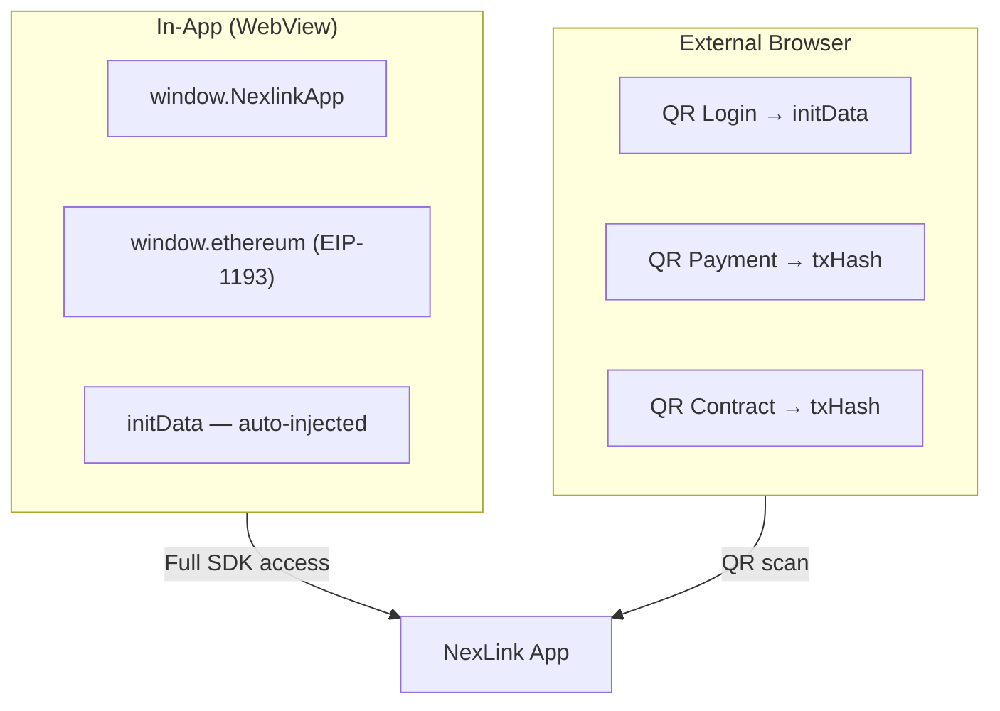

# NexLink dApp 平台

用于在 NexLink 平台上构建 dApp 的开发者文档。

---

## What is NexLink?

NexLink 是一款内置 dApp 浏览器的移动端钱包与消息应用。第三方开发者可以构建与 NexLink 集成的 dApp，实现用户身份认证、代币支付以及智能合约交互——全部通过一套标准化 SDK 完成。

---

## What Can DApps Do?

| 能力 | 说明 | 文档 | 状态 |
|---|---|---|---|
| **Authentication** | 通过签名的 initData（应用内）或二维码登录（浏览器）识别用户 | [登录与注册](AUTH.md) | 已上线 |
| **Identity** | 多身份人格（主身份 / 认证 / 匿名）；荣誉汇总到主身份；零知识信任证明 | [身份系统](IDENTITY.md) | 设计（提案阶段） |
| **Token Payments** | 通过订单支付或直接转账流程接收 USDK/CNYT 支付 | [支付集成](PAYMENT.md) | 已上线 |
| **Escrow / Guaranteed Payment** | 在交易完成前锁定资金；带陪审团争议裁决的 C2C + Guarantee 合约（K币担保） | [担保支付](ESCROW.md) | 已上线 |
| **Subscription Payment** | 每笔扣款均需用户确认的周期性计费——绝无静默自动扣款 | [订阅支付](SUBSCRIPTION.md) | 设计（提案阶段） |
| **Contract Interaction** | 通过钱包调用 NEXLK 链上的任意智能合约 | [合约交互](CONTRACT.md) | 已上线 |
| **NFT Issuance** | 发行普通及灵魂绑定（SBT）ERC-721 代币 | [NFT 发行](NFT.md) | SDK 已就绪 |
| **Honor / Reputation** | 灵魂绑定荣誉与不良记录；链上声誉（信任体系） | [荣誉与声誉](HONOR.md) | 设计（提案阶段） |
| **Community Governance** | 质押、发起提案与投票；代言人身份（Delegate ID）以 NFT 形式呈现（Tally 风格 DAO） | [社区治理](GOVERNANCE.md) | 设计（提案阶段） |

所有能力均通过两种渠道运作：

- **应用内** — dApp 运行在 NexLink 的 WebView 中，可完整访问 SDK（`window.NexlinkApp`）
- **外部浏览器** — dApp 运行在 Chrome/Safari 中，支付与合约调用采用二维码流程（二维码身份认证已在规划中，但尚未实现——参见 [AUTH.md Section 3.1](AUTH.md)）

---

## Getting Started

### 1. Register Your dApp

联系 NexLink 平台管理员注册你的 dApp。你将获得：

| 凭据 | 用途 |
|---|---|
| `dapp_id` | 你的 dApp 的数字标识符 |
| `secret_key` | 用于 initData 签名验证及 API 请求签名（MD5 签名） |

### 2. Choose Your Integration

**最小化集成（仅身份认证）：**

```javascript
// In-app: wait for SDK to be ready, then read initData
NexlinkApp.onReady(async function () {
  const initData = NexlinkApp.initData;
  if (!initData) return; // not in Nexlink app

  // Send to your backend for verification
  const res = await fetch('/api/login', {
    method: 'POST',
    body: JSON.stringify({ initData })
  });
});
```

**添加支付：**

```javascript
// Direct transfer (P2P, tips)
const result = await NexlinkApp.payment.transfer({
  to: "0x1234...abcd",
  amount: "10.00",
  token: "USDK"
});

// Order-based payment (commerce)
const result = await NexlinkApp.payment.pay({
  orderId: "uuid-from-your-backend"
});
```

**添加合约调用：**

```javascript
// Call any contract on the NEXLK chain
const result = await NexlinkApp.contract.call({
  contract: "0x3d8b4425...",
  abi: YOUR_CONTRACT_ABI,
  method: "freeze",
  args: [orderId, amount, tokenAddress]
});

// Read contract state (no signing needed)
const balance = await NexlinkApp.contract.read({
  contract: "0x3d8b4425...",
  abi: YOUR_CONTRACT_ABI,
  method: "getBalance",
  args: [userAddress]
});
```

### 3. Support External Browsers

对于 NexLink 应用之外的用户，请实现二维码流程：

```javascript
if (window.NexlinkApp) {
  // In-app: use SDK directly
} else {
  // Browser: show QR code for login/payment/contract
}
```

每项功能都有对应的二维码流程——详情参见 [AUTH.md](AUTH.md)、[PAYMENT.md](PAYMENT.md) 与 [CONTRACT.md](CONTRACT.md)。

---

## Platform Overview

### Two Runtime Environments



| 功能 | 应用内 | 外部浏览器 |
|---|---|---|
| Authentication | `NexlinkApp.initData`（自动） | 二维码 → 长轮询 |
| Payment (direct) | `NexlinkApp.payment.transfer()` | 不可用 |
| Payment (order) | `NexlinkApp.payment.pay()` | 二维码 → 长轮询 |
| Contract (write) | `NexlinkApp.contract.call()` | 二维码 → 长轮询 |
| Contract (read) | `NexlinkApp.contract.read()` | 直接向 NEXLK 链发起 RPC 调用 |
| EIP-1193 provider | `window.ethereum` | 不可用 |

### NEXLK Chain

| 属性 | 取值 |
|---|---|
| Chain ID | `2026777` |
| Type | EVM-compatible |
| Native token | NKT |
| Consensus | Proof of Authority |

### Supported Tokens

| Token | Contract Address | Decimals |
|---|---|---|
| USDK | `0xaC2D085205D0A42121E48a9C20E7aE1a7102c526` | 5 |
| CNYT | `0x1e0df1f0813E6521819af9cAC158787f6f94471F` | 5 |

---

## JS SDK Reference

### SDK Availability

当 dApp 在 NexLink 应用内加载时，NexLink WebView 会**自动注入** NexLink SDK（`window.NexlinkApp`）。无需 `<script>` 标签——应用会在页面自身脚本运行之前，通过内联 JavaScript 注入 SDK。

| 环境 | `window.NexlinkApp` | `window.ethereum` | 工作方式 |
|---|---|---|---|
| **Inside NexLink app** | 可用（自动注入） | 可用（自动注入） | WebView 在 `document_start` 注入 SDK——dApp 无需任何操作 |
| **External browser** | `undefined` | `undefined` | 没有 NexLink WebView——SDK 不存在 |

**不存在任何提供 SDK 的外部 JS 文件。** 与那些需要通过 `<script src="...">` 加载 SDK 的平台不同，NexLink 会自动注入一切。你的 dApp 代码只需检查 `window.NexlinkApp` 是否存在即可。

对于需要在两种环境下都能运行的 dApp，请始终对 SDK 调用做防护：

```javascript
if (window.NexlinkApp) {
  // Running inside NexLink app — full SDK access
  NexlinkApp.onReady(async () => {
    const initData = NexlinkApp.initData;
    // use payment, contract, wallet APIs...
  });
} else {
  // Running in a regular browser — no SDK available
  // Use QR code flows for login, payments, and contract calls
  // See AUTH.md, PAYMENT.md, CONTRACT.md for QR flow details
}
```

> **Note:** NexLink API 服务器在 `/static/nexlink-sdk.js` 托管了一个空操作的回退文件（`nexlink-sdk.js`）。它提供的桩方法只会记录警告而不会崩溃。该文件是**可选的**——其存在只是为了方便开发，便于在无需 `if (window.NexlinkApp)` 防护的情况下于普通浏览器中测试 dApp 页面。它在生产环境中并不需要，也不提供任何实际功能。

### Namespaces

| 命名空间 | 方法 | 说明 |
|---|---|---|
| `NexlinkApp` | `.initData` | 已签名的用户身份字符串 |
| `NexlinkApp.payment` | `.pay()`, `.transfer()`, `.getOrderStatus()` | 代币支付操作 |
| `NexlinkApp.contract` | `.call()`, `.read()`, `.encode()` | 智能合约交互 |
| `NexlinkApp.wallet` | `.getAccounts()`, `.sendTransaction()`, `.personalSign()`, etc. | 底层钱包访问（8 个方法） |
| `window.ethereum` | EIP-1193 标准方法 | 标准 Web3 provider |

### Detection

```javascript
// Check if running inside NexLink app
if (window.NexlinkApp) {
  // Full SDK available — auto-injected by WebView
  NexlinkApp.onReady(() => {
    const initData = NexlinkApp.initData;
  });
} else {
  // External browser — window.NexlinkApp is undefined
  // Fall back to QR code flows
}

// Check specific capabilities (only after confirming NexlinkApp exists)
if (window.NexlinkApp) {
  if (NexlinkApp.payment) { /* payment methods available */ }
  if (NexlinkApp.contract) { /* contract methods available */ }
}
if (window.ethereum) { /* EIP-1193 provider available (in-app only) */ }
```

> 完整的方法签名与参数，请参见 [API Reference](API.md)。

---

## Documentation

| 文档 | 说明 |
|---|---|
| [API Reference](API.md) | 类型、接口与 JS SDK 方法签名 |
| [登录与注册](AUTH.md) | initData、签名验证、二维码登录、账号绑定 |
| [身份系统](IDENTITY.md) | 多身份模型（主身份/认证/匿名）、荣誉汇总、零知识信任证明 |
| [支付集成](PAYMENT.md) | USDK/CNYT 支付——直接转账与订单支付流程 |
| [担保支付](ESCROW.md) | C2C + Guarantee 担保合约、角色、陪审团争议裁决（K币担保） |
| [订阅支付](SUBSCRIPTION.md) | 先确认后扣款的周期性计费（设计规范） |
| [合约交互](CONTRACT.md) | 智能合约调用——EIP-1193、NexLink SDK 及二维码流程 |
| [NFT 发行](NFT.md) | 普通及灵魂绑定（SBT）ERC-721 的发行与铸造 |
| [荣誉与声誉](HONOR.md) | 灵魂绑定荣誉、不良记录、声誉，以及荣誉的 ZK 证明 |
| [社区治理](GOVERNANCE.md) | 质押、提案、投票以及代言人身份（Delegate ID）NFT（设计规范） |

---

## Security Summary

| 原则 | 详情 |
|---|---|
| **Signed identity** | 用户身份（`initData`）经过 HMAC-SHA256 签名——无法被 dApp 前端伪造 |
| **User consent** | 每一笔支付和合约调用都需要带生物识别解锁的原生确认界面 |
| **No blind signing** | 确认界面会在签名前展示金额、收款方或解码后的函数调用 |
| **Server-side verification** | dApp 后端会独立验证 `initData` 签名与 Webhook 签名 |
| **QR code safety** | 二维码仅包含会话令牌——不含敏感数据（金额、地址、回调） |
| **On-chain finality** | 所有交易都会产生一个可在 NEXLK 链上独立验证的 `txHash` |
