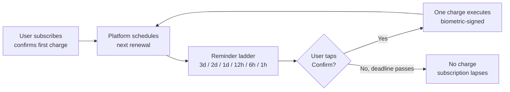
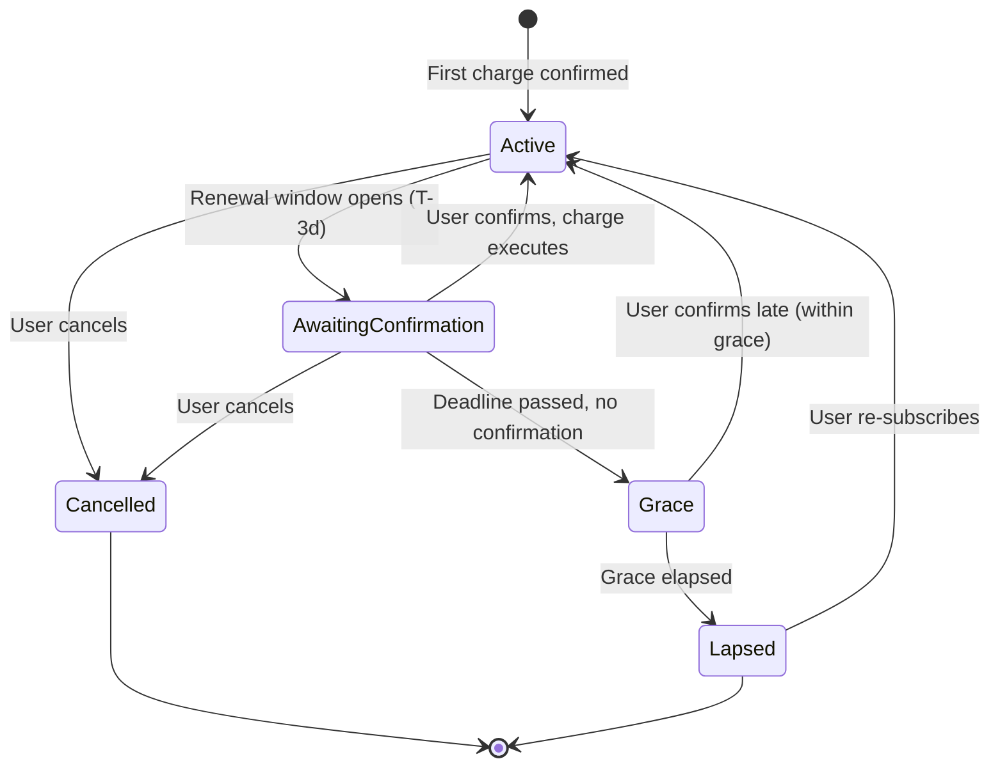
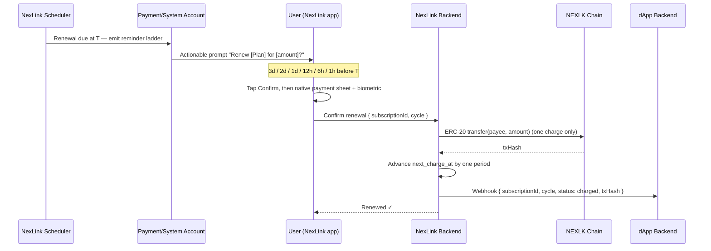

# NexLink dApp 订阅支付（Subscription）

> **状态：设计 / 提案阶段。** 目前尚未有任何订阅相关代码上线。本文档描述预期的模型，以便评审与实现。该设计刻意采用**安全优先**原则：NexLink **不会**支持静默的、由合约驱动的周期性扣款。相关理由参见 [Section 2](#2-why-not-auto-deduct)。此处的一切目前都无法调用；[`NexlinkApp.subscription`](#5-proposed-js-sdk) 命名空间与 `/dapp/subscription/*` 端点均为提案。

订阅支付（订阅支付）支持周期性计费——就像按月订阅的 Claude 套餐——用户每个周期支付固定金额以持续获得访问权。贯穿整个设计的硬性要求是：**每一笔扣款都需要用户主动、重新进行的确认。** 平台绝不会在没有用户点击*确认*的情况下按计划自动划扣资金。

一次性支付请参见 [Payment Integration](PAYMENT.md)。资金托管至交付的场景请参见 [Escrow](ESCROW.md)。

---

## 1. Overview

一个订阅是用户主动加入的一个**套餐（计划）**（金额、代币、周期、收款方）。NexLink 不会向收款方授予一个可以持续抽取钱包资金的长期授权额度，而是将每一次续订都视为一次**全新的、由用户确认的支付**——由平台负责"记忆"：在每个到期日之前发送一组阶梯式提醒，并呈现一键确认。



| 原则 | 详情 |
|---|---|
| **每次扣款前确认** | 每一次续订都是一笔独立的支付，用户必须通过原生确认 UI + 生物识别予以批准——与[多签](#4-the-multisig-analogy)联合签名的方式完全一致。 |
| **不设长期授权额度** | 订阅**不会**产生任何链上 `approve`，因此不存在某个 spender 之后可以据此抽取资金的授权。 |
| **只有提醒，没有意外** | 平台会在扣款前的 3 天、2 天、1 天、12 小时、6 小时和 1 小时推送确认提示。 |
| **默认失效** | 如果用户在截止时间前未确认，则**不会扣款**。订阅只是自动失效——用户绝不会为自己忘记取消的东西被计费。 |
| **随时取消** | 取消会立即停止所有未来的提醒与扣款。链上没有任何需要撤销的东西。 |

---

## 2. Why Not Auto-Deduct

在 EVM 上构建订阅的常见做法是向订阅合约授予一个长期的 ERC-20 `approve`（通常是无限额度），由合约在每个周期抽取金额。**NexLink 拒绝这种模型。**

| 自动扣款（已拒绝） | 每次扣款前确认（NexLink） |
|---|---|
| 用户签署一次无限额度的 `approve`；合约可永久抽取 | 用户为每一笔扣款单独签名 |
| 被攻陷或恶意的 spender/合约可以**抽干整个余额** | 一笔扣款永远只能划转已确认的确切金额 |
| 用户会持续为自己已忘记的订阅被计费 | 未确认 → 不扣款 → 自动失效 |
| 撤销需要用户执行一次链上 `approve(0)`，而用户很少这样做 | 取消只是一个链下开关；不存在需要撤销的授权额度 |
| "设置后不再理会"有利于商家 | 每个周期的授权都始终掌握在用户手中 |

> 威胁是具体存在的：无限授权额度被抽干是 DeFi 中资金被盗最常见的方式之一。一个订阅不值得你把钱包的钥匙交给第三方。NexLink 保持钱包规则完整无损——**没有用户对每笔扣款的签名，dApp 无法划转资金。**

---

## 3. Lifecycle & Reminder Ladder

### 3.1 States



| 状态 | 含义 |
|---|---|
| `active` | 当前周期已付费；下一次续订已排期 |
| `awaiting_confirmation` | 续订窗口已开启；正在发送提醒；等待用户确认 |
| `grace` | 已过截止时间但未确认；在切断访问权前有一段短暂的宽限期 |
| `lapsed` | 未确认且宽限期已过；**未发生任何扣款**；访问权终止 |
| `cancelled` | 用户已取消；不再有任何提醒或扣款 |

### 3.2 The reminder ladder

当一次续订在时刻 **T** 到期时，平台的订阅调度器会在 T 之前的以下每个时间点发送一条**可操作的确认提示**：

| 提醒 | 发送时间 | 消息意图 |
|---|---|---|
| 1 | **T − 3 天** | "您的 [Plan] 将在 3 天后以 [amount] 续订。确认以继续。" |
| 2 | **T − 2 天** | 提醒 + 确认 |
| 3 | **T − 1 天** | 提醒 + 确认 |
| 4 | **T − 12 小时** | 提醒 + 确认 |
| 5 | **T − 6 小时** | 提醒 + 确认 |
| 6 | **T − 1 小时** | 最终提醒——"除非您确认/取消，否则将在 1 小时后续订" |

一旦用户从**任意**一条提醒中完成确认，扣款即执行，该周期剩余的提醒会被取消，并排定下一个周期。如果 T 已过而仍无确认，订阅会转入 `grace`，且不会有任何资金划转。

提醒通过 NexLink 的**支付/系统账户**下发，走的是应用已经用于可操作消息的同一批渠道——一张聊天内确认卡片（带有**确认** / **取消**按钮，类似机器人的内联键盘），以及/或者一条深度链接到确认弹窗的推送通知。

### 3.3 Charge flow (on confirm)



链上扣款就是一笔单独的、普通的[基于订单的支付](PAYMENT.md#4-order-based-payment-commerce-mode)——订阅层只是负责为其排期并要求用户确认。这里没有任何新的签名原语；安全性来自于*从不跳过确认*。

---

## 4. The Multisig Analogy

该设计与 NexLink 多签钱包保护资金的方式如出一辙：在必需的一方主动联合签名之前，交易不会执行。一笔订阅扣款同理——在**用户**为*那一笔特定扣款*联合签名之前，它不会执行。平台可以按计划提议扣款，但它永远无法成为授权资金划转的那一方。这正是保障用户资产安全、并防止"无用的"（不想要、已遗忘的）订阅抽干余额的关键所在。

---

## 5. Proposed JS SDK

> **提案——尚未实现。** 命名空间 `NexlinkApp.subscription`，与 [`NexlinkApp.payment`](API.md#js-sdk--payment-methods) 类似。

```javascript
// Present a plan to the user and create the subscription after they confirm
// the FIRST charge (native sheet + biometric). Returns once active.
const sub = await NexlinkApp.subscription.subscribe({
  planId: "plan-uuid-from-your-backend"
});
// → { subscriptionId, status: "active", nextChargeAt: 1720000000 }

// Query current status without a backend round-trip
const status = await NexlinkApp.subscription.getStatus({ subscriptionId });
// → { status: "active" | "awaiting_confirmation" | "grace" | "lapsed" | "cancelled",
//     nextChargeAt, currentCycle }

// Cancel — stops all future reminders and charges immediately
await NexlinkApp.subscription.cancel({ subscriptionId });
```

| 方法 | 需要用户确认？ | 用途 |
|---|---|---|
| `subscribe({ planId })` | 是（首次扣款） | 加入订阅；确认并执行第一个周期的扣款 |
| `getStatus({ subscriptionId })` | 否 | 读取当前状态与下次扣款时间 |
| `cancel({ subscriptionId })` | 否（或一次点击） | 停止未来的提醒/扣款 |

续订确认**不**由 dApp 前端发起——它们由平台的提醒提示驱动。dApp 通过 [webhook](#7-webhooks-proposed) 获知结果。

---

## 6. Proposed Backend API

> **提案——尚未实现。** 遵循现有的 [`/dapp/*` MD5 签名鉴权](API.md#dapp-authentication)约定。

| 方法 | 路径 | 用途 |
|---|---|---|
| POST | `/dapp/subscription/plan/create` | 定义一个套餐：`{ name, amount, symbol, periodSeconds, payeeAddress, callbackUrl, reminderLadder? }` |
| POST | `/dapp/subscription/query` | 获取某个订阅的状态、周期数以及下次扣款时间 |
| POST | `/dapp/subscription/cancel` | 从后端取消一个订阅（例如账户已关闭） |
| POST | `/browser/subscription/confirm` | *（内部，JWT）* 当用户从提醒中确认续订时由应用调用 |

`reminderLadder` 默认为 `["3d","2d","1d","12h","6h","1h"]`，可按套餐配置（某个套餐可选择更少/更多的提醒，但"每次扣款前确认"的规则不可协商）。

---

## 7. Webhooks (Proposed)

dApp 后端是权益（访问权）的唯一可信来源。它应当仅在收到已签名的 webhook 时才授予访问权，绝不能依据前端结果。签名校验与[支付 webhooks](PAYMENT.md#6-webhook-callbacks) 完全相同。

```http
POST https://dapp.example.com/api/subscription/callback
X-Nexlink-Timestamp: 1720000000
X-Nexlink-Signature: <hmac-sha256>

{
  "subscriptionId": "sub-uuid",
  "planId": "plan-uuid",
  "cycle": 4,
  "status": "charged",        // charged | lapsed | cancelled
  "amount": 1000000,
  "symbol": "USDK",
  "txHash": "0xabc...",        // present when status = charged
  "chargedAt": 1720000000,
  "nextChargeAt": 1722678400   // present when status = charged
}
```

| `status` | 含义 | dApp 动作 |
|---|---|---|
| `charged` | 续订已确认并已付费 | 将访问权延长至 `nextChargeAt` |
| `lapsed` | 用户在截止时间前未确认 | 在周期结束时撤销访问权 |
| `cancelled` | 用户已取消 | 在周期结束时撤销访问权 |

---

## 8. Security Model

| 属性 | 机制 |
|---|---|
| **每笔扣款的同意** | 每一次续订都需要一次全新的原生确认 + 生物识别。不存在任何长期授权额度。 |
| **损失有界** | 一笔扣款只能向固定的收款方划转已确认的确切金额——绝不会更多。 |
| **无静默计费** | 未确认 → 不扣款 → 自动失效。用户不会为遗忘的订阅被计费。 |
| **即时链下取消** | 取消会停止调度器；没有任何链上授权额度需要撤销。 |
| **金额/收款方完整性** | 套餐参数在 [MD5 鉴权](API.md#dapp-authentication)下由服务端设定；确认弹窗会展示确切的金额与收款方。 |
| **权威确认** | 权益（访问权）依据[已签名的 webhook](#7-webhooks-proposed) 授予，而非依据前端。 |

---

## 9. What Needs Building

此功能**尚未实现**。交付它需要：

### NexLink Backend
- [ ] `SubscriptionPlan` + `Subscription` 模型（套餐参数、状态机、`next_charge_at`、周期计数器）
- [ ] 每个周期发出提醒阶梯（3d/2d/1d/12h/6h/1h）的订阅调度器
- [ ] 从支付/系统账户下发可操作提醒（聊天内确认卡片 + 推送），复用现有的可操作消息管道
- [ ] `/dapp/subscription/*` 端点（MD5 鉴权）+ `/browser/subscription/confirm`（JWT）
- [ ] 续订扣款 = 一笔基于订单的支付；推进状态；派发 webhook
- [ ] 宽限期处理与失效转换

### NexLink App (Dart)
- [ ] `SubscriptionModule` 桥接模块 + 处理器（`subscribe`、`getStatus`、`cancel`）
- [ ] 可从提醒深度链接抵达的续订确认弹窗
- [ ] 与 `/browser/subscription/confirm` 关联的提醒确认/取消动作

### JS SDK
- [ ] `NexlinkApp.subscription.subscribe() / getStatus() / cancel()` + 桩 SDK 排队

### Documentation
- [x] SUBSCRIPTION.md — 本设计规范
- [ ] API.md — 订阅类型/端点（标记为提案）
- [x] SUMMARY.md — 订阅链接
